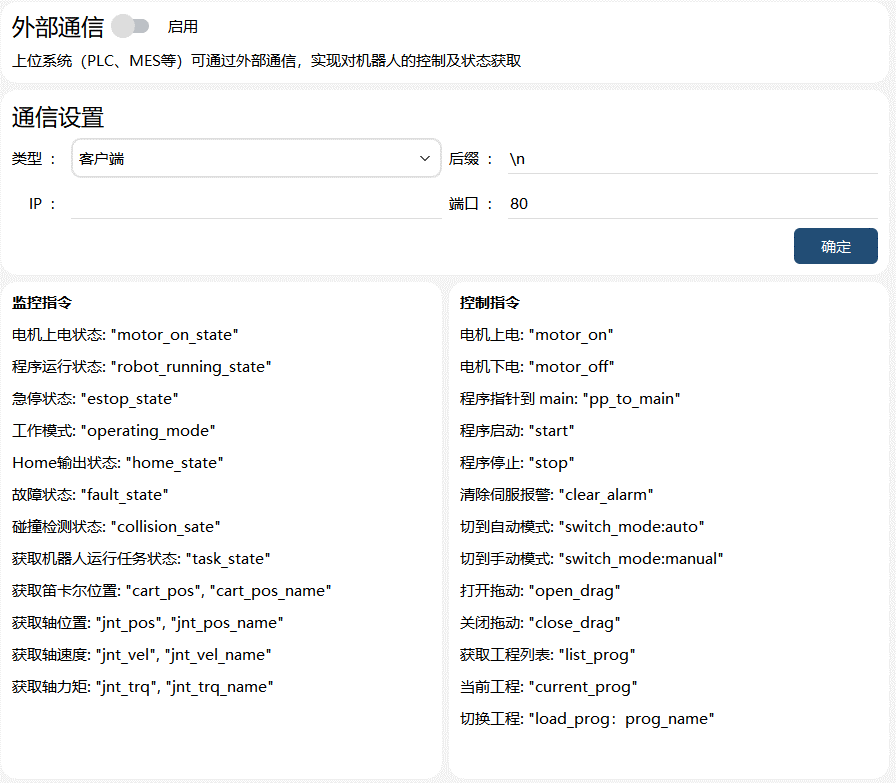
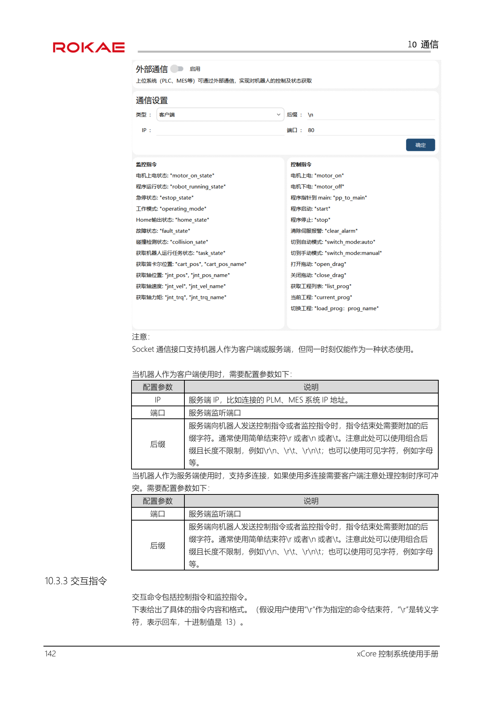
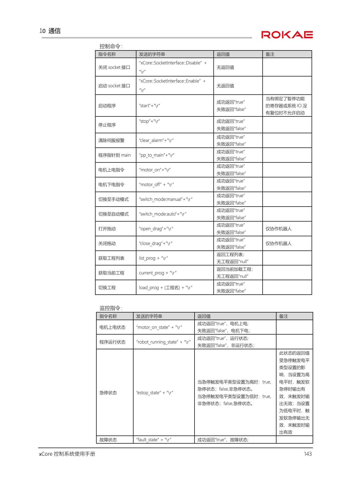
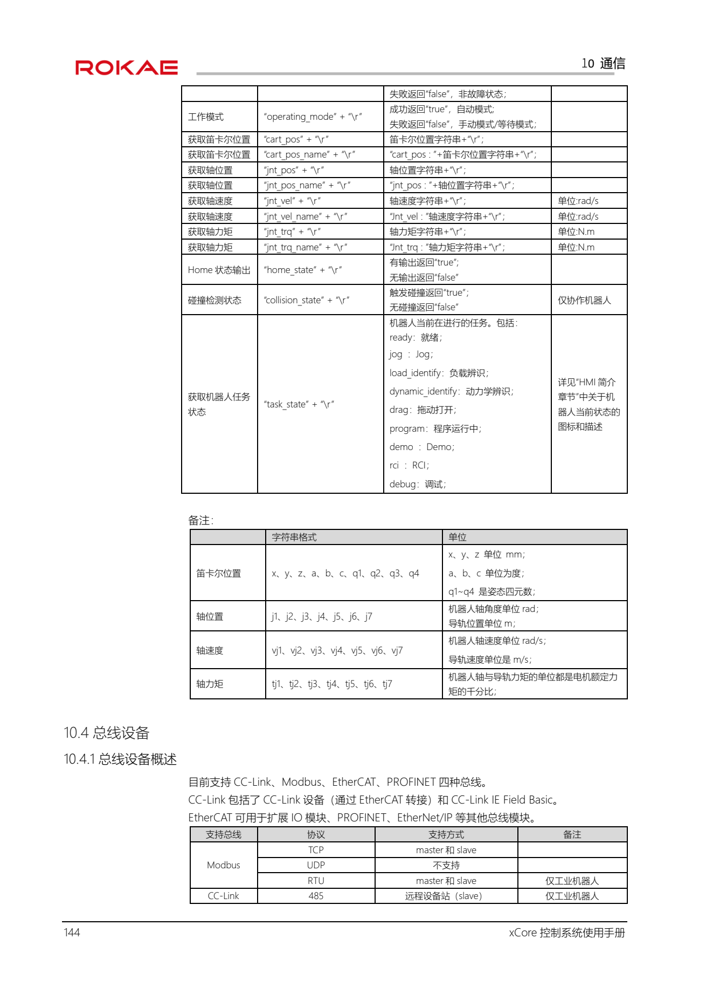

# xCore 控制系统使用手册 V2.2（A）——学习笔记 / 整理

> **来源**：`xCore控制系统使用手册V2.2_A.pdf`（珞石机器人 ROKAE，xCore 控制系统 V2.2，文档版本 A，共 381 页）。
> **整理方式**：全文文本提取（`pdf_out/xcore_full.txt`，含页码标记）+ 按章归类；页码引用格式 `(p.N)` 为 **PDF 物理页**。
> **本笔记定位**：工程用速查与学习材料，不替代原手册；安全相关操作以原手册与现场规程为准。提取不清处以 `（提取不清）` 标注。
> **原始提取与分章切片**：`pdf_out/xcore_full.txt`、`pdf_out/xcore_outline.txt`、`pdf_out/xcore_s*.txt`。

## 它是什么（速览）

- **xCore = 珞石（ROKAE）机器人控制系统**，CS 架构：HMI 软件 **RobotAssist**（PC 端 / xPad2 示教器）+ 控制器软件 **RC**。
- 编程语言 **RL（Rokae Robot Language）**：ABB RAPID 风格（`PROC/FUNC`、`MoveJ/MoveL/MoveAbsJ`、`robtarget/pos/pose`、`speed/zone/tool/wobj` 等），HMI 内提供工程/任务/变量/点位/路径/IO/坐标系/工具/工件/视觉等列表化编辑。
- 机器人系列：**工业机器人**（XBC5 控制柜等）与**协作机器人 xMate ER / CR**（差异在手册中多处标注，如拖动、xPanel、末端工具）。
- 对外通信能力（第 10 章）：系统 IO、**TCP Socket 交互指令**、总线（Modbus TCP/RTU、CC-Link、EtherCAT、PROFINET）、**寄存器（含寄存器远程控制）**、IO 设备、RCI（默认端口 1337）、OPC-UA、串口（仅工业柜）等。
- 安全：软/硬急停、安全区域/安全位置、安全门、碰撞检测、外部/手持急停（mini 安全板固件 ≥1.0.8.7）等。

## ★ 与本项目（Kine-X）的对照要点

**本站机器人链路（`EtherCAT_SocketServer.lua` 的 `robot_step`）用的正是手册 10.3「外部通信」的 TCP Socket 交互指令**：控制器（鲁班猫2）作 **TCP 客户端** 连机器人 `192.168.1.221:4320`，指令以 `\r` 结尾；机器人侧须在 HMI「通信 → 外部通信」配置为**服务端**（监听端口 + 后缀 `\r`）并启用。

| 手册 10.3.3 | 本站脚本实现 | 备注 |
|---|---|---|
| 监控 `motor_on_state / robot_running_state / estop_state / operating_mode / home_state / fault_state / collision_state / task_state / cart_pos / jnt_pos / jnt_vel / jnt_trq` | `ROBOT_KEYTAB`（12 条，逐条一致） | 另可用 `*_name` 变体（带字段名前缀），本站未用 |
| 控制 `motor_on / motor_off / pp_to_main / start / stop / clear_alarm / switch_mode:auto / switch_mode:manual / open_drag / close_drag / list_prog / current_prog` | `ROBOT_CTLTAB` + 4321 短命令 `RON/ROFF/RMAIN/RSTART/RSTOP/RCLEAR/RAUTO/RMAN/RDRAG/RUDRAG/RLIST/RCUR` | 一一对应 |
| `load_prog: <工程名>`（**p.156 配置界面图示含冒号**；p.157 正文表格简写作 `load_prog + (工程名)`） | `RLOAD,<工程名>;` → 实际发送 `load_prog:<工程名>`（含冒号） | ✅ 与图示一致（2026-09-26 据手册 156/157 页核对，无需再现场验证） |
| `xCore::SocketInterface::Enable/Disable` | 未使用（现场在 HMI 侧启用） | 可选补充：断链时远程启停接口 |

现场注意事项（手册已明示、容易踩）：
- **`estop_state` 的 true/false 含义受机器人「急停触发电平类型」设置影响**（高低电平两种极性），上位机解析报警时不能想当然；
- **`task_state` 取值**：`ready/jog/load_identify/dynamic_identify/drag/program/demo/rci/debug`；
- `jnt_trq` 单位是**电机额定力矩的千分比**（非 N·m）；`jnt_pos` 单位 rad（导轨 m）；`cart_pos` 含四元数 q1~q4；
- 机器人侧「运动状态/程序运行状态」等系统输出与 socket 监控量一致地**不统计辨识/拖动/力控/拖动回放**；
- 有“暂停”功能绑定寄存器/系统 IO 未复位时，**任何方式都不能启动程序**。

**手册提供的其它可替代/增强路径（备查）**：
- **寄存器远程控制（10.5.6）**：用 Modbus/总线寄存器做 Jog、更新点位、运动到点、设工具/工件等（命令码 1~14 + 三级错误码），适合 PLC 深度集成；
- **系统 IO（10.2）** 硬接线上下电/启停/急停复位；**RCI（10.8，端口 1337）** 底层实时控制；**OPC-UA（10.13）** 标准化上位集成；
- 协作机型专属：拖动（socket `open_drag/close_drag` 或 HMI）、xPanel（CR）、末端工具/电爪吸盘（ER/CR）。

---

## 章节目录

- 1 手册概述 / 2 安全 / 3 名词术语
- 4 机器人基础知识 / 5 机器人系统构成及连接
- 6 HMI 简介 / 7 控制系统基础操作
- 8 编程（RL 工程 / 编辑器 / 任务 / 变量 / 点位 / 路径 / IO / 坐标系 / 工具 / 工件 / 视觉）
- 9 设置
- 10 通信 ★（系统IO / 外部通信与交互指令 / 总线设备 / 寄存器与寄存器远程控制 / IO设备 / 末端工具 / RCI / xPanel / 电爪吸盘 / 串口 / 编码器 / OPC-UA）
- 11 安全 / 12 工艺包 / 13 日志 / 14 选项
- 15 RL 指令（变量类型 / 函数 / 运动 / Trigger / 力控 / 拖动回放 / IO / 通信 / 网络 / 逻辑 / 起始点 / 数学 / 位 / 字符串 / 运算符 / 时钟 / 高级 / 功能 / 寄存器 / 末端工具）
- 16 附录 / 17 故障排查（错误码 1XXXX~6XXXX）

---

---

## 1 手册概述 (p.15)

### 1.1 关于本手册 (p.15)

感谢您购买本公司的机器人系统。本手册记载了 xCore 控制系统的以下说明：

- 控制系统构成与基础操作
- 控制系统的编程与高级参数设置
- 控制系统选项功能介绍
- RL 指令集
- 控制系统错误码清单

安装使用该机器人系统前，请仔细阅读本手册与其他相关手册；阅读之后请妥善保管，以便随时取阅。

### 1.2 手册对象 (p.15)

本手册面向：操作人员、产品技术人员、技术服务人员、机器人程序员。请务必保证以上人员具备控制系统操作所需的知识，并已接受本公司的相关培训。

### 1.3 如何阅读产品手册 (p.15)

本手册包含单独的安全章节，必须在阅读安全章节后，才能进行安装或维护作业。

### 1.4 本手册中的插图 (p.15)

由于产品升级或其他原因，产品手册中的一些图片可能会与实际产品存在差异，但操作步骤是正确的。同时，对于某些通用的信息，可能会使用其他型号机器人的图片进行说明。

### 1.5 垂询方式 (p.15)

机器人维护、维修等相关事项，请与本公司售后部门或当地经销商联系。联系时请准备好如下信息：

- 控制器型号/序列号
- 机器人型号/序列号
- 软件名称/版本
- 系统出现的问题

### 1.6 手册阅读指南 (p.15-16)

本操作手册分为以下几个章节：

| 章节 | 标题 | 内容简介 |
|------|------|----------|
| 1 | 手册概述 | 手册总体情况。 |
| 2 | 安全 | 安全相关事项。 |
| 3 | 名词术语 | 手册涉及的名词术语。 |
| 4 | 机器人基础知识 | 部分必备的机器人基础知识。 |
| 5 | 机器人系统构成与连接 | 机器人系统的构成，不同机型的物理连接。 |
| 6 | HMI 简介 | HMI 的整体布局和功能介绍。 |
| 7 | 控制系统基础操作 | 控制系统常用的基础操作；通过示例，演示工业、协作机器人最基础的操作。 |
| 8 | 编程 | 详细介绍编程模块的使用。 |
| 9 | 设置 | 详细介绍控制系统各类设置。 |
| 10 | 通信 | 详细介绍通信类的功能及使用。 |
| 11 | 安全 | 介绍安全相关的功能。 |
| 12 | 工艺包 | 概述工艺包情况。 |
| 13 | 日志 | 介绍日志相关功能及使用。 |
| 14 | 选项 | 介绍选项模块的功能及使用。 |
| 15 | RL 指令 | 详细介绍所有 RL 指令。 |
| 16 | 附录 | 用户权限明细、协作机型末端把手功能和使用介绍。 |
| 17 | 故障排查 | 故障码，处理清单。 |

### 1.7 手册修订历史 (p.16)

| 版本号 | 日期 | 主要修改内容 |
|--------|------|--------------|
| V2.1 | 2023.11 | （提取不清：原表该行"主要修改内容"为空） |
| V2.2 | 2024.03 | 新版手册创建； |

### 1.8 相关手册 (p.16)

xCore 控制系统除完善的基本功能外，还包含丰富的扩展功能。关于扩展功能，我们提供以下文档，如有需要，可以联系官方获取。

| 名称 | 简介 |
|------|------|
| 《xCore 机器人控制系统使用手册》 | 介绍 xCore 控制系统基本功能使用； |
| 《xVision 使用手册》 | 介绍 xVision 机器人视觉基本使用； |
| 《xCore_SDK_Android 使用手册》 | 介绍 xCore-SDK 的使用； |
| 《xCore_SDK_Python 使用手册》 | 介绍 xCore-SDK 的使用； |
| 《xCore_SDK_C++ 使用手册》 | 介绍 xCore-SDK 的使用； |
| 《xCore_RCI_使用手册》 | 介绍 RCI 的使用； |
| 《传送带跟踪功能使用手册》 | 介绍传送带跟踪功能的使用； |
| 《料盘工艺包使用手册》 | 介绍料盘工艺包使用； |
| 《码垛工艺包使用手册》 | 介绍码垛工艺包使用； |
| 《RokaeStudio 用户手册》 | 介绍离线编程软件使用； |
| 《光伏排版工艺包用户手册》 | 介绍光伏排版工艺包使用； |
| 《光伏插片工艺包用户手册》 | 介绍光伏插片工艺包使用； |

---

## 2 安全 (p.17)

> 本章为纯安全条文，按要点压缩；关键禁止项完整保留。

### 2.1 简介 (p.17)

本章介绍使用机器人时需要注意的安全原则和流程。与机器人外部安全防护装置的设计、安装有关的内容不在本章描述范围内，请与您的系统集成商联系获得此类信息。

### 2.2 安全责任说明 (p.17)

珞石机器人致力于提供可靠的安全信息，但不对此承担责任。即使一切操作都按照安全操作说明进行，也不能确保工业机器人不会造成人身和财产方面的损失。

### 2.3 安全标识 (p.17)

危险操作说明附近有专门的安全标识提示框，内容包括：表示安全级别的图标和名称（如警告、危险、提示等）；危险后果的简单描述；有关如何消除危险的操作说明。

#### 2.3.1 安全级别 (p.17)

| 图标名称 | 说明 |
|----------|------|
| 危险 | 如不按规定操作，将会对人员造成严重甚至致命的伤害，同时将会/可能会对机器人造成严重损坏。 |
| 警告 | 如不按规定操作，可能导致严重人身伤害，甚至可能致命，对机器人本身也将造成较大损坏。 |
| 触电危险 | 提示当前操作可能会有人员触电风险，造成严重甚至是致命的伤害。 |
| 警示 | 如不按规定操作，可能导致人身伤害，对机器人本身可能也会造成损坏。 |
| 防静电（ESD） | 提示当前操作涉及的零部件对静电敏感，不按规范操作可能会造成器件损坏。 |
| 提示 | 用于提示一些重要信息或者前提条件。 |

#### 2.3.2 风险说明 (p.17-18)

| 图标名称 | 说明 |
|----------|------|
| 挤压 | 操作人员、维护人员在调试、维修、检修、工具装夹时进入机器人运动范围，可能会产生伤害。 |
| 夹手 | 维护人员在进行维护操作时，接近带传动部件时，存在夹手的风险。 |
| 撞击 | 操作人员、维护人员在调试、维修、检修、工具装夹时进入机器人运动范围，可能会产生严重伤害。 |
| 摩擦 | 操作人员、维护人员在调试、维修、检修、工具装夹时进入机器人运动范围，可能会产生伤害。 |
| 零件飞出 | 操作人员、维护人员在调试、维修、检修、工具装夹时进入机器人运动范围，工具或工件可能因夹持松懈飞出，此时可能会产生严重伤害。 |
| 火灾 | 电路发生短路、导线或器件着火时可能发生火灾，可能会产生严重伤害。 |
| 高温表面 | 维护人员在进行设备检修、维护时，接触机器人高温表面，可能会导致烫伤危害。 |

### 2.4 安全停止 (p.18)

机器人的停止方式有三种：STOP 0、STOP 1 和 STOP 2。安全停止指由安全控制器触发的停止，安全控制器只触发 STOP 0、STOP 1 两种停止方式，STOP 2 只由控制系统负责。

| 停止方式 | 说明 |
|----------|------|
| STOP 0 | 停止被触发后，立即切断电机的动力电源并闭合各关节抱闸，是安全级别最高的停止方式，但停止过程中机器人处于非受控状态，停止后可能会偏离编程路径。**手动模式的安全停止属于 STOP 0。** STOP 0 支持按给定时间停止、按给定距离停止、最大能力减速停止三种方式。 |
| STOP 1 | 停止被触发后，控制系统立刻沿编程路径执行减速过程，之后不论机器人是否完全停下，安全控制器将切断电机的动力电源并闭合各关节抱闸。在绝大多数情况下，由于是受控停止，机器人最终将停在编程路径上，因此该种急停方式对周边设备的保护性最好。**自动模式下安全门/安全光栅打开、自动模式下急停按钮被按下而发生的安全停止，均属于 STOP 1。** STOP 1 支持按给定时间停止、按给定距离停止、最大能力减速停止、正常规划停止四种方式。 |
| STOP 2 | 停止被触发后，控制系统立刻沿编程路径执行减速，直到机器人完全停止运动。此时电机的动力电源仍然保持，抱闸仍然打开，机器人保持在当前位置上。STOP 2 支持按给定时间停止、按给定距离停止、最大能力减速停止、正常规划停止四种方式。 |

提示（p.18-19）：

1. **紧急停止仅用于在危险情况下立刻停止机器人运行。不能将紧急停止作为正常的程序停止**，否则将对机器人的抱闸系统和传动系统造成额外而不必要的磨损，降低机器人的使用寿命。
2. 触发安全停止时，如果停止参数设置不正确，将会触发弹窗报错。现有两种弹窗报错：
   - （1）配置文件版本异常报错。当配置文件缺乏相应的安全停止参数时会弹窗报错，并使用默认的参数进行安全停止。
   - （2）安全停止参数设置异常报错。当安全停止参数设置不合理时会弹窗报错，并使用默认的参数进行安全停止，比如安全停止参数设置为 0。

### 2.5 安全装置 (p.19)

#### 2.5.1 急停 (p.19)

急停按钮是手动触发紧急停止的按钮，多数使用红色的操作主体，最常见的外形是蘑菇头型，通常还配合使用黄色的衬底、保护外壳或警示牌。按下急停时按钮靠机械锁定（急停按钮的安全锁机制），此时必须通过手动释放来复位装置；大多数急停按钮采用旋转释放方式（旋转方向标在按钮表面），也有一部分按钮支持直接向上拔起的释放方法。

#### 2.5.2 使能装置 (p.19-20)

使能装置是一个具有 2 段按压 3 个位置的特殊开关，又称三位使能开关（简称使能开关），用于在手动模式下控制机器人动力电源的通断，实现机器人的运动使能。**只有按下使能开关并保持在中间位置时才会接通电机电源**，使机器人处于允许运动的状态；松手放开或者用力按压到底都会将电机电源切断。

提示（p.20）：手动使能的黄色按钮为使能开关，按压到中间位置时电机动力电源接通并自动使能，系统处于上电状态，可以进行点动或运行程序；松开或者按到底时电机动力电切断，系统回到下电状态。

为安全使用示教器，必须遵守以下要求：

1. 在任何情况下都必须保证使能开关可以正常工作；
2. 在编程和调试期间，当不需要机器人运动时应尽快松开使能开关；
3. 任何进入机器人工作空间的人员必须随身携带手持使能，以避免其他人在内部人员不知情的情况下启动机器人。

> **警告：严禁使用外部装置将使能开关卡住使其停留在中间位置！**

### 2.6 各种情况下的安全注意事项 (p.20)

#### 2.6.1 手动模式的安全事项 (p.20)

在手动模式下，机器人的运动处于手动控制状态。只有在使能开关处于中间位置时，才能对机器人进行 Jog 或者运行程序。手动模式用于编写、调试机器人程序以及参与工作站试运行调试。

- **2.6.1.1 手动模式下的速度限制** (p.20)：在手动模式下，机器人末端的运动速度被限制在 **250mm/s 以下**，即无论是 Jog 机器人还是运行程序，不论程序中设置的速度是多少，机器人末端的最大运动速度不会超过 250mm/s。
- **2.6.1.2 旁路外部安全信号** (p.20)：在手动模式下，外部安全装置如安全门、安全光栅等信号将被旁路，即在手动模式下即使安全门被打开系统也可以进行电机使能的操作，且不会有安全门打开的信息提示，以方便进行调试。

#### 2.6.2 自动模式的安全事项 (p.20-21)

自动模式用于在正式生产过程中机器人程序的运行。自动模式下使能开关将被旁路，因此机器人可以在没有人员参与的情况下自动运行。

- **2.6.2.1 启动外部安全信号** (p.20-21)：外部安全装置如安全门、安全光栅等在自动模式下会启用，安全门打开会使电机断开电源且闭合抱闸。

#### 2.6.3 安装、操作的安全要求 (p.21)

- 在搬运、安装机器人设备时，需按照本公司手册说明的方法进行，否则有可能由于错误操作导致机器人翻倒，进而导致作业人员伤亡或设备损坏。
- 机器人设备安装好后首次使用时，务必先以低速进行，然后逐渐加快速度，不可首次就使用高速运行。
- 程序和系统变量等信息默认保存在控制柜存储设备中，为了预防由于意外引起的数据丢失，建议用户定期进行数据备份。

#### 2.6.4 调试的安全要求 (p.21)

调试时尽可能在安全防护区域外进行，当必须在安全防护区域内进行调试时，应着重注意下列事项：

- 仔细查看安全防护区域内的情况，确认没有危险再进入安全防护区域。
- 应确认安全防护区域内的所有调试人员的位置。
- 应在确认整个系统的状态后进行作业。
- 要做到随时都可以按下急停按钮。
- 应以低速运行机器人。
- 调试结束后，调试人员务必在安全防护区域外进行操作。

#### 2.6.5 维护的安全要求 (p.21)

- 仔细查看安全防护区域内的情况，确认没有危险再进入安全防护区域；应确认安全防护区域内的所有维护人员的位置。
- 当接通电源时，部分维护作业有触电的危险，应尽可能先断开机器人设备及系统电源，再进行维护作业。
- 维护作业时应避免其他人员无意中接通电源。
- 在进行作业时，不要将身体任何部位搭放在机器人设备的任何部分，以免造成不必要的人身伤害或对设备造成不良影响。
- 进行维护作业时，应配备适当的照明器具。
- 如需更换部件，务必使用本公司指定部件。若使用指定部件以外的部件，有可能导致机器人设备的损坏。
- 在更换部件时拆下来的零件（如螺钉），应正确装回其原来部位，如果发现零件不够或零件有剩余，则应再次确认并正确安装。

#### 2.6.6 生产线上的安全处理 (p.21)

绝大多数情况下，机器人属于生产线的一部分，因此机器人出现故障往往不只影响机器人本身，而会影响整个生产线；生产线的其他部分出现问题时，也可能会影响到机器人。因此应由对整个生产线非常熟悉的人员来设计故障补救方案，以提高整个系统的安全性。

- **需关注与机器人进行交互的其他设备**：例如，当某机器人需要维护时，需将此机器人从生产线上先脱离出来，也必须同时脱离与其交互的其他设备，例如为其上料的机器人。
- **需关注机器人周围仍保持运行的其他设备**：例如，生产线上的机器人需要从传送带上抓取工件，当机器人出现故障时，为保证生产过程不中断，在检修机器人的同时，传送带可能仍然保持运行，此时机器人维修人员应额外注意安全，需提前考虑运行中的传送带可能带来的风险，并制定详细的在此环境中工作的安全措施。

#### 2.6.7 火灾时的安全 (p.21-22)

在即将发生火灾危险或火灾已经发生但尚未蔓延开来的情况下，不要惊慌，保持镇定，使用现场提供的灭火装置将火焰扑灭。**严禁用水扑灭因短路导致的火灾。**

> 警告：机器人工作现场使用的灭火装置需由用户提供，用户需根据现场实际情况选择合适的灭火装置。

当火灾已蔓延开来、处于不可控阶段时，现场工作人员不要再试图灭火，而应立即通知其他工作人员，放弃私人物品，尽快从紧急出口向外撤离，**撤离时禁止使用电梯**，撤离过程中同时呼叫消防队。若有人员衣物着火，不要让他/她跑动，而应让他/她迅速平躺在地上，用衣服或其它合适物品、方式将火扑灭。

#### 2.6.8 触电时的安全 (p.22)

当发现有人触电，不要惊慌，首先要尽快切断电源。应根据现场具体条件果断采取适当的方法和措施：

1. 如果电源开关或按钮距离触电地点很近，应迅速拉开开关，切断电源。
2. 如果电源开关或按钮距离触电地点很远，可用绝缘手钳或用干燥木柄的斧、刀、铁锹等切断电源侧（即来电侧）的电线，切断的电线不可触及人体。
3. 当导线搭在触电人身上或压在身下时，可用干燥的木棒、木板、竹杆或其它带有绝缘柄（手握绝缘柄）的工具，迅速将电线挑开，**不能使用任何金属棒或湿的东西去挑电线**，以免救护人触电。

触电伤员脱离电源后的处理：

1. 如果触电伤员神志清醒，应使其就地仰面躺开，严密监视，暂时不要站立或走动。
2. 如果触电伤员神志不清，应使其就地仰面躺开，确保气道通畅，并用 5 秒的时间间隔呼叫伤员或轻拍其肩部，以判断伤员是否意识丧失。**禁止摆动伤员头部呼叫伤员。** 就地抢救的同时尽快联系医院。
3. 如果触电伤员意识丧失，应在 10 秒内判断伤员呼吸、心跳情况。若既无呼吸又无动脉搏动，可判定呼吸心跳已停止，应立即用心肺复苏法对其进行抢救。

---

## 3 名词术语 (p.23)

本章简单介绍手册中出现的部分名词术语。

| 名词 | 解释 |
|------|------|
| RobotAssist | 珞石机器人 xCore 控制系统的上位机软件，具有机器人移动控制、程序编写、参数配置、状态监控等功能，可以运行于 xPad2 示教器、PC 等设备上。 |
| HMI | Human Machine Interface，人机交互界面。 |
| HMID | HMI Device，人机交互设备。 |
| RC | Robot Controller，机器人控制器。 |
| RCI | Rokae Control Interface，珞石机器人外部控制接口，支持底层实时控制。 |
| SDK | Software Development Kit，软件开发工具包，支持通过 C++ 等语言实现对机器人的底层控制，后续将逐步取代 RCI。 |
| Project | 工程，控制机器人运行的程序、任务等对象的管理集合；工程的数据对象可以导出，在其他工程或机器人复用。 |
| Task | 在 xCore 中我们称为任务。 |
| Module | 在 xCore 中我们称为程序模块。 |
| Elbow | 臂角，指的是臂平面与参考平面之间的夹角，臂平面指的是机器人大臂与小臂所组成的平面，参考平面是指三轴为零时末端达到同样位姿时所形成的臂平面。 |
| RL | Rokae Robot Language，珞石机器人语言，包含丰富的指令，可以基于 RL 搭建机器人任务。 |
| xPad2 | 示教器。 |
| RSC | Robot Safety Controller，安全控制器。 |
| JOG | 点动。 |

---

## 4 机器人基础知识 (p.24)

### 4.1 本章简介 (p.24)

本章介绍机器人学相关的基础知识，熟悉本章内容有助于更好地理解和掌握控制系统及机器人的使用。

### 4.2 坐标系 (p.24-25)

空间中的任一物体（工具、工件等）都有六个自由度：三个平动自由度 + 三个旋转自由度。三个平动自由度构成位置，三个旋转自由度构成姿态，这六个自由度合起来统称**位姿**。物体的位姿可以用附着其上的坐标系来描述，一般采用笛卡尔坐标系（简称坐标系）。

机器人是一种多自由度机构，典型作业方式是在法兰固定一个工具，执行相对外部工件的运动；这种作业方式可以用坐标系及其相对运动来描述。xCore 系统中包含的坐标系见下表（原文附坐标系示意图）：

| 编号 | 坐标系 | 意义 |
|------|--------|------|
| A | 法兰坐标系 | 定义在机器人法兰盘中心位置；法兰坐标系相对基坐标系定义； |
| B | 工具坐标系 | 定义在工具末端；当工具为手持（普通工具）时，工具坐标系相对法兰坐标系定义；当工具为外部工具时，工具坐标系相对用户坐标系定义； |
| C | 基坐标系 | 定义在机器人基座的中心位置；基坐标系相对世界坐标系定义；注意：如果机器人不是默认安装方式，例如倒装、斜装，需要先进行基坐标系标定； |
| D | 工件坐标系 | 定义在工件上的坐标系；当工件为外部工件（普通工件）时，工件坐标系相对用户坐标系定义；当工件为手持工件时，工件坐标系相对法兰坐标系定义； |
| E | 用户坐标系 | 在定义工件坐标系时充当参考系，不单独使用；用户坐标系相对基坐标系定义； |
| F | 世界坐标系 | 世界坐标系一般作为基准坐标系，该坐标系并没有具体的位置；单机器人正常安装时，默认与机器人基坐标系重合；当涉及多机器人或外部设备协同时，可以通过将他们的世界坐标系统一到同一个坐标系，实现运动基准的统一； |

### 4.3 奇异 (p.25)

机器人的工作空间中存在若干特殊的位姿，机器人可以使用无数种不同的关节配置到达，这些位姿被称为**奇异点**。奇异点会导致控制系统在基于笛卡尔空间位姿计算关节角度时出现问题。机器人执行关节运动时，不存在奇异性问题。

当机器人执行靠近奇异点的笛卡尔空间轨迹时，某些关节的速度可能会非常快，可能导致报错，机器人运行中止。

#### 4.3.1 典型机器人奇异位置 (p.25)

不同构型的机器人有不同的奇异位置。

##### 4.3.1.1 工业六轴机器人奇异位置 (p.25)

| 奇异 | 构型 | 说明 |
|------|------|------|
| 肩部奇异 | 机器人腕心位于 1 轴轴线上时。 | （原文如此） |
| 腕部奇异 | 4 轴、6 轴轴线重合 | 当 4 轴和 6 轴轴线重合（5 轴角度为 0）时。 |
| 肘部奇异 | （原文如此） | 当腕心、2 轴转轴、3 轴转轴位于一条直线上时。 |

##### 4.3.1.2 ER PRO 协作机器人奇异位置 (p.25-26)

> 标题为"ER PRO"，正文首句提取为"ER RPO 协作机器人"（提取不清：应为 ER PRO）。

| 奇异 | 构型 | 说明 |
|------|------|------|
| 2 轴奇异 | （原文如此） | 当 2 轴角度等于 0°时，机器人求解逆解时无法区分 1 轴与 3 轴角度。 |
| 4 轴奇异 | （原文如此） | 当 4 轴角度为 0，机器人沿平行于 3 轴或 5 轴方向的运动受到限制。这种奇异状态会使机器人的手腕根部丧失一个运动自由度（手腕根部无法沿手臂轴向的运动）。此时求解逆解时，3 轴和 5 轴的位置无法求解。 |
| 6 轴奇异 | （原文如此） | 当机器人 6 轴角度等于 0°时，机器人求解逆解无法区分 5 轴与 7 轴角度。 |
| 腕心奇异 | （原文如此） | 当腕心位于 1 轴正上方时，机器人求解逆解无法准确给定 1 轴角度。 |

#### 4.3.2 奇异规避 (p.26-28)

奇异问题源自机器人构型，无法完全避免。在实际任务编程中，如遇到机器人必需通过奇异点附近的情况，可以考虑通过降低部分约束（例如姿态或路径精度等），让机器人顺利穿越奇异点。xCore 控制系统提供多种奇异规避方法：

| 方法 | 名称 | 说明 |
|------|------|------|
| 方法一 | 4 轴锁定 | 开启该奇异规避方法前，需将机器人 4 轴运动到 0 度或者 ±180 度。开启该形式奇异后，机器人将保持 4 轴不动，在保证 TCP 位置准确的前提下，以一种特殊的形式进行姿态插补。可参考 RL 指令 SingAreaLockAxis4 on/off 和 jog 模式章节。 |
| 方法二 | 笛卡尔牺牲姿态插补 | 开启该奇异规避方法后，可通过改变机器人形态，以通过腕关节类型奇异。注意：使用此功能，机器人运动时的手腕形态与示教的有可能不同（不仅是通过奇异点的示教点，后续示教点的形态也有可能不同）。 |
| 方法三 | 关节空间插补 | 开启该奇异规避方法后，控制系统会对后续的笛卡尔轨迹进行奇异性检测，直到关闭该功能。不含奇异点的笛卡尔轨迹，按照普通轨迹进行运动。含有奇异点的笛卡尔轨迹，控制系统检测到奇异点后，围绕奇异点将轨迹 P0P1 切割为 P0Pcut1、Pcut1Pcut2、Pcut2P1 三段，其中 P0Pcut1 和 Pcut2P1 依然沿着原轨迹运动进行笛卡尔插补，Pcut1Pcut2 则采用关节空间插补。三段轨迹间采用转弯区平滑过渡（原文附"奇异规避：关节空间轨迹插补示意图"）。具体使用参考 RL 指令 SingAreaJointWay。 |

注意（p.26）：

- 机器人在奇异点附近，关节的运动幅度往往很大，请确认是否必须使用奇异规避指令，优先推荐通过改变轨迹点位来规避奇异点。
- 使用奇异规避指令时，在机器人正式作业前，请先确认加上奇异规避指令后机器人的轨迹符合作业需求，再进行正式作业。
- 机器人在奇异点附近，关节运动幅度往往很大，使用前请确认周围环境。
- 鉴于上述原因，如果机器人运行点位或程序运行逻辑受外部信号影响，使用前请仔细确认程序逻辑和轨迹。

上述三种奇异规避的具体特征（p.26-28；原表为多列跨页表格，提取文本存在列错位，以下按语义归位）：

| 方式与特点 | 4 轴锁定 | 笛卡尔牺牲姿态插补 | 关节空间插补 |
|------------|----------|--------------------|--------------|
| 运动特征 | 1. 开启该指令前，需先将机器人 4 轴运动到 0 度或者 ±180 度。2. 开启该指令后，机器人在接下来的运动指令中保持 4 轴不动。 | 1. 开启该指令后，机器人改变手腕形态，工具姿态发生变化，以便通过有腕关节奇异点的轨迹。2. 运动时的手腕形态与示教的有时不同，不仅通过奇异点的示教点，而且以后的示教点的形态也有可能变更。 | 1. 轨迹中奇异点前后的一部分，采用关节插补（MoveAbsJ）的形式运动，剩余部分采用原笛卡尔轨迹的本身运动方式运动，两种方式间采用转弯区过渡。 |
| 轨迹形式是否改变 | 1. 位置轨迹不变。2. 特殊姿态插补方式。 | 1. 位置轨迹不变。2. 改变姿态插补方式。 | 1. 位置轨迹改变。2. 姿态轨迹改变。 |
| 目标点可达性 | 机器人运动空间，部分可达。即 4 轴为 0 度，或者 ±180 度的目标点位可达。 | 机器人运动空间，部分可达。 | 机器人全运动空间可达。 |
| 转弯区特征 | 1. 同类型轨迹间支持生成转弯区，即 SingAreaLockAxis4 on 和 SingAreaLockAxis4 off 之间的运动轨迹间支持生成转弯区。2. 不同类型间不支持生成转弯区，即 SingAreaLockAxis4 on/off 指令前后的运动轨迹间的不支持生成转弯区。 | 1. 同类型轨迹间支持生成转弯区（提取不清：原文此处提取为"SingAreaWrist on和SingAreaWrist4 off"，疑为列错位/衍字）。2. 不同类型间，轴空间轨迹和奇异规避轨迹之间，可生成转弯区。笛卡尔空间路径和奇异规避轨迹，不可生成转弯区。 | 奇异规避轨迹与普通轨迹间均可生成转弯区。 |
| 前瞻特征 | 打断前瞻，即 SingAreaLockAxis4 on/off 为阻塞指令，即机器人运动到 SingAreaLockAxis4 on 前一条轨迹，控制系统才会继续解析奇异规避指令。同理，机器人运动 SingAreaLockAxis4 off 前一条运动指令，控制系统才会继续解析后续指令。 | 不打断前瞻。 | 不打断前瞻。 |
| 奇异规避强制性 | 强制，开启锁轴后，所有运动笛卡尔运动指令均采用锁轴所对应的特殊插补形式进行插补，直到关闭锁轴功能。 | 强制，开启牺牲姿态奇异规避后，所有运动笛卡尔运动指令均采用锁轴对应的特殊插补形式进行插补，直到关闭牺牲姿态奇异规避功能。 | 不强制，开启该奇异规避后，控制系统自动检测每一条笛卡尔运动轨迹中是否含有奇异点。仅包含奇异点的轨迹会采用特殊的形式插补，不包含奇异点的轨迹依然采用普通路径的运动形式进行插补。注意：开启后会增加控制系统计算量，非必要不开启。 |
| 适用场景 | 1. 法兰平行于基座或者沿基座 z 轴运动的轨迹。2. 机器人运动过程中允许保持 4 轴不动，例如码垛。 | 不在意路径的姿态精度，也不在意机器人以何种形式到达目标点，仅追求能够到达目标点笛卡尔位置。 | 不在意路径的位置精度和姿态精度，也不在意机器人以何种形式到达目标点，仅追求能够到达目标点。 |
| 支持机型 | 工业标准六轴系列（XB,NB 型号），协作 xMate CR/SR | 工业标准六轴系列（XB,NB 型号），协作 xMate CR/SR | 工业标准六轴系列（XB,NB 型号） |
| 是否支持 Jog | 支持 | 不支持 | 不支持 |

### 4.4 转弯区 (p.28)

机器人的运动一般是依次执行用户编程设定的多条轨迹。通常这些轨迹间并非光滑连接，而是存在各种各样的"尖点"。这些"尖点"的存在，使得机器人在执行一条轨迹时，必须先在该轨迹末尾停止运动才能开始下一条轨迹。为了使机器人能够在不同轨迹间连续运动，必须消除上述"尖点"，可以通过"转弯区"将不同轨迹平滑地连接起来（原文附转弯区示意图，标注：转弯区、路径起点、转弯半径、编程目标点）。

转弯区类型包括**笛卡尔空间转弯区**和**轴空间转弯区**。关于转弯区的详细定义和具体参数，可以参考"RL 指令"-"zone"章节。

### 4.5 前瞻机制 (p.28-29)

前瞻（Lookahead）是指在机器人运动过程中，控制系统提前处理当前机器人正在执行指令之后的程序指令。引入前瞻机制有如下好处：

- 可以获得前方轨迹的速度、加速度要求以及机器人本身的限制条件信息，以便规划性能最优的控制策略；
- 根据编程的转弯区设置规划转弯区轨迹；
- 获取靠近软限位/边界、靠近奇异点等异常状态，以便提前进行处理。

关于前瞻机制更详细的介绍，参考"编程"-"关于 RL 程序"-"RL 程序调试"章节。

### 4.6 力控 (p.29)

#### 4.6.1 力控简介 (p.29)

机器人力控制是机器人末端与外部环境存在力交互的控制过程。在非接触类机器人运动控制过程中，只关注位置控制过程（速度与精度）；当与环境存在接触时，纯位置控制要求机器人和环境必须具有非常高的精度，避免位置偏差引起的接触力对机器人和环境造成损坏。

与单纯位置控制不同，机器人力控制在与环境交互过程中引入力/力矩反馈回路，并通过力/力矩反馈回路改变机器人的运动特性，从而起到与外部环境动态交互的作用。在机器人与外部环境存在偏差或不确定性时，力控会智能地调整预设的位置轨迹，消除位置偏差引起的内力，保证交互过程的平稳安全。

#### 4.6.2 阻抗控制 (p.29)

相比传统工业机器人，xMate 协作机器人关节中配置了扭矩传感器，这使其能够精准地感知关节扭矩。关节的扭矩信息使得 xMate 协作机器人能够通过阻抗来实现力控制，阻抗控制使得机器人具有非常柔顺的交互行为。这意味着机器人与环境的交互相当于一个虚拟的弹簧刚度、阻尼系统。此时机器人对外力具有敏感性，外力的作用能够使机器人偏离预先设定的轨迹；而外力的作用消失后，机器人能够具有一定的回弹效果。

阻抗运动过程中，在环境中的外力作用下，机器人的实际位置会偏离期望位置一定距离，偏离的距离取决于阻抗刚度和外力的大小，偏差的具体数值可以通过外力和阻抗刚度的比值得到。阻抗控制模式下，阻抗刚度设置为 K，外力 Fext 的作用下，机器人的当前位置 Pcur 会偏离期望位置 Pdes，位置偏差为 Δx，此偏差引起的阻抗力和外力会达到最终的平衡。

阻抗各方向的刚度可以单独设置，各方向阻抗力为此方向阻抗刚度和位置偏差的乘积，各方向阻抗力最终合成总的阻抗力。X、Y 方向的偏差分别为 Δx、Δy，阻抗刚度分别为 Kx、Ky，阻抗力分别为 Fx、Fy，总的阻抗力 F = Fx + Fy。

#### 4.6.3 力控搜索 (p.30)

人手在工件装配的过程中，会感受装配过程中力的变化，当感受到阻碍的时候（工件卡住），会尝试通过抖动来使工件顺利安装。力控制使得机器人也具有这样的手法，也即**搜索运动**，支持绕轴旋转的正弦搜索运动和平面内的莉萨如搜索运动。搜索运动是在机器人既定运动的基础上叠加的额外运动，搜索运动使得机器人表现出一定的抖动，从而能够在装配过程中更好地克服阻碍。

正弦搜索运动示意图标注：1 期望轨迹；2 实际轨迹（期望轨迹+搜索运动）；3 搜索运动幅值；4 搜索运动周期。

所谓**莉萨如搜索运动**，指的是平面内两个相垂直的方向分别施加一个正弦搜索运动，两方向正弦搜索运动的频率往往成一定的比例。例如 XY 平面内的莉萨如搜索运动，其中 X 和 Y 方向搜索运动频率的比值为 2:1，中心点 Pstart 为期望位姿点，Xamp 为 X 方向搜索运动的幅值，Yamp 为 Y 方向搜索运动的幅值。

#### 4.6.4 力控应用 (p.30)

工业机器人的力控应用场景大致可以分为两类：恒力跟踪和力控装配。

##### 4.6.4.1 恒力跟踪 (p.31)

在恒力跟踪应用场景中，机器人保证与曲面之间的接触力保持一个恒定值 Fdes，同时机器人能够顺应曲面起伏的变化。恒力跟踪主要应用在打磨、去毛刺等应用场景。

##### 4.6.4.2 力控装配 (p.31)

机器人装配工艺中，如果使用纯位置控制，由于位置、建模误差，机器人很容易就会碰撞到工件上，从而造成工件或机器人的损伤。而在基于力控制的装配工艺中，机器人在感受到外力超过一定范围（工件卡住）时，会尝试施加额外的搜索运动（抖动）来克服阻碍，从而使工件得以顺利安装。力控制在装配过程中通过期望力 Fdes 将机器人推入装配孔，通过搜索运动 Foverlay 克服安装过程工件卡死的情况。

---

## 5 机器人系统构成及连接 (p.32)

### 5.1 本章简介 (p.32)

珞石机器人分为多个系列，本章主要介绍不同系列机器人的系统构成与连接方式，加深用户对机器人系统的了解。用户可以根据自己使用的机型，选择性阅读本章的内容。

### 5.2 控制系统构成 (p.32)

xCore 控制系统采用的是 CS 架构，主要包括 HMI 软件（RobotAssist）和控制器软件 RC。

#### 5.2.1 xPad2 示教器简介 (p.32-33)

以下介绍 xPad2 示教器的按键及功能（原文为插图）：

| 编号 | 部件 |
|------|------|
| ① | 急停按钮； |
| ② | 触摸显示屏； |
| ③ | 实体按键； |
| ④ | U 盘插口； |
| ⑤ | 连接线，用于与控制柜或机器人连接； |
| ⑥ | 三段使能开关； |

### 5.3 工业机器人系统构成 (p.33)

本章节主要介绍工业机器人结构、接线以及通电开机方法。其中机器人本体和控制柜会因机器人型号的不同而有一定的差异。更多信息可参考《XBC5 系列控制器（xCore 系统）产品手册》。

工业机器人系统主要结构及接线关系（原文为配图）：主要包含机器人本体、示教器、控制柜、中继线和电源线等。

#### 5.3.1 XBC5 系列控制柜简介 (p.33-34)

XBC5 系列控制柜包括 **XBC5、XBC5-E、XBC5-M** 三款。以 XBC5-M 为例，柜体上的主要部件及功能如下（其他型号类似，原文为插图）：

| 编号 | 部件 |
|------|------|
| ① | 安全/通用 IO 接线端子； |
| ② | 网口：包括调试接口、EtherCAT 扩展网口以及视觉接口等； |
| ③ | 急停开关：用于紧急情况控制电机抱闸； |
| ④ | 电源开关：用于控制机器人开关机； |
| ⑤ | 示教器接线口：用于连接 xPad2； |

#### 5.3.2 XBC5-M 控制柜接线、通电、开机 (p.34)

| 步骤 | 说明 |
|------|------|
| 1 | 通过中继线连接机器人本体与控制器；备注：中继线重载插头两端有区别，连接前请确认。 |
| 2 | 按照图示连接示教器与控制柜； |
| 3 | 连接电源线与控制柜；备注：控制柜侧电源线接口为卡扣设计。 |
| 4 | 通电后开机。备注：电源线通电后按下开机按钮，xPad2 示教器自动开机。 |

#### 5.3.3 XBC5 控制柜接线、通电、开机 (p.34-35)

| 步骤 | 说明 |
|------|------|
| 1 | 通过中继线连接机器人本体与控制柜；备注：控制柜侧电源线和中继线为一体式设计，不需额外安装。 |
| 2 | 按照图示连接示教器与控制柜； |
| 3 | 通电后开机。备注：电源线通电后按下开机按钮，xPad2 示教器自动开机。 |

#### 5.3.4 XBC5-E 控制柜接线、通电、开机 (p.35-36)

| 步骤 | 说明 |
|------|------|
| 1 | 通过中继线连接机器人本体与控制柜；备注：控制柜侧电源线和中继线为一体式设计，不需额外安装。 |
| 2 | 按照图示连接示教器与控制柜； |
| 3 | 通电后开机。备注：电源线通电后按下开机按钮，xPad2 示教器自动开机。 |

### 5.4 协作机器人系统构成 (p.36)

#### 5.4.1 ER 及 ER PRO (p.36-38)

ER 和 ER PRO 系列采用**无控制柜设计**。

> 注意：ER 系列机器人不支持 xPad2 示教器。

连接和通电步骤：

| 步骤 | 说明 |
|------|------|
| 1 | 中继线连接机器人本体和电源适配器； |
| 2 | 连接手持使能。 |
| 3 | 连接电源线。 |
| 4 | 连接 HMI。备注：ER 系列机器人不支持示教器连接，请通过 PC 连接，详情见下文。 |
| 5 | 连接电源，依次按下电源适配器【开关】和机器人本体电源【开关】。 |

#### 5.4.2 CR 及 SR (p.38-39)

CR 和 SR 系列协作机器人采用**无控制柜设计**。以下以 CR 系列为例（SR 系列与之类似）：

| 步骤 | 说明 |
|------|------|
| 1 | 中继线连接机器人本体和电源适配器； |
| 2 | 连接示教器； |
| 3 | 连接电源线； |
| 4 | 连接电源，依次按下电源适配器【开关】和机器人本体电源【开关】。备注：机器人开机后，示教器自动开机。 |

#### 5.4.3 CR-C 及 SR-C (p.40)

CR 和 SR 系列协作机器人**有控制柜设计**。

##### 5.4.3.1 SR-C 控制柜及其接线、通电、开机 (p.40-41)

控制柜主要部件（原文为插图）：

| 编号 | 部件 |
|------|------|
| ① | 安全/通用 IO 接线端子； |
| ② | 网口：包括调试接口以及视觉接口等； |
| ③ | 电源开关：用于控制机器人上/电状态； |
| ④ | 示教器接线口：用于连接 xPad2。 |

| 步骤 | 说明 |
|------|------|
| 1 | 通过中继线连接机器人本体与控制器；备注：中继线重载插头两端有区别，连接前请确认。 |
| 2 | 按照图示连接示教器与控制柜； |
| 3 | 连接电源线与控制柜；备注：控制柜侧电源线接口为卡扣设计。 |
| 4 | 通电后开机。备注：电源线通电后按下开机按钮，xPad2 示教器自动开机。 |

##### 5.4.3.2 CR-C 控制柜及其接线、通电、开机 (p.41-42)

控制柜主要部件（原文为插图）：

| 编号 | 部件 |
|------|------|
| ① | 安全/通用 IO 接线端子； |
| ② | 中继线接口：用于连接机器人和控制柜； |
| ③ | 示教器接线口：用于连接 xPad2。 |

| 步骤 | 说明 |
|------|------|
| 1 | 通过中继线连接机器人本体与控制器；备注：注意 CR-C 系列控制柜分为中继电源线和中继信号线两根。 |
| 2 | 按照图示连接示教器与控制柜； |
| 3 | 连接电源线与控制柜；备注：控制柜侧电源线接口为卡扣设计。 |
| 4 | 通电后开机。备注：电源线通电后按下开机按钮，xPad2 示教器自动开机。 |

### 5.5 HMI 与机器人连接 (p.42)

RobotAssist 是机器人的上位机软件，可运行在 PC、xPad2 等设备上。将 RobotAssist 软件所在设备与机器人接入同一局域网，可选择机器人探测、手动输入控制器服务地址等方式，与连接的机器人建立连接。

#### 5.5.1 xPad2 与机器人连接 (p.42-43)

对于使用示教器 xPad2 的情况，**示教器默认网段为 192.168.1.X**，需先修改示教器的 IP 与机器人本体同一网段，再将 xPad2 连接到机器人对应的插口即可。

##### 5.5.1.1 硬件连接 (p.43-44)

| 机型 | 简介 |
|------|------|
| CR | xMate CR 系列机器人：xPad2 接线口位于底座处。 |
| CR-C | xMate CR-C 系列机器人：xPad2 接线口位控制柜上部。 |
| SR | xMate SR 系列机器人：xPad2 接线口位于底座处。 |
| SR-C | SR 专用控制柜（需增加转接口）。 |
| XBC5 | XBC5 系列控制柜：xPad2 接线口位于控制柜底部。 |
| XBC5-M | XBC5-M 系列控制柜：xPad2 接线口位于控制柜底部。 |
| XBC5-E | XBC5-E 系列控制柜：xPad2 接线口位于控制柜底部。 |

##### 5.5.1.2 连接配置 (p.44)

xPad2 在完成硬件连接后，机器人开机，xPad2 将自动开机并启动内置的 RobotAssist 软件。

#### 5.5.2 PC 与机器人连接 (p.44)

RobotAssist 软件可以运行在 PC 上，再将 PC 与机器人或控制柜建立连接。

##### 5.5.2.1 硬件连接 (p.44)

**5.5.2.1.1 HMI 与机器人一对一**：对于使用运行 RobotAssist 的 PC 的调试机器人的情况，PC 可以直接通过网线与机器人系统连接（原文如此：正文含"（表格+配图具体化）"字样）。

| 机型 | 简介 |
|------|------|
| ER/ER PRO | xMate ER 系列协作机器人，底座配有两个以太网口，其中 **J2 网口出厂默认配置为固定 IP 192.168.0.160**。 |
| CR | xMate CR 系列协作机器人，底座标配的以太网口只有一个 J1，**出厂默认配置为固定 IP 192.168.2.160**。 |
| CR-C | xMate CR 有控制柜 |
| SR | xMate SR（J2 网口） |
| SR-C | xMate SR-C 调试网口为 **LAN2，默认 IP 为 192.168.0.160**； |
| XBC5/XBC5E | 控制柜上自左至右有四个以太网口，依次为：① 调试网口，默认配置为固定 IP **192.168.0.160**；② EtherCAT 设备扩展网口，用于从站拓展；③ 视觉网口，用于连接工业相机，默认配置为固定 IP **192.168.2.160**；④ 总线扩展网口，选配。 |
| XBC5-M | **LAN2 为 XBC5 M 控制柜调试网口，默认 IP 为 192.168.0.160**； |

**5.5.2.1.2 HMI 与机器人一对多**：对于需要切换多台机器人连接的，可以将多台机器人接入同一局域网，运行 RobotAssist 的 PC 通过同网段探测，寻找可连接的机器人。

**5.5.2.1.3 无线连接**：对于 AGV 搭载等不方便有线连的场景，可以通过机器人控制柜预留的网口（xMate 协作机器人底座网口，工业机器人控制柜视觉/调试网口）与无线路由连接后，再与 HMID 通过无线连接。

##### 5.5.2.2 连接配置 (p.45-49)

**5.5.2.2.1 网线直连** (p.46)：机器人底座或控制柜上都有一个网口预设为调试网口，配置固定 IP 地址为 **192.168.0.160**，该地址在所有机器人上均相同，且不建议轻易修改。您可以将运行 RobotAssist 的 PC 通过网线与此网口直连，控制机器人。

**5.5.2.2.2 外网口连接** (p.46)：外网口连接机器人支持两种方式——自动获取 IP 地址或者设置静态 IP 地址：

- 需要自动获取地址时：协作机器人可将 **J1 网口**设置为 DHCP 模式，工业机器人可将**视觉网口**设置为 DHCP 模式，机器人通过此网口接入到 DHCP 功能的路由中，用于自动分配 IP 地址给机器人，这时可以通过机器人探测功能探测到机器人并连接。
- 需要使用静态 IP 地址时：协作机器人可将 J1 网口设置为所需网段的 IP 地址，工业机器人可将视觉网口设置为所需网段 IP 地址，机器人通过此网口接入到路由中，这时可以通过机器人的 IP 地址访问和控制机器人。

**5.5.2.2.3 PC 等设备网线直连** (p.46-48)：机器人底座或控制柜上都有一个网口预设为调试网口，配置固定 IP 地址为 192.168.0.160，该地址在所有机器人上均相同，且不建议轻易修改。使用 PC 等移动设备连接机器人时，需保证移动设备的 LAN 网口地址与机器人处于同一网段。以 PC 端（win11）静态 IP 修改及机器人（CR 系列）连接为例：

| 步骤 | 说明 |
|------|------|
| 1 | 网线连接机器人。网线一端接入笔记本网口，一端接入机器人网口。备注：CR 系列机器人底座侧端网口默认网段为 "192.168.2.XX"。 |
| 2 | 修改本地静态 IP。进入 PC 端【控制面板】->【网络和 Internet】->【网络和共享中心】->【更改适配器设置】->右键打开对应网口【属性】->双击【Internet 协议版本 4（TCP/IPv4）】->修改终端设备（PC）的 IP 地址、子网掩码以及默认网关并【确认】。备注：可将终端设备（PC）的 IP 地址修改为与机器人同一网段未被占用的任意 IP 地址，其子网掩码和默认网关与机器人的一致。 |
| 3 | HMI 与机器人连接。 |

**5.5.2.2.4 PC 等设备无线连接** (p.48-49)：协作机器人可将 J1 网口设置为 DHCP 模式，工业机器人可将视觉网口设置为 DHCP 模式，机器人通过此网口接入到 DHCP 功能的路由中，用于自动分配 IP 地址给机器人，这时可以通过机器人探测功能探测到机器人并连接。

| 步骤 | 说明 |
|------|------|
| 1 | 修改机器人系统 IP 属性为自动模式。备注：详情参见章节 6。 |
| 2 | 机器人接入路由设备。备注：协作机器人可将 J1 网口设置为 DHCP 模式，工业机器人可将视觉网口设置为 DHCP 模式，机器人通过此网口接入到 DHCP 功能的路由中，用于自动分配 IP 地址给机器人。 |
| 3 | PC 端接入相同网段的路由网络，将获取 IP 模式设置为 DHPC（提取不清：原文如此，应为 DHCP）。备注：进入【Internet 协议版本 4（TCP/IPv4）】页面方法参见手动修改 IP 部分步骤 2。 |
| 4 | HMI 连接机器人。 |

**5.5.2.2.5 关于 IP 修改** (p.49)：以 Windows10 操作系统为例，将网线一端连接至机器人的 J2 接口，另一端连接至终端设备（PC）；在终端设备（PC）上单击"开始 > 控制面板"菜单选择"网络和共享中心"；弹出"网络和共享中心"窗口；在该窗口单击"本地连接"；弹出"本地连接状态"界面；单击"属性"，弹出"本地连接属性"界面；双击"Internet 协议版本 4（TCP/IPv4）"；弹出"Internet 协议版本 4（TCP/IPv4）属性"界面；选择"使用下面的 IP 地址"，修改终端设备（PC）的 IP 地址、子网掩码以及默认网关并确认。（可将终端设备（PC）的 IP 地址修改为与机器人同一网段未被占用的任意 IP 地址，其子网掩码和默认网关与机器人的一致）

> 警告：手动修改机器人的网口 IP 地址时，**切勿将不同的网口设置为同一网段的静态 IP 地址**；不要轻易修改调试网口的网络模式和 IP 地址（**192.168.0.160**）；不要轻易修改示教器 xPad 适配网卡的网络模式和 IP 地址（**192.168.1.160**）。

#### 5.5.3 机器人探测与连接 (p.49-50)

HMI 可探测同一网段内所有可以连接的机器人并显示。探测并连接机器人的步骤：

| 步骤 | 说明 |
|------|------|
| 1 | 搜索可用机器人。点击底部状态栏网络图标按钮，快捷进入到搜索机器人界面，点击【搜索机器人】可以探测到可用的机器人。备注：搜索机器人时请确保运行 RobotAssist 的设备和机器人处于同一网络中，网络互通。 |
| 2 | 连接机器人。输入机器人 IP 地址，点击【连接】。备注：机器人连接成功时，【控制器服务】和【升级服务】会显示"连接到XXXX"；底部状态栏图标会变为（已连接）。不支持多 RobotAssist 软件同时连接，当前 RobotAssist 软件断开连接确认后或者机器人重启，其他 RobotAssist 软件可连接。 |
| 3 | 断开机器人。在连接界面点击"断开"按钮，可切除 RobotAssist 软件和控制器的连接。备注：恢复 RobotAssist 软件连接与初始连接过程一致。 |

---

## 6 HMI 简介 (p.51)

### 6.1 本章简介 (p.51)

本章概述 xCore 的 HMI 软件基本布局、主要功能的分布和作用。用户在实际操作使用机器人之前，请先阅读本章。

### 6.2 RobotAssist 软件简介 (p.51)

RobotAssist 是 xCore 控制系统的上位机软件，具有机器人移动控制、任务编辑、参数设置、状态监控等功能。该软件可安装于 PC、Surface、xPad2 示教器上，只要与机器人处于同一网段内，连接机器人便可操控机器人。

若选择不使用 xPad2，建议使用平板电脑或者笔记本电脑作为操作终端，推荐配置如下：

| 项目 | 平板电脑 | 电脑 |
|------|----------|------|
| 存储容量 | 32GB | 32GB |
| 系统内存 | 4GB | 4GB |
| 屏幕尺寸 | 8.0 寸及以上 | — |
| 显卡 | — | Intel HD Graphics 4000 或更高 |
| 网络通信 | Wi-Fi | Wi-Fi 或有线网卡 |
| 操作系统 | Windows7 64bit，Windows10 64bit，Ubuntu20.04（原文为横跨两列的条目） | 同左 |
| 处理器 | Intel Core I3 及以上（原文为横跨两列的条目） | 同左 |

提示（p.51）：RobotAssist 软件与控制器实时交互，在 PC 端使用时，如频繁改变窗口大小可能导致监控数据停止更新，此时点击 Alt+Tab 切换窗口即可恢复。

### 6.3 HMI 整体布局 (p.51)

操作主界面通常由 4 个主要区域构成，包括：顶部状态栏、底部状态栏、左侧边栏、右侧操控面板（原文为界面插图）：

| 编号 | 区域 |
|------|------|
| ① | 顶部状态栏 |
| ② | 左侧边栏 |
| ③ | 右侧操控面板 |
| ④ | 底部状态栏 |

#### 6.3.1 顶部状态栏 (p.52)

顶部状态栏包含：若干一级菜单按钮（编程、设置、通信、安全、工艺包、日志、选项）、即时日志、清除报警按钮、工具工件信息按钮、状态监控按钮、RSC 复位按钮、安全校验按钮、操控面板按钮。

| 编号 | 说明 |
|------|------|
| ① | 一级菜单按钮，包含编程、设置、通信、安全、工艺包、日志、选项等若干一级菜单按钮，点击可跳转到功能子界面； |
| ② | 即时日志，显示系统最新的控制器日志信息，点击可跳转到控制器日志子界面； |
| ③ | 清除报警按钮，点击可清除即时日志与控制器的报警状态； |
| ④ | 工具选择按钮，显示当前使用工具信息，单击后可选择工具； |
| ⑤ | 工件选择按钮，显示当前使用工件信息，单击后可选择工件； |
| ⑥ | 状态监控面板按钮，点击可打开、关闭状态监控面板； |
| ⑦ | 急停复位按钮（仅对配置了安全控制器的机器人开放），当机器人处于急停、安全门或安全停止状态时，在消除导致以上状态的因素后，点击此按钮可恢复机器人状态； |
| ⑧ | 安全校验和，用于校验涉及安全的五个页面：软限位、虚拟墙、碰撞检测、安全监视器、协作模式。当这五类设置改变时，将弹出本页面进行再次确认； |
| ⑨ | 操控面板入口按钮，点击可打开、关闭操控面板； |

#### 6.3.2 左侧边栏 (p.52-53)

当通过顶部状态栏切换不同的功能，例如编程、设置、通信等，左侧边栏会显示相应功能的子菜单。

- 在顶部状态栏点击"设置"，左侧边栏显示所有"设置"子菜单；点击"本体参数"，进入"本体参数"设置页面。
- 在顶部状态栏点击"通信"，左侧边栏显示所有"通信"子菜单。
- 再次在顶部状态栏点击"设置"，左侧边栏显示所有"设置"子菜单，并默认进入上一次进入的"本体参数"页面。

#### 6.3.3 右侧操控面板 (p.53-55)

点击顶部状态栏的（操控面板）或（状态监控）按钮，可打开右侧操控面板，操控面板用于切换机器人控制模式，对机器人进行移动控制、位姿示教。

机器人支持两种方式示教机器人位姿：Jog 模式和拖动模式（仅限协作机器人）。Jog 模式通过 Jog 按钮控制机器人在相应方向运动；拖动模式通过末端拖动 Pilot/xPanel 手柄，直接手动引导机器人运动。（原文附 7 轴机器人操控面板与 6 轴及以下机器人操控面板插图）

| 编号 | 说明 |
|------|------|
| ① | 拖动设置区，表示②、③、④跟拖动相关。 |
| ② | 拖动空间设置：轴空间拖动、笛卡尔空间拖动。 |
| ③ | 拖动使能开关按钮，用于开启、关闭拖动模式。 |
| ④ | 拖动方式设置；轴空间仅支持：自由拖动；笛卡尔空间支持三种：仅平移拖动、仅旋转拖动以及自由拖动。 |
| ⑤ | JOG 设置区，表示⑥、⑦、⑧跟 Jog 相关。 |
| ⑥ | Jog 参考系设置，用来选择 Jog 时的单轴模式和笛卡尔模式以及在笛卡尔模式下的参考坐标系，包括：世界坐标系、基坐标系、法兰坐标系、工具坐标系、工件坐标系。 |
| ⑦ | Jog 速率设置，用来调节 Jog 时的运动速率，调整范围 1~100%，为相对 Jog 最高速度限制 250mm/s 的百分比。 |
| ⑧ | Jog 步进模式设置，可选连续 Jog 和步进 Jog，并且可以调整增量步进的大小。 |
| ⑨、⑭ | 功能区切换，可以进行 Jog 按钮与⑪、⑫、⑬按钮的切换。 |
| ⑩ | Jog 按钮。对于 7 轴机器人，轴空间 Jog 时显示 J1~J7，笛卡尔空间 Jog 时显示 X/Y/Z/A/B/C 及 Elbow；对于 6 轴机器人，轴空间 Jog 时显示 J1~J6，笛卡尔空间 Jog 时显示 X/Y/Z/A/B/C。 |
| ⑪ | 程序启动、停止按钮。 |
| ⑫ | 程序运行上一步(暂不支持)、下一步按钮。 |
| ⑬ | 快捷按键区，可以在自定义按键界面配置该区域按键的快捷功能。默认配置四个按键，初始位姿、拖动位姿、发货位姿、用户位姿。更详细的介绍，参考"设置"-"快速调整"章节。 |

> 提示（p.54-55）：请在 JOG 和打开拖动使能开关前，确认当前机器人工作模式为手动模式且下电状态。
> 当有绑定了暂停功能的寄存器或系统 IO 没有复位时，不允许启动程序。

#### 6.3.4 底部状态栏 (p.55-56)

底部状态栏显示 RobotAssist 软件与机器人连接状态、程序运行速度、机器人工作模式、机器人状态、机器人电机状态、当前用户登录信息和机器人型号信息。

| 编号 | 说明 |
|------|------|
| ① | RobotAssist 软件与机器人的连接状态，点击该按钮可打开与机器人的连接设置页面。图标显示为未连接/已连接/正在尝试连接（动画）/升级服务已连接、控制器服务未连接状态（该状态下可以进行控制系统升级操作，无法操作机器人和设置机器人参数）。 |
| ② | 程序运行速度调整控件，用来调节 RL 程序运行时的运动速度，可调范围 1%~100%，该参数分别独立影响手动和自动两种模式的程序运行速度。点击滑条或者 -/+ 按钮，可以微调程序速度（-/+1%）。注意：程序速度上限，可能受"控制器设置"-"高级设置"中的"手动模式下程序速度上限""自动模式程序初始速度上限"影响。 |
| ③ | 机器人工作模式，分为手动和自动。手动模式（图标）通常用户在此模式进行程序编写及调试；自动模式（图标）通常用户在此模式下进行连续自动化生产。 |
| ④ | 机器人状态，包括：空闲（程序停止状态，机器人未运动）；程序运行（程序运行中，当机器人运动会变成红色）；拖动模式（控制器处于拖动模式下，机器人可以进行拖动，当机器人运动会变成红色）；Demo 模式（控制器处于 Demo 演示模式下，可以开始 Demo 演示，当机器人运动会变成红色）；辨识模式（控制器处于辨识模式下，当机器人运动会变成红色）；Jog 模式（控制器处于 Jog 模式下，随 Jog 按钮开始、结束而改变）；RCI 模式（控制器处于 RCI 模式下，当机器人运动会变成红色）；协作模式（控制器处于协作模式下，会与其他状态进行组合显示在图标的右上角）；错误状态（机器人系统处于错误状态）；调试模式（机器人系统处于调试模式，当机器人运动会变成红色）。 |
| ⑤ | 工程半静态状态；当机器人处于半静态任务运行状态时，显示该按钮；否则不显示该按钮；点击该按钮可以停止半静态任务。 |
| ⑥ | 机器人电机状态：上电状态（机器人电机处于上电状态，单击可以下电）；下电状态（机器人电机处于下电状态，单击可以上电）；急停状态（机器人处于紧急停止状态，此时无法给机器人电机上电）；安全门状态（机器人处于安全门打开状态，此时无法给机器人电机上电）；安全停止状态（仅限配置了安全控制器的机型，机器人处于安全停止状态，表示安全控制器检测到工作、通信异常或者某参数超出安全控制器设置安全阈值，此时无法给机器人上电）。 |
| ⑦ | 当前登录用户信息：操作员、示教员、编程员、管理员、超级管理员；点击按钮可跳转用户登录界面。 |
| ⑧ | 机器人型号信息。 |

### 6.4 状态监控 (p.56)

点击顶部状态栏的"状态监控"按钮，可打开浮动的状态监控面板。通过状态监控面板可监控：机器人 3D 模型、任务运行状态、IO 信号、网络连接状态、寄存器变量、传送带状态、PERS 变量信息，方便用户快速了解机器人状态。

#### 6.4.1 3D 模型监控 (p.56)

该界面以三维模型的方式直观展示机器人当前状态，三维模型可以通过点击拖动的方式切换观察视角，也可以通过点击"正视"按钮让模型回归默认视角。

| 编号 | 说明 |
|------|------|
| ① | 坐标系切换：可选基坐标系/世界坐标系/工件坐标系。在机器人非正装情况下，或使用机器人组时，基坐标系与世界坐标系可能不重合。 |
| ② | 正视：点击"正视"按钮可让模型回归默认视角。 |
| ③ | 末端姿态：机器人末端相对某坐标系（工件坐标系、基坐标系、世界坐标系）下的位置和姿态(RPY 或四元数)。 |
| ④ | 关节角度、关节转矩、外部轴信息。 |

提示（p.56）：目前仅有 PC 端的 RobotAssist 软件支持 3D 模型显示，xPad2 上只能展示状态数据。

#### 6.4.2 任务监控 (p.56)

该界面显示当前工程中各个任务的任务名称、任务类型、运行状态。

#### 6.4.3 IO 信号监控 (p.56-57)

对于 xMate 系列协作机器人，IO 信号监控界面默认显示本体底座上的 4 路 DI、DO 信号以及末端 2 路 DI、DO 信号。对于工业机器人，IO 信号监控界面默认显示控制柜内已配置的 IO 信号。

| 编号 | 说明 |
|------|------|
| ① | 过滤器，用于筛选显示的 IO，可选择的过滤条件包括：类别、IO 板、信号类型、名称，点击"重置"按钮可重置过滤条件 |
| ② | IO 信号列表 |
| ③ | 打开 IO 仿真模式，可对 DI 信号值模拟 |

IO 仿真模式使用步骤：

| 步骤 | 说明 |
|------|------|
| 1 | 进入 IO 信号页面，点击【IO 仿真模式】使能按钮，开启仿真模式。备注：有权限限制，需要是操作员以上权限才能使用。 |
| 2 | 点击相应 DI 或者 DO 所对应的修改值按钮，可以对其进行仿真。备注：注意，非仿真模式 DO 也可以强制输出。 |
| 3 | 点击【IO 仿真模式】使能按钮，关闭仿真模式。备注：实际值和修改值按钮没有强关联，关闭仿真模式后，修改值按钮会统一置为 false。 |

#### 6.4.4 网络连接监控 (p.58)

该界面显示当前与控制器建立连接的网络信息，包括：名称、类别、IP、端口、状态。

| 编号 | 说明 |
|------|------|
| ① | 名称：MODBUS、RCI、SYS_SOCKET 为固有名称，属于系统默认，用户新建的会显示其自定义名称。 |
| ② | 类别：可支持显示 MODBUS、RCI、SOCKET 等类型连接。相应连接可以在相关界面进行增加或配置，SYS_SOCKET 特指外部通信对应连接。 |
| ③ | IP：如果是客户端性质的连接会显示目标服务端的 IP，如果是服务端会显示自身 IP。 |
| ④ | 端口：如果是客户端性质的连接会显示目标服务端的端口，如果是服务端会显示自身端口。 |
| ⑤ | 状态：一般有三种，已连接、已关闭、正在连接；如果是服务端性质连接未被连接时会显示正在监听。 |

#### 6.4.5 寄存器监控 (p.58-59)

该界面显示各寄存器的信息。如果觉得默认显示的寄存器过多，可进行过滤，可选择的过滤条件包括：设备、类型、读写、名称、描述，点击"重置"按钮进行更新。

（原文如此，本节 ①~③ 说明文字与 IO 信号监控段落重复）：① 过滤器：用于筛选显示的 IO，可选择的过滤条件包括：类别、IO 板、信号类型、名称，点击"重置"按钮可重置过滤条件。② IO 信号列表。③ 打开 IO 仿真模式，可对 DI 信号值模拟。

| 步骤 | 说明 |
|------|------|
| 只写寄存器赋值 | 1、操作员权限不可写入；2、只有只写寄存器、并且未绑定功能码的寄存器才能进行赋值。选中只写寄存器，在"写入"按钮左侧的输入框中输入期望值，点击"写入"按钮即可更改该寄存器的当前值。 |
| 只读寄存器赋值 | 打开"只读寄存器仿真模式"，在"写入"按钮左侧的输入框中输入期望值，点击"写入"按钮即可更改该寄存器的当前值。 |

#### 6.4.6 传送带监控 (p.59)

用于配合传送带工艺包，监控传送带状态，详细介绍见传送带跟踪工艺包。

#### 6.4.7 PERS 变量监控 (p.59-60)

该界面显示 Pers 变量的实时信息。

| 编号 | 说明 |
|------|------|
| ① | 过滤器：可根据类型及名称过滤器进行过滤。注意：目前 Pers 变量监控只支持对 bool、int 和 double 三种类型单个变量或者数组监控。 |
| ② | PERS 变量列表。 |
| ③ | 写入按钮：为 PERS 变量赋值。 |

| 步骤 | 说明 |
|------|------|
| 写入 | 在"修改值"一列，写入要修改的变量值，点击写入按钮，可将值实时写入 Pers 变量。备注：操作员权限不可写入。 |

注意（p.60）：新增 PERS 变量后，需要先执行 pptomain 操作，才能对变量数据进行读取及修改。

### 6.5 编程模块概览 (p.60)

| 子模块 | 说明 |
|--------|------|
| RL 编辑器 | 主要用于 RL 程序的编写和调试。 |
| 工程配置 | 工程新建、加载、导入导出、推送等操作。 |
| 自定义生产 | 用户可以自定义若干控件，方便地实现对寄存器、DI/DO 信号、工程 PERS 变量的监控和编辑。 |
| 任务列表 | 用于任务的查看、新建、编辑、导入导出等。 |
| 变量列表 | 变量的查看、新建、编辑、导入导出等。 |
| 点位列表 | 点位的查看、新建、编辑、导入导出等。 |
| 路径列表 | 路径的查看、新建、编辑、导入导出等。 |
| IO 信号列表 | IO 信号的查看、新建、编辑、导入导出等。 |
| 用户坐标系列表 | 用户坐标系的查看、新建、编辑、导入导出等。 |
| 工具列表 | 工具坐标系的查看、新建、编辑、导入导出等。 |
| 工件列表 | 工件坐标系的查看、新建、编辑、导入导出等。 |
| 视觉 | 视觉任务的编辑、运行控制。(完整功能需要专门版本，请联系珞石官方获取) |

### 6.6 设置模块概览 (p.61)

| 子模块 | 说明 |
|--------|------|
| 控制器设置 | 控制器系统相关设置界面，包括机器人类型、系统时间、系统 IP 等。 |
| HMI 设置 | HMI 相关的设置，包括语言切换、示教器 IP 设置等。 |
| 用户组 | 用户管理，包括登录和密码管理。 |
| 零点标定 | 机器人机械和力传感器零点标定。 |
| 基坐标系标定 | 机器人基坐标系标定。 |
| 动力学设置 | 设置机器人动力学相关设置。 |
| 本体参数 | 设置机器人运动学相关设置，例如 RD 参数、减速比、过载合系数等。 |
| 运动参数 | 机器人加减速性能、安全控制等设置。 |
| 力控参数 | 机器人的力控制相关设置。 |
| 快速调整 | 快速调整姿态设置。 |
| 电子铭牌 | 电子铭牌相关设置。（该功能仅部分机型支持） |
| 错误码报警过滤 | 错误码过滤相关设置。 |
| 自定义按键 | 设置操控面板按键绑定的功能。 |

### 6.7 通信模块概览 (p.61)

| 子模块 | 说明 |
|--------|------|
| 系统 IO | 系统输入、系统输出信号设置。 |
| 外部通信 | 基于 Socket 的外部通信接口设置。 |
| 寄存器 | 寄存器相关设置。 |
| IO 设备 | IO 类设备设置。 |
| 总线设备 | 配置各类的总线扩展模块。 |
| 末端工具 | 大寰电爪设置。 |
| RCI 设置 | RCI 通信设置。 |
| xPanel 设置 | CR 机器人 xPanel 设置。 |
| 电爪吸盘 | 各类电爪、吸盘的设置和测试。 |
| 串口设置 | 串口相关的设置。 |
| 编码器 | 传送带跟踪功能所需的编码器设置。 |
| OPC-UA | OPC-UA 相关设置。 |

### 6.8 安全模块概览 (p.61)

| 子模块 | 说明 |
|--------|------|
| 软限位 | 机器人关节限位设置。 |
| 虚拟墙 | 针对笛卡尔控件拖动工作范围限制的虚拟墙功能。 |
| 碰撞检测 | 碰撞检测相关的参数设置。 |
| 安全区域 | 安全区域相关的设置。 |
| 安全监视器 | 安全监视器相关的设置。 |
| 协作模式 | 协作模式相关的设置。 |
| 安全位置 | 安全位置相关的设置。 |
| RSC 相关设置页面 | RSC 相关的设置。（仅限配置了 RSC 的机型） |

### 6.9 工艺包模块概览 (p.61)

支持码垛、料盘、传送带跟踪、光伏排版、光伏插片等工艺包，请参考相应章节。

### 6.10 日志模块概览 (p.62)

| 子模块 | 说明 |
|--------|------|
| HMI 日志 | 显示当前操作界面日志信息。 |
| 控制器日志 | 显示当前连接机器人控制器运行日志。 |
| 日志时间轴 | 通过时间轴直观显示日志历程。 |
| 内部日志 | 用于显示示教器或 RobotAssist 的底层日志信息。 |
| 诊断设置 | 辅助用于辅助开发人员进行问题诊断。 |

### 6.11 选项模块概览 (p.62)

| 子模块 | 说明 |
|--------|------|
| 连接 | RobotAssist 软件与控制器连接，相关的操作和设置。 |
| 关于珞石 | 版本信息、公司介绍。 |
| 软件升级 | 控制系统软件升级、备份相关的操作。 |
| 导入 | 控制系统配置导入。 |
| 导出 | 控制系统配置导出。 |
| 文件管理器 | RobotAssist 软件涉及的若干文件夹。 |
| 演示 | 部分特性功能演示。 |

---

## 7 控制系统基础操作 (p.63)

### 7.1 本章简介 (p.63)

本章概述机器人最常用的基础必备操作。用户在实际操作使用机器人之前，请先阅读本章。

### 7.2 工作模式 (p.63)

机器人工作模式分为手动模式和自动模式。

#### 7.2.1 手动模式 (p.63)

手动模式主要用于机器人程序编写及调试。在手动模式下，机器人的所有运动均由用户手动控制，机器人只有在运动使能时（三位使能开关处于中间位置）才会给电机通电并响应运动指令。

手动模式通常用来执行以下任务：

- 紧急停止后将机器人 Jog 回路径附近以便继续运行程序；
- 创建、编写 RL 程序；
- 调试 RL 程序，包括但不限于启动、停止、单步运行、更新程序位置等；
- 设置控制系统参数、标定坐标系等；
- 查看、修改变量；

#### 7.2.2 自动模式 (p.63-64)

自动模式用于连续的自动化生产，在该模式下三位使能开关将不再起作用，机器人可以在没有人员参与的情况下正常工作。机器人处于自动模式时，可以通过系统 IO 信号等来控制机器人，以及获取机器人工作状态。

自动模式下通常被用来执行以下任务：

- 加载，启动及停止 RL 程序；
- 急停后返回原编程路径；
- 备份系统；
- 清洗工具（根据工艺要求）；
- 对工件进行加工、处理；

自动模式下的使用限制包括不限于：

- 无法进行 Jog。
- 不允许修改配置文件，配置 IO 板个数，设置机器人安装方式。
- 不允许备份恢复。
- 不允许功能授权。
- 不允许设置软限位。
- 不允许新建，修改，删除 IO。
- 不允许参数辨识。
- 不允许开启/关闭碰撞检测。
- 不允许开启/关闭协作模式。
- 不允许开启/关闭拖动示教。
- 不允许标定。
- 不允许新建变量。
- 不允许升级/恢复出厂设置。

#### 7.2.3 模式确认和切换 (p.64)

通过观察 HMI 软件底部状态栏工作模式图标，即可知道当前控制系统所处的工作模式：手动模式（图标）/自动模式（图标）。用户可通过点击 HMI 界面上的工作模式图标，进行工作模式切换操作。切换前会弹框确认，点击"确定"系统将切换工作模式；点击"取消"将不进行切换。

注意（p.64）：安全起见，模式切换时，系统将会切断动力电。假如系统正在执行 RL 程序且机器人正在运动中，系统将触发 STOP 1 停止。

##### 7.2.3.1 手动切至自动 (p.64)

当操作人员需要对程序进行全状态、全速验证时或者程序已经准备好进行正式生产活动时，可切换到自动模式。可以通过以下方式从手动模式切至自动模式：

| 方式 | 操作 |
|------|------|
| 方式一 | HMI 按钮：点击 HMI 界面上的工作模式图标，从手动模式切换至自动模式。切换前会弹框确认，点击"确定"系统将切换工作模式；点击"取消"将不进行切换。 |
| 方式二 | 系统 IO："自动模式"。 |
| 方式三 | 外部通信："switch_mode:auto"+"\r"。 |
| 方式四 | 寄存器功能码：ctrl_switch_operation_auto_manual。 |
| 方式五 | SDK。 |

> 危险（p.64）：当处于自动模式时，机器人可能在无任何警告的情况下由外部信号触发运动。在切换到自动模式之前，**请确认碰撞检测功能已开启**，防止机器人与工作人员发生意外碰撞出现人身伤害！

##### 7.2.3.2 自动切至手动 (p.64-65)

可以通过以下方式，从自动模式切至手动模式：

| 方式 | 操作 |
|------|------|
| 方式一 | HMI 按钮：点击 HMI 界面上的工作模式图标，从自动模式切换至手动模式。切换前会弹框确认，点击"确定"系统将切换工作模式；点击"取消"将不进行切换。 |
| 方式二 | 系统 IO："手动模式"。 |
| 方式三 | 外部通信："switch_mode:manual"+"\r"。 |
| 方式四 | 寄存器功能码：ctrl_switch_operation_auto_manual。 |
| 方式五 | SDK。 |

### 7.3 上下电 (p.65)

请先阅读第 2 章-安全装置章节，关于使能装置的介绍。

#### 7.3.1 上电 (p.65)

手动模式下，用户通过按住手动使能手柄上的黄色三位使能开关保持在中间位置给电机上电。可以通过听机器人上电声音或者观察 HMI 软件界面上的底部状态栏上电按钮变成红判断是否上电成功。

提示：若上电失败，观察实时日志判断机器人此时状态，调整至支持上电的状态再上电。

自动模式下，点击 HMI 软件底部状态栏的上电按钮给电机上电，判断电机是否正常上电方法与手动模式相同。

#### 7.3.2 下电 (p.65)

手动模式下，用户通过松开或者用力按压黄色三位使能开关使其保持在位置 1 或位置 3 给电机下电。自动模式下，点击 RobotAssist 软件底部状态栏的上下电按钮给电机下电。

> 警告：紧急情况下，按下手动使能上的急停按钮给机器人紧急断电，需要再次上电时，请先手动复位急停开关。

### 7.4 移动控制 (p.65)

#### 7.4.1 Jog 点动 (p.65-66)

Jog 点动支持多种坐标系/模式，参考下表：

| 坐标系/模式 | 说明 | 备注 |
|-------------|------|------|
| 世界坐标系 / 法兰坐标系 / 基坐标系 / 工具坐标系 / 工件坐标系 | 笛卡尔空间 Jog，沿给定的坐标系方向进行运动。例如选择"世界坐标系"，Jog X，将沿世界坐标系 X 向平移运动；选择"工具坐标系"，Jog Ry，将沿工具坐标系的 Y 向旋转。 | — |
| 奇异规避 | 主要用于笛卡尔 Jog 时规避手腕奇异点，其 XYZ 运动都是相对于基坐标系运动的。需要先将 4 轴 Jog 到 0 或者 ±180 后才能进行笛卡尔 XYZ 的 Jog，使用该模式下的 J4 可以快速 Jog 4 轴到上述角度。在此基础上，Jog XYZ，4 轴角度将被锁定，不再发生变化，机器人的姿态将会随着臂平面转动。Jog Ry 机器人法兰会绕机器人大小臂构成的平面的法线方向转动（只有当 4 轴角度为 0 或者 ±180 时才能 Jog Ry）。Jog J6 与关节空间 Jog 6 轴相同，只调整 6 轴。 | 需要先在"设置"-"运动参数"-"高级设置"页面开启"码垛调试模式"，目前版本适用机型：工业标准六轴系列（XB,NB 型号）和协作 xMate CR/SR 系列。CR 系列 5 轴机型的基坐标系 jog，对应 6 轴协作机型的奇异规避模式，即 Jog X/Y/Z 时，机器人的姿态将会随着臂平面转动；Jog Ry 机器人法兰会绕臂平面法线转动；Jog J5 与关节空间 Jog 5 轴相同。 |
| 平行基座 | 主要用于笛卡尔 Jog 时规避手腕奇异点，其 XYZ 运动都是相对于基坐标系运动的。需要先将法兰 Jog 至基座平行的状态才能进行笛卡尔 XYZ 的 Jog，使用该模式下的 J4 和 Ry 可以快速使法兰到达与基座平行的状态。Jog XYZ 时，机器人的姿态不发生改变，但是可以自动规避机器人腕奇异点。J4，Ry，J6 的使用方式与奇异规避模式一致。 | CR 系列 5 轴机型使用该模式下的 Ry 可快速使法兰到达与基座平行的状态。 |
| 轴空间 | 单独控制各个轴运动。 | — |

> 提示：xMate 系列的 5 轴机型由于构型限制，在普通坐标系下 Jog xyz 时，机器人的姿态将会随着臂平面转动；Jog A 时机器人法兰会绕臂平面法线转动；Jog B 与关节空间 Jog 5 轴相同；C 按钮为无效。

Jog 点动支持连续和步进两种模式：

- **连续运动模式**下，机器人上电后，按住 Jog 按键，机器人在设定 Jog 速度下连续运动，直至松开使能或者 Jog 按钮。
- **增量步进模式**下，机器人上电后，每按一次 Jog 按键，机器人运动给定的步长；用户可根据需要选择合适的步长大小，主要用来精确调整机器人位姿。

> 提示：增量步进模式下，需长按 Jog 按钮，等待机器人运行指定步长后方可松开 Jog 按钮，点按操作将可能使机器人提前停下来。

Jog 速度设置：用来控制 Jog 时机器人的运动速度，可选范围 **1%~100%**，100% 时对应机器人最大 TCP 速度 **250 mm/s**。受安全法规限制，笛卡尔空间 Jog 和轴空间 Jog，TCP 线速度均不会超过 250mm/s。

#### 7.4.2 快速调整 (p.66)

HMI 右侧操控面板提供了快速位姿调整功能，支持的快速位姿调整包括：初始位姿、拖动位姿、发货位姿及 Home 位姿（注：6.3.3 节快捷按键区默认配置描述为"初始位姿、拖动位姿、发货位姿、用户位姿"，两处表述不一致，均按原文保留）。

快速位姿调整在手动模式下使用，使用方式与 Jog 操作类似：手动模式下通过使能将机器人上电，按下相应目标位姿按钮，机器人将通过轴空间运动至目标位姿。运动过程的速度可通过 Jog 速度调整。

拖动位姿、发货位姿、Home 位姿支持用户自定义，可在"设置"-"快速调整"页面进行设置。如未设置，则使用默认配置。

#### 7.4.3 拖动 (p.67)

在点位示教时，通过拖动定位可以大幅缩短编程时间；机器人拖动，结合轨迹录制、轨迹复现，可以简化部分连续轨迹场景示教的难度。关于协作机器人各机型末端把手的介绍和使用示例，请参考附录。

> 注意：拖动及其扩展功能（末端把手、点位示教、连续轨迹示教、轨迹复现）**仅适用于 xMate 系列协作机器人**。

| 拖动方式 | 模式 | 说明 |
|----------|------|------|
| 轴空间 | （提取不清：该行"模式"列内容缺失，6.3.3 节描述"轴空间仅支持：自由拖动"） | 各轴运动独立，直接调整各轴位置到期望位姿； |
| 笛卡尔空间 | 仅平移 | 可引导机器人沿笛卡尔空间各方向做平移运动； |
| 笛卡尔空间 | 仅旋转 | 可直接手动引导机器人绕 TCP 做姿态旋转； |
| 笛卡尔空间 | 自由拖动 | 支持笛卡尔空间平移及旋转； |

手动模式下电状态下，在操作面板打开拖动使能开关，机器人自动上电并启用拖动模式，用手同时按下末端拖动把手使能按钮，即可拖动机器人进行点位示教、轨迹录制。

> 提示：请在启用拖动模式前，设置合适的拖动方式、拖动空间。启用拖动模式后，机器人自动上电，此时无法设置拖动方式、拖动空间，请关闭拖动后进行设置。
>
> 警告：在启用拖动模式前，必须准确设置机器人的动力学参数以及负载参数，否则拖动模式可能打开失败，拖动过程可能存在飘动感。可使用系统提供的动力学参数辨识功能以及负载辨识功能来设置参数。
>
> 危险：在使用拖动示教之前必须要确保以下参数已经正确设置，否则各轴角度处于错误状态时，控制器无法计算正确的输出力矩，机器人拖动功能不能正常使用。
>
> - 机器人的型号。
> - 机器人安装方式，地面安装或者吊装。
> - 本体和负载的动力学参数。
> - 机械零点标定。

### 7.5 连续轨迹回放 (p.67)

连续轨迹示教成功后，可在录制界面回放轨迹进行确认，确认后手动保存录制轨迹。回放模式可勾选循环模式，回放时循环回放。

回放速率可设置为 1% 至 300%。建议用户回放速率设置范围 1% 至 300%。**当回放速率大于 100%，有可能产生驱动器跟随错误。** 操作示例可以参考下文"编程"-"路径列表"章节。

### 7.6 操作示例一：工业机器人实现 Jog 运动 (p.67-69)

在进行实机操作前，需确保 HMI 与机器人连接、通电开机正常（详见第五章）。

| 步骤 | 说明 |
|------|------|
| 1 | 检查机器人状态。确保机器人处于正常连接且手动操作模式；备注：尽量使机器人处于合理姿态。如机器人处于自动模式，拖动按钮将处于不可选取状态。 |
| 2 | 切换用户。 |
| 3 | 选择【基坐标系】运动坐标系（具体坐标系详见章节 4），并选择【连续运动】。备注：机械臂末端运动方向与基坐标系方向相同。 |
| 4 | 握住示教器的使能开关。备注：手动上电后成功时，会有明显上电声音，机器人状态栏会显示机器人处于手动上电状态。点动期间，需保持使能开关处于按下状态。 |
| 5 | 机器人点动。点击示教器需要移动的目标方向。此示例演示沿基坐标系 X 正方向移动。备注：连续点动模式下，需保证运动按钮处于按下状态，松开运动按钮，机器人将停止运动。 |
| 6 | 关闭点动。松开机器人运动按钮，并松开使能按钮。备注：手动下电后，机器人状态栏将处于手动下电状态。 |

### 7.7 操作示例二：CR 协作机器人实现拖动 (p.69-70)

在进行实机操作前，需确保 HMI 与机器人连接、通电开机正常（详见第五章）。本节主要基于 **xMate CR7 协作机器人**，演示协作机器人拖动功能。

| 步骤 | 说明 |
|------|------|
| 1 | 检查机器人状态。确保机器人处于正常连接且手动操作模式；备注：尽量使机器人处于拖动位姿。如机器人处于自动模式，拖动按钮将处于不可选取状态。 |
| 2 | 切换用户。 |
| 3 | 点击【拖动】按钮。备注：拖动按钮会显示拖动打开状态，机器人状态栏会变为拖动状态，机器人会出现明显上电声音。 |
| 4 | 按住机器人的拖动使能开关，将机器人拖动至机器人工作空间内的任意位置；备注：拖动期间，拖动使能两侧开关需同时处于按下状态。 |
| 5 | 松开机器人拖动使能开关，点击【拖动】按钮。备注：拖动按钮会显示拖动关闭状态，机器人状态栏会变为手动下电状态，机器人会出现明显下电声音。退出拖动状态后方可允许进行其他操作。 |

---

## 8 编程

> 整理说明：本章依据《xCore 控制系统使用手册 V2.2_A》（珞石机器人 ROKAE）第 8 章提取文本整理，覆盖 PDF 第 71~128 页（手册印刷页 57~114）。页码引用采用 `(p.71)` 形式，对应提取文本中的 `===== PDF page 71 =====`。原文大量界面截图与图内标注未包含在提取文本中，凡“如下图所示”之处均以文字描述为准；字段名、指令、限制值按原文照录，提取文本中疑似不一致处标注“（提取不清：…）”。

### 8.1 本章简介 (p.71)

工业/协作机器人是一种非常柔性的生产工具，用户可以通过指令编程，应对不同的需求。本章将介绍 xCore 控制系统编程的方方面面。从本章开始，用户将逐步深入了解 xCore 编程、设置、通信等高阶使用方式。

### 8.2 初识工程 (p.71~p.72)

xCore 以工程为单位，管理用户的编程。一个典型的工程，包含了 RL 程序、自定义用户界面、任务、变量、点位、路径、IO、用户坐标系、工具坐标系、工件坐标系等信息。

根据范围大小分为四个层次：

| 层次 | 说明 |
|------|------|
| 工程 Project | 最高级别，包含各类信息；一个工程中可以包含多个任务，原则上每个任务互相独立，仅靠提供的接口进行交互；机器人一次只能选择一个工程执行。 |
| 任务 Task | 一个任务中可以包含多个程序模块，但有且仅有 1 个 main.mod；在 main.mod 中包含一个 GLOBAL PROC main，该 GLOBAL PROC main 作为整个工程的入口函数；加载并执行某个工程，本质上是在执行 main 函数。 |
| 程序模块 Module | 分为程序模块（.mod）与系统模块（.sys）两种，一个模块就是一个程序文件；每个程序模块中都包含了若干数据变量以及函数，用于实现具体的机器人功能；每一个程序文件都可以执行拷贝、删除等常规的文件操作。 |
| 函数 Routine | 支持用户自定义函数，不同的自定义函数可以存储在同一个程序文件中，也可以存储在不同的程序文件中。 |

模块的定义方式为：

```text
PROC main()
...
ENDPROC
PROC test1()
...
ENDPROC
PROC test2()
...
ENDPROC
```

用户可在函数内按自己的需求调用机器人功能或者其他模块。工程、任务、程序模块以及函数的相互关系，如下图所示（提取文本无图）。

> **提示**
>
> 每一个模块中，位于文件头部与第一个函数之前的代码区称为声明区，用来存放 GLOBAL 和 LOCAL 作用域的变量声明。该区域中定义的变量在每次 `pptomain`（提取文本如此，同一文档他处作 `PPToMain`）时将重新初始化。
>
> 例：int0 在变量列表中定义，初始值为 0；int1 在声明区中定义，初始值为 0。循环运行时，int0 每次运行后递增 1，其打印值为“1，2，3……”；int1 每次运行时将重新初始化为 0，其打印值为“1，1，1……”。

### 8.3 RL 编辑器 (p.72)

#### 8.3.1 概览 (p.72~p.73)

| 序号 | 说明 |
|------|------|
| ① | 工程、任务、程序文件选择、切换和编辑。 |
| ② | 程序调试快速定位按钮，支持：（1）快速定位至 main 函数；（2）快速定位至光标；（3）快速定位至当前程序模块的某函数。 |
| ③ | 保存当前任务。 |
| ④ | 程序编辑工具栏：撤销、重复、剪切、粘贴、复制、上移一行、下移一行、批量注释、删除当前行、查找、点位偏移、辅助编程。 |
| ⑤ | 更新点位的位置信息、运动至某点位、程序语法检查、循环模式、输出终端。 |
| ⑥ | 程序编辑区，通过辅助编程等方式，进行 RL 命令编辑。 |

#### 8.3.2 工具介绍 (p.73~p.74)

- **① 工程同步标识**：红色时，表示控制器内加载程序与 HMI 当前程序不同步；灰色时，表示控制器内加载程序与 HMI 当前程序已同步。
- **② 当前工程**：点击可切换至工程配置页面。
- **③ 当前任务**：点击可切换任务。
- **④ 当前程序模块**：点击可切换程序模块。
- **⑤ 指针移动**：点击下拉箭头可选择指针移动到的目标，可移动程序指针到 Main 函数（相当于程序复位）、程序指针移动到光标所在行、程序指针移动到某函数。
- **⑥ 保存状态**：显示保存状态，点击该按钮可立即保存到本地并推送至控制器。显示绿色时，程序已经编辑但未同步到控制器；显示灰色时，程序已经同步到控制器。
- **撤销 / 恢复**：对上一步操作进行撤销；对上一步撤销的操作进行恢复。（提取不清：原文中“撤销”条目旁的序号缺失，“⑦”标在“恢复”条目上。）
- **剪切 / 复制 / 粘贴**：剪切、复制选中的代码行，支持多行；将剪切或复制到的整行内容，插入光标所在行。
- **上移一行 / 下移一行**：将选中的代码行上移/下移一行，支持多行同时移动。
- **批量注释**：注释或取消注释选中的代码。
- **删除**：删除选中行或光标所在行。
- **查找**：查找关键字。
- **⑧ 程序语法检查**：检查当前程序中是否存在特定明显错误，例如函数重名、关键标识符缺失。不能检查出所有语法错误。
- **⑨ 循环模式切换**：程序循环执行 / 程序只运行一次。
- **⑩ 输出终端**：显示 Print 打印信息和语法信息。
- **⑪ 更新点位位姿**：更新光标所在行的点位位姿为当前位姿。注意：光标须位于点位名称中间。
- **⑫ 运动至光标点位**：采用关节空间运动形式，运动至光标所在行的点位。
- **⑬ 点位偏移工具**：详细说明见下文“点位偏移工具”（8.3.4）。
- **⑭ 辅助编程工具**：详细说明见下文“辅助编程”（8.3.3）。

#### 8.3.3 辅助编程 (p.74)

辅助编程面板可以辅助编程员快速搭建程序框架、插入程序指令、更改指令属性配置。辅助编程面板分为两个部分内容：插入指令和属性配置。

##### 8.3.3.1 插入指令 (p.74)

插入指令负责在程序文本中插入期望指令。

| 序号 | 说明 |
|------|------|
| ① | 程序指令组别选择区； |
| ② | 程序常用元素选择区； |
| ③ | 程序指令/元素选择区，选择细分指令； |
| ④ | 指令/选择插入确认区，用于将选中的指令默认参数或元素插入到工程文本中。 |

**8.3.3.1.1 示例一，插入 MoveL 指令 (p.74~p.75)**

1. 点击“辅助编程” → “插入指令”按钮，打开插入指令面板。
2. 选择“运动指令” → 选择“MoveL”指令。
3. 将光标选中期望插入行的上一行。
4. 点击“插入下一行”按钮；指令插入到步骤 3 中选中行的下一行。

**8.3.3.1.2 示例二，插入函数 (p.76)**

1. 点击“辅助编程” → “插入指令”按钮，打开插入指令面板。
2. 选择“函数”。
3. 在“名称”下方的输入框中，填入期望函数名称。
4. 点击“插入”按钮；将在文本末尾创建对应函数的文本。

**8.3.3.1.3 示例三，插入元素 (p.77)**

1. 点击“辅助编程” → “插入指令”按钮，打开插入指令面板。
2. 选择“元素”。
3. 在“元素”面板中选择期望插入的变量等信息。
4. 将光标移动至期望插入的文本位置。
5. 点击“插入”按钮；将在光标对应位置生成文本。

**8.3.3.1.4 示例四，插入数学/逻辑/运算符 (p.78)**

1. 点击“辅助编程” → “插入指令”按钮，打开插入指令面板。
2. 选择“数学”。
3. 将光标移动至期望插入的文本位置。
4. 点击“sin()”按钮；将在光标对应位置生成文本 `sin()`。

##### 8.3.3.2 属性配置 (p.79)

属性配置负责更新选中行的指令参数信息。

| 序号 | 说明 |
|------|------|
| ① | 属性定义区，介绍当前指令的参数名称； |
| ② | 属性选择区，修改选中指令的各项参数； |
| ③ | 属性确认区，点击“替换”按钮，替换程序文本中当前行的指令参数。 |

**8.3.3.2.1 示例一，配置 SetDO 指令属性 (p.79~p.80)**

1. 在文本中选中期望修改的指令所在行；打开属性设置面板，指令详情将在面板中展开。
2. 在“属性设置”面板选择期望参数。
3. 点击“替换”按钮；选中行的指令参数将更新为设置后的参数。

**8.3.3.2.2 示例二，配置 MoveAbsJ 指令属性 (p.80~p.81)**

| 序号 | 说明 |
|------|------|
| 1. 运动参数设置 | 设置 MoveAbsJ 指令的速度、转弯区、工具、工件参数。 |
| 2. 点位设置 | ① 选择点位；② 更新选中点位的位姿信息为当前机器人位姿；③ 可手动修改点位信息；④ 手动 JOG 机器人到选中点位；⑤ 点击“确定”按钮可将 ③ 中修改的数据更新到点位数据中。 |

**8.3.3.2.3 示例三，配置 MoveL 指令属性 (p.81~p.82)**

| 序号 | 说明 |
|------|------|
| 1. 运动参数设置 | 设置 MoveL 指令的速度、转弯区、工具、工件参数。 |
| 2. 点位设置 | ① 选择点位；② 更新选中点位的位姿信息为当前机器人位姿；③ 可手动修改点位信息；④ 手动 JOG 机器人到选中点位；⑤ 点击“确定”按钮可将 ③ 中修改的数据更新到点位数据中。 |
| 3. 偏移设置 | —（原文此处为界面图示） |
| 4. 偏移后点位调试面板 | 该面板不可编辑，用于 JOG 设置偏移后。 |

#### 8.3.4 点位偏移工具 (p.82~p.84)

##### 8.3.4.1 概述

本工具可以将 RL 程序中用户设定范围内的运动指令，对已示教完成的点位进行整体偏移。需要工件仅平移时，使用平行偏移，只有调整 xyz 数值；当希望工件位姿都调整时，打开“姿态可变”，姿态数值 ABC 也会调整。

原理：通过 p1、p2、p3，q1、q2、q3 共计 6 个点，计算原始坐标系和偏移后坐标系之间的关系。当不打开“位姿可变”时，仅需要设置 p1、q1。

##### 8.3.4.2 参数介绍 (p.82~p.83)

| 序号 | 参数 | 说明 |
|------|------|------|
| ① | 点位选择 | 选择需要偏移的点所在的位置，指定 task 与 mod、起始行、结束行，本工具将搜索从起始行到结束行的所有指令中涉及的点位。注意：用“//”注释掉的指令不被搜索。 |
| ② | 新点位生成方式 | 可选择“覆盖原点位”或“生成新点位”。如果选择“生成新点位”，可选择新点位命名方式：“自动重命名”或“原点位名+指定后缀”。 |
| ③ | 插入位置 | 指定新生成的指令插入的位置，选择 task 与 mod，生成的指令文（提取不清：疑为“指令文本”）将从插入行生成。 |
| ④ | 下一步 | 点击“下一步”按钮，进入偏移量设置页面。 |
| ⑤ | 偏移矩阵生成方式 | 可选择“输入”或“选择/示教”，仅在后者中支持“位姿可变”。 |
| ⑥ | 位姿可变 | 选择位姿是否可变，若不可变即仅考虑平移。 |
| ⑦ | 参考点位 | 在“选择/示教”条件下，指定用于计算位姿的 2 个点或 6 个点；每个点可以选择“选择”（在下拉列表中选择已存在的点位），也可选择“示教”（点击“记录”按钮，记录机器人当前位置）。 |
| ⑧ | 上一步 / 下一步 | 点击“上一步”按钮，进入点位选择页面；点击“下一步”按钮，开始计算偏移点位。 |

**使用限制：**

1. 建议每次偏移点位数量 1000 以内，否则可能造成界面卡死、点位丢失。
2. 系统在计算偏移点位时，会自动校核点位是否合理，若不合理会报错，同时生成指令失败；但在不合理点位之前的点位仍会生成。点位不合理情况：① 参数错误 ② 奇异位置 ③ 点位不可达 ④ 其他错误。
3. 若指定 mod 的起始行到结束行之间没有点位，则报错“未找到待偏移点”。
4. 使用本工具需要连接机器人，否则报错“机器人通信错误”。
5. p1、p2、p3 两辆（提取不清：疑为“两两”）组成的向量之间夹角应大于 1°，否则将判定三点共线，报错“参考点错误”；q1、q2、q3 同理。
6. 指令中的点位名字需要与点位列表中一致（不区分大小写），否则报错“未找到点 xxx”。
7. 本工具页面打开情况下，在“任务列表”“点位列表”、RL 编辑页面进行增减任务、增减点位、编辑 RL、切换工程等操作，本工具不会自动刷新，需要关闭本工具页面再打开。

##### 8.3.4.3 操作示例 (p.83~p.84)

1. 点击“点位偏移”按钮，打开该工具；仅在“编程员”及以上权限、手动模式下可使用。
2. 选择待偏移点位，设置参数后，点击“下一步”按钮。示例选择 task0 任务中的 main 中的第 2~5 行的点位；点位生成方式为“生成新的点位”，并指定新点位的名字后缀；插入的位置选择该 mod 文件的第 7 行。
3. 提示“待偏移点数量”。示例中待偏移点位分别是：第 2 行中的 point1、第 3 行的 point2、第 4 行的 point2 和 point5、第 5 行的 robtarget2。
   - 注意 1：其中“point2”被计算了两次，但实际上只会偏移一次，也只生成一个偏移后的点位。
   - 注意 2：SearchL 中的“robtarget1”并没有算在待偏移点位，这是因为 robtarget1 是用于存储的点位名称，其位置是在机器人运行过程中生成的，不需要偏移。
4. 设置偏移量计算方式、参考点位，点击“下一步”按钮；正在执行偏移过程中弹出进度条，请耐心等待。
5. 提示“偏移成功”；在点位列表中可以看到生成的点位信息；示例中第 7~10 行为新生成的指令。

### 8.4 工程配置 (p.84)

工程配置界面用于对当前工程进行相关配置。

#### 8.4.1 选择机器人 (p.85)

当 PC 端运行 RobotAssist 软件，不连接机器人时，如果想离线编辑 RL 工程，可以在此选择连接过的机器人，系统会切换并显示该机的工程数据。

当 RobotAssist 软件连接机器人时，此处显示的是当前连接的机器人。

#### 8.4.2 工程 (p.85)

| 操作 | 说明 |
|------|------|
| 重新加载 | 重新加载选择的工程。 |
| 设为默认 | 将选择的工程设为默认工程，当机器人开机后，可自动加载。 |
| 另存为 | 另存为选择的工程，并将其推送到控制器。 |
| 导入 | 打开导入工程页面，选择要导入的工程系统、工程路径等参数。 |
| 导出 | 打开导出工程页面，选择需要导出的工程以及路径。 |
| 新建 | 新建工程，工程名称只能是英文字母，数字和下划线的集合。 |
| 重命名 | 重命名当前选择的工程。 |
| 删除 | 删除当前选择的工程。 |

> **警告**
>
> 文件一旦删除，无法恢复！

#### 8.4.3 同步 (p.85)

HMI 与控制器中的工程文件有三种同步方式：

1. 二者建立连接后，工程文件立即自动同步，以控制器内的为准；
2. 工程的重要工程信息（例如工具、工件等）有变化时，会立即同步至控制器；
3. RL 代码在执行运行调试等操作时，会自动推送至控制器；如工作未完成，若需要保存请在此页面点击“推送到控制器”按钮。

- **“从控制器载入”按钮**：示教器将重新从控制器同步工程并加载，此操作将覆盖示教器当前状态下的所有工程。
- **“推送到控制器”按钮**：示教器将当前状态下的工程同步到控制器中。

#### 8.4.4 恢复工程 (p.85~p.86)

当工程有修改时，控制器会进行定期备份。在下拉列表中选择一个按时间命名的备份工程，点击“恢复”恢复备份的工程。点击（刷新图标，提取不清）刷新备份工程列表。

#### 8.4.5 预定义参数 (p.86)

预定义参数包括基本坐标系参数，以及一系列标准速度、转弯区设置，这些变量用于 RL 指令的参数。在本页面可以查看变量的物理含义，暂不允许编辑。

### 8.5 自定义生产 (p.86)

自定义生产界面为用户提供了一种简易直观的交互式方式。用户可以通过简单地选择感兴趣的寄存器、DI/DO 信号、工程 PERS 变量，构成极简的监控、交互界面。

该界面支持的功能包括：寄存器的显示及编辑、DI 信号的状态显示、DO 信号的使能操作、PERS 变量的显示及编辑。

#### 8.5.1 概述

操作/显示面板中包含多个生产任务控件，可通过下方按钮进行导入、导出、编辑、删除操作。

| 序号 | 说明 |
|------|------|
| ① | 操作/显示面板，主要包含不同控件的选择、显示、操作。当前可选择控件包含单路 DI、单路 DO、寄存器、PERS 变量。 |
| ② | 面板编辑栏，包括自定义生产界面数据的导入导出、页面的切换、单个控件的编辑和删除。 |

控件包含三个部分：顶部显示该控件的信号名称；中部为该控件的标签文本（用户可自定义）；底部可供用户对控件进行的操作/显示。不同的控件提供的交互方式不同。

#### 8.5.2 基本操作 (p.86~p.87)

| 操作 | 说明 |
|------|------|
| 控件选择 | 点击控件左上角的圆圈可以在面板中选中某个控件，被选中的控件左上角圆形框中将显示红色。例如：当前面板被选中的控件为第 1 行第 2 列的“吸盘”控件。 |
| 导入 | 点击导入按钮进入导入界面，选择需要导入的文件路径、导入条目、是否替换。 |
| 导出 | 点击导出按钮进入导出界面，选择需要导出的控件、导出路径。 |
| 编辑 | 点击编辑按钮，进入控件编辑页面，详细使用方式见下文。 |
| 删除 | 点击删除按钮，删除选中的控件。 |

#### 8.5.3 控件介绍 (p.87~p.88)

自定义生产界面目前提供了四种控件，用户可以结合生产环境搭配出适合生产环境的面板风格。这四种控件分别是单路 DI 控件、单路 DO 控件、寄存器控件、PERS 变量控件。控件编辑页面如下（提取文本无图）：

| 序号 | 说明 |
|------|------|
| ① | 选择控件的类型，包括：单路 DI、单路 DO、寄存器、PERS 变量、空。 |
| ② | 通用属性，包括：标签文本、标签颜色、背景颜色，标签代表的颜色见 ⑥。 |
| ③ | 特殊属性，每种控件的特殊属性都不尽相同，详细介绍见下文。 |
| ④ | 样式栏，提供了不同控件所显示的数据表达风格。个别控件不提供样式，如寄存器控件。 |
| ⑤ | 预览栏，可以预览当前编辑控件最终风格效果。 |
| ⑥ | 16 种颜色可选，在 ② 中输入期望的颜色编号。 |

##### 8.5.3.1 单路 DI 控件 (p.88)

单路 DI 控件，可用于 DI 显示。可选择的 IO 板类型包含：(1) 用户在“IO 设备”配置的 IO 设备；(2) 用户在工程的“IO 信号列表”中配置的用户 DI 信号。

- 当所选 DI 为 True 时，控件将显示样式中的“开”图标，即绿灯；IO 为 False 时，显示样式中的“关”图标，即灰灯。
- 单路 DI 控件不提供控件交互，仅作为 DI 状态显示。

##### 8.5.3.2 单路 DO 控件 (p.88~p.89)

单路 DO 控件，可用于 DO 信号的显示、设置。可选择的 IO 板类型包含：(1) 用户在 IO 设备界面配置的 IO 设备；(2) 用户在工程的“IO 信号列表”中配置的用户 DO 信号。

- 当所选 IO 为 True 时，控件将显示样式中的 [开] 图标，即绿打开按钮；IO 为 False 时，显示样式中的 [关] 图标，即红色关闭按钮。
- 单路 DO 控件提供了按钮开关的交互方式，可以通过“允许操作”属性，设置控件在“操作/显示面板”是否可以操作。
- 在“操作/显示面板”界面点击对应按钮，可以对 DO 信号进行操作。

##### 8.5.3.3 寄存器控件 (p.89~p.91)

寄存器控件可以监控和修改“通信”-“寄存器”配置的寄存器值。可通过“总线设备”来筛选寄存器。

注意：寄存器控件不支持寄存器数组类型。

- 寄存器控件不提供状态样式显示，可以提供寄存器数值显示。
- 寄存器控件采用数字键盘值写入的方式进行编辑，在“操作/显示面板”界面，点击值“显示/编辑框”，可以写入寄存器值（注意：仅当寄存器为“只写”模式时才允许写入）。

值写入操作步骤：

| 步骤 | 说明 |
|------|------|
| 1. 选择 | 点击寄存器控件中的值显示/编辑框。 |
| 2. 输入 | 输入需要设置的寄存器值。 |
| 3. 值写入成功 | — |

##### 8.5.3.4 PERS 变量控件 (p.91~p.92)

PERS 变量控件可以监控和修改“工程”-“变量列表”配置的 PERS 变量，可以选择的变量类型有 int/bool/double 三种，不支持变量数组类型。

- PERS 变量控件不提供状态样式显示，可以提供 PERS 变量的数值显示。
- PERS 变量控件采用数字键盘值写入的方式进行编辑，可以通过“允许操作”属性，设置控件在“操作/显示面板”是否可以操作。
- 在“操作/显示面板”界面点击值显示/编辑框，可以对 PERS 变量进行值写入操作。

值写入操作步骤：

| 步骤 | 说明 |
|------|------|
| 1. 选择 | 点击 PERS 变量控件中的值显示/编辑框。 |
| 2. 输入 | 输入需要设置的 PERS 变量值。 |
| 3. 值写入成功 | — |

### 8.6 任务列表 (p.92)

xCore 控制系统支持多任务。通过多任务，可实现多个机器人程序的“并行”，典型应用场景：

- 持续监控某个信号，即使 Main 主程序已经停止运行（类似于后台 PLC 功能，但是响应速度比不上真正的 PLC）；
- 在机器人执行运动主程序的同时，跟外设进行数据接收、发送等处理，而不受到主程序执行逻辑的限制；
- 机器人工作的时候，通过示教器获取一些输入。

xCore 系统的“任务列表”，提供了对并行处理任务的管理界面，用户可以在该界面查看已有任务属性，新建、编辑、删除任务。

#### 8.6.1 任务属性 (p.92~p.93)

新建或编辑任务时，需要设置任务属性。

| 任务属性 | 描述 |
|----------|------|
| 任务名称 | 任务的名称在所有任务中必须是唯一的，任务名称仅支持字母数字下划线，首字母不能为数字，最长为 20 个字符。 |
| 描述 | 描述任务的作用，辅助使用者理解。 |
| 任务类型 | 包括常规任务、运动任务、半静态任务、视觉任务（配合 xVision 使用）。其中，运动任务指可以使用 RL 指令来控制机器人的运动，只能有一个任务是运动任务。 |
| 自动开始 | 配合生产模式使用，选中自动开始表示系统重启时程序开始重新执行。通常情况下不会被示教器或者急停停止。 |
| 优先级 | 设置任务运行的优先级。 |
| 创建文件 | 勾中生成 main 函数时，创建任务之后会自动生成 main 函数；其他函数同理。 |

#### 8.6.2 常规任务、运动任务 (p.93)

##### 8.6.2.1 新建任务 (p.93~p.94)

新建第一个任务前，请先新建工程。如果已有工程，想新增一个任务，则无需重复新建工程。新建一个任务后，可以编辑该任务的属性。

注意：

- 支持 10 个任务。
- 最多只有一个运动任务。
- 更改任务类型、任务入口函数、是否运动任务属性即时生效。

##### 8.6.2.2 新建程序模块 (p.94)

每个任务可以包括若干程序模块（mod 文件）。点击编辑按钮，在新的页面点击 “+”，新建程序模块。设置模块的名称、描述等基本信息后，点击“确定”，完成程序模块的创建。此时，任务列表可以查看新建的程序模块。RL 编辑器上方，也可以选择新的程序模块，并进行编程。

##### 8.6.2.3 启动和运行 (p.95)

在 RL 编辑器上方点击（任务选择按钮，提取文本图标缺失），可以选择任务。在手动使能或者自动上电情况下，可使用启动/停止按钮或者外部信号控制选中任务的启停。

使用限制：

- 通常情况下，一个后台任务会一直循环运行。如果一个任务中不包含任何等待指令，那么后台任务可能会消耗过多的计算器资源（提取不清：疑为“计算机资源”）而导致控制器无法处理其他的任务；
- 变量 VARS 和常量 CONST 作用域限制在各自的任务中，但是 GLOBAL 级别的 PERS 变量为全局变量；
- 当执行 PPToMain 时，所有没有运行的任务都执行 PPToMain；
- 有任务运行时，禁止修改任务列表中的内容。

##### 8.6.2.4 任务间通信 (p.95~p.96)

任务间通信支持两种方式，PERS 变量（提取不清：原文称“支持两种方式”，但提取文本仅列出 PERS 变量一种）。

任务间使用 PERS 变量通信：

- 在所有需要进行通信的任务工程中都定义相同名称的 GLOBAL 级别的 PERS 变量，且变量的数据类型、维数均应相同；
- 在需要的地方使用 PERS 变量来控制任务执行、传递数据等；
- 变量列表、点位列表的所有变量所有任务都可以随意使用。

使用限制：

- 只需在其中一个任务中为 PERS 变量指定初始值即可。如果在多个任务中为同一个 PERS 变量指定了初始值，那么将使用第一个运行的任务中定义的初始值。
- 通过 PERS 变量以及 WaitUntil 或 WHILE 指令的方式让一个任务等待另一个任务时，需要注意配合等待指令（大于 0.1s），避免程序快速执行空判断语句导致占用过多系统资源。

#### 8.6.3 半静态任务 (p.96)

从 v2.0.1 版本开始，xCore 控制系统提供半静态任务功能。

半静态任务从属于多任务功能，运行的也是 RL 语言编写的程序。相比常规任务和运动任务，半静态任务有两个特点：一是它在正确配置之后，无需上电、启动等指令，就能开机后自启动；二是暂停按钮不会停止半静态任务。这两个特点使得半静态任务的运行周期覆盖几乎整个控制系统从开机到关机的时间。

半静态的典型应用：

- 周期性判断机器人的位置，并通过寄存器、IO 等通知上位机；
- 输出自定义心跳信号；
- 转发多个设备之间的数据。

##### 8.6.3.1 创建半静态任务 (p.96)

在任务列表，点击 “+”，新建任务。任务类型选择半静态任务，完成其他属性设置；点击“下一步”按钮，创建一个半静态任务。

##### 8.6.3.2 启动、停止半静态任务 (p.96)

跟常规任务的启动一样，创建并配置好半静态程序后，手动上电或者自动模式上电后，点击运行，即可启动半静态任务。如果工程中有半静态任务正在运行，则在底部状态栏中间会提示（半静态状态图标，提取文本图标缺失），此时点击暂停或者下电，半静态任务都不会停止；此时点击这个“半静态状态”的按钮，将弹窗确认对话框，点击“确认”将执行停止半静态任务操作。半静态任务在不触发程序异常时，只有这个按钮可以停止半静态任务（需要先暂停常规任务，才能暂停半静态任务）。

##### 8.6.3.3 配置半静态开机自启动 (p.97)

在工程配置界面，将半静态任务所属的工程设置为默认工程，并在任务列表中，勾选半静态任务的开机运行和是否运行两个选项。最后再点击 `pptomain`（提取原文如此，即 PPToMain），将工程配置从 HMI 同步到控制器，可使半静态任务自启动。

##### 8.6.3.4 半静态任务安全级别 (p.97)

除了常规任务的优先级和是否运行等配置，半静态任务有一个额外属性：安全级别。它用于定义半静态任务工作出现异常（比如数据接收失败）时，控制器对于半静态任务的异常处理策略。

- **安全无关**：适用于上位机或者操作人员，对半静态任务的工作情况不在意的情况，配置该安全级别的半静态任务如果运行出错，则只会将自己停止，其他的任务运行不受影响。
- **系统停止**：适用于半静态任务的数据影响程序安全逻辑的情况（比如通过半静态决定运动点位、通过半静态通知上位机如何控制机器人），系统停止级别的半静态任务如果运行出错，会将所有任务暂停。

##### 8.6.3.5 半静态任务调试建议 (p.98)

- 控制器支持在手动上电模式对半静态任务进行单步调试，但是仍然建议先使用常规任务调试完成之后，再将任务类型改为半静态任务，以避免调试过程中重启，未调试完成的半静态任务开机启动引发意外；
- 半静态任务中对可能执行失败的指令尽量增加错误处理，比如 ReadXX 指令就很可能会因为网络抖动、外部设备意外种种原因导致读取超时或者失败，如果要达成半静态任务尽量不停止的需求，则应该使用 try_catch 语句将可能失败的代码保护起来，并在 catch 语句中进行错误处理（比如 goto 到 Read 之前重新读数据）；
- 由于半静态任务本身长期执行的特殊性，程序调试界面右上角的单次 | 循环运行设置对半静态任务不生效，所有半静态任务都是循环运行。

#### 8.6.4 任务监控 (p.98)

可以在状态监控中，监控当前各任务运行状态。

### 8.7 变量列表 (p.98)

#### 8.7.1 变量命名规则 (p.98)

RL 语言中的变量名称可由字母、下划线、数字组成，必须以字母或者下划线“_”开头，但变量名不能与系统关键字重名，RL 系统关键字详见预定义关键字。

除此之外，还存在以下注意事项：

- 在同一模块中，不允许出现重名的 GLOBAL、LOCAL 级别变量；
- 在不同的模块中，不允许出现重名的 GLOBAL 变量；
- 在不同的模块中，允许出现重名的 LOCAL 级别变量；
- 在同一模块中，不允许任何变量（GLOBAL，LOCAL 级别，不包括 ROUTINE 级别）与本模块内的函数发生命名冲突；
- 在不同的模块中，不允许任何 GLOBAL 级别的函数与变量发生命名冲突。

> **提示**
>
> 当变量名只包含两个字符时，需要注意第二个字符不要为“h”、“b”，否则该变量可能会被转换为十六进制或者二进制，更多信息请参考进制转换。

#### 8.7.2 变量作用域 (p.98)

RL 语言系统定义了三种作用域：

| 作用域 | 说明 |
|--------|------|
| 全局（GLOBAL） | 对当前任务的任意程序模块可见，可在模块声明区内声明；如果需要跨任务访问变量，需要用 GLOBAL PERS 关键字进行声明。注意：变量列表、点位列表中的变量均为全局，所有任务可读可写。 |
| 局部（LOCAL） | 仅对当前程序模块可见，可在模块声明区内声明。 |
| 函数（ROUTINE） | 仅在当前函数内可见，只能在函数体内部声明，且声明该作用域变量时不允许指定作用域类型（GLOBAL 或者 LOCAL）。 |

注意：作用域仅适用于变量，不适用于自定义函数。

#### 8.7.3 存储类型 (p.98~p.99)

每个变量根据其是否可以在程序执行过程中被修改，分为三种：可变量（VAR）、持续性变量（PERS）、常量（CONST）。

| 存储类型 | 说明 |
|----------|------|
| VAR（Variable） | 可变量，可以在程序运行过程中进行重新赋值的变量。 |
| CONST（Const Variable） | 常量变量，不能在程序运行过程中重新赋值的变量，此类型变量的值必须在其初始化时指定。 |
| PERS（Persistent Variable） | 持续性变量，在程序执行过程中如果此类型变量的值发生了变化，将会自动将该变量的初始值修改为当前值，由此达到“持续”存储的效果。 |

PERS 注意：

- 即使某个 PERS 类型变量的值在程序运行过程中被修改，其在程序编辑器声明区内显示的初始值也不会立即刷新，只有当程序重新加载或程序停止时在程序编辑器声明区显示的初始值才会更新到最新值；
- 不论程序运行与否，在“变量管理”界面只能查看 PERS 变量的初始值，可以通过状态监控或者 print 指令查看当前值。

#### 8.7.4 预定义关键字 (p.99)

以下为 RL 语言预定义的保留关键字（不区分大小写）：

Module、EndModule、Proc、EndProc、Func、EndFunc、SetDO、DO_ALL、SetGO、SetAO、WaitDI、Wait、WaitUntil、WaitWObj、WBID、Q、P、J、V、W、T、S、L、CA、DURA、IGNORELEFT、EJ、1J、FCBV、FCCV、FCOL、FCXYZ、FCCART、PE、PER、TCP、ORI、EXJ、CFG、PDIS、JDIS、MoveAbsJ、MoveJ、MoveL、MoveC、MoveT、LOCAL、TASK、GLOBAL、VAR、CONST、PERS、INV、DOT、CROSS、sin、cos、tan、asin、cot、acos、atan、atan2、sinh、cosh、tanh、ln、log10、pow、exp、sqrt、ceil、floor、abs、rand、GetCurPos、Print、PrintToFile、ClkRead、TestAndSet、IF、Else、Endif、WHILE、ENDWHILE、for、from、to、endfor、Break、Continue、Del、Int、Double、Bool、String、BYTE、Robtarget、Speed、Zone、Tool、Wobj、Jointtarget、TriggData、Load、FCBoxVol、FCSphereVol、FCCylinderVol、FCXyzNum、FCCartNum、Pose、CLOCK、INTNUM、SYNCIDENT、TASKS、Call、Return、EXIT、Pause、StopMove、StartMove、StorePath、RestoPath、True、False、Interrupt、When、Offs、CalcJointT、CalcRobT、CRobT、RelTool、SocketCreate、SocketClose、SocketSendByte、SocketSendInt、SocketSendString、SocketReadString、SocketReadBit、SocketReadInt、SocketReadDouble、AccSet、MotionSup、TriggIO、TriggJ、TriggL、TriggC、On、Off、clock、intnum、userframe、pinf、ninf、FCFRAME_WORLD、FCFRAME_TOOL、FCFRAME_WOBJ、FCFRAME_PATH、FCPLANE_XY、FCPLANE_XZ、FCPLANE_YZ、FC_LINE_X、FC_LINE_Y、FC_LINE_Z、FC_ROT_X、FC_ROT_Y、FC_ROT_Z、Offs、CalcJoinT、CalcRobT、CRobT、RelTool、Start、Time、ClkReset、ClkStart、ClkStop、CONNECT、WITH、IDisable、IEnable、ISignalDI、Single、SingleSafe、WaitWobj、DropWobj、WobjIdentifier、WobjAngle、ActUnit、DeactUnit、INTNO、Exp、DoubleToStr、WaitSyncTask、FCAct、FCDeact、FCLoadID、FCCalib、FCSupvForce、FCSupvTorque、FCSupvPosBox、FCSupvPosSphere、FCSupvPosCylinder、FCSupvOrient、FCSupvOrient、FCSupvReoriSpeed、FCSupvTCPSpeed、FCCondForce、FCCondTorque、FCCondOrient、FCCondReoriSpeed、FCCondPosBox、FCCondPosCylinder、FCCondPosSphere、FCCondTCPSpeed、FCCondWaitWhile、FCRefLine、FCRefRot、FCRefSpiral、FCRefCircle、FCRefForce、FCRefTorque、FCRefStart、FCRefStop、FCSetSDPara

（提取不清：该关键字表在提取文本中存在重复项，如 Offs、CalcRobT、CRobT、RelTool、WaitWobj/WaitWObj、Start、Time、INTNUM/intnum、clock/CLOCK、FCSupvOrient 等，此处按提取原样保留；表中同时出现 CalcJointT 与 CalcJoinT 两种写法。）

#### 8.7.5 进制转换 (p.99~p.100)

RL 语言支持在数字或者字母后面增加进制标识符的方式来直接输入十六进制、二进制字符或者科学计数法的数值。

**例 1**：在 0~9、a~f 以及 A~F 后面增加 “h” 后缀，RL 编译器会将相应的数字或者字母当做十六进制来处理，并在编译器内部转换成十进制处理：

- `8h`，代表十六进制的 8，十进制的 8；
- `bh`，代表十六进制的 b，十进制中的 11；
- `25h`，代表十六进制的 25，十进制的 37。

**例 2**：在 0~9、a~f 以及 A~F 后面增加 “b” 后缀，RL 编译器会将相应的数字或者字母当做二进制来处理：

- `1b`，代表二进制的 1，十进制的 1；
- `10b`，代表二进制的 10，十进制的 2；
- `1010b`，代表二进制的 1010，十进制的 10。

**例 3**：在数字后面增加 “e±x”，表示该数字乘以 10 的 x 次方，例如：

- `5e+20`，代表 5×10^20；
- `26e-15`，代表 26×10^(-15)；
- `112e-10`，代表 112×10^(-10)。

#### 8.7.6 变量声明 (p.100~p.101)

在使用一个变量之前必须要先进行声明，变量声明语句格式为：

```text
SCOPE STORAGE TYPE varname [= value]
```

其中：

1. SCOPE 为变量作用域，详见变量作用域；
2. STORAGE 为变量存储类型，详见存储类型；
3. TYPE 为变量类型，可以是基本类型，也可以是专用类型，详见变量类型；
4. varname 为变量名，详见变量命名规则。

中括号 [ ] 内为可选内容，可以在声明变量的时候进行初始化，也可以不初始化。对于在声明时没有进行显式初始化的变量，系统会自动根据变量的类型赋予不同的初值。默认的初值可能会在某些情况下造成程序执行问题，因此建议对每一个手动新增的变量进行初始化。

**示例**

例 1：

```text
VAR int counter = 8 //声明整型变量 count，并赋初值为 8
VAR double time = 2.5 //声明浮点型变量 time，并赋初值为 2.5
VAR bool ifOpen = true //声明 bool 型变量 ifOpen，并赋初值为 true
```

（提取原文如此：变量名为 counter，注释中写作 count。）

例 2：一般情况下，变量不允许重名：

```text
VAR int counter = 8
VAR double counter = 2.5
```

此时编译器将报错，提示“添加变量失败”。

例 3：但是全局变量和局部变量可以使用相同的变量名：

```text
VAR int counter = 1
GLOBAL int counter = 555
```

虽然不同作用域的变量允许重名，但是为了避免引起混淆和误用，除非使用重名的变量在工艺上有特别的好处，否则不建议使用重名变量。

> **提示**
>
> 不可在 while 等循环语句块内部声明变量，否则在该部分代码重复执行时会造成重复声明，导致出现“添加变量失败”错误。请在循环体外部声明需要使用的变量。

**使用限制**

- 不支持声明 PERS 存储类型的 ROUTINE 变量；
- 当不同级别的变量或函数存在重名情况时，编译器会根据作用域的优先级来决定选择使用哪个变量，具有最高优先级顺序的变量将优先被选中，而低优先级顺序的将被遮蔽隐藏，各作用域的优先顺序如下：
  - 当出现变量重名时，作用域的优先顺序为：ROUTINE > LOCAL > GLOBAL；
  - 当出现函数重名时，作用域的优先顺序为：LOCAL > GLOBAL。

#### 8.7.7 用户变量保持 (p.101~p.102)

在 RL 的同一个工程中创建一个带保持的用户变量 a，该用户变量被标记成 pers 变量，那么该变量的值在 RL 停止、机器人重启、机器人关机、机器人断电时保持在非易失存储介质上，当机器人重新上电或者 RL 重新运行时，该变量 a 的值就会恢复成保持值。只有变量第一次创建或者变量重新编辑，变量才会被赋初始值。（注意：只有在变量列表中添加的 pers 变量，才具有保持属性，变量声明区定义的 pers 类型变量，不具备保持属性。）

用户变量目前支持保持的数据类型：Int、byte、double、bool、string、robtarget、jointtarget、pose、speed、zone、fcboxvol、Fcspherevol、fccylindervol、fcxyznum、fccartnum、torqueinfo、tool、wobj。

**用户变量保持配置**

在 RL 工程界面，可以创建保持变量的入口：点击变量、点位、工具、工件任一按钮，进入创建该类型的用户变量。所有可以创建保持属性的变量都有一个“持续”属性项，“是”表示该变量是保持变量，即标记为 pers 变量。比如创建一个 int 类型的 pers 变量，配置如下（提取文本无图）：（其他类型以此类推）

**保持变量的修改**

xCore 控制系统的保持（pers）变量采用初值+保持值的形式存储。

- 初值指的是用户在变量列表输入的数据，保持值是保持变量在程序运行过程中被程序修改后，存储在非易失存储介质上的数据，基础类型（int\bool\double）的保持值可以通过状态监控查看，结构体数据（比如点位、工具、工件）则可以通过 print 指令打印。
- RL 程序运行过程中，可以通过运算符“=”对保持变量进行修改，修改后的数据将作为保持值存储在控制器内部。下一次运行程序时，会优先读取对应变量的保持值，当保持值不存在的时候，会读取变量的初始值。
- 如果通过点位更新按钮或者变量列表的编辑功能修改保持变量，则会同时修改变量的初值和保持值。

#### 8.7.8 变量列表操作 (p.102~p.104)

变量管理界面提供了对机器人系统内几乎所有变量的新建、查看、修改及删除操作，目前支持的变量类型包括：

| 序号 | 变量类型 | 描述 |
|------|----------|------|
| 1 | 系统预定义变量 | 指用户不可修改的变量，用于存储某些系统参数，例如 tool0/wobj0 等。 |
| 2 | 用户预定义变量 | 用户可以进行修改，并且可以在多个程序中进行使用的变量，例如用户标定的工具、工件等。 |
| 3 | 程序变量 | 用户在程序中进行定义的变量，一般仅在当前程序及其子程序中使用，包含了绝大部分系统支持的变量类型。 |

##### 8.7.8.1 变量查看

对于一些有专门定义步骤的变量类型，例如：robtarget/jointtarget/speed/zone（使用辅助编程界面进行定义和修改），虽然也可在变量查看界面进行查看和修改，但是出于方便性和减少错误的考虑，仍然推荐使用专用界面进行修改，在变量管理界面只进行查看操作。

> **提示**
>
> 可以在变量管理界面查看和修改的变量仅限于当前所加载的机器人程序中使用的变量，因此加载其他程序后显示的变量会发生变化。

##### 8.7.8.2 变量运动至

对于 Robtarget 类型的变量，可选中变量并点击变量列表下方的“MoveL 至”或“MoveJ 至”按钮，将机器人通过直线运动方式或轴关节运动方式运动至该变量储存位置；对于 Jointtarget 类型的变量，可选中变量并点击变量列表下方的“MoveAbsJ 至”按钮，将机器人通过轴关节运动方式运动至该变量储存位置。

> **警告**
>
> 变量列表界面运动至功能使用的工具工件为当前的全局工具工件，即当前软件右上角显示的工具工件，不是变量创建或更新时的工具工件。使用此界面运动至功能请确保当前工具工件与变量创建或更新时相同，错误的工具工件可能使机器人运动到意料之外的点位，产生撞机风险。

##### 8.7.8.3 变量编辑

如果需要新增变量或者对某个存在的变量进行修改，可通过点击“新建”或者“修改”按钮进入变量编辑页面进行操作。

| 字段 | 说明 |
|------|------|
| 变量类型 | 在新建变量时用于选择变量的类型，所有支持的类型都列在左侧边栏内。 |
| 变量名称 | 将要插入变量的名称。 |
| 数组维数 | 用于创建或者修改数组，最大支持 3 维数组。 |
| 模块名称 | 默认为 main.mod，也可以选择存储在其他 mod 中。 |
| 存储类型 | 可选择 const、pers 和 var，更多信息请参考变量声明。 |
| 作用域 | 可选择 global 和 local，更多信息请参考变量声明。 |

### 8.8 点位列表 (p.104)

#### 8.8.1 概述

点位列表用于统一管理工程中涉及的机器人点位。RL 程序中用到的点位，都需要先在点位列表进行配置，然后才可以在程序中使用。

| 序号 | 说明 |
|------|------|
| ① | 点位过滤，可以筛选需要显示在下方列表中的点位。 |
| ② | 点位展示，展示各点位的：名称、属性、是否持续、位置、工具和工件坐标系等属性。 |
| ③ | 点位编辑，使用“更新位置”按钮可更新点坐标为机器人当前位姿；右侧三个按钮用于移动机器人至该点位：对于笛卡尔类型的点位，可点击 MoveL 或 MoveJ 按钮，机器人采用直线或轴空间运动方式运动至该点位；对关节类型的点位，可使用 MoveAbsJ 按钮，机器人采用轴关节运动方式运动至该点位。注意：点位运动至功能使用的工具工件为点位创建、更新时的工具工件。 |
| ④ | 功能按钮区：导入点位、导出点位、新建点位、编辑点位、删除点位。 |

点位编辑页面：

| 序号 | 说明 |
|------|------|
| ① | 基本信息，包括点位名称、描述、是否保持。 |
| ② | 位姿信息，点位类型可选。点击“更新位置”按钮会更新点位至当前位姿，也可手动更改。对笛卡尔类型的点位，手动更改数据不会改变关节数据，反之亦然。 |
| ③ | 相关坐标系，显示该点位涉及的坐标系信息。 |
| ④ | “取消”或“上一步”返回点位列表页面，不会保存当前更改；“下一步”按钮保存当前更改。 |

#### 8.8.2 操作示例 (p.105~p.106)

| 操作 | 说明 |
|------|------|
| 1. 新建/编辑 | 点击新建或编辑按钮，进入点位编辑页面。 |
| 2. 基本信息编辑 | 输入点位名称、点位描述（非必须），选择是否持续。 |
| 3. 位姿信息编辑 | 选择点位类型，通过“更新位置”获取机器人当前位姿；若点位为新建点位，默认获取当前位姿。 |
| 4. 保存 | 点击“下一步”按钮，保存当前信息。 |

### 8.9 路径列表 (p.106)

#### 8.9.1 概述

路径列表用于记录拖动示教的轨迹，进行轨迹回放等操作。

| 序号 | 说明 |
|------|------|
| ① | 路径列表，显示相关属性，包括：名称、类型、总长度、采样间隔、是否包含轨迹、DO 信号、描述。 |
| ② | 功能按钮区：导入路径、导出路径、新建路径、编辑路径、删除路径。 |

路径编辑页面：

| 序号 | 说明 |
|------|------|
| ① | 基本信息，设置路径名称、描述。 |
| ② | 录制路径，如需录制 DO 信号，点击“选择 DO”按钮，在弹出的对话框中选择 DO 信号，每个 DO 信号还可以设置与一个 DI 信号做映射，这种情况下，录制路径时会记录 DI 信号的变化，后续回放时，DO 信号的输出按记录的 DI 信号进行；若不关联 DI 信号，则会直接记录 DO 信号的变化，此时可以在“状态监控”-“IO 信号”界面手动设置 DO 信号输出。 |
| ③ | 回放，回放录制的路径，可设置是否循环运行、运行速率等，点击“回放”按钮，进行回放，确认录制的路径是否与期望的一致。 |
| ④ | 可保存缓存区的轨迹，供后续使用。 |

#### 8.9.2 操作示例 (p.107~p.108)

| 操作 | 说明 |
|------|------|
| 1. 打开拖动模式。点击右下角 “+” 按钮，新建一个路径。 | 此操作也可在机器人末端按键操作。 |
| 2. 设置录制时长，按下“录制”按钮后，拖动末端进行轨迹录制，直到计时结束或点击“停止”按钮。 | 注意：请在录制时间计时结束前停止拖动，否则路径录制失败。 |
| 3. 关闭拖动使能开关，切换至自动模式，点击上电按钮，机器人上电。设置回放速率、是否循环，点击“回放”按钮，查看轨迹回放。 | — |
| 4. 轨迹回放完成后，完成轨迹确认，点击保存，录制轨迹成功保存到文件。 | — |

### 8.10 IO 信号列表 (p.108)

#### 8.10.1 概述

除开启状态的“IO 设备”默认创建的通用 IO 信号外，若想要单独使用 IO 设备创建用户 IO 信号，需要在“IO 信号列表”页面进行创建。

在 RL 程序中使用 signalxx 类型的变量来存储和访问 IO 信号，详细信息请参考 RL 指令相关章节。

| 序号 | 说明 |
|------|------|
| ① | 过滤设置，用于筛选显示在下方列表中的 IO 信号。 |
| ② | IO 信号列表，可以查看 IO 信号属性，包括：信号名称；类型（包括 DI/DO/GI/GO）；IO 板（可以是珞石提供的标准 IO 模块，也可以是 Profinet 总线或 Ethernet/IP 总线设备）；起始端口、终止端口（IO 信号映射对应的物理地址号）。 |
| ③ | 功能按钮，可以对 IO 信号执行导入、导出、新建、编辑和删除操作。 |

> **警告**
>
> 1. 如果 IO 配置出现错误，如映射 IO 端口超出物理限制或者出现端口重复分配等情况，控制系统启动时将进入 SYS_ERR 状态，并在 HMI 上给出报警信息，该情况下只允许用户进入系统配置界面修正错误的配置，不允许其他操作。
> 2. 用户自定义 IO 不可映射到系统输出上。

配置完成的 IO 可以在状态监控界面进行查看，该页面支持对 IO 的强制输出或者仿真输入。

#### 8.10.2 操作示例 (p.109~p.110)

| 操作 | 说明 |
|------|------|
| 1. 点击右下角 “+” 按钮，新建一个 IO。 | 在“编程员”及以上权限时，可进行新建、编辑操作。 |
| 2. 设置属性。 | 设置 IO 信号名称、描述、IO 板、信号类型、端口。 |
| 3. 在 RL 中使用信号。 | 对于输入信号来讲（DI/GI），在 RL 程序中可直接使用输入信号的变量名读取输入节点的状态。例：使用数字输入的状态作为判断条件：`IF（di1 == true）` → `do something…` → `ENDIF`。对于输出信号（DO/GO），在 RL 中可以使用专门的指令 SetDO 和 SetGO 来处理，详见各指令的说明章节。 |

### 8.11 用户坐标系统列表 (p.110)

#### 8.11.1 概述 (p.110~p.111)

用户坐标系，在定义工件坐标系时充当参考系，不单独使用。

建立用户坐标系可以选择“立即标定”、“手动输入”或“不标定”。

- 选择“立即标定”时，采用 3 点法标定。在标定用户坐标系前，需先标定一个工具，然后使用该工具的 TCP 来进行用户坐标系标定，推荐使用带有尖端的工具。
- 如果提前知道用户坐标系，可以手动输入。
- 也可选择不标定，此时默认用户坐标系是世界坐标系。

#### 8.11.2 标定用户坐标系 (p.111)

| 操作 | 说明 |
|------|------|
| 1. 点击右下角 “+” 按钮，新建一个用户坐标系。 | 在“编程员”及以上权限时，可进行新建、编辑操作。 |
| 2. 按图示步骤，执行标定。 | Jog 机器人，使标定好的工具 TCP 按顺序指到期望的坐标系原点、x 轴上一点、xy 平面上一点或 y 轴上一点，点击“确认第一点、第二点、第三点”按钮。三个点都完成确认后，点击“确认标定”按钮。 |

### 8.12 工具列表 (p.111)

#### 8.12.1 概述

工具是指安装在机器人法兰上，用来完成特定加工工序的器具。常见的工具有气动/电动手爪、焊枪、喷头等。机器人出厂时没有附带任何工具，您需要根据实际情况选择外购或者自行设计合适的工具并完成安装和设置，才可使用机器人进行工作。

使用任何一个工具之前都必须先进行标定，以获取工具中心点的数据。

在 xCore 控制系统中，工具对应的数据类型为 tool。关于 tool 的详细描述，请参考“RL 指令-变量”章节。

#### 8.12.2 基本概念 (p.112)

工具的属性包括：工具的中心点和姿态，代表了工具的几何参数；工具的重量、质心以及旋转惯量，代表了工具的动力学参数。

> **提示**
>
> tool0 是系统预定义的工具变量，其工具坐标系与法兰坐标系重合，动力学参数都是 0。tool0 变量不允许修改。

##### 8.12.2.1 工具中心点

工具中心点（Tool Center Point，TCP）是工具上的一个特定点，通常情况下机器人使用该“点”进行加工作业，例如一个焊枪的焊丝尖端，气动手爪的某一个手指顶端等。机器人可绕 TCP 点旋转变换姿态而保持 TCP 的位置不变。

不同的工具可能有不同的 TCP，根据实际情况定义合适的 TCP 可以大幅提升编程效率。

> **提示**
>
> 如无特殊说明，凡是本手册中提到“机器人位置、速度、加速度”的地方，均是指 TCP 相对于工件坐标系的位置、速度、加速度。

##### 8.12.2.2 工具坐标系

工具坐标系标定指的是确定工具坐标系相对于法兰坐标系位姿的过程。

如果已知工具相对法兰的位姿信息，可以在示教器上选择“手动输入”，直接输入，而不必执行标定过程。

如果不了解工具相对法兰的位姿信息，xCore 提供三种标定方法进行工具坐标系标定：

- **4 点法**，用来标定工具坐标系的中心点。
- **3 点法**，用来标定工具坐标系的姿态。
- **6 点法**，同时标定工具坐标系的中心点和姿态，相当于 4 点法+3 点法。

##### 8.12.2.3 负载参数

xCore 系统使用 load 型变量存储工具的负载参数。注意：使用外部工具时，tool 变量中的 load 参数存储的是手持工件的负载。

定义工具的负载参数有两种方法：

- 如果工具负载数据已知，那么可以在工具坐标系标定页面上选择手动输入方法，并直接输入对应的数据；
- 如果工具负载数据未知，可以使用 xCore 系统的负载辨识功能获取。

##### 8.12.2.4 负载辨识 (p.112~p.113)

负载辨识功能可以方便地计算工具的动力学参数。

负载辨识支持两种方法：一步辨识，两步辨识。工业机器人只支持两步辨识，两步辨识精度通常优于一步辨识。

“两步辨识”操作流程：

1. 将机器人切换到自动模式，并执行上电操作；
2. 在空载的状态下运行无负载辨识程序，等待辨识程序完成；
3. 装上工具负载，运行有负载辨识程序，等待辨识程序完成；
4. 辨识完成出现辨识结果弹窗，点击保存。

对协作机器人来说，支持“一步辨识”，操作流程：

1. 选择负载辨识方法为一步辨识；
2. 装上负载，并确定负载正确安装、且辨识动作无干涉；
3. 切换到自动模式并上电；
4. 点击带载辨识，运行辨识程序，等待辨识程序完成；
5. 确认辨识结果，并保存。

> **提示**
>
> - 请务必准确定义新工具的动力学参数，否则将影响机器人的运动性能，严重情况下甚至会造成机器人过载而损坏。
> - 开始辨识之前先将机器人预热半小时以上可提高辨识准确度。
> - 负载惯量计算基于法兰坐标系。
> - 只支持机器人正装情况下的负载辨识。

> **提示**
>
> 在辨识过程中出现以下情况，将导致辨识过程终止，所有已获得的辨识数据丢失，需要重新辨识：
>
> - 辨识操作进行到中间时，选择了其他工具或切换到其他界面；
> - 辨识程序运行过程中触发急停或者外部安全停止；
> - 辨识程序运行过程中，从自动模式转换到手动模式会导致辨识失败。

> **警告**
>
> 辨识程序需要在自动模式下执行，因此各项防护措施均应处于有效状态，外部控制信号可能随时启动机器人，因此请在完成安装且人员全部退到安全区域时再切换到自动模式执行。

##### 8.12.2.5 使用工具坐标系

**在 Jog 时使用**：如需要使用特定工具进行 Jog 操作，只需要在示教器界面上方快捷操作栏的“工具”下拉框中选择需要的工具即可。

**在 RL 程序中使用**：在程序中使用特定工具非常简单，只需要在运动语句的“工具”参数中使用目标工具即可。使用示教器的“辅助编程”界面编写运动指令时，其默认用的“工具”“工件”为 tool0、wobj0。

##### 8.12.2.6 外部工具与手持工具

大部分情况下，工具安装在机器人上，工具随机器人运动来完成指定的工作，这样的工具称为**手持工具**，典型工具包括：抓手、吸盘、焊枪等。

某些特定情况下，把工具安装到机器人上会影响正常使用，例如打磨、涂胶。在这些情况下，把工件安装到机器人上，把工具固定在外部的某个位置会更合适。我们把这些安装在机器人之外，固定在某个位置不动的工具称为**外部工具**（有些品牌称为 Stationary Tool 或者 Remote TCP），相应的工件称为**手持工件**。

#### 8.12.3 操作示例 (p.114)

##### 8.12.3.1 创建手持工具 (p.114~p.116)

标定工具坐标系之前，需要准备一个固定的外部尖端点，要求该点位于机器人工作范围之内，并且使用待标定的工具能以比较灵活的姿态接触到该点。

| 操作 | 说明 |
|------|------|
| 1. 在工具列表界面点击右下角的 “+” 进入新建工具向导界面。 | 在“编程员”及以上权限时，可进行新建、编辑操作。 |
| 2. 设置工具属性：手持。 | — |
| 3. 位姿标定，以三点法为例：选择“立即标定”、标定方法为“三点法”，点击“执行标定”按钮，进入“新建用户坐标系”页面执行标定（提取原文如此；外部工具示例同类步骤为“工具标定”页面）。 | Jog 机器人，使标定好的工具 TCP 按顺序指到期望的坐标系原点/x 轴上一点/xy 平面上一点或 y 轴上一点，点击“确认第一点/第二点、第三点”按钮。三个点都完成确认后，点击“确认标定”按钮，回到“新建工具”页面，此时“标定状态”为“已标定”。若使用四点法标定工具原点，应使 4 个点之间的姿态差距应尽可能的大，即机器人应尽量以不同的姿态接触外部尖端点。 |
| 4. 负载辨识（以手动输入为例）：选择“手动输入”，点击“执行手动输入”按钮，进入“工具负载辨识”页面。 | 输入工具物理信息，点击“下一步”按钮，回到“新建工具”页面，此时“负载辨识”状态为“已辨识”。 |
| 5. 点击“下一步”按钮，完成新建工具。 | 在工具列表中，显示新建的工具。 |

##### 8.12.3.2 创建外部工具 (p.116~p.117)

外部工具的标定方法与手持工具一致，支持 4 点法、6 点法和手动输入三种方式。

注意：标定外部工具坐标系，需要使用已标定好的手持工具来进行。

| 操作 | 说明 |
|------|------|
| 1. 列表中已存在标定好的手持工具，使用它辅助标定外部工具，示例里采用 tool1。 | 该工具应带尖端。 |
| 2. 在工具列表界面点击右下角的 “+” 进入新建工具向导界面。 | 在“编程员”及以上权限时，可进行新建、编辑操作。 |
| 3. 设置工具属性：外部。 | — |
| 4. 在右上角切换工具，选择已经标定好的手持工具 tool1。 | — |
| 5. 位姿标定，以四点法为例：选择“立即标定”、标定方法为“四点法”，点击“执行标定”按钮，进入“工具标定”页面执行标定。 | Jog 机器人，使标定好的工具 TCP 以不同的姿态指到期望的工件坐标系原点上，然后分别确认第一、二、三、四个点。应使 4 个点之间的姿态差距应尽可能的大，即机器人应尽量以不同的姿态接触外部尖端点。标定完毕后，系统会弹出标定误差，根据误差大小来选择是否需要重新标定（参考确认标定精度）。 |

注意：外部工具必须与对应的工件一起使用，即同时选中的工具和工件中的 robhold 参数必须有一个为 False 而另一个为 True，否则系统会给出错误提示，并禁止 Jog 机器人。

使用外部工具时，定义工具坐标系和工件坐标系的参考系与普通工具是不一样的，见下表：

| 坐标系名称 | 普通工具时，相对于…定义 | 外部工具时，相对于…定义 |
|------------|--------------------------|--------------------------|
| 工件坐标系 | 用户坐标系 | 用户坐标系 |
| 用户坐标系 | 世界坐标系 | 法兰坐标系 |
| 工具坐标系 | 法兰坐标系 | 世界坐标系 |

### 8.13 工件列表 (p.117)

#### 8.13.1 概述

工件是指机器人使用工具进行加工或者处理的物品，在 xCore 系统中使用 wobj（Work Object）类型的变量来描述一个实际的工件。要定义一个工件，就意味着要创建一个 wobj 型的变量。

机器人的运动轨迹都是在工件坐标系下定义的，这样主要有两个好处：

1. 当工件发生移动，或者加工多个相同工件时，只需要重新标定工件坐标系，程序中的所有路径即可随之更新，而不需要重新编写程序；
2. 允许加工被外部轴（如导轨，变位机等）移动的工件。

每一个工件由两个坐标系共同定义：一是用户坐标系，可以理解为摆放工件的工作台/桌子，在处理多个相同工件时非常有用；二是工件坐标系，可以理解为工作台上的工件。机器人的路径点，都是工具相对工件描述的。

使用外部工具功能，对应的工件将安装在机器人上，称之为手持工件。手持工件同样需要标定工件坐标系，且必须使用已经定义好的外部工具进行标定，更多信息请参考外部工具功能。

> **提示**
>
> - wobj0 是系统预定义的工件变量，其用户坐标系和工件坐标系都与世界坐标系重合。与 tool0 一样，wobj0 也不允许修改。
> - 当机型为 PCB 3、4 轴机器人时，工件坐标系只支持手动输入，姿态 A、C 分量强制为 0，且禁止用户手动修改。

#### 8.13.2 使用工件坐标系 (p.118)

**在 Jog 时使用**：如需要在特定的工件坐标系下进行 Jog，只需要在示教器界面上方快捷操作栏的“工件”下拉框中选择需要的工件即可。

**在 RL 程序中使用**：在程序中使用特定工件非常简单，只需要在运动语句的“工件”参数中使用目标工件即可。使用示教器的“辅助编程”界面编写运动指令时，其默认用的“工具”和“工件”与 Jog 时使用的一致，即界面上方快捷操作栏当前选中的“工具”和“工件”，具体操作步骤请参考插入指令。

> **提示**
>
> - 通常情况下，运动指令的工件参数是可选的，因此如果不特意指定的话，系统会默认使用 wobj0，默认的 wobj0 与世界坐标系重合。
> - 如果使用外部工具功能，则必须指定与所用工具配套的工件参数。

#### 8.13.3 操作示例 (p.118)

##### 8.13.3.1 创建外部工件 (p.118~p.119)

标定外部工件坐标系，需要使用已标定好的手持工具来辅助标定。

| 操作 | 说明 |
|------|------|
| 1. 在工件列表界面点击右下角的 “+” 进入新建工件向导界面。 | 在“编程员”及以上权限时，可进行新建、编辑操作。 |
| 2. 设置工件属性：外部。 | — |
| 3. 在右上角切换工具为已经标定好的手持工具 tool1。 | — |
| 4. 点击“执行标定”按钮，进入工件标定界面。 | Jog 机器人，使标定好的工具 TCP 指到期望的工件坐标系原点，点击“确认第一点”按钮；Jog 机器人，使 TCP 指到期望的工件坐标系 X 轴上一点，点击“确认第二点”按钮；Jog 机器人，使 TCP 指到期望的工件坐标系 Y 轴上一点，点击“确认第三点”按钮，点击“确认标定”，弹出标定结果确认对话框，点击“确认”。点击“下一步”按钮，返回“新建工件”页面。 |
| 5. 点击“下一步”按钮，完成新建工具。 | 在工具列表中，显示新建的工具（提取原文如此：应为“工件”）。 |

##### 8.13.3.2 创建手持工件 (p.119~p.120)

标定手持工件坐标系，需要使用已标定好的外部工具来辅助标定。

| 操作 | 说明 |
|------|------|
| 1. 在工件列表界面点击右下角的 “+” 进入新建工件向导界面。 | 在“编程员”及以上权限时，可进行新建、编辑操作。 |
| 2. 设置工件属性：手持 | “外部”为工件与机器人末端不相对固定；“手持”为相对固定。 |
| 3. 在右上角切换工具为已经标定好的外部工具 tool2。 | — |
| 4. 点击“执行标定”按钮，进入工件标定界面。 | Jog 机器人，使标定好的工具 TCP 指到期望的工件坐标系原点，点击“确认第一点”按钮；Jog 机器人，使 TCP 指到期望的工件坐标系 X 轴上一点，点击“确认第二点”按钮；Jog 机器人，使 TCP 指到期望的工件坐标系 Y 轴上一点或 XOY 平面上一点，点击“确认第三点”按钮，点击“确认标定”，弹出标定结果确认对话框，点击“确认”。点击“下一步”按钮，返回“新建工件”页面。 |
| 5. 负载辨识同工具负载辨识，点击“下一步”按钮，完成新建工件 | 在工具列表中，显示新建的工件（提取原文如此：应为“工件列表”）。 |

### 8.14 视觉 (p.120~p.121)

视觉任务编程，可以视为跟 RL 运动任务编程同样级别。通过“编程”-“视觉”，可以打开视觉任务编辑界面。

视觉任务也属于“任务”的一种，单击“任务”，可以查看视觉任务，并进行视觉任务的新建、打开、重命名。

勾选视觉任务“是否运行”属性，该属性在视觉任务中被定义为“开机自启动”功能。在机器人工程中选中的项目在加载后，勾选“是否运行”属性的视觉任务将自动加载并循环运行。

注意：有且只有一个视觉任务可以被勾选。

更多关于视觉功能的使用，请参考手册《xVision 机器人视觉使用手册》。

### 8.15 关于 RL 程序 (p.121)

#### 8.15.1 RL 程序格式及语法 (p.121)

##### 8.15.1.1 概述

RL 语言程序文件后缀名为 .mod，mod 是 module（模块）的缩写。例如：MoveObj.mod 或 PickSomething.mod，每一个程序文件构成一个程序模块。

RL 语言的指令不区分大小写，例如对于 MoveAbsJ、moveabsj、MOVEABSJ 三种写法均可识别，但是为保持统一的语言风格，建议采用单词首字母大写的格式。

##### 8.15.1.2 程序结构 (p.121~p.122)

下面为一个简单的 RL 程序（提取文本无图）。

整个程序分为声明区和实现区两大部分，在每个 Mod 文件中第一个函数之前的区域为声明区，例如 main.mod 中 GLOBAL PROC main 之前的部分为声明区；声明区中可以定义变量或常量。该区域定义的变量将在每次执行程序时被重置为初始值。

VAR 或 CONST 关键字表示存储类型，VAR 表示可变量，CONST 声明为常量；若不显式声明变量的存储类型，默认变量为可变量。

声明区变量、变量列表中的变量存在以下区别：

- 某个任务运行结束重置时，会重置任务内声明区定义的变量；
- 变量列表的变量属于整个工程，是公用变量。变量列表的非保持变量只在执行 pptomain（提取原文如此，即 PPToMain）时重置，保持变量只能通过变量列表编辑功能或者 RL 程序修改。

#### 8.15.2 RL 程序调试 (p.122)

##### 8.15.2.1 程序指针

程序指针指向程序已解析并运行的行号。

在 HMI 界面上，程序指针使用绿色小箭头表示（又称绿指针）。

##### 8.15.2.2 运动指针

运动指针表示机器人实际正在执行的指令。

在 HMI 界面上，运动指针使用红色箭头表示。

##### 8.15.2.3 移动程序指针 (p.123~p.124)

如果需要从程序中间的某一行开始执行之后的程序，那么可以使用该功能将程序指针移动到光标所在行，之后程序即可从新的位置开始执行。

| 步骤 | 操作 |
|------|------|
| 1 | 点击右侧操作面板中的“停止”按钮，使 RL 程序暂停。 |
| 2 | 点击期望指针移动到的行，使其为选中状态（选中状态下背景颜色为浅蓝色）。 |
| 3 | 点击程序调试快速定位按钮旁的下拉箭头，从列表中选择“光标”；选择后该按钮显示“光标”字样。 |
| 4 | 点击程序调试快速定位按钮，即可移动指针到选中行。 |

**使用限制：**

1. 使用该功能时，以下指令会被忽略，编译器的编译位置会直接移动到目标行，除此之外，其他所有指令都不执行：
   - 所有的运动指令；
   - SetDO、SetGO、Return、Wait、Print 以及所有的 Socket 指令；
   - 函数调用行。
2. 移动程序指针时，忽略流程控制指令的判断条件。
3. 不能跨函数移动程序指针，需要先使用“程序指针到函数”功能将程序指针移动到某个函数的开头，再使用移动程序指针功能。
4. 移动程序指针只能移动到运动指令行。

##### 8.15.2.4 单步调试 (p.124)

单步运行状态又称为单步模式，与之对应的是连续模式，绝大多数情况下，机器人可以在单步模式和连续模式之间进行切换。

单步运行主要用来做程序调试，机器人每次单步运行将尽可能执行完一行指令，并在指令完成后暂停程序，便于确认每一个行的示教点是否符合要求。当调试对象是多任务工程时，单步调试只会执行当前 HMI 调试界面显示的任务，其余任务将不会被调用。

如果单步调试执行的是读取数据指令（ReadDouble，ReadString 等）、时间相关指令（Wait、WaitUntil 等）、逻辑指令（IF、GOTO 等），由于指令特性限制，将需要两到三次点击下一步，才能完成该行指令。

| 步骤 | 操作 |
|------|------|
| 1 | 移动指针到某行。 |
| 2 | 点击右侧操作面板中的下一步按钮。 |
| 3 | 再次点击下一步按钮，可看到机器人正在执行该行。执行完成后再次点击下一步按钮，开始执行下一步。若遇到函数，将跳转到该函数内部，可通过程序指针（绿色箭头）定位正在执行的行。 |

**使用限制：**

1. 连续模式程序自动执行，需要处理转弯区，可以有运动前瞻。
2. 单步模式直接执行指令，不处理转弯区，无运动前瞻。
3. 连续模式下，前瞻点够了才运动，到位后才可以继续解析指令。
4. 单步模式下，所有下一步信号由界面触发，不处理转弯区，不前瞻。
5. 单步模式下，运动过程中点击下一步，不响应。
6. 连续模式下，运动过程中的回调，按照前瞻逻辑响应。
7. 下一步可到任意行，执行字面意义。对于 RL 程序而言，只有“程序指令”，不区分运动指令和逻辑指令。
8. 连续运行，暂停在转弯区上，下一步均先回到当前转弯区所对应的目标点。

##### 8.15.2.5 重回路径 (p.125)

在某些特定情况下，机器人的位置会偏离其编程的路径，例如：

- 在程序运行中被停止的期间（程序复位造成的程序停止不在此列），机器人被 Jog 到其他位置；
- 程序运行期时触发紧急停止，机器人执行 STOP 0 后。

当程序再次从停止位置启动时，如果系统检测到机器人已经偏离编程路径，那么机器人会首先执行重回路径（Regain Path）运动以返回到原来的编程路径上。

为保证安全，重回路径时机器人的运动速度比较慢，并且可随时按示教器上的“停止”按钮来停止机器人的运动。

**使用限制：**

1. 重回路径时机器人执行的是关节轨迹，因此末端路径无法预测，请注意观察是否会与周边环境发生碰撞。
2. 只有当机器人从程序中间停止的地方继续执行时，控制系统才会检测是否偏离路径，如果偏离则会执行重回路径操作。
3. 如果程序被复位，那么系统将不会检测是否偏离路径，而是直接从第一行开始执行，请注意防范可能发生的碰撞。

##### 8.15.2.6 循环模式 (p.125)

点击“循环模式”按钮切换至循环模式，或单次模式。

**循环模式：**

- 所有任务在执行到指定函数（默认为 main 函数）的 endproc 时，会在 0.5 秒之后重置，重置之后从最后一次指定的函数的第一行重新开始执行。
- PPToMain 操作将 main 函数作为指定函数；
- PPToFunc 将跳转的目标函数作为指定函数；
- PPToLine 不会影响下次循环的函数执行目标。

**单次模式：**

- 所有任务（半静态任务除外）将在执行到指定函数（默认 Main 函数）的 endproc 后永久停止，直到下一次开始运行，重新加载工程。

##### 8.15.2.7 前瞻机制 (p.126~p.127)

###### 8.15.2.7.1 基本概念

前瞻机制无法关闭，系统在运行程序时会自动进行前瞻，可以使用程序指针（Program Pointer）来查看前瞻的位置。从前瞻的角度看，RL 指令分为 4 类：运动指令、不停前瞻指令、转弯区执行指令、停止前瞻指令。

###### 8.15.2.7.2 运动指令

控制机器人产生实际运动效果的指令，详情见 RL 编程指令，其中所有“运动指令”、“Trigger 指令”、“拖动回放指令”以及“Home”指令属于运动指令分类。

###### 8.15.2.7.3 不停前瞻指令

指令在前瞻指针解析后立即执行，随后前瞻指针继续向下运行解析下一条指令，不会影响前后两条运动指令之间的转弯区。

不停前瞻指令：Print 指令，逻辑判断指令，变量赋值操作，用户自定义函数，碰撞检测动态阈值指令。

示例：

```text
MoveL p1
IF (condition_1)
Print("满足条件1")
MoveL p2
ENDIF
MoveL p3
```

运行上面程序，在条件 1 满足的情况下，机器人会规划 p1 > p2 > p3 的连续轨迹运动，并在前瞻到 print 指令时打印字符串“满足条件1”。

在条件 1 不满足的情况下，机器人会规划 p1 > p3 的连续轨迹运动。

###### 8.15.2.7.4 转弯区执行指令

转弯区指令的上一条运动指令开始运行时，则执行该指令。

用于在运动的过程中向外部设备发送信号，说明机器人已经运动到哪条运动指令。

转弯区执行指令：WriteRegByName, SetDO, SetGO, SetAO, PulseDO, PulseReg, InZone。

示例：

```text
MoveL P19
MoveL P20
WriteRegByName reg_position, 20
MoveL P21
WriteRegByName reg_position, 21
MoveL P22
```

运行上述运动指令，机器人将规划一条 P19 > P20 > P21 > P22 的连续运动轨迹，当机器人完成 P19 运动，即将往 P20 运动时，会将立即数 20 写到寄存器 reg_position；当机器人完成 P20 运动，即将往 P21 运动时，会将立即数 21 写到寄存器 reg_position；外部设备只要读取这个寄存器，就可以知道机器人的运动过程。

> **提示**
>
> 转弯区指令的触发时机受机器人本体性能、转弯区大小、转弯区是否生成、实际运行速度等多方面影响，适用于只关注机器人正准备运动到哪些位置的场景，如果要求精确在轨迹某个位置触发信号，需要使用 trigger 系列指令。

###### 8.15.2.7.5 停前瞻指令

除了上述三种指令，其他指令都是停前瞻指令，控制器会在机器人完成该指令前的所有运动之后，再执行指令。

示例：

```text
MoveL P1
MoveL P2
Wait 10
MoveL P3
```

Wait 指令属于停前瞻指令，机器人会运动到 P2 并且减速停止完成后，再开始等待十秒，并在等待完成后，再启动前往 P3。

#### 8.15.3 调试示例 (p.127~p.128)

| 操作 | 说明 |
|------|------|
| 1. RL 程序编辑完成后，使用 pptomain，将指针移动至 main 函数，同时检查程序有无语法错误。 | 为了方便单步调试，可在程序中插入 pause 指令。 |
| 2. 切换模式至“手动模式”，机器人上电，调节程序速度到较小值，使机器人低速运行。 | — |
| 3. 点击右侧操作面板中的运行按钮。 | — |
| 4. 程序运行到 pause 将暂停运行，直至点击“下一步”按钮或“运行”按钮。 | “下一步”按钮将使程序单步执行。 |
| 5. 点击下一步按钮，开始单步调试。 | 程序运行到 SetDO 行，打开状态监控，查看该 DO 是否为“关”状态。 |
| 6. 继续单步执行，查看机器人是否到达期望的点位。 | — |
| 7. 也可移动光标至某一行，点击“下一步”按钮，查看指令是否运行成功。 | 程序运行到 SetDO 行，打开状态监控，查看该 DO 是否为“开”状态。 |
| 8. 确认程序没有问题后，再次 pptomain，保持“程序速度”较小，完整运行一次之后，可增加程序速度，切换到“自动模式”执行程序。 | — |

---

## 9 设置

### 9.1 本章简介 (p.129)

本章详细介绍 xCore 控制系统各种设置项。

### 9.2 控制器设置

#### 9.2.1 基本设置

##### 9.2.1.1 系统信息 (p.129)

| 项 | 说明 |
|---|---|
| 版本 | 控制系统版本信息 |
| 机器人类型 | 机器人机型信息 |
| MAC 地址 | 本机 MAC 地址 |
| 重启 | 注意，重启前保存所有配置信息 |
| 关机 | 需要控制柜断电后重新上电，才能重新启动控制器软件 |

##### 9.2.1.2 系统配置 (p.129)

| 项 | 说明 |
|---|---|
| 机器人类型 | 选择机器人型号 |
| 安全板 | 选择安全板类型 |
| 控制柜类型 | 选择控制柜类型 |

注意：系统配置用户请勿修改；特殊情况下在厂家指导下进行调整。

##### 9.2.1.3 系统时间 (p.129-130)

系统时间为日志等功能提供时间参考。

| 项 | 说明 |
|---|---|
| 时间值 | 控制器时间；不会实时刷新 |
| 获取控制器时间 | 点击后刷新并显示控制器时间，用户可确认该值是否合理 |
| 修改为当前时间 | 将控制器系统时间更新为 RobotAssist 软件所在设备当前的系统时间，无须再点击“确定” |
| 手动改时间 | 用户可在“时间值”手动修改时间，点击“确定”后设置控制器时间 |

警告：1）系统时间是日志信息的绝对时间标准，请勿随意修改，错误修改会导致无法根据日志追溯事件发生时刻；2）该操作不宜频繁执行，“获取控制器时间”“修改为当前时间”这两个操作或同操作本身的执行间隔需大于 5 秒。

##### 9.2.1.4 系统IP属性 (p.130)

通过该页面对机器人外网口的连接模式、IP 和子网掩码等进行配置。

| 项 | 说明 |
|---|---|
| 名称 | 显示自动获取的网卡名称 |
| 模式 | 手动（可以改 IP）或 自动（自动分配 IP） |
| IP、网关、子网掩码、DNS 服务器 | 相应网络参数设置项 |

注意：调试网口的 IP 只能修改为 `192.168.0.160` 或 `169.254.160.160`。并且当调试网口的 IP 为 `192.168.0.160` 时，其它网口的 IP 不可以修改为 `192.168.0` 网段；当调试网口的 IP 为 `169.254.160.160` 时，其他网口的 IP 可以修改为 `192.168.0` 网段，但不能修改为 `192.168.0.160`。

#### 9.2.2 高级设置 (p.130-131)

| 项 | 说明 |
|---|---|
| 多圈编码 | 清除编码器多圈值。谨慎操作！ |
| 别名 | 对控制器设置别名，便于同一片局域网内存在多台机器人设备时进行区分；别名显示在“选项”→“连接”→“机器人探测”界面上 |
| 日志保存级别 | 从低到高分为“信息”“警告”“错误”，对应显示为 `info`、`warning`、`error`；可设置从某个级别开始保留日志，低于该级别的日志仅在线展示、不做历史留存 |
| 心跳周期 | “一个高电平 + 一个低电平”构成一个心跳周期，高、低电平持续时间相等；心跳信号可通过系统 IO 与 DO 信号绑定（参考系统 IO 章节），或通过 `sta_heartbeat` 功能码与寄存器绑定（参考寄存器章节） |
| 手动模式下程序速度上限 | 限制手动模式下通过程序速度滑块及“-/+”微调按钮设定程序速度时的上限值。例：设为 20%，当前自动模式且速度 40%，切换到手动后速度自动置为 20%；自动模式下不受此参数影响。注：1）通过寄存器功能码 `ctrl_set_program_speed` 或 SDK 设置程序速度时，机器人处于手动模式则实际速度受此参数限制，处于自动模式则为寄存器功能码或 SDK 的设置值；2）自动模式切换到手动模式时（HMI 模式切换按钮、寄存器功能码、系统 IO、外部通信、SDK 等），程序速度受此参数限制 |
| 自动模式程序初始速度上限 | 让自动模式下程序以一个较低速度开始运行，增强安全性；开始运行后用户可再按实际情况调整程序速度。例：设为 5%，当前速度 60% 时自动模式运行程序，速度自动调为 5%；当前速度 3% 时保持 3% |
| Jog 速度上限 | 机器人 Jog 速度无法调整为大于该上限的值 |
| 急停触发电平类型设置 | 确定急停触发后，寄存器、系统输出、外部通信与急停状态相关的输出/状态位是“高”还是“低” |

#### 9.2.3 授权设置

##### 9.2.3.1 EtherCAT 授权 (p.131)

通过授权码对 EtherCAT 通信授权。提示：当授权码失效或者授权失败，将无法让机器人上电。

##### 9.2.3.2 功能授权 (p.131-132)

- 选配软件功能分两类：1）语言类：日语、韩语、俄语、英语；2）工艺包类：光伏插片工艺包、光伏排版工艺包、激光焊接工艺包、SDK 二次开发接口。
- 如需开放选配功能，可根据要开通的功能列表购买授权码文件。注意：授权信息与机器人的控制器绑定，一机一文件。
- 激活方法：“设置”→“控制器设置”→“授权设置”→“功能授权”，点击“选择文件”选择授权文件；授权成功后按界面提示重启 RobotAssist，即可开启相应可选功能。
- 授权有效性：目前功能授权为授权一次后即可一直使用；控制器版本升级、抹除配置、恢复出厂设置等操作均不影响授权状态。
- 已授权功能：显示当前机器人已授权过的功能。
- 关联内容：“HMI 设置”→“基本设置”→“语言”中仅显示已授权语言。

### 9.3 HMI 设置

#### 9.3.1 基本设置 (p.132-133)

（提取说明：原文该页控件分三组排列，提取文本未含分组标题，以下按提取顺序分组列出。）

第一组：

| 项 | 说明 |
|---|---|
| 语言 | 目前支持中、英、日、韩、俄；中文为默认语言，其他语言需联系珞石官方授权启用；xCore V1.7 之后版本支持多语言日志（仅对“控制器日志”生效）。HMI 切换语言时控制器跟随切换；HMI 与控制器语言设置不同时，控制器在连接建立时切换到 HMI 对应语言；控制器切换语言不需重启（热切换），但部分详细日志信息仅在切换后生效，切换前生成的日志可能无法切换为对应语言 |
| 绑定 IP 地址 | “选项-连接”的机器人探测功能，可在此设置是否通过固定的 PC 端 IP 执行探测 |
| 刷新间隔 | 状态监控 3D 显示页面刷新频率；上限 100Hz，默认 18Hz |
| 关闭 3D 显示 | 关闭状态监控的 3D 显示，重启生效 |

第二组（xPad2 相关）：

| 项 | 说明 |
|---|---|
| IP（仅适配 xPad2） | 设置示教器和机器人连接网卡的静态 IP |
| 锁屏（仅适配 xPad2） | 减少无关人员误触示教器；开启后一段时间（空闲时间）不操作示教器、或点击锁屏快捷键，示教器进入锁屏状态；通过长按锁屏页面圆形按钮 3 秒、或再次短按锁屏快捷键可解锁屏幕 |
| 截屏（仅适配 xPad2） | 截取当前示教器屏幕，存放在示教器目录中，图片格式 JPG |
| 是否显示光标 | 示教器光标有无设置 |

第三组：

| 项 | 说明 |
|---|---|
| 选择主题 | 选择不同的显示风格 |
| 主题大小 | 调整控件、字体等大小 |
| 工作区路径 | 设置工程文件存储的位置 |

#### 9.3.2 示教器模式 (p.133-134)

- 断开 xPad2 与机器人的物理连接会导致机器人进入急停状态；如不想影响机器人正常运行，可先切换为“无示教器模式”再断开连接。
- 切换步骤：在该页面查看当前模式（默认为“有示教器模式”），单击“切换模式”按钮，成功后界面显示“无示教器模式”，此时可断开 xPad2 物理连接，机器人不会进入急停。
- 重新连接步骤：先建立 xPad2 与机器人的物理连接，再在当前页面单击“切换模式”，由“无示教器模式”切回“有示教器模式”。
- 提示：1）热插拔示教器功能仅支持部分机型，不支持机型将提示示教器模式切换失败，机型配置建议咨询技术支持；2）示教器模式仅建议在有移除示教器需求时开启，平时调试及使用中不建议随意开启。

### 9.4 用户组 (p.134-135)

xCore 系统内置五个级别的用户，按操作权限从低到高：操作员（Operator）、示教员（Teacher）、编程员（Programmer）、管理员（Admin）、超级管理员（System）。连接控制器后默认登录操作员；切换到其他权限用户需输入密码。

| 用户 | 默认密码 | 权限简述 |
|---|---|---|
| 操作员 | 无密码 | 运行程序、bug 报告 |
| 示教员 | 123 | 示教点位 |
| 编程员 | 1234 | 编辑程序 |
| 管理员 | 12345 | 改变机器人设置 |
| 超级管理员 | 123456 | 所有控制机器人权限 |

注意：高权限用户可修改相同或更低级别用户的密码；操作员级别用户密码不能修改；从高级别用户切换至低级别用户无需输入密码。各用户组权限详情参考附录。

### 9.5 零点标定 (p.135)

xCore 系统提供机器人标定功能，包括机械零点标定、软标定（工业机器人）、力传感器零点标定（协作机器人）；标定可执行一键标定，也可执行单轴标定。

#### 9.5.1 零点标定 (p.135-136)

- 此处零点标定指机械零点标定，目的是让机器人理论零点与实际机械零点重合；机器人本体预设零点刻线，各关节对准（回到机械零点）后即可执行标定。
- 空间受限、机器人无法回到机械零点时，可使用“角度设定”功能：前提是知道标定时刻机器人的关节角，将其输入“角度设定”再标定，可达到与在零点位置标定相同的效果。
- 警告：机械零点请勿随意标定，标定前请使用机械标定块确认各关节均处于零点；机器人出厂经过激光跟踪仪标定之后不可再进行机械零点标定，否则激光跟踪仪标定后的零点数据会丢失、影响精度；零点丢失时请联系机器人厂商尝试零点数据还原。
- 示例（xMate7 Pro）：4 轴空间之上有障碍物、无法达到机械零点竖直状态时，先 jog 至直角状态（4 轴 90 度），在“角度设定”中输入当前角度（4 轴 90 度、其余 0 度）后标定。注意：该功能标定的是零点，而非把当前角度当作零点——标定成功后直接用“快速调整至零点”，机器人仍会往机械零点竖直状态运动，注意碰撞风险。

#### 9.5.2 软标定 (p.136-137)

- 用于编码器电池欠压、拆卸电池或误触清除多圈等非正常操作引发零点丢失后快速找回零点。
- 使用前需先手动 jog 机器人至零点（宽窄标定槽对齐，且窄槽完全位于宽槽内），本功能不能在任意角度恢复零点。
- 软标定功能只针对工业机器人，协作机器人不支持该功能。
- 操作步骤：1）手动将机器人 jog 至零点；2）进入“主菜单-设置-零点标定-软标定”界面；3）点击“一键标定”并确认弹窗提示即可找回零点，零点编码器值显示各轴零点的编码器值；4）点击各轴对应的“标定”按钮并确认弹窗提示，可找回单轴零点。

#### 9.5.3 力传感器标定 (p.137-138)

- 针对 xMate 系列协作机器人；长期使用过程中力矩传感器可能产生零点漂移，表现为机器人拖动发飘等问题。
- 出现类似问题后，可将机器人调整至零点位置，执行单轴标定或一键标定。
- 如希望在任意位置进行力传感器标定，可开启“动态标定”开关后再执行单轴标定或一键标定；该方式标定精度可能不如在机器人零点位置标定。开启动态标定后，在开启拖动、RL 程序中开启力控时，系统也会自动进行标零，确保力控相关功能正常使用。
- 警告（动态标定两个使用风险）：1）开启拖动时若机器人和环境有接触（非自由状态），标定出的零点误差较大，可能导致计算力矩异常、造成开启力控失败；2）开启拖动或 RL 开启力控时可能遇到动态标定报错（提示当前传感器力矩与理论模型偏差较大），可检查：负载是否正确设置、基坐标系是否正确设置、机械零点是否偏移较大、开启功能时是否与外界环境有直接力接触。
- 由于以上风险，如果不是力矩传感器零点漂移比较严重，不推荐打开动态标定功能；此功能开关默认为关闭状态。

### 9.6 基坐标系标定 (p.138)

基坐标系位于机器人底座的中心，相对世界坐标系描述，定义机器人相对世界坐标系的位姿。在机器人倒装、墙装、多机器人协同等场景下，通常需先进行基坐标系标定，否则容易出现机器人过载、抖动、力控失效等异常。基坐标系标定方法有两种：手动输入和六点法标定。

#### 9.6.1 手动输入 (p.138)

手动输入基坐标相对于世界坐标系的位置和姿态，姿态可选择欧拉角或四元数。若选择预设的两种安装方式（正装、倒装），可自动设置姿态数值；若安装方式选择“自定义”，可手动输入。

#### 9.6.2 六点法标定 (p.138-139)

步骤：1）标定一个工具；2）如果不是正装，先关闭动力学前馈（设置→动力学设置-动力学前馈）；3）基坐标系标定的模式选择“标定”；4）定义辅助点位置（该步骤可选；当机器人离世界坐标系距离较远、工具末端够不着时，可通过辅助点来标定基坐标系；辅助点位置相对于世界坐标系定义）；5）按 HMI 示意步骤完成六个点的设置，并“确定”；6）根据标定结果，选择是否保存基坐标系数据。

### 9.7 动力学设置 (p.139)

动力学设置页面用于设置机器人动力学相关参数，与力控、拖动示教、虚拟墙、碰撞检测等功能关联；请确保动力学设置合理，否则可能出现上述功能无法正常使用或机器人异常抖动。

#### 9.7.1 动力学前馈 (p.139)

动力学前馈开关决定控制器是否开启动力学前馈功能，默认为开启状态。不建议用户自行关闭（可能造成上电点头、轨迹精度下降等负面影响）；特殊情况需要关闭，如非正装下进行基坐标系标定、执行摩擦力辨识等。

#### 9.7.2 动力学约束 (p.139)

动力学约束开关决定控制器是否开启动力学约束功能，默认为开启状态。不建议用户自行关闭（可能造成电机过载或异常抖动等负面影响）。开关开启后有两个选项：

- 标称动力学参数：动力学控制使用该机型的标称参数；好处是同机型机器人在执行相同运动程序时会保证完全相同的运动速度和节拍时间，代价是可能牺牲一定运动性能或存在电机超载风险。
- 出厂辨识动力学参数：让机器人保持最佳动力学控制状态，可达到本台机器允许的最短节拍时间并极大地保护电机、降低超载风险；代价是不同机器人跑同样运动程序时运动速度和节拍时间会稍有差异。

#### 9.7.3 摩擦力辨识及设置

##### 9.7.3.1 摩擦力辨识 (p.139-140)

摩擦力辨识通过让机器人执行一系列预设轨迹、采集运动信息，最终计算出各项摩擦力参数。

步骤：1）关闭动力学前馈和动力学约束；2）切换到自动模式并上电（请清除机器人附件的障碍物，并确保机器人已经正确标定）；3）点击“开始运行”，机器人执行摩擦力辨识；4）等待辨识完成，结果会显示在下方的摩擦力系数和三阶摩擦力系数，用户可手动修改，确认无误后点“确定”，参数在控制器重启生效；5）恢复动力学前馈和动力学约束设置。

错误处理：1）辨识过程中可通过 RobotAssist 软件点击“停止”按钮停止辨识；2）紧急情况可通过急停按钮停止机器人运行；3）中断辨识后，辨识结果不会被记录，需要重新辨识；4）摩擦力辨识结果异常会启用标称值并在界面上提示，如果标称值不合适，可在界面下方手动修改摩擦力系数。

##### 9.7.3.2 摩擦力设置 (p.140-141)

- 摩擦力系数页面显示本机各轴的摩擦力系数值，包含粘滞摩擦力系数 fv、库仑摩擦力系数 fc、库仑摩擦力系数偏置 fo。
- 没有经过摩擦力辨识时显示本机型的标称摩擦力系数；经过辨识则显示本机的出厂辨识摩擦力系数。
- 摩擦力系数允许手动修改，点击设置后重启生效，但不建议用户自行修改（擅自修改很可能造成动力学相关功能异常）。
- 注意：三阶摩擦力系数为控制器的高级功能，属于内部参数，用户不得擅自修改。

#### 9.7.4 动力学参数辨识 (p.141-142)

动力学辨识功能通过让机器人执行一系列预设轨迹并采集运动信息，计算出所需要的本体动力学参数。

- 步骤一：设置→动力学设置。
- 步骤二：将机器人周围的障碍物移除，保证机器人在可达空间内无任何障碍物（底座除外）；机器人可达空间参考各机型对应的机器人安装手册。
- 步骤三：“预热时间”是机器辨识持续运行时间，运行时间越长辨识效果越好；可选择范围 0/1/2/4 小时；选择 0 小时则辨识只运行一次完整轨迹就完成，持续时间大约 1 分钟。
- 步骤四：点击“开始运行”，机器人自动开始执行动力学参数辨识程序。
- 步骤五：等待辨识结果；显示辨识成功表明正常完成，显示辨识失败参考后续错误处理部分。
- 使用限制：1）动力学参数辨识功能在以下机型不支持：XB12s-3、XB12s-4；2）试运行前确保机器人可达空间范围内无障碍物；3）使用前确保机器人零点正确标定（参考章节 7.1.3）；4）请不要带负载进行动力学辨识；5）辨识结果不会立即生效，需要重启机器人后方才生效。
- 错误处理：1）辨识过程中可通过 RobotAssist 软件点击“停止”按钮停止辨识；2）紧急情况可通过急停按钮停止机器人运行；3）中断辨识后，辨识结果不会被记录，需要重新辨识。

### 9.8 本体参数 (p.142)

本体参数包含 RD 参数、减速比、过载系数、耦合系数等机器人本体相关数据。该页面的参数直接影响运动的准确性，如果没有机器人厂家的许可和协助，请勿修改。

#### 9.8.1 RD参数 (p.142)

RD 参数描述机器人连杆坐标系之间相对位姿关系，是机器人运动学的基础。

| 项 | 说明 |
|---|---|
| 导入 | 点击选择 RD 参数文件；一般无须进行此操作 |
| 确定 | 手动修改 RD 参数后，点击“确定”生效 |
| 校验 | 点击后会显示当前 RD 参数与系统默认 RD 参数 |

注意：机器人出厂前会存在一组默认参数；用户在修改或导入参数前需确认 RD 参数的合理性；RD 参数修改后需要重启控制器生效。

#### 9.8.2 减速比 (p.142-143)

减速比是机器人各轴减速器的参数；如果没有机器人厂家的许可和协助，请勿修改。① 确定：手动修改减速比参数后点击“确定”生效；② 校验：点击后会显示当前减速比参数与系统默认减速比参数。

#### 9.8.3 过载系数 (p.143)

电机过载系数设置。① 确定：手动修改过载系数参数后点击“确定”生效，请在厂家支持下谨慎修改；② 校验：点击后会显示当前过载参数与系统默认过载参数。

#### 9.8.4 耦合系数 (p.143)

部分机器人各个轴存在耦合关系，耦合系数描述了这些轴之间的耦合关系；如果没有机器人厂家的许可和协助，请勿修改。

### 9.9 运动参数

#### 9.9.1 基础运动参数 (p.144-145)

运动参数包括机器人各轴最大速度、最大加速度、最大加加速度，影响机器人运动节拍和平顺性。出厂前存在一组默认参数；修改以上参数可能造成机器人异常抖动、报错、影响使用寿命，请谨慎修改。

| 项 | 说明 |
|---|---|
| ① 最大轴速度 | 机器人各轴速度上限，主要由电机速度限制，一般使用出厂参数，不需要修改 |
| ② 最大轴加速度 | 各轴加速度上限，受电机力矩能力限制；关闭动力学约束时该参数生效，开启动力学约束时该参数失效；该数值一般不小于该轴最大轴速度的 3-5 倍 |
| ③ 最大轴加加速度 | 各轴加加速度上限；通常增大加加速度可提升节拍但运动时容易抖动；小转弯区较多时可适当增大以提升节拍，但需注意抖动情况；该数值不应小于该轴最大加速度的 3-5 倍 |
| ④ 加速度倍率 | 用于缩放机器人运行时的加速度，数值越大运行时加速度越大。（已废弃，后续版本将去除该参数） |
| ⑤ 加速度上升时间 | 加速度从最小值增加到最大值所消耗的时间；数值越小加速越快，数值越大加速越平缓 |
| ⑥ 速度平滑系数 | 调整机器人通过转弯区时的速度平滑处理；数值越大，经过转弯区时降速越小、越容易产生抖动。数值为 1.0 时经过转弯区不额外进行速度平滑处理；调试时先确认 1.0 时的抖动情况，若运行平稳但转弯区降速严重可逐渐增大该参数，建议以 0.1~0.5 的步长逐步增大 |
| ⑦ Jog 加速度上升时间 | Jog 时加速度从最小值增加到最大值所消耗的时间，仅在 10mm 步长 Jog 和连续模式 Jog 生效；值越小 Jog 启动/停止越迅速但更容易抖动，感觉 Jog 反应偏慢时可适当调小 |
| ⑧ 校验 | 点击后会显示当前运动参数与系统默认运动参数 |
| ⑨ 前瞻 | 数值越大机器人运动越平滑高速，但会影响对逻辑、信号处理的及时性；该值一般无需调整（默认值即可），特殊情况请在厂家指导下修改 |

#### 9.9.2 高级设置

##### 9.9.2.1 安全控制 (p.145)

支持四种停止方式，每种的停止参数可设置：

- 方式一，按给定时间停止：收到停止信号后严格按照给定时间规划减速运动，到达给定时间后速度指令减速为零；减速时间过小可能导致伺服负载过大、电流过流等问题，对硬件可能造成损伤；伺服响应位置指令有滤波延迟误差，实际停止时间会比给定时间稍长。
- 方式二，按给定距离停止：收到停止信号后严格按照给定距离规划减速运动，到达给定停止距离后速度指令减速为零；减速距离过小可能导致伺服负载过大、电流过流等，对硬件可能造成损伤；实际停止距离会比给定距离稍长。
- 方式三，最大能力减速停止：确保机器人路径不偏移前提下，至少一个电机按照最大减速能力进行规划停止。
- 方式四，正常规划停止：按照暂停指令进行规划停止，最柔和，但停止速度也最慢。

##### 9.9.2.2 Search指令最大停止距离 (p.145)

使用 Search 类指令且停止方式选择快速停止时，从机器人收到停止运动信号到完全停止运动，该过程中机器人 TCP 点走过的距离不超过该数值。

##### 9.9.2.3 最小转弯区半径 (p.145)

通过转弯区半径指定允许生成的最短转弯区大小，避免生成长度过短的转弯区、提升运动平滑性。当控制系统检测到某条轨迹长度小于该参数设定值且该轨迹需要生成转弯区时，会自动将该轨迹与其相邻轨迹合并成一条轨迹，从而生成长度符合要求的转弯区。该参数数值越大最小转弯区长度越长、经过转弯区时运动越平滑；设为 0 时控制系统不再对转弯区额外处理，严格按照转弯区参数生成转弯区。

##### 9.9.2.4 码垛调试模式 (p.145-146)

码垛调试模式选项仅在机型类型为 CR、SR、工业六轴机器人（NB、XB）系列机型时才显示并可用。开启该模式会增加两个四轴锁定对应的 Jog 坐标系：奇异规避和平行基座。注意：CR 系列 5 轴机型默认打开该模式，此时在基坐标系下的 Jog 对应 6 轴机型的奇异规避坐标系。

##### 9.9.2.5 默认Conf (p.146)

用于设置每次重新加载 RL 工程后，运动指令是否严格按照点位的 Conf 信息进行运动约束。如果开启，默认为 Conf On，运动指令将严格按照示教点位的姿态进行运动。

### 9.10 力控参数

#### 9.10.1 力控参数 (p.146)

| 项 | 说明 |
|---|---|
| 力控增益 | 调节机器人力控响应速度，数值越大响应越快但抗干扰能力越弱；默认值 1.0。机器人底座刚度较低（如置于移动底盘上）应适当降低；末端负载接近负载曲线图负载上限时，使用拖动及阻抗功能可能出现抖动，应适当调低；控制系统为 V2.0 以下版本时应调整底座刚度选项为低刚度模式 |
| 传感器补偿系数 | 补偿传感器误差，通常不建议修改；拖动过程中若有朝关节正方向运动的力可适当调小，反之调大；默认值 0.5 |
| 摩擦力补偿系数 | 补偿拖动和阻抗运动时的摩擦力，补偿数值太大会出现不稳定现象，请谨慎修改；默认值 0.5 |

注意：力控参数面向高级开发者，请谨慎修改。

#### 9.10.2 力控模型 (p.146)

力控模型有三种可选；此功能为开发者选项，请谨慎修改。初始化及未修改状态下使用默认的标称模型。

#### 9.10.3 拖动优化 (p.146-147)

拖动优化通过拖动结束时的停止处理提升拖动体验；初始化及未修改状态下默认启用该功能。

#### 9.10.4 快速调整 (p.147-148)

- 快速调整功能：用户可自定义若干常用位置，通过按钮或指令实现机器人位置的快速调整。支持自定义的位姿包括：拖动位姿、发货位姿、Home 位姿；以上位姿有针对具体机型的默认值，也支持用户自定义。
- Home 位姿较特殊：除定义基准位置外还需设置一组偏移量；当机器人当前位置与基准位置之差小于偏移量时，认为机器人处于 Home 位姿，系统 IO 的“Home 状态”和寄存器的 `sta_home` 会有对应输出。

| 序号 | 名称 | 含义 |
|---|---|---|
| ① | 基准值 | 各个关节的原点基准值 |
| ② | 偏移值 | 以基准值为中心，原点区间的上下对称浮动值，支持设定范围 [0.1,30]。如基准值为 1°、偏移值为 3° 时，原点区间范围为 [-2°,4°] |

- 快速调整还可在保持机器人 TCP 位置和臂角（仅 7 轴机器人有臂角概念）不变的情况下，快速调整到一些特殊姿态，包括：法兰与地面平行，工具坐标系 X 轴与地面垂直，工具坐标系 Y 轴与地面垂直，工具坐标系 Z 轴与地面垂直。
- 使用方式与 JOG 类似：需在手动模式下通过使能按键将机器人上电；持续按“运动至”按钮，机器人通过轴空间运动至目标位姿，速度可通过 JOG 速度调整；运动中下电或松开“运动至”按钮，机器人停止运动。
- 注意：使用快速调整功能进行位姿调整时请开启软限位，以免造成预期之外的碰撞。

### 9.11 电子铭牌 (p.148-150)

部分工业机器人本体内置电子铭牌，主要保存与本体相关的数据，避免更换工控机或更换控制柜导致基本数据丢失。控制器负责电子铭牌的数据读取、校验、覆盖等功能；RobotAssist 软件负责相关操作命令下发及数据展示。

- 开机检测逻辑：控制器开机后先检测电子铭牌是否存在——若存在，正常读取数据、进行数据校验并存储校验结果；若不存在且用户未选择使用电子铭牌，则直接使用控制器数据正常运行；若不存在且用户选择了使用电子铭牌，则给出电子铭牌不存在的提示。
- RobotAssist 连接控制器后首先检测控制器内电子铭牌数据校验结果，并按不同结果弹窗提示；若成功使用电子铭牌中的数据，则默认以电子铭牌数据覆盖控制器中的数据。
- 三种弹框提示情况：1）检测到电子铭牌且数据与控制器不同，弹框提示“是否使用电子铭牌数据”（选“是”用电子铭牌信息，选“否”用控制器数据）；2）选择过一次使用电子铭牌数据后，再次开机会默认使用电子铭牌信息，当控制器信息再次与电子铭牌信息不同时，重新弹框提示；3）开机初始就不存在电子铭牌则默认使用控制器数据；但使用过电子铭牌信息后，若下次开机检测不到电子铭牌，则提示“是否使用控制器数据”（选“是”正常使用控制器数据；选“否”控制器整体处于故障状态，无法操作，需重启解决）。
- 提示：当电子铭牌中的机型与控制器中的机型不一致时，使用电子铭牌数据失败；若想成功使用，需保持控制器中的机型与电子铭牌中的机型一致。
- HMI 路径：“设置”→“电子铭牌”。若控制器检测到电子铭牌，无论是否使用，此界面都会显示电子铭牌中相关参数段的信息；状态栏三个参数分别表示：电子铭牌状态、电子铭牌数据与控制器数据的匹配情况、开机是否“点击使用电子铭牌”按钮（只要点击“使用电子铭牌数据”，无论数据使用成功与否，此处都显示为使用）。

| 功能 | 说明 |
|---|---|
| 导出控制器数据 | 将控制器中相关参数段的数据导出至文件中 |
| 导出电子铭牌数据 | 将电子铭牌中的数据导出至文件中 |
| 刷新 | 同步电子铭牌信息状态 |
| 基础信息 | 显示电子铭牌中基础信息的参数段；不可手动修改 |
| 编码器电池电压 | 显示编码器电池电压；每次开机或开机后的每 24h 检测一次并显示实际电压值；不可手动修改 |
| 运动时间 | 当电机有动作时累加运动时间；界面显示值每 1h 刷新一次；不可手动修改 |
| 机械零点参数、运动学参数 | 界面分别显示控制器的目前值及电子铭牌的目前值；不可手动修改 |
| 动力学参数 | 此参数段在界面隐藏显示 |
| 覆盖电子铭牌数据 | 使用控制器中的数据覆盖电子铭牌中的数据 |

提示：1）导出的所有数据均为加密显示；2）若选择使用电子铭牌，当机器人进行零点标定、修改本体参数、动力学辨识操作后，控制器会自动向电子铭牌中同步修改后的数据。

### 9.12 错误码报警过滤 (p.150)

当 xCore 出现错误级别的报警时，会触发绑定报警状态的系统 IO 或寄存器输出高电平。如果客户不希望某些报警触发报警状态输出（系统 IO 或寄存器），可以通过该功能进行设置。

### 9.13 自定义按键 (p.151-152)

通过自定义按键功能，可将部分便捷功能与 xPad2 上的若干实物按钮绑定。

| 项 | 说明 |
|---|---|
| ① 按键位置 | 8 个按键的位置可以自定义 |
| ② 按键名称 | 用户可设定按键名称，显示在对应按键图标下方；建议名称不要过长，以免显示不完整 |
| ③ 绑定功能 | 可选“空、强制 DO、强制 DI、截屏、软键盘、初始位姿、拖拽位姿、发货位姿、用户位姿、锁屏（仅支持 xPad2 示教器）” |
| ④ 触发形式 | 按住使能、短按触发、长按触发三种。按住使能=按住按键才能使用对应功能；短按触发=按下立即触发；长按触发=长按一段时间才触发，长按时间可设置。每种绑定功能支持的触发形式不尽相同 |
| ⑤ 长按时间 | 触发形式选择“长按触发”后可设置，单位秒，范围 [0.5,5] |
| ⑥ 关联信号 | 绑定功能为“强制 DO”“强制 DI”时可选择信号 |
| ⑦ 信号行为 | 绑定功能为“强制 DO”“强制 DI”时定位信号如何变化，支持“0”“1”“交替”；“0”=触发后对应信号置 0，“1”=置 1，“交替”=触发后若当前为 0 则置为 1，反之类似 |
| ⑧ 确定 | 自定义按键的修改在点击“确定”后生效 |

---

## 10 通信（p.153~191）

> 本章是 xCore 与外部系统交互的核心：系统 IO、TCP Socket 外部通信（**本站机器人链路所用协议**）、总线设备、寄存器（含寄存器远程控制）、IO 设备、末端工具、RCI、xPanel、电爪吸盘、串口、编码器、OPC-UA。

### 10.1 本章简介（p.153）
介绍 IO、寄存器、总线设备、末端工具等通信设置。

### 10.2 系统IO（p.153~155）

#### 10.2.1 系统输入（p.153~154）

系统 IO = 系统输入（外部 → 机器人指令）+ 系统输出（机器人状态 → 外部），在 HMI「通信 → 系统IO」配置。

**系统输入（触发电平/P 表示脉冲）**：

| 输入名 | 触发 | 备注 |
|---|---|---|
| 上电 / 下电 | 上升沿/下降沿 | 成对绑定互斥 |
| 启动程序 / 暂停程序 | 上升沿/下降沿 | |
| 自动模式 / 手动模式 | 上升沿/下降沿 | 可在手动模式生效 |
| 自动且上电 | 上升沿 | 依次切换自动模式、上电；已上电时不响应 |
| 指针到main | 上升沿 | |
| 上电且运行 | 上升沿 | 依次上电、pptomain、运行 |
| 上电并继续运行 | 上升沿 | 依次上电、运行 |
| 下电并暂停 | 上升沿 | 暂停，待停止后下电 |
| 进入/退出协作模式 | 上升沿/下降沿 | 仅协作机器人 |
| 开始拖动 / 停止拖动 | 上升沿/下降沿 | 仅协作机器人，需在操控面板打开拖动 |
| 急停复位 | 上升沿 | |
| 清除报警 | 上升沿 | |
| 急停复位并清除报警 | 上升沿 | |

注意（p.154）：脉冲宽度 **≥300 ms**；成对功能（上电/下电、自动/手动、启动/暂停、进入/退出协作、开始/停止拖动）**必须一一对应绑定**（如「上电」用 DI1，则 DI1 不能再用于「下电」之外的功能）；多数功能仅在自动模式有效；**有绑定暂停功能的寄存器或系统 IO 未复位时，不允许以任何方式启动程序**。

#### 10.2.2 系统输出（p.154~155）

**系统输出**（除“工作模式”外均高电平有效；建议仅在自动模式使用）：

| 输出 | 有效 | 无效 | 备注 |
|---|---|---|---|
| 上下电状态 | 电机上电 | 电机下电 | |
| 运行状态 | 程序运行 | 程序未运行 | |
| 运动状态 | 运动中 | 静止 | 仅统计 RL 运动指令与 Jog；辨识/拖动/力控/拖动回放时即使动也输出“静止” |
| 操作模式 | 自动 | 手动/等待 | 受“急停触发电平类型”影响的行为同急停项 |
| 急停状态 | 急停 | 非急停 | 受“急停触发电平类型”影响（高：触发有效；低：触发无效） |
| 碰撞检测开启 / 碰撞触发 / 碰撞检测报警 | 开/触发/报警 | 关/未触发/复位 | PCB3、4 轴不支持 |
| 协作状态 | 协作模式 | 非协作 | 仅协作机器人 |
| 报警状态 | 报警 | 无报警 | |
| 编码器低电压报警 | 报警 | 无 | |
| 机器人TCP未处于home点 | 非home | 到home点 | |
| 心跳信号 | 心跳 | — | 周期在“设置-控制器设置”配置 |
| 机器人开机完成 | 已完成 | 未完成 | |
| 安全门状态 | 打开 | 关闭 | |
| 程序复位状态 | 已复位 | 未复位 | |
| 外部/手持急停状态 | 急停 | 非急停 | 需 mini 安全板固件 ≥1.0.8.7 |

其他：IO 点绑定系统 IO 后不能强制输出/仿真输入。

### 10.3 外部通信（TCP Socket 交互指令）★（p.155~158）

#### 10.3.1 概述（p.155）

xCore 提供基于 **TCP Socket** 的外部通信接口（服务端或客户端，**同一时刻只能一种**），上位系统（PLC/MES）用它发送控制指令、获取状态。

#### 10.3.2 配置（p.156，手册印刷页 142）



*图（p.156）：HMI「通信 → 外部通信」配置界面——顶部「启用」开关（外部通信总开关）、「通信设置」区（类型=客户端/服务端、后缀、IP、端口、「确定」），下方并排列出**监控指令**与**控制指令**（见 10.3.3 的两张清单）。图中的值（类型=客户端、后缀=`\n`、端口=80）是**默认/示例值**，按现场实际配置修改；本站机器人侧为**服务端**、端口 4320、后缀 `\r`。*

**注意（原文）**：Socket 通信接口支持机器人作为**客户端或服务端，但同一时刻仅能作为一种状态使用**。

当机器人作为**客户端**使用时，需要配置参数如下：

| 配置参数 | 说明 |
|---|---|
| IP | 服务端 IP，比如连接的 PLM、MES 系统 IP 地址。 |
| 端口 | 服务端监听端口 |
| 后缀 | 服务端向机器人发送控制指令或者监控指令时，指令结束处需要附加的后缀字符。通常使用简单结束符 `\r` 或者 `\n` 或者 `\t`。注意此处可以使用组合后缀且长度不限制，例如 `\r\n`、`\r\t`、`\r\n\t`；也可以使用可见字符，例如字母等。 |

当机器人作为**服务端**使用时，**支持多连接**（如果使用多连接需要客户端注意处理控制时序可冲突）。需要配置参数如下：

| 配置参数 | 说明 |
|---|---|
| 端口 | 服务端监听端口 |
| 后缀 | 服务端向机器人发送控制指令或者监控指令时，指令结束处需要附加的后缀字符。通常使用简单结束符 `\r` 或者 `\n` 或者 `\t`。注意此处可以使用组合后缀且长度不限制，例如 `\r\n`、`\r\t`、`\r\n\t`；也可以使用可见字符，例如字母等。 |


#### 10.3.3 交互指令（p.156~158）

（假设结束符 `\r`，即十进制 13）：


**配置界面内给出的指令清单（p.156 图内原文，双引号与冒号照录）**：

| 监控指令（图内） | 控制指令（图内） |
|---|---|
| 电机上电状态："motor_on_state" | 电机上电："motor_on" |
| 程序运行状态："robot_running_state" | 电机下电："motor_off" |
| 急停状态："estop_state" | 程序指针到 main："pp_to_main" |
| 工作模式："operating_mode" | 程序启动："start" |
| Home输出状态："home_state" | 程序停止："stop" |
| 故障状态："fault_state" | 清除伺服报警："clear_alarm" |
| 碰撞检测状态："collision_sate"（**图内如此；正文表格为 `collision_state`，系手册笔误**） | 切到自动模式："switch_mode:auto" |
| 获取机器人运行任务状态："task_state" | 切到手动模式："switch_mode:manual" |
| 获取笛卡尔位置："cart_pos", "cart_pos_name" | 打开拖动："open_drag" |
| 获取轴位置："jnt_pos", "jnt_pos_name" | 关闭拖动："close_drag" |
| 获取轴速度："jnt_vel", "jnt_vel_name" | 获取工程列表："list_prog" |
| 获取轴力矩："jnt_trq", "jnt_trq_name" | 当前工程："current_prog" |
| | 切换工程："load_prog: prog_name"（**含冒号**；正文表格写作 `load_prog + (工程名)`，无冒号——以图示为准） |

> **本站脚本实现映射（2026-09-26 补全，见根 `EtherCAT_SocketServer.lua`）**：报文后缀常量 `ROBOT_SUFFIX = "\n"`
> （与机器人侧「外部通信→后缀」一致）；新增 4321 命令 `RSOCK,<0|1>;` → `xCore::SocketInterface::Enable/Disable`
> （无返回值，发送后不等应答）；`estop_state` 的 true/false 按机器人「急停触发电平类型」解释
> （脚本常量 `ROBOT_ESTOP_HIGH=1` 表示高电平时 true=急停）。`_name` 变体未启用（值相同、仅多字段名前缀，解析器两种都兼容）。

> **冒号问题已澄清（见 p.156 配置界面图）**：切换工程的实际写法为 `load_prog: <工程名>`（图内 `"load_prog: prog_name"`；p.157 正文表格则写作 `load_prog + (工程名)`）。
> 本站脚本发送 `load_prog:<工程名>`（含冒号、无空格）与**图示**一致，无需再现场核对。

**正文表格（p.157~158，与上表互为印证）**：

**控制命令（p.157，原文逐格照录）**：

| 指令名称 | 发送的字符串 | 返回值 | 备注 |
|---|---|---|---|
| 启动socket接口 | “xCore::SocketInterface::Enable” + “\r” | 无返回值 | |
| 关闭socket接口 | “xCore::SocketInterface::Disable” + “\r” | 无返回值 | |
| 启动程序 | “start”+“\r” | 成功返回“true”<br>失败返回“false” | 当有绑定了暂停功能的寄存器或系统IO没有复位时不允许启动 |
| 停止程序 | “stop”+“\r” | 成功返回“true”<br>失败返回“false” | |
| 清除伺服报警 | “clear_alarm”+”\r” | 成功返回“true”<br>失败返回“false” | |
| 程序指针到main | “pp_to_main”+“\r” | 成功返回“true”<br>失败返回“false” | |
| 电机上电指令 | “motor_on”+“\r” | 成功返回“true”<br>失败返回“false” | |
| 电机下电指令 | “motor_off” + “\r” | 成功返回“true”<br>失败返回“false” | |
| 切换至手动模式 | “switch_mode:manual”+”\r” | 成功返回“true”<br>失败返回“false” | |
| 切换至自动模式 | “switch_mode:auto”+”\r” | 成功返回“true”<br>失败返回“false” | |
| 打开拖动 | “open_drag”+”\r” | 成功返回“true”<br>失败返回“false” | 仅协作机器人 |
| 关闭拖动 | “close_drag”+”\r” | 成功返回“true”<br>失败返回“false” | 仅协作机器人 |
| 获取工程列表 | list_prog + “\r” | 返回工程列表；<br>无工程返回“null” | |
| 获取当前工程 | current_prog + “\r” | 返回当前加载工程；<br>无工程返回“null” | |
| 切换工程 | load_prog + (工程名) + ”\r” | 成功返回“true”<br>失败返回“false” | |


**监控命令（p.157~158，原文逐格照录）**：

| 指令名称 | 发送的字符串 | 返回值 | 备注 |
|---|---|---|---|
| 电机上电状态 | “motor_on_state” + “\r” | 成功返回“true”，电机上电;<br>失败返回“false”，电机下电； | |
| 程序运行状态 | “robot_running_state” + “\r” | 成功返回“true”，运行状态;<br>失败返回“false”，非运行状态； | |
| 急停状态 | “estop_state” + “\r” | 当急停触发电平类型设置为高时：true, 急停状态；false, 非急停状态。<br>当急停触发电平类型设置为低时：true, 非急停状态；false, 急停状态。 | 此状态的返回值受急停触发电平类型设置的影响，当设置为高电平时，触发软急停时输出有效，未触发时输出无效；当设置为低电平时，触发软急停输出无效，未触发时输出有效 |
| 故障状态 | “fault_state” + “\r” | 成功返回“true”，故障状态;<br>失败返回“false”，非故障状态； | |
| 工作模式 | “operating_mode” + “\r” | 成功返回“true”，自动模式;<br>失败返回“false”，手动模式/等待模式； | |
| 获取笛卡尔位置 | “cart_pos” + “\r” | 笛卡尔位置字符串+“\r”； | |
| 获取笛卡尔位置 | “cart_pos_name” + “\r” | “cart_pos : ”+笛卡尔位置字符串+“\r”； | |
| 获取轴位置 | “jnt_pos” + “\r” | 轴位置字符串+“\r”； | |
| 获取轴位置 | “jnt_pos_name” + “\r” | “jnt_pos : ”+轴位置字符串+“\r”； | |
| 获取轴速度 | “jnt_vel” + “\r” | 轴速度字符串+“\r”； | 单位:rad/s |
| 获取轴速度 | “jnt_vel_name” + “\r” | “Jnt_vel : ”轴速度字符串+“\r”； | 单位:rad/s |
| 获取轴力矩 | “jnt_trq” + “\r” | 轴力矩字符串+“\r”； | 单位:N.m |
| 获取轴力矩 | “jnt_trq_name” + “\r” | “Jnt_trq : ”轴力矩字符串+“\r”； | 单位:N.m |
| Home状态输出 | “home_state” + “\r” | 有输出返回“true”;<br>无输出返回“false” | |
| 碰撞检测状态 | “collision_state” + “\r” | 触发碰撞返回“true”；<br>无碰撞返回“false” | 仅协作机器人 |
| 获取机器人任务状态 | “task_state” + “\r” | 机器人当前在进行的任务。包括：<br>ready：就绪；jog ：Jog；load_identify：负载辨识；dynamic_identify：动力学辨识；drag：拖动打开；program：程序运行中；demo ：Demo；rci ：RCI；debug：调试； | 详见“HMI简介”章节中关于机器人当前状态的图标和描述 |


**备注（p.158，原文照录：返回值字符串格式与单位）**：

| 字符串格式 | 单位 |
|---|---|
| 笛卡尔位置 `x、y、z、a、b、c、q1、q2、q3、q4` | x、y、z 单位 mm；a、b、c 单位为度；q1~q4 是姿态四元数； |
| 轴位置 `j1、j2、j3、j4、j5、j6、j7` | 机器人轴角度单位 rad；导轨位置单位 m； |
| 轴速度 `vj1、vj2、vj3、vj4、vj5、vj6、vj7` | 机器人轴速度单位 rad/s；导轨速度单位是 m/s； |
| 轴力矩 `tj1、tj2、tj3、tj4、tj5、tj6、tj7` | 机器人轴与导轨力矩的单位都是**电机额定力矩的千分比**； |

> 带 `_name` 变体的前缀**逐字照录**（p.157~158）：`"cart_pos : "`、`"jnt_pos : "`、**`"Jnt_vel : "`**、**`"Jnt_trq : "`**（后两者首字母大写，原文如此，解析时按不区分大小写或按原文处理）。


> 该协议即本站现场机器人链路（`EtherCAT_SocketServer.lua` 的 `robot_step`，客户端连 `192.168.1.221:4320`、后缀 `\r`）的官方依据：12 条监控（`ROBOT_KEYTAB`）与控制短命令（`ROBOT_CTLTAB`：motor_on/off、pp_to_main、start、stop、clear_alarm、switch_mode:auto/manual、open_drag、close_drag、list_prog、current_prog）与上表一致；`load_prog` 因带参数由 `RLOAD,<工程名>;` 单独映射。

### 附：10.3 原始页与截图（p.156~158；手册印刷页 142~144）

- p.156 整页（渲染自 PDF，含版式/页眉页脚；外部通信配置界面 + 客户端/服务端参数表 + 10.3.3 开头）：

  

- p.157 整页（交互指令正文表格：控制命令 / 监控指令）：

  

- p.158 整页（监控指令表尾 + 备注/单位表 + 10.4 总线设备开头）：

  


- 配置界面截图原图（嵌入式图像，原生分辨率 896×783）：`pdf_out/xcore_img/xcore_p156_printf_config_raw.png`


### 10.4 总线设备（p.158~164）

#### 10.4.1 总线设备概述（p.158~159）

支持 **CC-Link、Modbus、EtherCAT、PROFINET**（页面：「通信→总线设备」，每条总线可单独开/关；关闭后其 IO 不在“状态监控→IO信号”显示）。

| 总线 | 协议 | 支持方式 | 备注 |
|---|---|---|---|
| Modbus | TCP / UDP / RTU | master 和 slave | UDP 不支持；RTU 仅工业机器人 |
| CC-Link | 485 / IE Field Basic | 远程设备站（slave） | 485 仅工业机器人 |
| EtherCAT | — | — | 用于扩展 IO、PROFINET/EtherNet-IP 等网关 |
| PROFINET | — | 从站 | |

#### 10.4.2 总线设备参数配置（p.159~164）

**Modbus 功能码支持**：0x01 读线圈 ✅、0x05 写单线圈 ✅、0x0F 写多线圈 ✅、0x02 读离散输入 ✅、**0x04 读输入寄存器 ❌ 不支持**、0x03 读保持寄存器 ✅、0x06 写单保持 ✅、0x10 写多保持 ✅。

**总线通用参数**：名称（被“IO设备/寄存器”引用）、类型、模式（主/从）、**大小端：ABCD、CDAB、BADC、DCBA，默认 CDAB**（每寄存器 2 字节，主从须一致）。

##### 10.4.2.1 Modbus 通信（TCP p.161 / RTU p.162）

**Modbus TCP（p.161）**：模式（master/slave）；从站ID（主站时为目标从站 **仅支持单从站**；从站时填 0.0.0.0 监听所有网卡）；TCP/IP（主站填从站 IP）；TCP端口；保持寄存器起始地址/个数（0x03/0x06/0x10；只写寄存器：从站=0x03、主站=0x06/0x10；只读寄存器相反）；线圈起始地址/个数（0x01/0x05/0x0F）；离散输入起始/个数（0x02）。

**Modbus RTU**：多一项「RTU 串口名称」——先在「通信→串口设置」配好介质与参数。

##### 10.4.2.2 CC-Link 通信（p.162）

**CC-Link IE（p.162）**：协议类型（cclink_ie=直接用以太网口）、网卡、占用站数 1~16（默认 4）、协议版本 Ver1/Ver2（须与主站一致）。

##### 10.4.2.3 EtherCAT 通信（p.162~163）

**EtherCAT（p.162~163）**：从站地址。**机器人内部已占用从站号 1000~4000，用户扩展设备从站号必须 ≥5000**。

##### 10.4.2.4 PROFINET 通信（p.163~164）

**PROFINET（p.163~164）**：仅从站；一台机器人一个 PROFINET 从站，多台可改站名组网；大小端一般 DCBA；站名须与通信伙伴一致（不支持中文/大写/下划线）；网卡；更新周期默认 10ms（最小 2ms）；槽 1~6 模型：槽1=DO_256、槽2=DI_256、槽3=AO_Int16_*、槽4=AI_Int16_*、槽5=AO_Float32_*、槽6=AI_Float32_*（8/16/32/64/128/256）。

### 10.5 寄存器（p.164~177）★

#### 10.5.1 寄存器概述（p.164）

**概念**：寄存器=机器人内部变量，用于与外部设备数据交换（也可在 RL 工程内当变量用；支持指令式与赋值式两种操作）。每个寄存器占 **2 字节**；可绑定到某条总线设备。

#### 10.5.2 寄存器参数配置（p.164~166）

**配置参数（p.165~166）**：名称（RL 访问名，不可与 RL 其它列表变量重名）、类型（**bit、byte、bool、int16、float、int32**）、起始寄存器、读写属性（机器人视角）、是否保持（掉电/RL停止后保持）、长度（数组，下标从 1 起；元素数≠寄存器数，如 float 长 7 占 14 个寄存器）、位偏移（bit 型，1~16，仅元素数=1 可设）、字节偏移（byte 型：低字节 1~8 / 高字节 9~16；数组时固定低字节）、结束寄存器、设备名称（绑定总线）、功能（固定功能码）。地址不得交叉占用（同一设备、同一读写属性）。

#### 10.5.3 寄存器类型（p.166~167）

bit（占某 1 位；bit 数组须按 16 位整数倍）、byte（占某 8 位）、bool（1 个）、int16（1 个）、float（2 个）、int32（2 个；**PROFINET 不支持**）。

#### 10.5.4 寄存器功能码（p.167~170）

##### 10.5.4.1 只读类型功能码（p.167~169）

**只读功能码（控制信号，外部 → 机器人）**：`ctrl_clear_alarm`（清伺服报警）、`ctrl_estop_reset`（急停复位）、`ctrl_jjwc_A`（脉冲触发停机，只能 pptomain/pptofunc 后重启；对应 `sta_jjwc_B`）、`ctrl_motor_off`、`ctrl_motor_on`、`ctrl_motor_on_off`（1 上电/0 下电）、`ctrl_motoron_pptomain_start`、`ctrl_motoron_start`、`ctrl_pause_motoroff`、`ctrl_pptomain`、`ctrl_program_start`、`ctrl_program_start_stop`、`ctrl_program_stop`、`ctrl_set_program_speed`、`ctrl_soft_estop`（1 不触发/0 触发）、`ctrl_switch_auto_motoron`、`ctrl_switch_operation_auto`、`ctrl_switch_operation_auto_manu`（1 自动/0 手动）、`ctrl_switch_operation_manu`、`enable_safe_region01~10`、`ext_*`（远程控制 4 种，见下）。
系统寄存器均为脉冲触发，**脉冲宽度 ≥60 ms**；并给出“上电/下电/程序启动/程序暂停/急停处理/开机全流程”的前置条件（p.168~169；如 pptomain 建议预留 2s）。

##### 10.5.4.2 只写类型功能码（p.169~170）

**只写功能码（状态信号，机器人 → 外部）**：`ext_error_code`、`ext_resp_set`、`ext_response_data`、`sta_alarm`、`sta_board_DI0~3 / DO0~3`、`sta_collision`、`sta_collision_alarm`、`sta_collision_open`、`sta_controller_is_running`、`sta_encoder_low_battery`、`sta_error_code`（**与日志错误码差 30000**：日志 50002 → 此处 20002）、`sta_estop`（受急停触发电平影响）、`sta_heartbeat`、`sta_home`、`sta_jjwc_B`、`sta_motor`、`sta_operation_mode`、`sta_program`、`sta_program_full`（0 初始化/1 运行中/2 HMI 暂停/3 系统IO暂停/4 寄存器暂停/5 外部通讯暂停/6 SDK/7 Pause 指令/10 急停/11 安全门/12 其它）、`sta_program_not_run`、`sta_program_reset`、`sta_program_speed`（百分比）、`sta_robot_is_busy`、`sta_robot_moving`（同“运动状态”限制）、`sta_safe_door`、`sta_safe_jnt_pos1~8`、`sta_safe_region01~10`、`sta_soft_estop`、位姿/速度/力矩数组（`sta_cart_pose` 长 8、`sta_jnt_pose` 长 8、`sta_jnt_trq` 长 8 N·m、`sta_jnt_vel` 长 8 rad/s、`sta_tcp_pose` 长 7、`sta_tcp_vel` 长 7、`sta_tcp_vel_mag`）、`sta_ext_estop` / `sta_hand_estop`（mini 板 ≥1.0.8.7）。

#### 10.5.5 RL 读写寄存器示例（p.170~171）

##### 10.5.5.1 指令式（p.170~171）

`WriteRegByName(reg[index], rl_symbol)`、`ReadRegByName(reg[index], rl_symbol)`（index 范围 1~长度，默认 1）。

##### 10.5.5.2 赋值式（p.171）

直接用 `=`：如 `mtcp_wo_i[1] = 1`（写第一个元素）、`a = mtcp_wo_i[1]`（读到 RL 变量）。

#### 10.5.6 寄存器远程控制（p.171~177）★

##### 10.5.6.1 使用流程（p.172~173）

7 个专用寄存器组合使用（外部视角）：
- 只读（外部下发）：`ext_cmd_set`（请求位，置 1 才响应数据区；执行完清零）、`ext_reset`（功能总开关，使用期间保持 1；异常重置/中断也用它）、`ext_resp_get`（确认并清除上一条响应，将 `ext_resp_set` 清 0）、`ext_request_data`（**int16 数组，固定 8 寄存器**，命令码+参数）；
- 只写（机器人反馈）：`ext_error_code`、`ext_resp_set`（执行完成=1）、`ext_response_data`（int16×8）。

使用流程（p.172~173）：初始化（ext_reset=0、ext_cmd_set=0）→ ext_reset=1 → 写 `ext_request_data` → ext_cmd_set=1 → 等 `ext_resp_set=1` → 读 `ext_response_data` → ext_cmd_set=0 → `ext_resp_get=1`（≥1 个通信周期）→ ext_resp_get=0；出错走错误处理流程。

##### 10.5.6.2 指令格式（p.173~174）

指令与响应分别用 8 个寄存器（ext_request_data / ext_response_data，reg0~reg7）；命令/响应均由最多 8 个字（16 位）构成；异常响应固定 3 个字。

##### 10.5.6.3 指令详解（p.174~176）

**命令码表（p.174）**：

| 类别 | 命令 | 命令码 | 命令长度 | 响应长度 |
|---|---|---|---|---|
| JOG | 设置jog空间 | 1 | 2 | 3 |
| | 获取jog空间 | 2 | 1 | 4 |
| | 设置jog速度 | 3 | 2 | 3 |
| | 获取jog速度 | 4 | 1 | 4 |
| | 设置jog步长 | 5 | 2 | 3 |
| | 获取jog步长 | 6 | 1 | 4 |
| | 开始jog | 7 | 4 | 2 |
| | 停止jog | 8 | 1 | 2 |
| | 更新点位 | 9 | 2 | 2 |
| | 运动到点 | 10 | 2 | 2 |
| 设置信息 | 设置工具 | 11 | 2 | 3 |
| | 获取当前工具id | 12 | 1 | 4 |
| | 设置工件 | 13 | 2 | 3 |
| | 获取当前工件id | 14 | 1 | 4 |

要点（p.174~176）：jog 空间坐标系 1~6（轴/世界/法兰/基/工具/工件）；jog 速度 1~100；jog 步长 1 连续 /2 10mm /3 1mm /4 0.1mm /5 0.01mm；开始 jog（轴空间参数1=关节号 1~7，笛卡尔参数1=x,y,z,a,b,c,elb 的序号 1~7；方向 1 负/2 正）；运动到点运动方式 1 MoveAbsJ /2 MoveJ /3 MoveL。

##### 10.5.6.4 错误码（p.176~177）

三级——`ext_error_code`（命令无法执行）、`ext_response_data` 内的执行结果错误码、`sta_error_code`（运动报错，如奇异/超限位）。`ext_error_code`：01 不支持的命令、02 参数不合法、03 控制标志不正确（须确认 ExtRespSet=0）、04 机器人忙碌、05 找不到对应编号、06 点位类型与运动类型不匹配（关节点位只能 MoveAbsJ；笛卡尔点位只能 MoveJ/MoveL）、07 轴数与机型不匹配、11 手自动模式不对、12 非 jog 状态、13 未上电、14 非位置模式、15 启动 jog 失败（算法）、20 遇奇异点、21 已到目标点。

#### 10.5.7 寄存器导入导出（p.177~178）

##### 10.5.7.1 寄存器导出（p.177） / 10.5.7.2 寄存器导入（p.177~178） / 10.5.7.3 导入冲突检查（p.178）

导出勾选列表到文件；导入可选冲突策略（不导入=保留原寄存器 / 自动替换=新覆盖旧，弹窗确认）。**7 个 `ext_*` 寄存器**（ext_cmd_set/ext_resp_set/ext_resp_get/ext_reset/ext_response_data/ext_request_data/ext_error_code）被地址绑定后不可再被别的寄存器绑定；导入时同功能码冲突以新导入为准。

### 10.6 IO设备（p.178~183）

#### 10.6.1 概述（p.178）

信号类型 DI/DO/AI/AO；来源：控制柜自带、EtherCAT 扩展、现场总线扩展（工业柜预留 EtherCAT 扩展口；协作机器人底座/末端自带若干 DI/DO）。

#### 10.6.2 参数配置（p.178~181）

（「通信→IO设备」）：设备类型 ETHERCAT / FIELDBUS / ROKAE_IO；
- EtherCAT 从站信息-设备类型：SafeBoard IO（安全板自带）、SafeBoard Extend IO（扩展，配 IO 板类型 DIO16_1/4/5/6、AIAO4_2/3，末位=地址）、xPanel IO（仅协作）、Slave IO（扩展模块）——需填从站地址（不得与安全板/关节/末端冲突）；
- FIELDBUS：选“总线设备”里创建的连接名（DIDO/AIAO）；
- ROKAE_IO：DIDO/AIAO 自研板，从站地址 1~15（与拨码一致、不可重复）；
- 每个 IO 设备生成一块虚拟 IO 板（IO板序号唯一、名称用于筛选）；可配 DI/DO/AI/AO 数量、模拟量电压/电流型；
- RL 使用：默认名（如 `DI3_0`）或在「编程→IO信号列表」起别名。

#### 10.6.3 Modbus 扩展 IO 示例（p.182~183）

推荐用 Modbus TCP 从站 IO 模块（线圈方式）：① 配置“总线设备”（主站、从站ID、IP、端口）② 配置“IO设备”（FIELDBUS、关联总线名）③ **开启总线连接**后 IO 才在状态监控出现。

### 10.7 末端工具（p.183~184）
仅 **xMate ER 系列**；通过 IO 或 RS485 控制大寰爪手（「通信→末端工具」）。参数：厂商、接口（IO/RS485）、路径（trip1/trip2：张开闭合位置与力）、最大/最小位置（%）、外撑力、夹持力（后四项仅 RS485）。注意：RS485 可设 trip；IO 控制时 trip 需用大寰通讯转接盒设置。

### 10.8 RCI 设置（p.184）
RCI = 外部控制接口（底层实时控制）。参数：IP（同网段/局域网）、**端口默认 1337**、包丢失阈值（10~20% 建议）。详见《RCI 用户使用手册》。

### 10.9 xPanel 设置（p.185）
仅 **xMate CR 系列**：末端对外供电模式、模拟输入或 RS485 模式、DO0/DO1 NPN/PNP、AI0/AI1 电压/电流型。注意信号类型须与设置一致。

### 10.10 电爪吸盘（p.185~187）

#### 10.10.1 概述（p.185）

仅 xMate ER/CR；末端 RS485；已适配：**钧舵** EPG 电爪 / EVS 吸盘，**增广** RM-RMG、RM-C 电爪。注意老末端板卡可能需要升级固件；CR 需先确认 xPanel 参数。

#### 10.10.2 配置（p.185~187）
- 钧舵 EPG：ID 初始化 → 位置/速度/力矩（0~255）移动测试；
- 钧舵 EVS：通道/最小最大真空度/超时；
- 增广：位置模式（位置 mm、速度 mm/s、定位范围、加速度）与力矩模式（距离/速度/力度%/加速度/定位范围/时间范围）；释放用位置模式、闭合用力矩模式。

### 10.11 串口设置（p.187~189）
工业柜 XBC5 预留 RS-232（也可 USB 转 RS-232）；**协作机器人不支持**。参数：名称（RL 中唯一标识）、系统端口、波特率（1200~115200）、数据位（5~8）、停止位（1/1.5/2）、校验（Odd/Even/Mark/Space/None）。两端参数须一致。

### 10.12 编码器（p.189）
属传送带跟踪功能，见《传送带跟踪功能使用手册》。

### 10.13 OPC-UA（p.189~191）

#### 10.13.1 概述（p.189）

xCore 作 **OPC-UA 服务端**，支持 OPC 40010-1（OPC UA for Robotics, Part 1: Vertical Integration）全部强制节点与部分可选节点。
- #### 10.13.2 打开/关闭（p.189）

  - 配「端口」，启用后可在状态监控看到监听；
- #### 10.13.3 安全（p.189~190）

  - 安全模式 None/Sign/Sign&Encrypt；策略 Basic128Rsa15/Basic256/Basic256Sha256/Aes128Sha256RsaOaep；允许匿名或用户名密码（可增删用户）；
- #### 10.13.4 证书（p.190）

  - 默认自生成；可导入 der 证书+私钥（**服务端证书 URL 必须为 `urn:xcore.opcua.server`**）；可导入受信任客户端证书；
- #### 10.13.5 自定变量配置（p.190~191）

  - bool/int/double/string，可配“可写”与初始值，**最多 128 个**；客户端在 Robotics 模型 `CustomVariables` 节点读写；RL 侧用 `ReadOpcUaVarByName` / `WriteOpcUaVarByName`；
- #### 10.13.6 事件（event）（p.191）

  - 上报：上/下电、手/自动切换、程序运行/停止（severity 100）；急停触发、安全门停止、保护停止触发、碰撞检测报警（severity 600）。

---

## 11 安全

### 11.1 本章简介 (p.192)

本章主要介绍 xCore 安全相关功能的设置。

### 11.2 软限位 (p.192-193)

#### 11.2.1 功能简介 (p.192)

- 位置：“安全”→“软限位”；软限位从软件层面设置各轴最大运动范围，避免机器人与周边设备干涉或碰撞。
- 拖动过程中各轴关节角度也受软限位保护；拖动到软限位附近会给机械臂一个远离软限位方向的反弹力，产生拖动反弹力的范围是 HMI 界面设置的软限上下限的 10° 范围内（例：轴 1 软限位 -170°~170°，则反弹力范围为 [-170°~-160°] 以及 [160°~170°]）。
- ①“启用”开关控制软限位是否启用；②“最大值”和“最小值”是本机可设定软限位的最大范围；③“设定值”为用户定义的软限位值，下限需小于上限；④点击“确定”设置生效。
- 警告：1）软限位范围不能超过机器人本体所允许的机械硬限位范围；2）协作机器人在伺服固件支持机械最大运动范围的情况下，软限位可设置范围为各轴机械最大运动范围。

#### 11.2.2 超出软限位后的处理 (p.192-193)

- 极少见情况下机器人可能运动到软限位之外，例如运动到限位边界时触发急停、执行 STOP 0 时可能超出软限位。
- xCore V2.1 及之前版本：有一个或多个关节在软限位之外时将无法 Jog 和运行程序；此时需先取消软限位，将超限关节 Jog 回软限位范围内，再重新启用软限位。
- 从 xCore V2.2 版本起：机器人运动至软限位之外时，可以向软限位方向 Jog 从而回到软限位范围内。
- 警告：取消软限位功能只能用于机器人关节超出软限位时将超限关节 Jog 回正常范围；软限位取消时将无法运行程序。

### 11.3 虚拟墙 (p.193)

#### 11.3.1 功能简介 (p.193)

- 针对 xMate 协作机器人笛卡尔空间（仅平移）拖动场景，限制法兰末端工作空间；拖动接近虚拟墙时用户会感受到虚拟墙的反作用力。典型场景：医生将 xMate 协作机器人作为辅助工具通过拖动进行手术操作，通过虚拟墙限定法兰操作空间范围以提高安全。
- ①“启用”开关控制虚拟墙功能是否启用；②虚拟墙功能使用步骤介绍；③虚拟墙类型包括球形、立方体，虚拟墙参数包括中心点等；④点击“确定”设置生效。
- 注意：“边界”内设置的参数值需大于 100mm；拖动力过大、速度过快的极限情况下机器人有可能超出虚拟墙范围，系统会有相应提示。

### 11.4 碰撞检测 (p.193-195)

#### 11.4.1 功能简介 (p.193-194)

基于机器人动力学模型估计的被动检测功能；运行中与外界发生意外碰撞时能及时检测并执行预先设置的处置措施。

- 设置模式：支持“整机设置”和“单轴设置”。
- ① 灵敏度：按模式不同可调节整机或单轴灵敏度；百分比越高灵敏度越高，越容易检测到碰撞；灵敏度出厂默认设置为 100%，用户可根据需要调整。
- ② 触发行为：支持“触发暂停”“安全停止”“柔顺停止”三种。触发暂停：检测到碰撞后暂停当前程序运行，协作机器人支持在本体施加一个下压的力时恢复程序运行（仅限演示功能使用，参考“选项-演示”章节）。安全停止：检测到碰撞后以安全方式停止当前运动，支持碰撞后机器人回退以减小对人或工件的持续挤压，可设置停止后回退距离、范围 0~50mm，回退路径沿碰撞时速度的反方向；触发安全停止后支持直接上电并继续运行程序。柔顺停止：针对机器人和高刚度环境的碰撞检测停止方式，柔顺度越大机器人响应越迅速、关节承载越大，柔顺度一般使用默认 0 即可；安全停止后机器人自动下电，该状态下支持直接上电并沿当前路径继续运行程序。注意：协作机器人默认采用柔顺停止；工业机器人默认采用安全停止。
- ③ 碰撞检测延时环节辨识：可通过延时环节辨识提升灵敏度；开启延时环节辨识开关开始辨识，运行任意轨迹至少 2 分钟后关闭开关，辨识结束并计算延时周期数；也支持手动设定延迟周期。注意：该功能不建议普通用户使用。
- ④ 碰撞检测动态阈值功能：开启动态阈值以配合 RL 程序中 DynamicThreshold 指令使用，DynamicThreshold 区间内的程序会使用辨识出的阈值进行碰撞检测判断，其余部分仍使用预设阈值；此开关关闭时 DynamicThreshold 指令不生效，整体程序均使用预设阈值并清空已保存的动态阈值。需要重新辨识或重置动态阈值灵敏度时，可先关闭、再打开动态阈值开关。

#### 11.4.2 注意事项 (p.195)

1. 程序执行中机器人高速运动并与外部设备发生硬碰撞、碰撞力过大直接导致伺服驱动器报警停机时，清除碰撞后需重启机器人复位伺服报警才能重新运行。
2. 灵敏度模式选择不对可能引起碰撞误报，请根据不同应用场景选择不同的灵敏度阈值。
3. 碰撞检测灵敏度受机器人硬件影响，不同机器人之间灵敏度阈值存在差异；目前三种灵敏度模式只提供一套标称值，若有更高需求可通过单轴设置基于特定应用场景精调各轴灵敏度，或通过 RL 指令在线调整检测灵敏度。
4. 碰撞检测及安全监控触发后会弹窗，必须点击“确认”以手动清除报警才可以继续运行。
5. 碰撞检测功能出厂时默认为启用状态。
- 警告：使用碰撞检测前必须确保以下参数已正确设置，否则控制器无法计算正确的输出力矩、可能产生误报：1）机器人的型号；2）机器人的安装方式；3）负载信息（工具）；4）机械和传感器零点；5）本体参数信息。

### 11.5 安全区域 (p.195-197)

#### 11.5.1 功能简介 (p.195-196)

用于设置机器人在进出某个区域时的行为。可定义空间中若干安全区域（目前支持最多 10 个）；机器人在进、出安全区域时可选择性触发预设的安全行为，同时自动修改寄存器值（绑定安全区域的寄存器功能码）。

- ①“总体开关”：开启或关闭安全区域功能，关闭时所有安全区域无效。
- ②“信号控制”：打开后可通过寄存器信号控制某个安全区域是否开启。每个安全区域支持两种方式设置是否开启：一是通过 HMI 设置；二是通过寄存器设置（寄存器功能码 `enable_safe_region01~enable_safe_region10`，类型为 bool 或 int16，只读类型）。注意：当“信号控制”打开时，各安全区域“是否开启”由绑定的寄存器决定，HMI 上“是否开启”栏下面的按钮不生效；当“信号控制”关闭时，各安全区域开启情况由 HMI“是否开启”决定。
- ③ 监控状态：机器人 TCP 是否处于用户设定的区域内（长方体区域内或者平面正方向的区域内）。
- ④ 触发状态：结合用户设定的安全区域内外属性、平面的方向属性，确定是否触发安全区域设定的安全行为。
- 区域编辑：支持长方体区域、点面矢量区域。长方体区域可通过示教（TCP 相对机器人基坐标系）或手动输入确定区域中心点位姿，可手动设置长方体的长、宽、高；方向属性中，内侧=TCP 向内侧移动进入长方体将触发安全行为和对应寄存器状态修改（长方体内为禁止区域、长方体外为安全区域），外侧=TCP 向外侧移动出长方体将触发安全行为和对应寄存器状态修改（长方体内为安全区域、立方体外为禁止区域）。点面矢量区域暂时只支持手动输入设置其位姿（Z 轴所指方向为安全区域）；方向属性中，正向=机器人 TCP 进入安全区域触发安全行为和对应寄存器状态修改，负向=机器人 TCP 离开安全区域触发安全行为和对应寄存器状态修改。
- 触发行为：无行为（机器人无具体动作）、安全停止（机器人执行 stop1，停止并下电）、协作模式（机器人进入协作模式，目前仅限协作机器人）。
- 区域绑定的寄存器在区域触发后的状态：True/False。True 表示安全区域触发安全动作时寄存器输出信号为 true、反之亦反（进入禁止区输出为 true）；False 表示安全区域触发安全动作时寄存器输出信号为 false、反之亦反（进入禁止区输出为 false）。

#### 11.5.2 安全区域与寄存器关联 (p.196-197)

##### 11.5.2.1 安全区域状态输出

新建寄存器选择类型为只写，功能选择 `sta_safe_region01~sta_safe_region10`，表示将对应安全区域的触发状态绑定到当前新建寄存器上。

##### 11.5.2.2 寄存器控制安全区域启用

新建寄存器选择类型为只读，功能码选择 `enable_safe_region01~enable_safe_region10`，表示将对应安全区域的控制开关绑定到当前新建寄存器上。

### 11.6 安全监视器 (p.197)

安全监视器监控机器人运行状态，如有超出，机器人采用 STOP1 停机处理。监控项：① 最大关节速度限制；② 最大关节力矩限制；③ 力矩传感器双通道数据偏差阈值；④ 双编码器位置偏差阈值；⑤ 最大 TCP 速度限制（X/Y/Z 共用一个限制阈值，参数设置范围 0.0~1m/s）；⑥ 总功率限制；⑦ 总动量限制；⑧ 各监控项“启用”按钮，默认关闭。

### 11.7 协作模式 (p.198)

- 机器人分为正常模式和协作模式，两种模式有不同的限制值；处于协作模式时，如果超过“协作模式下的安全监控”阈值，会触发 STOP1 停机。
- 转为协作模式有两种情况：1）某个安全区域被触发，并且该区域的“触发行为”被设定成“协作模式”；2）“系统输入”的“进行协作模式”功能。
- 可设置项：① 启用（是否开启协作模式）；② 协作速度；③ 最大关节速度限制；④ 最大关节力矩限制；⑤ 最大 TCP 速度限制；⑥ 总功率限制；⑦ 总动量限制。

### 11.8 安全位置 (p.198-199)

#### 11.8.1 功能简介 (p.199)

机器人处于预设的安全位置时，绑定的寄存器会输出信号，用户可获知机器人与安全位置相对位置关系。xCore 支持设置最多 8 个以关节角度作为参考的安全位置，每个安全位置对应一个寄存器功能码（类型：bool 或 int16，读写：只写，`sta_safe_jnt_pos1~sta_safe_jnt_pos8`）；当机器人当前关节角度与某个安全位置设定的关节角度在允许误差范围内时，绑定该安全位置对应寄存器功能码的寄存器值会自动修改（在允许误差内，若寄存器类型为 bool 则值为 true，若为 int16 则值为 1）。

- ① 使能：某个安全位置是否启用；② 点击后可在右侧设置该安全位置的参数；③ 安全位置对应的“关节坐标”，可手动更新，也可点击“更新位置”用机器人当前关节位置数据更新；④ 安全位置对应的“允许误差”，当机器人当前关节角度与“关节坐标”小于“允许误差”时认为机器人处于该安全位置；⑤“关节坐标”和“允许误差”在“确定”后才生效。

#### 11.8.2 安全位置与寄存器关联 (p.199-200)

新建寄存器选择类型为只写，功能选择 `sta_safe_jnt_pos1~sta_safe_jnt_pos8`，表示将对应安全位置的反馈状态绑定到当前新建寄存器上。

### 11.9 安全校验和 (p.200-201)

- “安全校验和”图标显示四位“数字+字母”的组合，用于让用户了解安全相关的设置状态；安全相关设置变更时会自动计算并生成新的四位“字母+数字”组合。
- 点击该图标可查看当前机器人的安全设置信息，目前包括：软限位、虚拟墙、碰撞检测、协作模式和安全监视器五项。
- 修改这几项涉及的参数后，点击“保存”按钮会弹出安全校验和弹窗；点击“保存”按钮，安全参数设置成功，安全校验和也随之发生变化。

### 11.10 安全控制器 (p.201)

xCore 控制系统可以选配 RSC 安全控制器：符合功能安全认证的安全模块，内部进行诸多安全相关的计算和保护，xCore 自身安全类功能并行处理，构成双保险。

- 实时数据采用 FSoE 通信机制确保传输准确无误；非实时数据采用安全的同步机制，每一次非实时数据同步大约需要 5-10s。
- 采用了安全控制器的机器人，其安全板类型设置为：`ROKAE_RSC`。

#### 11.10.1 选配安全控制器后的变更 (p.201-202)

- 11.10.1.1 机器人电机状态的变化：机器人状态额外增加一种“安全停止状态”，表示安全控制器检测到工作、通信异常或某参数超出安全控制器设置的安全阈值，此时无法给机器人上电。
- 11.10.1.2 新增机器人复位操作：机器人进入“急停状态”“安全门状态”或“安全停止状态”中任何一种时，想恢复至“下电状态”必须完成两步——第一步，消除触发进入以上三种状态的操作或条件（如将急停按钮旋转归位、消除安全门触发信号、消除机器安全超限因素或关闭对应的安全限制功能）；第二步，单击界面上的“急停复位”按钮，机器人方可复位至“下电状态”。
- 11.10.1.3 安全门逻辑的变化：未配置安全控制器的机器人，自动模式下接收到安全门闭合信号后会立即下电；配置安全控制器的机器人，自动模式下接收到安全门闭合信号时若 RL 程序处于运行状态，将暂停 RL 程序运行、机器人并不会下电，此情况下机器人无法运行 RL 程序或单步运行 RL 程序；恢复方法：断开安全门信号，在 HMI 点击“复位”信号。
- 11.10.1.4 零点标定和摩擦力参数设置时间差异：机器人零点信息和摩擦力参数信息需同步给安全控制器，以保证其基本安全限制功能正常使用；用户进行零点标定或设置摩擦力参数时，控制器会主动将更新后的参数同步给安全控制器，大约需要等待 5~10 秒，此时界面提示且用户无法操作和使用机器人。

#### 11.10.2 机器人限制 (p.202-204)

安全控制器对机器人运行状态进行监控，状态超过设置的阈值时机器人会立刻停止运行、进入安全停止状态。用户可根据需要自行开启或关闭某个功能。

- ① 速度限制：使能开关控制安全控制器对机器人的速度限制功能；开启后实时监控机器人 TCP 线速度、TCP 角速度、肘部线速度和肘部角速度；根据当前模式（正常模式或缩减模式）采用不同监控参数作为判断阈值（如正常模式采用“TCP 线速度”，缩减模式采用“缩减 TCP 线速度”）；任意监控值超过阈值，机器人立即规划停止、下电，并进入安全停止状态。
- ② 力限制（包括 TCP 力和肘部力）：使能开关控制；开启后实时监控机器人 TCP 力和肘部力，根据当前模式采用不同监控参数作为阈值；任意监控值超过阈值立即规划停止、下电，进入安全停止状态。
- ③ 工具负载信息：机器人法兰外接工具时，为实现更精准的力限制需将工具负载信息提供给安全控制器；可通过下拉框选择工程中已设置/已辨识的工具加载对应负载信息，也可手动输入。
- ④ 整机功率限制：使能开关控制；开启后实时监控整机功率，按当前模式采用不同阈值；超过阈值立即规划停止、下电，进入安全停止状态。
- ⑤ 动量限制：使能开关控制；开启后实时监控机器人动量，按当前模式采用不同阈值；超过阈值立即规划停止、下电，进入安全停止状态。
- ⑥ 拖动速度限制：协作机器人可通过使能开关控制；开启后若协作机器人拖动速度超过 250mm/s，将禁止拖动、下电，并进入安全停止状态。
- ⑦ 确定：在 HMI 界面内对安全功能开关或参数修改后，需单击“确定”按钮将修改同步给安全控制器方可生效；若不“确定”，离开此界面并再次进入时，界面显示的是未作修改的安全控制器内实际参数值。

#### 11.10.3 关节限制 (p.204-205)

安全控制器对各关节参数进行监控，任一关节状态超过阈值时机器人立刻停止运行并进入安全停止状态。用户可根据需要自行开启或关闭某个功能。

- ① 关节位置限制：开启后实时监控各关节角度，按当前模式采用不同阈值；任一关节角度超过阈值立即规划停止、下电，进入安全停止状态。注意：“关节位置”和“缩减关节位置”需处于机器人硬限位范围内。
- ② 关节速度限制：开启后实时监控各关节角速度，按当前模式采用不同阈值；超过阈值立即规划停止、下电，进入安全停止状态。
- ③ 关节扭矩限制：开启后实时监控各关节扭矩，按当前模式采用不同阈值；超过阈值立即规划停止、下电，进入安全停止状态。
- ④ 关节功率限制：开启后实时监控各关节功率，按当前模式采用不同阈值；超过阈值立即规划停止、下电，进入安全停止状态。
- ⑤ 关节碰撞力限制：开启后实时监控各关节碰撞力，按当前模式采用不同阈值；超过阈值立即规划停止、下电，进入安全停止状态。关节碰撞力灵敏度可设置范围：1%-200%；灵敏度越高越容易触发碰撞检测，过高的灵敏度可能导致误触。
- ⑥ 确定：修改后需单击“确定”同步给安全控制器方可生效；若不“确定”，离开再进入时显示的是未作修改的安全控制器内实际参数值。

#### 11.10.4 安全平面 (p.205-206)

安全控制器的安全平面功能主要对机器人的末端工具位置和肘部位置进行限制。

- 11.10.4.1 安全平面列表：用户可自行开启或关闭该功能；支持最多 8 个安全平面。列表可直观查看各安全平面的配置状态，包括 ID、平面名称、是否配置以及安全平面的类型；选中某平面后单击右下方编辑按钮进入编辑界面。注意：通过 HMI 修改任一安全平面配置后，需点击“确定”将修改同步给安全控制器方可生效；若不“确定”，离开再进入时显示的是未作修改的安全控制器内实际参数值。
- 11.10.4.2 安全平面编辑：两种设置方式——方式一，复用现有工件坐标系（从当前工程中选择一个工件坐标系作为安全平面）；方式二，三点法示教。
- 11.10.4.3 平面类型（定义安全平面触发后的行为）：正常模式（机器人处于正常模式时，若末端工具/肘部位置接触该平面则执行安全停止；处于缩减模式时此平面不生效）；缩减模式（机器人处于缩减模式时接触该平面则执行安全停止；处于正常模式时此平面不生效）；正常模式和缩减模式（无论正常还是缩减模式，末端工具/肘部位置接触该平面均执行安全停止）；触发缩减模式（末端工具/肘部位置接触该平面时机器人切换到缩减模式；离开该平面时安全监控恢复为正常模式）；无动作（无任何行为动作）。

#### 11.10.5 位置与姿态限制 (p.206-207)

- 工具位置：设置工具属性，此处的工具会用于安全控制器内部各安全监控功能的计算；支持最多四个监控对象——法兰、肘关节、以及两个可选的工具。工具 1 和工具 2 通过表格中的下拉框从当前工程中选择已标定的工具；“No Matched”表示当前安全控制器配置的工具参数与目前控制器选择的工程中任何一个工具都不匹配。每个监控对象可设置外包络球（例如安全平面功能会检测外包络球与安全平面的接触情况）。通过 HMI 修改工具属性需单击“确定”按钮，修改方可生效。
- 工具姿态限制：①“使能”开关可开启/关闭姿态限制；②姿态限制功能同一时刻仅监控一个对象，可在法兰、工具 1、工具 2 中选择一个；③角度：以开启姿态功能时选中对象的姿态作为参考，按设定的角度形成一个锥体作为姿态允许范围，选中对象姿态超出锥体范围时触发安全停止；④通过 HMI 修改姿态限制相关属性后需单击“确定”按钮，修改方可生效。

#### 11.10.6 安全DO配置 (p.207)

安全控制器包括四路安全 DO 信号；用户可根据需要将几种安全状态信号映射到四路安全 DO 上。可映射项：① 急停输出（机器人处于急停状态时输出为 true，否则为 false）；② 机器人运动中（RL 程序正在运行时输出为 true，未运行时为 false）；③ 安全 Home 点（机器人处在安全控制器设置的安全 Home 点设置的位置范围时输出为 true，否则为 false）；④ 缩减模式（机器人处于缩减模式时输出为 true，否则为 false）；⑤ 拖动模式（机器人处于拖动状态）；⑥ 机器人未停止（在 RL 程序运行的前提下即“机器人运动中”为 true 时，机器人关节确实在运动则输出 true，否则 false）；⑦ 通过 HMI 修改任何一个安全 DO 绑定的配置参数后，需在界面上单击“确定”按钮，配置的参数方可生效。

#### 11.10.7 安全Home点 (p.207-208)

安全控制器可以设置一个安全 Home 点；开启此功能后，若机器人各个关节均达到设定的范围，可以输出一个安全 DO 信号。可通过使能开关设置该功能是否开启；分别设置机器人各个关节的安全 Home 点角度范围，设置时各关节的限制值不能超过机器人各软件的硬限位限制（各关节硬限位范围已显示在界面上），同时设置的各关节上限值必须大于下限值。通过 HMI 修改安全 Home 功能开关或者上下限值后，需在界面上单击“确定”按钮，配置的参数方可生效。

## 12 工艺包

xCore 控制系统除完善的基本功能外，还包含丰富的扩展功能。以下工艺包提供专门文档，如有需要可联系官方获取。

### 12.1 传送带跟踪 (p.209)

主要特性和限制：支持直线类型传送带跟踪；支持光电、2D 视觉两种定位/触发方式；支持工业六轴机器人；xMate 协作机器人只支持带控制柜版本。

### 12.2 导轨 (p.209)

主要特性和限制：只支持直线导轨。

### 12.3 码垛 (p.209)

主要特性和限制：支持创建最多 100 个码垛工艺；支持矩阵重叠式、纵横交错式、旋转交错式等预置垛型，支持用户自定义垛型；1 个码垛工艺最多创建 100 种平面排样，1 个平面排样最多创建 200 个工件，1 个码垛可以创建 50 层。

### 12.4 料盘 (p.210)

主要特性和限制：支持多达 100 个料盘工艺；可定制机器人码放模式（平行模式、S 形模式等）；1 个料盘工艺可提供 16 种平面排样，1 个平面排样最多 999 个工件。

### 12.5 光伏排版 (p.210)

请联系珞石官方获取更多信息。

### 12.6 光伏插片 (p.210)

请联系珞石官方获取更多信息。

## 13 日志 (p.211)

日志模块包含 HMI 日志、控制器日志、日志时间轴、内部日志、诊断设置五个界面。

### 13.1 HMI 日志 (p.211)

HMI 日志界面显示当前用户 HMI 操作日志信息，有筛选区、查找区、显示页等部分，用户可点击导出日志按钮导出所需要的 HMI 日志信息。

- ① 筛选条件区：可选择只查看当前控制器或者与 HMI 连接过的控制器日志；可选择日志级别进行筛选。
- ② 查找区：可根据关键字对日志进行搜索。
- ③ 日志显示页：显示日志标题、用户、类型及发生时间等，使用翻页按钮切换上下页。
- ④ 导出：点击“导出日志”可将日志导出成 csv 格式文件。

### 13.2 控制器日志 (p.211-212)

控制器日志界面显示当前机器人控制器日志信息，有筛选区、查找区、显示页三部分，用户可在此处查看控制器日志信息。

- ① 筛选条件区：可选择日志级别进行筛选。
- ② 查找区：可根据关键字对日志进行搜索。
- ③ 日志显示页：显示日志编号、标题、发生时间以及内容等基本信息，使用翻页按钮切换上下页。

### 13.3 日志时间轴 (p.212)

日志时间轴界面按照时间顺序同时显示 HMI 与控制器的日志信息，有查找区与显示页，用户可通过查找区查找不同时间段的 HMI 日志与控制器日志。

- ① 查找区：可设置时间区间对日志进行搜索。
- ② 日志显示页：左侧为 HMI 日志，右侧为 RC 日志。

### 13.4 内部日志 (p.213)

内部日志具有为技术问题、机器人故障等状况提供排查依据、定位问题原因等功能，该界面主要有查找区与显示页两部分：① 内部日志选择区；② 内部日志显示页。

### 13.5 诊断设置 (p.213-214)

此界面功能用于辅助开发人员进行诊断伺服、ECAT 等设备问题，开启实时线程告警监测等功能。开启诊断功能后会加重控制器运行负荷，在实际生产环境中非必要不要打开。

| 项 | 说明 |
|---|---|
| 伺服诊断 | 伺服诊断模块用来保存伺服出现错误的数据；点击保存按钮，5s 后可以导出诊断数据 |
| EC 诊断 | EC 软件诊断功能可以辅助排查 ECAT 设备问题 |
| 超时警告 | 开启后可以上送实时线程超时警告 |
| 转弯区 | 开启后上报转弯区警告 |
| 延迟运动 | 开启后运动延迟会延长 |
| 前瞻转弯区 | 开启后上报前瞻转弯区警告 |

## 14 选项 (p.215)

选项页面主要涉及机器人连接、软件升级、导入导出、特性演示相关内容。

### 14.1 连接 (p.215)

搜索可用机器人，搜索在同一局域网中全部的机器人（直连情况除外）；当连接机器人后，会显示控制器服务及升级服务均连接。

- ① 如果 RobotAssist 软件与机器人处于同一网络中仍搜不到机器人，或连接机器人后 3D 界面不显示机器人实时位置，可以通过在“设置”-“HMI 设置”界面，绑定 IP 地址下拉框中选择局域网分配的 IP，尝试解决上述两个问题。
- ② 显示连接情况，用户可以主动断开连接。
- ③ 启用自动重连功能：当机器人控制器与 RobotAssist 软件间的网络断开后，RobotAssist 软件会尝试自动重连，超过设定的重连时间后将不再尝试连接。
- ④ 重连方式两种：1）复选框勾选，重连总时长 = 单次时长 × 重连次数，用户可以指定单次时长和重连次数，在重连总时长范围内会尝试自动重连；2）复选框未勾选，RobotAssist 软件会一直尝试重连控制器。

### 14.2 关于珞石 (p.215)

介绍了软件版本、组件信息，以及公司简介。

### 14.3 软件升级

#### 14.3.1 控制器升级 (p.216)

通过控制器升级功能可实现：（1）控制器软件版本升级，（2）数据恢复。控制器版本升级：选择升级包，点击“上传”，界面会提示“上传成功”，根据弹窗提示重启即可。数据恢复：选择要恢复的数据包，勾选要恢复的数据后点击上传，根据弹窗提示重启。

#### 14.3.2 控制器备份 (p.216)

该功能可实现控制器中数据的备份。勾选希望备份的数据，点击“打开”选择备份路径，点击“导出”；导出的文件为 rpa 格式的加密文件。数据分类包括：

- 机器人配置：控制器设置-系统配置、标定-力矩传感器零点电压值、本体参数-过载系数、运动参数-参数、安全控制等。
- 本机参数：标定-编码器值、角度标定设定、基坐标系、动力学设置-(三阶)摩擦力系数；本体参数-RD 参数、减速比等。
- 自定义配置：动力学设置-前馈、约束开关、运动参数-Search 停止距离、最小转弯区半径、Conf、力控参数、xPanel 配置、快速调整、示教器模式、通信、安全。

#### 14.3.3 HMI升级 (p.216)

仅适用 xPad2，用于示教器 HMI 软件的升级。点击“打开”：选择 U 盘目录中的 HMI 软件升级压缩包；点击“升级”按钮开始执行 HMI 升级流程；升级完成后 HMI 软件将自启动，升级完成。

#### 14.3.4 重启机器人 (p.216)

用于重启工控机系统；执行该操作需要建立升级服务连接。

#### 14.3.5 抹除配置 (p.217)

用于抹除自定义配置、机器人配置、本体参数、工程数据等（关于以上数据的说明参考“控制器备份”章节）；执行抹除配置仍会保留控制系统相关运行日志，务必谨慎操作。勾选要抹除的内容，点击“抹除配置”按钮，手动重启机器人生效。注意：执行该操作需要建立升级服务连接。

#### 14.3.6 恢复出厂配置 (p.217)

用于将控制系统恢复到出厂默认状态。控制系统内的配置文件、工程和用户自定义配置将被重置，日志会保留，务必谨慎操作。注意：执行该操作需要建立升级服务连接。

#### 14.3.7 控制系统升级操作示例 (p.217-218)

联系珞石获取新版控制系统安装包后，参考步骤：1）准备好安装包；2）打开 HMI、连接控制器、连接升级服务；3）升级前建议先进行控制系统备份，以免重要数据丢失（可在“备份选项”中勾选备份内容、选择导出文件夹导出备份；此步骤非必须）；4）选择安装包，升级选项会根据安装包配置升级选项，点击上传——请勿选中控制器升级选项中的自定义配置、机器人配置、控制器日志、工程数据/演示案例、伺服（提取不清：原文此处换行断句，末几项是否为「工程数据、演示案例、伺服」三项不能完全确定）；5）上传成功后 HMI 会提示重启机器人，重启完成控制系统升级。

提示：1）当控制器版本与 HMI 版本不匹配时，HMI 将在顶部状态栏显示即时日志信息，内容为“版本不匹配。推荐使用 HMI 版本：[xxx]”；2）当控制器版本与配置文件版本不匹配时，开机后 HMI 将会在中间弹出警告，此时将禁止任何机器人运动的操作，需要按照控制器日志信息升级正确版本的配置文件。

### 14.4 导出 (p.218-219)

可通过导出功能备份控制器相关设置；选择导出目标文件夹，选中要导出的内容，点击“确定”即可。支持的导出内容：

| 功能模块 | 导出内容 |
|---|---|
| 编程 | 可导出具体的单个工程 |
| 设置 | 控制器设置—其他设置；HMI 设置—基础设置、主题、工作区路径；用户组；动力学设置—动力学前馈、动力学约束；本体参数—RD 参数、减速比、过载系数；力控参数—力控参数、力控模型、拖动优化；运动参数—运动参数、AccSet、安全控制、Search 指令、最小转弯区、默认 Conf；错误码过滤；自定义按键 |
| 通信 | 系统 IO；外部通信；IO 设备；总线设备；末端工具；RCI 设置；串口设置；编码器 |
| 安全 | 软限位；虚拟墙；碰撞检测；安全区域；安全位置；安全监视器；协作模式 |
| 工艺包 | 传送带 |
| 日志 | 控制器日志；HMI 日志 |
| 选项 | 连接、自动重连 |
| 机器人配置 | 机型文件 |

### 14.5 导入 (p.219)

可通过导入功能导入控制器设置。选择要导入的 zip 包，打开后会自动勾选 zip 包内包含的配置项，不包含的配置项置灰；用户可根据需求自行选择具体导入内容。注意：导入后需重启控制系统才能生效。

### 14.6 文件管理器 (p.219)

文件管理器主要用于快捷打开 RobotAssist 软件涉及的若干文件夹。注意：该功能仅 PC 版 HMI 软件具备。

- 缓存文件夹：存储 RobotAssist 软件的缓存。
- 日志文件夹：存储 RobotAssist 软件日志，此处的日志与诊断界面的内部日志内容一致，可以点击此处进入文件夹进行日志拷贝。
- 工作区文件夹：存储机器人工程文件。

### 14.7 演示 (p.219-226)

各演示功能通用流程：打开对应演示开关进入演示模式 → 切换至自动模式 → 上电 → 点击右上角“开始演示” → 演示完毕后点击右上角“停止演示”（需调整灵敏度/刚度阈值时先停止演示，调整后再开始）。

- 14.7.1 七轴冗余运动 (p.219-221)：支持 xMate ER PRO；演示运动包括圆弧、直线、转弯曲、零空间运动等。
- 14.7.2 避障运动 (p.221-223)：演示机械手进入窄深盒内部，通过零空间自运动调整机械臂姿态，使其在进入深盒过程中不与盒体结构发生干涉，顺利完成取放物品任务。
- 14.7.3 碰撞检测 (p.223-224)：演示碰撞检测功能；碰撞检测灵敏度设置支持单轴设置，也支持高、中、低三档设置；开启“按压继续”后，当机器人检测到碰撞停止后，通过按压机器人可让机器人恢复到碰撞停止前的工作状态。
- 14.7.4 柔顺演示 (p.224-226)：展示 xMate 不同刚度、不同空间下的柔顺控制效果。
- 警告 (p.226)：演示功能期间，机器人所有配置失效，注意：1）机器人基坐标系默认与世界坐标系重合；2）机器人默认末端无负载，机器人末端安装负载时会影响碰撞检测、柔顺演示等演示。

---

## 15 RL指令

### 15.1 变量类型

原文从 p.227 起给出 15.1.1~15.1.28 共 28 个小节，其中 15.1.8 为类型转换规则说明（非数据类型）。类型总览：

| 编号 | 名称 | 类别 | 一句话说明 | 页码 |
|---|---|---|---|---|
| 15.1.1 | Int | 基础变量 | 整型，取值 -2147483647~2147483647 | (p.227) |
| 15.1.2 | Double | 基础变量 | 浮点数，8 字节存储 | (p.227) |
| 15.1.3 | Bool | 基础变量 | 布尔，true / false；int/double 非 0 为 true | (p.228) |
| 15.1.4 | String | 基础变量 | 字符串，双引号定义，支持 “+” 拼接 | (p.228) |
| 15.1.5 | Array | 基础变量 | 数组，同类型元素集合，可多维，下标从 1 开始，总长 ≤1000 | (p.228) |
| 15.1.6 | byte | 基础变量 | 无符号字节（unsigned char），0~255，常用于 SocketSendByte | (p.229) |
| 15.1.7 | clock | 基础变量 | 计时（秒表），精度 0.001 s，最大间隔 45 天 | (p.229) |
| 15.1.8 | 隐式类型转换 | 规则（非类型） | 变量列表限制数据类型，避免隐式转换 | (p.230) |
| 15.1.9 | Confdata | 结构体 | 空间目标点的形态配置数据（cf1~cf7、cfx） | (p.230) |
| 15.1.10 | Jointtarget | 结构体 | 机器人关节角度和外部轴位置 | (p.231) |
| 15.1.11 | load | 结构体 | 负载动力学参数（质量、质心、惯量主轴、惯量） | (p.232) |
| 15.1.12 | orient | 结构体 | 姿态（四元数 q1~q4） | (p.234) |
| 15.1.13 | pos | 结构体 | 三维位置（x、y、z） | (p.234) |
| 15.1.14 | pose | 结构体 | 笛卡尔位置 + 姿态（X/Y/Z + Q1~Q4） | (p.234) |
| 15.1.15 | robtarget | 结构体 | 笛卡尔位姿 + 机器人配置 + 外部轴，MoveJ/L/C/T 用 | (p.235) |
| 15.1.16 | signalxx | 结构体 | 输入输出信号（signaldi/do/gi/go） | (p.236) |
| 15.1.17 | speed | 结构体 | 机器人和外部轴运动速度（5 个成员） | (p.236) |
| 15.1.18 | tool | 结构体 | 工具参数（TCP、姿态、动力学参数） | (p.238) |
| 15.1.19 | trigdata | 结构体 | 运动期间触发事件信息（条件+动作） | (p.239) |
| 15.1.20 | wobj | 结构体 | 工件（用户坐标系 + 工件坐标系） | (p.240) |
| 15.1.21 | zone | 结构体 | 转弯区（Distance / Percent） | (p.241) |
| 15.1.22 | torqueinfo | 结构体 | 力和力矩信息（轴空间 + 笛卡尔空间） | (p.243) |
| 15.1.23 | SocketServer | 结构体 | TCP 服务器对象（监听连接，支持一对多） | (p.243) |
| 15.1.24 | SocketConn | 结构体 | TCP 连接对象（客户端/服务端两用） | (p.244) |
| 15.1.25 | FCBoxVol | 结构体 | 空间立方体（力控位置监控/终止条件） | (p.245) |
| 15.1.26 | FCSphereVol | 结构体 | 空间球体（力控位置监控/终止条件） | (p.245) |
| 15.1.27 | FCXYZNum | 结构体 | 表示力或力矩数据变化（X/Y/Z） | (p.246) |
| 15.1.28 | FCCartNum | 结构体 | XYZABC 6 自由度方向的参数（Num1~6） | (p.246) |

#### 15.1.1 Int

- 说明：整型 int 变量的取值范围是 -2147483647~2147483647，建议赋值在规定范围内，如果超过范围则**会随机赋值**，使用时请不要超过最大取值范围。(p.227)
- 示例（原文为「变量列表」界面截图，提取文本未含具体语法）：定义了一个整型的变量 `counter`，且初始值等于 4。`（提取不清：变量列表示例截图未进入文本提取）`

#### 15.1.2 Double

- 说明：浮点数，使用 8 个字节存储，使用时请不要超出取值范围。(p.227)
- 示例：定义了一个浮点型的变量 `time`，且初始值等于 1.5。`（提取不清：变量列表示例截图未进入文本提取）`

#### 15.1.3 Bool

- 说明：bool 型变量主要用于状态或逻辑判断，取值为 true 或者 false；当被赋值 int 或 double 值时，非 0 取值为 true，0 取值为 false。(p.228)
- 示例：定义了一个 bool 型的变量 `ifClose`，且初始值为 true。`（提取不清：变量列表示例截图未进入文本提取）`

#### 15.1.4 String

- 说明：字符串类型变量由多个字母或者数字组成，且定义时必须放在双引号 “” 内；支持 “+” 操作实现字符串拼接。(p.228)
- 示例：定义了一个字符串变量 `name`，并初始化为 “rokae”；`name = “Rok” + “ae”` 表示 `name` 被赋值为 “Rokae”。

#### 15.1.5 Array

- 说明：数组由相同类型的变量组成，可以是一维也可以是多维；元素用下标访问，**每一维的下标都从 1 开始**；数组总长度不允许超过 1000。(p.228)
- 示例：定义了一个二维数组，包含 16 个整型变量，将数组的第一行第 6 个元素赋值为 8。`（提取不清：变量列表示例截图未进入文本提取）`

#### 15.1.6 byte

- 说明：byte 表示 RL 语言中的无符号字节，相当于 C++ 中的 `unsigned char`；取值范围 0~255，不允许为负值；一般用于 SocketSendByte 指令。当 byte 变量值超过 255 时，会自动截断，只保留低 8 位的值（原文例：`var byte data2=288`，截断后 data2 的值为 32）。(p.229)
- 示例：定义了一个 byte 类型变量 `data`，它的值为 177。`（提取不清：变量列表示例截图未进入文本提取）`

#### 15.1.7 clock

- 说明：clock 用于计时，就像用于计时的秒表；clock 类型存储的时间精度是 0.001 s，最大时间间隔 45 天（即 45×24×3600 秒）。(p.229)
- 示例（原文例 1，p.230）：

```
ClkStart clock1
ClkStop clock1
interval = ClkRead(clock1)
ClkReset clock1
```

  `Interval`（预先声明的 double 变量）读到的是 ClkStart 和 ClkStop 之间的时间间隔，单位是 s。
- 附带出现但本笔记未给出独立定义小节的指令：`ClkStart`、`ClkStop`、`ClkRead`、`ClkReset`（仅见于上述示例）。

#### 15.1.8 隐式类型转换

- 说明：目前，在变量列表中设置数据时，限制了数据类型，即不符合变量类型的值不能成功输入，从而避免类型隐式转化。(p.230)
- 示例：在定义整型变量 counter 时，只能输入整数，而不能输入小数。

#### 15.1.9 Confdata

- 说明：confdata（Robot Configuration Data）用于定义空间目标点对应的形态配置数据。机器人多采用旋转关节，同一关节在 1° 和 361° 状态相同，选定形态后还需处理关节多圈性。工业机器人和 xMate ER 协作机器人以**象限数**标记关节角度的大致范围：0~90° 象限数为 0，90~180° 记为 1，每隔 90° 增减 1；角度为负时象限数也为负（逆时针转动角度增加，顺时针减小）。对于 xMate CR 和 SR 协作机器人，confdata 中直接记录各关节角度**向下取整**的数值。同一笛卡尔目标点对应多组逆解，需用 confdata 指定形态。(p.230)
- 原文图示象限标记（提取文本）：`-4 3 / -1 0 / -3 2 / -2 1`。`（提取不清：图内文字，含义不完整）`

**字段构成表**

| 字段 | 类型 | 说明 | 页码 |
|---|---|---|---|
| cf1~cf6 | int | 1~6 轴角度对应的象限或向下取整的关节角度 | (p.231) |
| cf7 | int | 7 轴角度对应的象限或向下取整的关节角度 | (p.231) |
| cfx | int | 机器人使用的形态配置编号，取值范围 0~8（原文：“取整范围 0~8”） | (p.231) |

> 原文表述“需要 7 个参数来构成完整的 confdata”，但实际列出 cf1~cf7 与 cfx 共 8 项（原文如此）。

**cfx 取值（6 轴工业机器人、xMate ER 协作机器人和 7 轴机器人）(p.231)**

| cfx | 腕心位于 1 轴…… | 腕心位于大臂…… | 6 轴角度为…… |
|---|---|---|---|
| 0 | 前面 | 前面 | 正 |
| 1 | 前面 | 前面 | 负 |
| 2 | 前面 | 后面 | 正 |
| 3 | 前面 | 后面 | 负 |
| 4 | 后面 | 前面 | 正 |
| 5 | 后面 | 前面 | 负 |
| 6 | 后面 | 后面 | 正 |
| 7 | 后面 | 后面 | 负 |

**cfx 取值（xMate CR 协作机器人，cfx=0 表示离 cf1~6 所代表的关节角度较近的解）(p.231)**

| cfx | 腕心位于 1 轴…… | 腕心位于大臂…… | 5 轴角度为…… |
|---|---|---|---|
| 0 | — | — | 离 cf1~6 所代表的关节角度较近的解 `（提取不清：该行其余列为空）` |
| 1 | 前面 | 前面 | 负 |
| 2 | 前面 | 前面 | 正 |
| 3 | 前面 | 后面 | 负 |
| 4 | 前面 | 后面 | 正 |
| 5 | 后面 | 前面 | 负 |
| 6 | 后面 | 前面 | 正 |
| 7 | 后面 | 后面 | 负 |
| 8 | 后面 | 后面 | 正 |

- xMate SR 协作机器人：cfx **恒为 0**，表示离 cf1~6 所代表的关节角度较近的解。(p.231)
- 3 轴工业机器人和 4 轴工业机器人（表头：cfx / 腕心位于大臂……）：`0 前面`、`1 前面`。`（提取不清：表格在 PDF 页末被截断，仅提取到前两行；两行文字相同，疑有提取/排版问题）`

#### 15.1.10 Jointtarget

- 说明：存储机器人关节角度和外部轴位置。(p.231)

**字段构成表 (p.232)**

| 字段 | 类型 | 说明 |
|---|---|---|
| robax | double（7 个成员） | 机器人关节角度（Robot Axis），存储机器人 7 个关节的角度 Degree |
| extax | double（6 个成员） | 外部轴位置（External Axis），最多存储 6 个外部轴；旋转轴单位 Degree，直线轴单位 mm |

- 示例：定义了一个名为 “jointtarget0” 的关节空间的点，除六轴为 90 度外，机器人其他轴角度均为 0 度，第一个外部轴位置为 10 度或 10 毫米，取决于外部轴类型。`（提取不清：变量列表示例截图未进入文本提取）`

#### 15.1.11 load

- 说明：load 变量类型用于存储机器人负载的动力学参数。负载主要有两种：①安装在机器人末端的工具或工件本身；②工具所抓起/吸起来的物体。load 型变量**不支持单独创建**，只能作为 tool 型变量的成员在标定工具界面手动修改，或者使用负载辨识功能由控制系统自动修改。(p.232)
- 错误定义负载的后果：机器人无法最大化利用伺服系统能力导致性能下降；路径精度降低、定位误差变大；机械部件过载导致寿命降低或损坏。(p.232)
- xCore 系统把负载当刚体处理，描述参数如下 (p.232~233)：

**字段构成表**

| 字段 | 类型 | 单位 | 说明 |
|---|---|---|---|
| mass | double | kg | 负载的质量 |
| cogx | double | — | 质心（Center of Gravity）在 x 方向的偏移量；工具安装在机器人上时在工具坐标系下描述，使用外部工具功能时在工件坐标系下描述 |
| cogy | double | — | 质心在 y 方向的偏移量（坐标系同 cogx） |
| cogz | double | — | 质心在 z 方向的偏移量（坐标系同 cogx） |
| q1~q4 | double | — | 四元数，记录负载惯量主轴的方向；工具安装时在工具坐标系下描述，外部工具时在工件坐标系下描述 |
| Ix | double | kg·m² | 负载沿 x 主轴的惯量（原文写作 Ix，注意：前文惯量主轴方向写作 q1~q4） |
| Iy | double | kg·m² | 负载沿 y 主轴的惯量 |
| Iz | double | kg·m² | 负载沿 z 主轴的惯量 |

- 注意：正确定义负载惯量有助于提升运动精度，尤其是搬运较大物体；如果 ix、iy、iz 都被设置为零，则负载将被当做一个质点处理；通常当负载质心到法兰中心点的距离小于负载本身的最大尺寸时，就应该对负载惯量进行定义。(p.233)

#### 15.1.12 orient

- 说明：存储坐标系或空间刚体的姿态信息。orient 类型的变量**不支持单独创建或者修改**，仅作为某些变量的成员变量。RL 语言系统使用四元数来表示姿态，共有 4 个分量。(p.234)

**字段构成表**

| 字段 | 类型 | 说明 |
|---|---|---|
| q1 | double | 四元数的第一个分量 |
| q2 | double | 四元数的第二个分量 |
| q3 | double | 四元数的第三个分量 |
| q4 | double | 四元数的第四个分量 |

- 四元数的四个分量满足 q1²+q2²+q3²+q4²=1。原文“备注”给出旋转矩阵 R（r11~r33）与四元数的换算公式及符号判定：sign(q2)=sign(r32−r23)、sign(q3)=sign(r13−r31)、sign(q4)=sign(r21−r12)。`（提取不清：sqrt 公式的分子/分母及上下标在文本提取中丢失，无法可靠还原，故仅保留可读的符号关系）`

#### 15.1.13 pos

- 说明：用来存储三维空间的位置信息。pos 类型的变量**不支持单独创建或者修改**，仅作为某些变量的成员变量。RL 语言系统使用笛卡尔坐标系描述三维空间，因此 pos 变量有 x、y、z 三个分量。(p.234)

**字段构成表**

| 字段 | 类型 | 说明 |
|---|---|---|
| X | double | 位置的 x 坐标 |
| Y | double | 位置的 y 坐标 |
| Z | double | 位置的 z 坐标 |

#### 15.1.14 pose

- 说明：存储笛卡尔空间的位置和姿态。(p.234)

**字段构成表**

| 字段 | 类型 | 说明 |
|---|---|---|
| X | double | 位置的 X 坐标 |
| Y | double | 位置的 Y 坐标 |
| Z | double | 位置的 Z 坐标 |
| Q1 | double | 四元数的第一个分量 |
| Q2 | double | 四元数的第二个分量 |
| Q3 | double | 四元数的第三个分量 |
| Q4 | double | 四元数的第四个分量 |

#### 15.1.15 robtarget

- 说明：存储三维空间的笛卡尔位置和姿态，用于 `MoveJ`、`MoveL`、`MoveC` 以及 `MoveT` 指令。由于运动学逆解多解性，为明确指定采用的配置形态，robtarget 变量中还包含机器人配置（Robot Configuration）数据。robtarget 类型的变量在通过辅助编程插入运动指令时自动创建，手动更改变量内部的值可能导致 Pose 和 ConfData 不对应，机器人无法正常执行运动指令。(p.235)
- 注意：机器人程序中使用笛卡尔位置和姿态均是在**工件坐标系**下定义的。若最终使用的工件与最初编程时不一致，会导致机器人运动偏离期望路径；使用“修改指令”功能更改指令的 wobj 参数时、或实际工件与程序指令中使用的工件不一样时，须确认工件变更不会造成危险——不当使用会导致人员受伤或设备损坏。(p.235)

**字段构成表**

| 字段 | 类型 | 说明 |
|---|---|---|
| Trans | pos | 空间位置，保存在参考坐标系下的位置偏移量 |
| Rot | orient | 姿态，保存在参考坐标系下的姿态 |
| Conf | confdata | 机器人配置数据（Robot Configuration），保存位形配置数据 |
| Extax | double | 外部轴信息（External Axes），含 6 个 double 成员，最多存储 6 个外部轴位置；旋转轴单位 Degree，直线轴单位 mm |

- 示例：定义了一个名为 p1 的笛卡尔位姿，其位置与姿态（四元数表示）如上所示，臂角角度为 10°，1,3,5,7 轴的角度均处于 0~90° 之间，机器人对应第一组位型构型（详见 confdata），所有外部轴处于零位。`（提取不清：示例代码截图未进入文本提取，“如上所示”指向的数值不可得）`

#### 15.1.16 signalxx

- 说明：signalxx 类型的变量用于描述输入与输出信号。所有 signalxx 类型的变量都需要在“IO 信号列表”中进行定义，然后在程序中使用，**不支持在程序中直接声明**（若出现这种用法程序将报错）。signalxx 目前仅支持数字输入输出，包括以下变量类型：(p.236)

**字段/变量类型构成表**

| 变量类型 | 用于描述… | 说明 |
|---|---|---|
| signaldi | 数字输入信号 | 值为 True 或者 False，仅表示状态 |
| signaldo | 数字输出信号 | 值为 True 或者 False，对输出赋值 |
| signalgi | 数字组输入信号 | 将一段连续的物理输入端口定义为一个二进制数，在 RL 中可转换为十进制使用；最多支持 16 个 DI 构成组输入，取值范围 0 ~ (2^n − 1)，n 是组输入包含的 DI 点个数 |
| signalgo | 数字组输出信号 | 将一段连续的物理输出端口定义为一个二进制数，在 RL 中可转换为十进制使用；最多支持 16 个 DO 构成组输出，取值范围 0 ~ (2^n − 1)，n 是组输出包含的 DO 点个数 |

- signaldo 和 signalgo 类型仅包含信号的引用，可使用单独的指令（例如 SetDO、SetGO 等）来进行赋值；signaldi 和 signalgi 可用于在程序中直接获取所对应输入信号的值。
- 作用域：signalxx 型变量的作用域为 System，与其他作用域类型的关系为 System > GLOBAL > LOCAL；如果 IO 配置界面的 Signal 与 RL 程序中声明的变量重名，那么**较低作用域级别的变量**将被选中。
- 示例 1：`IF（di1 == true）` → do something… → `ENDIF`（使用数字输入的状态作为判断条件）。
- 示例 2：例 2 中定义组输入 gi2 映射了 Profinet IO 的第一个 byte 的前三个 bit，那么当 bit0~bit2 的值分别为 0,1,1 时，gi2 的值为 110（换算成 int 型为 6）；组输出（signalgo）同理；`IF（gi2 == 6）` → do something… → `endif`。(p.236)

#### 15.1.17 speed

- 说明：用来定义机器人和外部轴的运动速度。为方便用户使用，系统预设了常用的速度变量，可通过辅助编程直接选择使用，详见插入指令。speed 型变量包含 5 个成员变量：关节速度百分比、TCP 线速度、空间旋转速度、外轴线速度、外轴角速度。(p.236)

**字段构成表 (p.236~237)**

| 成员 | 类型 | 取值范围/单位 | 说明 |
|---|---|---|---|
| 关节速度百分比 | double | 1%~100% | 用于指定关节运动指令时的运动速度，适用于 `MoveAbsJ` 和 `MoveJ` 指令 |
| TCP 线速度（Linear Velocity） | double | 0.001 毫米/秒 ~ 7000 毫米/秒 | 定义工具中心点的线速度 |
| 空间旋转速度（Orientation Velocity） | double | 0.001 度/秒 ~ 500 度/秒 | 定义工具的旋转速度 |
| 外部轴线速度 | double | 0 毫米/秒 ~ 5000 毫米/秒 | 定义外部直线轴的运动速度 |
| 外部轴角速度 | double | 0 度/秒 ~ 1000 度/秒 | 定义外部旋转轴的运动速度 |

- 示例：定义了一个名为 `speed0` 的 speed 变量，其中关节旋转速度为最大允许速度的 40%，TCP 线速度为 300 mm/s，空间旋转速度为 100°/s，外轴角速度为 1000°/s，外轴线速度为 200 mm/s。`（提取不清：变量列表示例截图未进入文本提取）`
- 系统预定义了常用的速度变量，具体如下表所示 (p.237~238)：

| 名称 | 关节速度百分比 | TCP 线速度 | 空间旋转速度 | 外部轴角速度 | 外部轴线速度 |
|---|---|---|---|---|---|
| v5 | 1% | 5 mm/s | 200°/s | 1000°/s | 5000 mm/s |
| v10 | 3% | 10 mm/s | 200°/s | 1000°/s | 5000 mm/s |
| v25 | 5% | 25 mm/s | 200°/s | 1000°/s | 5000 mm/s |
| v30 | 5% | 30 mm/s | 200°/s | 1000°/s | 5000 mm/s |
| v40 | 5% | 40 mm/s | 200°/s | 1000°/s | 5000 mm/s |
| v50 | 8% | 50 mm/s | 200°/s | 1000°/s | 5000 mm/s |
| v60 | 8% | 60 mm/s | 200°/s | 1000°/s | 5000 mm/s |
| v80 | 8% | 80 mm/s | 200°/s | 1000°/s | 5000 mm/s |
| v100 | 10% | 100 mm/s | 200°/s | 1000°/s | 5000 mm/s |
| v150 | 15% | 150 mm/s | 200°/s | 1000°/s | 5000 mm/s |
| v200 | 20% | 200 mm/s | 200°/s | 1000°/s | 5000 mm/s |
| v300 | 30% | 300 mm/s | 200°/s | 1000°/s | 5000 mm/s |
| v400 | 40% | 400 mm/s | 200°/s | 1000°/s | 5000 mm/s |
| v500 | 50% | 500 mm/s | 200°/s | 1000°/s | 5000 mm/s |
| v600 | 60% | 600 mm/s | 200°/s | 1000°/s | 5000 mm/s |
| v800 | 70% | 800 mm/s | 200°/s | 1000°/s | 5000 mm/s |
| v1000 | 100% | 1000 mm/s | 200°/s | 1000°/s | 5000 mm/s |
| v1500 | 100% | 1500 mm/s | 200°/s | 1000°/s | 5000 mm/s |
| v2000 | 100% | 2000 mm/s | 200°/s | 1000°/s | 5000 mm/s |
| V3000 | 100% | 3000 mm/s | 200°/s | 1000°/s | 5000 mm/s |
| v4000 | 100% | 4000 mm/s | 200°/s | 1000°/s | 5000 mm/s |
| v5000 | 100% | 5000 mm/s | 200°/s | 1000°/s | 5000 mm/s |
| v6000 | 100% | 6000 mm/s | 200°/s | 1000°/s | 5000 mm/s |
| v7000 | 100% | 7000 mm/s | 200°/s | 1000°/s | 5000 mm/s |
| vmax | 100% | infinite | 200°/s | 1000°/s | 5000 mm/s |

> 表中“V3000”的大小写为原文写法。提示：系统预定义的 speed 变量中所有的空间旋转速度都是 200°/s，如果对机器人末端的旋转速度有特殊要求，可根据工艺要求自行定义新的 speed 变量以便使用。(p.238)

#### 15.1.18 tool

- 说明：tool 型变量用来记录工具参数，包括机器人所用工具的 TCP、姿态以及动力学参数。tool 变量会从以下几个方面影响机器人运动：只有工具中心点 TCP 会按照编程的路径和速度运动，执行空间纯旋转运动时只有 TCP 保持不动；编程时指定的运动路径和速度均是指工具坐标系相对于工件坐标系运动的路径和速度，因此更换良好标定后的工具或工件不影响路径的形状和速度大小；当使用外部工具时，编程的速度指的是工件的速度（相对于外部工具）。(p.238)
- 注意：当使用外部工具时，tool 变量中的 tframe 记录外部工具的零点位置和姿态偏移量，而 tload 则用来记录机器人末端所安装的用于抓取工件的手抓的动力学参数。tool 型变量的数据都存储在数据库中，加载程序时由程序编辑器从数据库中读出，请不要在程序编辑器中直接对 tool 型变量修改；如需修改，请通过标定界面进行修改（详见标定工具坐标系）。(p.238)

**字段构成表 (p.238~239)**

| 字段 | 类型 | 说明 |
|---|---|---|
| Robhold | bool | 定义工具是否安装在机器人上：True 表示安装在机器人上，False 表示没有安装在机器人上（当前正在使用外部工具）。Jog 或执行程序时，同时使用的工具/工件组合中 robhold 只能有一个为 True（工具为 True 则对应工件必须为 false，反之亦然），否则机器人给出错误提示且无法 Jog 或执行相应程序语句 |
| Tframe | pose | 工具坐标系（Tool Frame），记录所用工具的工具坐标系：TCP 表示相对于机器人末端法兰坐标系在 x、y、z 三个方向的偏移量（单位毫米）；工具坐标系相对于法兰坐标系的姿态偏移量用四元数表示 |
| Tload | load | 工具的动力学参数。普通工具：tload 描述整个工具的动力学参数（质量 kg、重心在法兰坐标系下描述、惯量主轴方向在法兰坐标系下描述、沿惯量主轴的惯量大小 kg·m²；若惯量分量都定义为 0 kgm²，则该工具被当做质点处理）；外部工具：tload 描述机器人用来夹持工件的手抓的动力学参数 |

- 注意：当使用外部工具功能时，工具的 TCP 和姿态是相对于世界坐标系定义的。tload 成员仅定义机器人用来（夹持工件的）手抓的动力学参数，被夹持工件的动力学参数并不包含在内；为保证最佳性能，需要定义两个 tool 变量：一个保存手抓本身的所有参数，另一个保存手抓+被夹持工件的所有参数；使用时通过在运动语句中使用不同的工具来实现有无负载的切换功能。(p.239)

#### 15.1.19 trigdata

- 说明：trigdata 用于存储有关机器人移动期间触发事件的信息数据，包括触发条件和触发动作。触发条件通常是机器人到达路径上的指定位置点；触发动作的具体形式可以是设置 IO、设置变量等。trigdata 类型的变量**不能通过赋值操作符进行定义**，只能通过特定的 RL 指令来定义，因此每一个 trigdata 类型的变量内存储什么样的信息，取决于所使用的 Trig 指令（例如 TrigIO 等）；最终在运动指令 TrigL、TrigC、TrigJ 中，以该数据作为参数使用。(p.239)

**字段构成表**

| 组成 | 类型/形式 | 说明 |
|---|---|---|
| 触发条件 | 由 TrigX 指令定义（如位置偏移 Distance、参考起点/终点 RefStart） | 通常是机器人到达路径上的指定位置点 |
| 触发动作 | 由 TrigX 指令定义（如设置 IO、修改寄存器、设置变量） | 具体取决于所使用的 Trig 指令 |

- 示例（原文例 1，p.240）：

```
VAR trigdata gripopen
TrigIO gripopen,0.5,do1,true
TrigL p1,v500,gripopen,fine,tool1
```

#### 15.1.20 wobj

- 说明：wobj 是工件（Work Object）的缩写，工件指被机器人加工、处理、搬运的物体。所有运动指令中使用的位置都是在工件坐标系下定义的（如果没有指定工件坐标系，则默认在世界坐标系下定义，世界坐标系可以被看作是 wobj0），这样做的好处：很多加工点的位置可从工件设计图纸获得并直接使用；机器人重新安装或工件移动后只需重新标定工件坐标系即可复用之前的程序；配备合适传感器时可自动补偿工件的震动或轻微移动。(p.240)
- 正常情况下，如果不定义专门的工件坐标系，控制系统将把世界坐标系当作默认的工件坐标系 wobj0；但当使用外部工具时，必须要定义工件坐标系（此时编程的路径和速度指工件的路径和速度，而不是工具的）。通常工件坐标系相对用户坐标系定义；若用户未指定用户坐标系，则工件坐标系默认相对于世界坐标系定义。工件实际上由用户坐标系和工件坐标系两个坐标系组成。(p.240)
- 注意：wobj 型变量的数据都存储在数据库中，加载程序时由程序编辑器从数据库中读出，请不要在程序编辑器中直接对 wobj 型变量修改；如需修改，请通过标定界面进行修改（详见定义工件）。(p.240)

**字段构成表**

| 字段 | 类型 | 说明 |
|---|---|---|
| Robhold | bool（原文未重复标注类型） | 定义该工件是否安装在机器人上：True 表示工件安装在机器人上（当前正在使用外部工具），False 表示工件没有安装在机器人上（当前正在使用普通工具） |
| Ufprog | bool | 用户坐标系是否移动（User Frame Programmed）：True 表示用户坐标系是固定的，False 表示用户坐标系是移动的（例如定义在外部变位机或者其他机器人上）；多用于机器人与变位机或其他机器人协调运动 |
| Ufmec | string | 用户坐标系关联的机械单元（User Frame Mechanical Unit），用机械单元名称指定用户坐标系与哪个机械单元绑定，只有当 ufprog 为 false 时才有用 |
| Oframe | pose | 工件坐标系（Work Object Frame），存储工件坐标系的原点和姿态 |
| uframe_id | int | 用户坐标系（User Frame）id，可通过 id 找到对应的用户坐标系 |

- 坐标系定义链：使用普通工具（非外部工具）时——工件坐标系相对于用户坐标系定义，用户坐标系相对于世界坐标系定义；使用外部工具时——工件坐标系相对于用户坐标系定义，用户坐标系相对于法兰坐标系定义。(p.240~241)

#### 15.1.21 zone

- 说明：zone 变量用于定义某一个运动如何结束，或者说定义两条运动轨迹之间转弯区的大小。对于同一个机器人指令目标点，在运动指令中有两种处理方式：①当做停止点处理，机器人将运动到目标点且到达目标点时的速度为 0，之后才会继续执行下一条指令；②当做过渡点处理，机器人不会运动到目标点，而是从距离该目标点若干毫米的地方开始转向往下一个目标点运动，转弯路径会偏离编程路径。(p.241)
- 定义的转弯区大小不能超过路径长度的一半，如果超过，系统会自动将转弯区缩小到总路径长度一半大小。使用转弯区可以避免机器人频繁启停，显著减少节拍时间。(p.242)
- 转弯区被取消的情况（系统上报“转弯区被取消 Corner Path Failed”日志）：前后两条轨迹中的至少一条长度过小（1 mm/0.001 rad）；前后两条轨迹接近平行且运动方向相反；前后两条轨迹纯旋转运动转轴反向（如前一条只有末端轴正转，后一条只有末端轴反转）。产生警告时，程序自动将受到影响的语句目标点当做停止点处理；此外，**所有的逻辑指令也会导致其上一条运动指令的转弯区被取消**。(p.242)
- 关节轨迹和笛卡尔空间轨迹使用不同参数定义转弯区，所以该变量包括 distance 和 percent 两部分。(p.242)

**字段构成表**

| 字段 | 类型 | 单位/取值 | 说明 |
|---|---|---|---|
| Distance | double | 0 ~ 200 mm | 笛卡尔空间转弯区大小，用于 `MoveL`、`MoveC` 和 `MoveT`：当机器人运动到距离目标点还有 distance 毫米时，开始转向往下一个目标点运动 |
| Percent | double | — | 转弯百分比，用于 `MoveJ` 和 `MoveAbsJ`，表示距离目标角度还有多远时开始转弯，100% 表示整个转动角度值的一半；对于只有空间纯旋转运动的 `MoveL` 指令，也会使用 Percent 参数，而不使用 Distance |

- 示例：定义了一个 zone 变量，其中笛卡尔空间转弯区大小为 100 mm，关节空间转弯区大小为 50%。`（提取不清：变量列表示例截图未进入文本提取）`
- 系统预定义了常用的转弯区变量，具体如下表所示 (p.243)：

| 名称 | 笛卡尔空间转弯区大小 | 转弯百分比 |
|---|---|---|
| fine | 0 mm | 0% |
| z1 | 1 mm | 1% |
| z5 | 5 mm | 3% |
| z10 | 10 mm | 5% |
| z15 | 15 mm | 8% |
| z20 | 20 mm | 10% |
| z30 | 30 mm | 15% |
| z40 | 40 mm | 20% |
| z50 | 50 mm | 25% |
| z60 | 60 mm | 30% |
| z80 | 80 mm | 40% |
| z100 | 100 mm | 50% |
| z150 | 150 mm | 75% |
| z200 | 200 mm | 100% |

#### 15.1.22 torqueinfo

- 说明：用来描述机器人受到力和力矩信息；内部包括轴空间力矩信息以及笛卡尔空间力矩信息两个部分。(p.243)

**字段构成表**

| 字段 | 类型 | 说明 |
|---|---|---|
| joint_torque | 结构（轴空间力矩信息） | 轴空间力矩信息的总容器 |
| joint_torque.measure_torque | double 数组 | 轴空间测量力信息，力传感器测量到的各轴所受力矩 |
| joint_torque.external_torque | double 数组 | 轴空间外部力信息，控制器根据机器人模型和测量力计算出的各轴所受力矩信息 |
| cart_torque | 结构（笛卡尔空间力矩信息） | 笛卡尔空间力矩信息的总容器 |
| cart_torque.m_force | double 数组 | 笛卡尔空间 (xyz) 各个方向受到的力的大小 |
| cart_torque.m_torque | double 数组 | 笛卡尔空间 (xyz) 各个方向受到的力矩的大小 |

- 示例（原文例 1，p.243）：

```
TorqueInfo tmp_info = GetEndtoolTorque(tool1, wobj1)
//获得在tool1 wobj1条件下机器人末端工具的力矩信息结构体
print(tmp_info.joint_torque.measure_torque)
print(tmp_info.joint_torque.external_torque)   //打印各个轴的测量力和外部力
print(tmp_info.cart_torque.m_torque)          //打印笛卡尔空间力矩
print(tmp_info.cart_torque.m_force[1])
print(tmp_info.cart_torque.m_torque[1])       //打印X方向的力和力矩信息
```

#### 15.1.23 SocketServer

- 说明：在控制器上建立 Socket TCP 服务器，用来监听外部设备以客户端身份发起的连接。该服务器仅用来监听连接请求，支持多连接。当连接建立之后，会生成一个新的 SocketConn 对象来进行通信。(p.243)

**字段构成表 (p.244)**

| 字段 | 类型 | 说明 |
|---|---|---|
| Ip | string | 控制系统使用 ip 参数来匹配网卡，并使用对应的网卡进行网络监听；该参数如果设置为 “0.0.0.0” 则表示监听所有网卡的连接，通常设置为 “0.0.0.0” 即可 |
| Port | int | 监听端口；外部客户端发起连接时，需要指定服务器端口为此设置的数值 |
| Name | string | RL 程序中使用的此服务器的唯一标识；工程内唯一，多任务间可共享使用，不可命名冲突 |

- 注意：系统资源申请和释放需要一定时间来处理，不要频繁创建（OpenDev）和销毁（CloseDev）服务器资源，创建和销毁资源期间推荐保留至少 500 ms 时间间隔，否则系统资源会超负荷导致出现问题；该语句仅仅创建了一个服务器资源对象，并没有完成服务器创建，服务器需要通过 OpenDev 和 SocketAccept 来进入监听状态；支持服务器一对多连接。(p.244)
- 示例（原文例 1/例 2，p.244）：

```
SocketServer ss = {"192.168.0.160", 8090, "svr"}   //仅监听ip配置为192.168.0.160的网卡
SocketConn conn = SocketAccept( "svr")

SocketServer ss = {"0.0.0.0", 8090, "svr"}         //监听机器人所有网卡
SocketConn conn = SocketAccept( "svr")
```

#### 15.1.24 SocketConn

- 说明：Socket TCP 连接对象，可用于对外部设备的通信。分为两种类型：①机器人作为客户端，通过该对象发起向外部设备 TCP 服务器的连接和通信；②机器人作为服务器，当外部设备的 TCP 客户端发起连接之后，产生的与对端设备的通信连接（外部不同设备发起多个 TCP 客户端连接，则对每个连接产生一个连接）。(p.244)

**字段构成表 (p.244~245)**

| 字段 | 类型 | 默认值 | 说明 |
|---|---|---|---|
| Ip | string | — | 机器人作为客户端使用时，该参数表示外部设备服务器的 ip；机器人作为服务器使用时，当外部设备建立连接后，该参数表示外部客户端的 ip |
| Port | int | — | 监听端口；机器人发起连接时，需要指定外部设备服务器端口 |
| Name | string | — | RL 程序中使用的此连接的唯一标识；工程内唯一，多任务间可共享使用，连接之间以及连接与服务器的命名不能有冲突 |
| Cache | int | 1（可缺省） | 缓存大小，表示接收数据最多可以缓存的数量 |
| Suffix | string | “\r”（可缺省） | 结束符，表示一条消息的结束 |
| Attr | string | — | 连接属性：“incoming”＝本地为服务器、由对端客户端连入（ip、port 标识客户端信息）；“outgoing”＝本地为客户端、连接外部服务器（ip、port 为连接对端服务器的信息）；“”及其他＝不可用连接，表示还没有打开连接或者查找到未建立过的连接 |
| State | string | — | 当前通信连接状态：Closed＝连接已关闭；establish＝连接已建立正常使用中 |

- 注意：做客户端使用时，ip、port 信息应该由用户编程设置；做服务端使用时，ip、port 应该从 accept 指令自动获取；连接建立以后不要轻易修改这两个值。suffix 随时可以重新设置，在下一次 read 之前可以生效；谨慎使用该功能（否则会造成通信数据错误），suffix 应该在进行通信之前设置好，就不要再更改了。(p.244~245)
- 示例（原文例 1~例 4，p.245）：

```
//服务器ip为"192.168.0.202"，端口号8090，连接名称"clt"，缓存缺省为1，后缀缺省为"\r"
SocketConn scnn1 = {"192.168.0.202", 8090, "clt"}

//服务器ip为"192.168.0.203"，端口号8091，连接名称"clt1"，缓存为2，后缀缺省为"\r"
SocketConn scnn2 = {"192.168.0.203", 8091, "clt1", 2}

//服务器ip为"192.168.0.204"，端口号8092，连接名称"clt2"，缓存为2，后缀为"\n"
SocketConn scnn3 = {"192.168.0.204", 8092, "clt2", 2, "\n"}

//作为服务器使用，外部设备建立连接以后
SocketConn conn = SocketAccept( "svr1")
Print(conn.ip)      //外部设备的ip
Print(conn.port)    //外部设备产生该连接所使用的端口
Print(conn.cache)   //接收消息缓冲区队列
Print(conn.suffix)  //收发后缀
```

#### 15.1.25 FCBoxVol

- 说明：定义一个空间立方体，用于力控开启之后的位置监控或终止条件。(p.245)

**字段构成表**

| 字段 | 说明 |
|---|---|
| Xmax | 立方体边界在 x 正方向的坐标值 |
| Xmin | 立方体边界在 x 负方向的坐标值 |
| Ymax | 立方体边界在 y 正方向的坐标值 |
| Ymin | 立方体边界在 y 负方向的坐标值 |
| Zmax | 立方体边界在 z 正方向的坐标值 |
| Zmin | 立方体边界在 z 负方向的坐标值 |

- 示例 `（提取不清：原文“示例”下的定义语句截图未进入文本提取；另见 15.4.4.20 中示例 `VAR fcboxvol box1 = fcbv:{-100.0, 100.0, -200.0, 200.0, -300.0, 300.0}`）`。

#### 15.1.26 FCSphereVol

- 说明：定义一个空间球体，用于力控开启之后的位置监控或终止条件。(p.245)

**字段构成表 (p.245~246)**

| 字段 | 说明 |
|---|---|
| Xc | 空间球体球心坐标在 x 方向的坐标值 |
| Yc | 空间球体球心坐标在 y 方向的坐标值 |
| Zc | 空间球体球心坐标在 z 方向的坐标值 |
| Radius | 空间球半径 |

- 示例 `（提取不清：原文“示例”下的定义语句截图未进入文本提取）`。

#### 15.1.27 FCXYZNum

- 说明：用于表示力或力矩数据变化的变量。(p.246)

**字段构成表**

| 字段 | 说明 |
|---|---|
| X | 表示 x 方向的力或力矩 |
| Y | 表示 y 方向的力或力矩 |
| Z | 表示 Z 方向的力或力矩（原文如此，大写 Z） |

- 示例 `（提取不清：原文“示例”下的定义语句截图未进入文本提取）`。

#### 15.1.28 FCCartNum

- 说明：用于空间 XYZABC 6 个自由度方向上的某种参数的表示。(p.246)

**字段构成表**

| 字段 | 说明 |
|---|---|
| Num1~3 | XYZ 方向的参数 |
| Num4~6 | ABC 方向的参数 |

- 示例 `（提取不清：原文“示例”下的定义语句截图未进入文本提取）`。

### 15.2 基础变量和结构体

- RL 指令支持的所有变量类型中，不可再次分割的 int、double、bool、string 类型属于**基础变量**（也称为基本变量），它们是所有变量类型的基础；把它们按照一定的规则组合在一起的变量类型，被称为**结构体**。(p.246)

#### 15.2.1 结构体的构成

- 结构体的组合规则通常是对具有实际物理意义的数据进行抽象。示例：(p.247)
  - 结构体 pos 是将三个 double 组合成了一个三维空间的位置（xyz）；
  - 结构体 orient 是将四个 double 组合成了一个描述旋转角度的四元数；
  - 结构体 pose 是将位置（pos）和旋转角度（orient）组合成了一个描述机器人位置的姿态参数。

#### 15.2.2 结构体的使用方法

- 结构体除了作为指令的参数，还可根据使用场景进行更精细的操作；通过特定的 RL 指令，能够直接修改结构体的数据。(p.247)
- 示例 1：Robtarget 结构体由空间位置（pos）、姿态（orient）、配置数据（confdata）、外部轴（double 数组）构成，它们的名字分别是 trans(pos)、rot(orient)、conf(confdata)、extax(double)，通过名字可以直接在 RL 函数中访问结构体的成员：

```
robtarget rob1 = …            // 变量列表或者用户自定义了一个笛卡尔变量
rob1.trans.x += 20            // 将点位的x数据加20
                              // trans(pos)的结构体定义中，它由xyz三个变量组成
                              // 所以最后访问rob的x坐标是 rob1.trans.x
print(rob1.trans)             // 只打印位置数据
```

- 示例 2：wobj 工件坐标系，可以进行下面操作（以默认工件 wobj0 为例）(p.247)：

| 访问式 | 含义 |
|---|---|
| wobj0.robhold | 是否手持工件，bool |
| wobj0.ufprog | 工件坐标系的用户坐标系是否移动，bool，不常用 |
| wobj0.ufmec | 工件坐标系的用户坐标系关联的机械单元，string，常用于电镀线、传送到跟踪 |
| wobj0.oframe | 工件坐标系的位姿，Pose |
| wobj0.oframe.x / .y / .z | 工件坐标系位姿 Pose 的 x / y / z 坐标 |
| wobj0.q1 | 工件坐标系的位姿 Pose 的四元数（原文写作 wobj0.q1） |
| wobj0.uframe_id | 工件相关的用户坐标系 id |

- 其他复杂结构体也可参照该方法进行结构体访问。

### 15.3 函数

- 使用函数功能可以简化代码结构，提高代码可读性和复用率。用户可以将需要经常执行的程序段定义成新的函数，这样在主程序中就可以方便地随时调用。(p.247)

#### 15.3.1 函数定义

**15.3.1.1 PROC**（无返回值函数，p.247~248）

```
SCOPE PROC RoutineName()
…
//do something
…
ENDPROC
```

1. SCOPE 为函数作用域，支持 GLOBAL 和 LOCAL 两种；
2. PROC 是无返回值函数的定义关键字；
3. RoutineName 为函数名称，命名规则与变量命名规则相同（详见变量命名规则）。

辅助编程可以通过相应方式插入 PROC `（提取不清：插入方式为界面截图）`。

**15.3.1.2 FUNC**（有返回值函数，p.248）

```
SCOPE FUNC RET RoutineName()
…
//do something
…
ENDFUNC
```

1. SCOPE 为函数作用域，支持 GLOBAL 和 LOCAL 两种；
2. FUNC 是有返回值函数的定义关键字；
3. RET 是返回值类型；
4. RoutineName 为函数名称，命名规则与变量命名规则相同（详见变量命名规则）。

辅助编程可以通过相应方式插入 FUNC `（提取不清：插入方式为界面截图）`。

#### 15.3.2 函数调用

- 调用函数时，直接在程序编辑器输入函数名即可，例如：`RoutineName()`。(p.249)
- 注意：(p.249)
  - 仅能调用本工程内的其它 GLOBAL 级别的函数或本模块文件中 LOCAL 级别的函数，**不支持递归调用**，不支持两个子函数之间相互交叉调用；
  - 对于函数的调用在编译器中被视为一条独立的程序指令；
  - 不允许在函数中定义函数。

### 15.4 指令

#### 15.4.1 变量类型转换

| 指令 | 语法原型 | 说明（参数/返回值） | 页码 |
|---|---|---|---|
| ByteToStr | `ByteToStr (BitData [\Hex] \| [\Okt] \| [\Bin] \| [\Char])` | 将 byte 数据按指定格式转成 string；BitData：byte，默认按十进制转换；\Hex 按 16 进制、\Okt 按 8 进制、\Bin 按 2 进制、\Char 按 Ascii 码字符格式转换 | (p.249) |
| DecToHex | `DecToHex(str)` | 十进制转十六进制；返回值 string，用 0-9、a-f、A-F 表示；str：string，用 0-9 表示；数据范围 0~2147483647 或 0~7ffffffff（原文如此，十六进制位数疑有排版/提取差异） | (p.250) |
| DoubleToByte | `DoubleToByte(dou1)` | double 或 double 数组转 byte 数组；每 1 个 double 转换得到 8 个 byte；dou1：double | (p.250) |
| DoubleToStr | `DoubleToStr(Val, Dec)` | double 转 string；Val：double；Dec：string，要保留的小数点位数，最多 15 位 | (p.250) |
| HexToDec | `HexToDec(str)` | 16 进制转 10 进制；返回 10 进制整型数据，用 0-9 表示；str：string，用 0-9、a-f、A-F 表示；数据范围 0~2147483647 或 0~7ffffffff（原文如此） | (p.250) |
| IntToByte | `IntToByte(int1)` | int 或 int 数组转 byte 数组；每 1 个 int 转换得到 4 个 byte；数据范围 -2147483647~2147483647 | (p.250) |
| IntToStr | `IntToStr(int1)` | 整数转字符串；返回转换得到的字符串；数据范围 -2147483647~2147483647 | (p.250) |
| EulerToQuaternion | `EulerToQuaternion (type,A,B,C,q1,q2,q3,q4)` | 欧拉角转四元数；返回值 0＝正常转换、其他＝异常；type：欧拉角顺规类型，包括 EULER_XYZ 和 EULER_ZYX；A,B,C：double，要转换的欧拉角；q1~q4：double，转换得到的四元数 | (p.251) |
| QuaternionToEuler | `QuaternionToEuler (type,q1,q2,q3,q4,A,B,C)` | 四元数转欧拉角；返回值 0＝正常转换、其他＝异常；type 同上；q1~q4：double，要转换的四元数；A,B,C：double，转换得到的欧拉角 | (p.251) |

- `ByteToStr` 示例（原文例 1，p.249）：`VAR byte data1 = 122`；`str1 = ByteToStr(data1)` → “122”；`\Hex` → “7A”；`\Okt` → “172”；`\Bin` → “01111010”；`\Char` → “z”。

#### 15.4.2 运动指令

| 指令 | 语法原型 | 说明 | 页码 |
|---|---|---|---|
| MoveAbsJ | `MoveAbsJ ToJointPos， Speed， Zone， Tool， [Wobj]` | 把机器人和外部轴运动到以轴角度定义的位置（所有轴同步运动，末端沿不规则曲线移动） | (p.251) |
| MoveJ | `MoveJ ToPoint， Speed， Zone， Tool， [Wobj]` | 关节运动到目标位姿（末端轨迹无要求场合快速移动，末端沿不规则曲线） | (p.252) |
| MoveL | `MoveL ToPoint， Speed， Zone， Tool， [Wobj]` | TCP 沿直线移动到目标位置 | (p.252) |
| MoveC | `MoveC AuxPoint， ToPoint， Speed， Zone， Tool， [Wobj]` | TCP 沿圆弧经过中间辅助点移动到目标位置 | (p.253) |
| MoveCF | `MoveCF AuxPoint1, AuxPoint2, RunDeg, RotType, Speed, Zone, Tool, [Wobj]` | 沿起点和两个辅助点确定的圆做全圆运动（指定执行角度与姿态变化方式） | (p.253) |
| MoveT | `MoveT AuxPoint, ToPoint, Radius, Step, Speed, Zone, Tool, [Wobj]` | 经辅助点画次摆线旋转步进移动到目标位置 | (p.255) |
| MoveSP | `MoveSP Point, Radius, Radius_step, Angle, Direction, Speed, Zone, Tool, [Wobj]` | 在平行于工件坐标系 xy 的平面内画阿基米德螺旋线 | (p.256) |
| SearchL | `SearchL [action,] di, [trigger_mode,] save_rob, target_rob, Speed, Tool [,Wobj]` | 沿直线移动 TCP 时监控 DI 搜索位置（仅可用于运动任务） | (p.257) |
| SearchC | `SearchC [action,] di, [trigger_mode,] save_rob, aux_rob, target_rob, Speed, Tool [,Wobj]` | 沿圆周移动 TCP 时监控 DI 搜索位置（仅可用于运动任务） | (p.258) |

##### 15.4.2.1 MoveAbsJ (p.251)

- 说明：MoveAbsJ（Move Absolute Joint）用于把机器人和外部轴运动到一个以轴角度定义的位置上，用于快速定位或者移动机器人到某个精确的轴角度。所有轴同步运动，机器人末端沿一条不规则的曲线移动，请注意是否有发生碰撞的危险。MoveAbsJ 指令中使用的 tool 参数不会影响机器人的终点位置，但控制器仍然需要使用 tool 参数进行动力学的计算。
- 语法：`MoveAbsJ ToJointPos， Speed， Zone， Tool， [Wobj]`（带 `[]` 的参数为可选参数，可不写）。

| 参数 | 类型 | 说明 |
|---|---|---|
| ToJointPos | jointtarget | 目标关节角度（To Joint Position），机器人和外部轴的目标角度和位置值 |
| Speed | speed | 运动速度（Move Speed），包括机器人末端的平移速度、旋转速度以及外部轴的运动速度 |
| Zone | zone | 转弯区（Turning Zone），定义当前轨迹的转弯区大小 |
| Tool | tool | 执行该轨迹时使用的工具；MoveAbsJ 使用工具的 TCP 数据来计算运动速度和转弯区大小 |
| [Wobj] | wobj | 工件（Work Object）；工具安装在机器人上时可忽略；使用外部工具时必须指定，机器人将使用 wobj 内存储的数据计算运动速度和转弯区大小 |

- 示例：`MoveAbsJ j10， v500， fine， tool1`（工具 tool1，速度 v500，运动到 j10 的绝对关节角度，转弯区 0）；`MoveAbsJ startpoint， v1000， z100， gripper， phone`（工具 gripper，工件坐标系 phone 下，速度 v1000，运动到 startpoint 的绝对关节角度，转弯区 100 mm）。

##### 15.4.2.2 MoveJ (p.252)

- 说明：MoveJ（Move The Robot By Joint Movement）用于对机器人末端运动轨迹没有要求的场合，使机器人快速地从一个点运动到另一个点。所有轴同步运动，机器人末端沿一条不规则的曲线移动，请注意是否有发生碰撞的危险。MoveJ 与 MoveAbsJ 最大的区别在于给定的目标点格式不同：MoveJ 的目标点是工具（TCP）的空间位姿而不是关节轴角度。
- 语法：`MoveJ ToPoint， Speed， Zone， Tool， [Wobj]`。

| 参数 | 类型 | 说明 |
|---|---|---|
| ToPoint | robtarget | 目标位姿（To Point），在笛卡尔空间描述的目标位置 |
| Speed | speed | 运动速度，包括末端平移速度、旋转速度以及外部轴的运动速度 |
| Zone | zone | 转弯区，定义当前轨迹的转弯区大小 |
| Tool | tool | 执行该轨迹时使用的工具；MoveJ 使用工具的 TCP 数据计算运动速度和转弯区大小 |
| [Wobj] | wobj | 工件；工具安装在机器人上时可忽略；使用外部工具时必须指定，并使用 wobj 中存储的数据计算运动速度和转弯区大小 |

- 示例：`MoveJ p30， v100， z50， tool1`；`MoveJ endpoint， v500， z50， gripper， wobj2`。

##### 15.4.2.3 MoveL (p.252~253)

- 说明：用于将工具中心点 TCP 沿直线移动到给定的目标位置。当起点和终点姿态不同时，姿态将与位置同步旋转到终点的姿态。由于平移和旋转速度是分开指定的，为保证不超出指定速度的限制，MoveL 指令最终的运动时间取决于姿态、位置和臂角变化时间较长的那一个；因此在执行某些特定轨迹（例如位移很小而姿态变化很大）时，如果机器人运动速度明显过慢或过快，请检查转动速度设置是否合理。当需要保持 TCP 静止、只调整工具姿态时，可以通过为 MoveL 指定位置相同但姿态不同的起点和终点来实现。
- 语法：`MoveL ToPoint， Speed， Zone， Tool， [Wobj]`。

| 参数 | 类型 | 说明 |
|---|---|---|
| ToPoint | robtarget | 目标位姿，在笛卡尔空间描述的目标位置 |
| Speed | speed | 运动速度，包括末端平移速度、旋转速度以及外部轴的运动速度 |
| Zone | zone | 转弯区，定义当前轨迹的转弯区大小 |
| Tool | tool | 执行该轨迹时使用的工具；指令中的速度指的是该工具的 TCP 速度及旋转速度 |
| [Wobj] | wobj | 工件；工具安装在机器人上时可忽略；使用外部工具时必须指定，并使用 wobj 中存储的数据计算运动速度和转弯区大小 |

- 示例：`MoveL p10， v1000， z50， tool0`；`MoveL endpoint， v500， z50， gripper， wobj2`。

##### 15.4.2.4 MoveC (p.253)

- 说明：MoveC（Move Circle）用于将工具中心点 TCP 沿圆弧经过中间辅助点移动到给定的目标位置。当起点和终点姿态不同时，姿态将与位置同步旋转到终点的姿态，辅助点的姿态不影响圆弧运动过程。由于平移和旋转速度分开指定，MoveC 最终运动时间取决于姿态、位置和臂角变化时间较长的那一个；某些特定轨迹（位移很小而姿态变化很大）下若速度明显过慢或过快，请检查转动速度设置是否合理。
- 语法：`MoveC AuxPoint， ToPoint， Speed， Zone， Tool， [Wobj]`。

| 参数 | 类型 | 说明 |
|---|---|---|
| AuxPoint | robtarget | 辅助点（Auxiliary Point），在笛卡尔空间描述的辅助点位置，用于确定圆弧大小和运动方向；该点姿态不会影响最终轨迹的执行 |
| ToPoint | robtarget | 目标位姿，在笛卡尔空间描述的目标位置 |
| Speed | speed | 运动速度，包括末端平移速度、旋转速度以及外部轴的运动速度 |
| Zone | zone | 转弯区，定义当前轨迹的转弯区大小 |
| Tool | tool | 执行该轨迹时使用的工具；指令中的速度指的是该工具的 TCP 速度及旋转速度 |
| [Wobj] | wobj | 工件；工具安装在机器人上时可忽略；使用外部工具时必须指定，并使用 wobj 中存储的数据计算运动速度和转弯区大小 |

- 示例：`MoveC p10， p20， v1000， z50， tool0`；`MoveC auxpoint， endpoint， v500， z50， gripper， wobj2`。

##### 15.4.2.5 MoveCF (p.253~255)

- 说明：MoveCF（Move Circle Full）用于将工具中心点 TCP 沿着由起点和两个辅助点确定的圆形路径，以给定的全圆执行角度进行移动和旋转。MoveCF 全圆运动的终点由全圆执行角度确定，两个辅助点只用来确定圆形路径的空间位置。全圆运动过程中姿态将以参数指定的方式变化，且辅助点的姿态不影响全圆运动过程中的姿态。MoveCF 指令最终的运动时间只取决于位置变化的时间；因此在圆半径较小的情况下，请检查运动速度设置是否合理，以免发生姿态旋转过快的情况。
- 语法：`MoveCF AuxPoint1, AuxPoint2, RunDeg, RotType, Speed, Zone, Tool, [Wobj]`。

| 参数 | 类型 | 说明 |
|---|---|---|
| AuxPoint1、AuxPoint2 | robtarget | 辅助点，在笛卡尔空间描述的两个辅助点位置，用于确定圆弧的位置和大小以及运动方向；两个辅助点的姿态不会影响运动的执行（原文参数表统称 AuxPoint） |
| RunDeg | double | 全圆运动执行角度，数值范围 -359~3600（请注意机器人末端轴软限位限制）；用于确定绕圆运动的圆心角度数；可以是负角度，即按相反方向画圆 |
| RotType | char | 姿态变化方式，可选 “ConstPose”、“RotAxis”、“FixedAxis” |
| Speed | speed | 机器人执行 MoveCF 时的 TCP 运动速度；姿态旋转速度和全圆路径长度相关，不由 speed 参数决定，请注意该参数设置以免末端轴旋转过快 |
| Zone | zone | 转弯区，定义当前轨迹的转弯区大小 |
| Tool | tool | 执行该轨迹时使用的工具；指令中的速度指的是该工具的 TCP 速度 |
| [Wobj] | wobj | 工件；工具安装在机器人上时可忽略；使用外部工具时必须指定，并使用 wobj 中存储的数据计算运动速度和转弯区大小 |

- RotType 取值说明：
  - “ConstPose”：不变姿态全圆运动，运动过程中姿态保持起点的姿态不变；
  - “RotAxis”：动轴旋转全圆运动，姿态由起始点姿态和圆的位置决定，运动过程中姿态绕着圆中心轴线变化一周；该方式运动时末端姿态变化较大，请合理设置起点末端轴角度，以免运动过程中超过软限位（尤其是最后一个关节）；
  - “FixedAxis”：定轴旋转全圆运动，姿态由起始点姿态和圆的位置决定，运动过程中姿态绕着圆中心轴线变化，但不会绕着自身 Z 轴进行旋转。
- 示例 1：`MoveJ P1, v1000, z100, tool1` → `MoveCF P2, P3, 360,“RotAxis”, v100, z50, tool1`；以 P1->P2->P3 为正方向，沿圆形轨迹运动 360°，回到 P1 点，姿态绕圆形轨迹中轴线旋转。
- 示例 2：`MoveCF P2, P3, -330,“ConstPose”, v100, z50, tool1`；以 P1->P2->P3 为正方向运动 -330° 到 P5 点，姿态保持和 P1 相同。
- 示例 3：`MoveCF P3, P2, 30,“FixedAxis”, v100, z50, tool1`；以 P1->P3->P2 为正方向运动 30° 到 P4 点，姿态以起点 P1 为准绕圆中轴线旋转、不绕自身 Z 轴旋转。

##### 15.4.2.6 MoveT (p.255)

- 说明：MoveT（Move trochoid）用于将工具中心点 TCP 按照指定步进长度，经过辅助点画次摆线旋转步进移动到给定的目标位置。当起点和终点姿态不同时，姿态将与位置同步旋转到终点的姿态，辅助点的姿态不影响螺旋运动过程。由于平移和旋转速度分开指定，MoveT 最终运动时间取决于姿态、位置和臂角变化时间较长的那一个；特定轨迹（位移很小而姿态变化很大）下速度异常时请检查转动速度设置。
- 语法：`MoveT AuxPoint, ToPoint, Radius, Step, Speed, Zone, Tool, [Wobj]`。

| 参数 | 类型 | 说明 |
|---|---|---|
| AuxPoint | robtarget | 辅助点，在笛卡尔空间描述的辅助点位置，用于确定圆弧大小和运动方向；该点姿态不会影响最终轨迹的执行 |
| ToPoint | robtarget | 目标位姿，在笛卡尔空间描述的目标位置 |
| Radius | double | 摆线半径，次摆线前进的半径长度，单位 mm |
| Step | double | 步进长度，次摆线前进的步进长度，单位 mm |
| Speed | speed | 运动速度，包括末端平移速度、旋转速度以及外部轴的运动速度 |
| Zone | zone | 转弯区，定义当前轨迹的转弯区大小 |
| Tool | tool | 执行该轨迹时使用的工具；指令中的速度指的是该工具的 TCP 速度及旋转速度 |
| [Wobj] | wobj | 工件；工具安装在机器人上时可忽略；使用外部工具时必须指定，并使用 wobj 中存储的数据计算运动速度和转弯区大小 |

- 示例：`MoveT p10, p20, 150, 50, v1000, z50, tool0`（TCP 以 v1000 沿圆弧经过 p10 画次摆线，每次摆线半径 150 mm、步进 50 mm，最后运动到 p20，转弯区 50 mm）。

##### 15.4.2.7 MoveSP (p.256)

- 说明：MoveSP（Move Spiral）用于将工具中心点 TCP 按照指定初始半径、旋转增率、合计旋转角度和旋转方向，在与工件坐标系 xy 平行的平面内画阿基米德螺旋线。运动过程中姿态线性变化到目标点中的指定姿态。注意：当 MoveSP 指令运动中途暂停、继续运行时，将以当前点为起点重新生成路径，不再继续之前的路径。
- 语法：`MoveSP Point, Radius, Radius_step, Angle, Direction, Speed, Zone, Tool, [Wobj]`。

| 参数 | 类型 | 说明 |
|---|---|---|
| Point | robtarget | 目标点，笛卡尔点位，仅使用其中的姿态作为螺旋线终点的姿态 |
| Radius | double | 初始半径，单位 mm，要求不小于 0 mm；螺旋线的中心点位置为：TCP 当前位置沿工件坐标系 x 轴负方向移动 Radius 距离 |
| Radius_step | double | 旋转增率，单位 mm/deg，要求不小于 0.0001 mm/deg |
| Angle | double | 合计旋转角度，单位 deg，要求不小于 0.1 deg，且不大于 3600 deg |
| Direction | int | 旋转方向：0＝顺时针；1＝逆时针 |
| Speed | speed | 运动速度，包括机器人末端的平移速度、旋转速度 |
| Zone | zone | 转弯区；**螺旋线暂不支持转弯区，系统会自动取消螺旋线前后的转弯区** |
| Tool | tool | 执行该轨迹时使用的工具；指令中的速度指的是该工具的 TCP 速度及旋转速度 |
| [Wobj] | wobj | 工件；工具安装在机器人上时可忽略；**该指令仅支持外部工件**；TCP 运动平面与工件坐标系 xy 平面平行 |

- 示例：`MoveL Start_point, v1000, fine, tool1` → `MoveSP Point, 10, 0.1, 900, 1, v100, fine, tool1`；先直线运动到 Start_point，再以 v100 做阿基米德螺旋线运动：中心点在 Start_point 沿工件坐标系 x 轴负方向 10 mm 处，从工件坐标系 z 轴向下看旋转方向为逆时针，每旋转 1° 半径增大 0.1 mm，合计旋转 900° 后停下。

##### 15.4.2.8 SearchL (p.257)

- 说明：SearchL（Search Liner）用于沿直线移动工具中心点时搜索位置。在移动时，机器人会监控一个数字输入信号（DI），当监测的信号状态符合触发模式时，机器人立即读取当前位置。当由机械臂固定的工具为用于表面探测的探针时，通常可使用该指令。使用 SearchL 指令，可获得工件的概略坐标。本指令**仅可用于运动任务**。
- 语法：`SearchL [action,] di, [trigger_mode,] save_rob, target_rob, Speed, Tool [,Wobj]`（带 `[]` 的参数为可选参数，可不写）。

| 参数 | 类型 | 说明 |
|---|---|---|
| [action] | 关键字 | 触发 DI 后的行为，无参数：不停止；`\Stop`：快速停止（可能导致机器人偏离路径，但停止速度更快，**仅当速度小于 v100 时可用**）；`\PStop`：规划停止（机器人会在预定轨迹上停止，不限制速度） |
| di | DI 信号 | SearchL 指令触发特定行为的信号，使用用户自定义 DI 信号 |
| [trigger_mode] | 关键字 | DI 信号触发模式，无参数：默认为上升沿触发；`\Flanks`：边缘触发（上升沿或下降沿）；`\Posflank`：上升沿触发；`\Negflank`：下降沿触发；`\Highlevel`：高电平触发；`\Lowlevel`：低电平触发 |
| save_rob | robtarget | 存储机器人触发信号时位置数据的点位 |
| target_rob | robtarget | 直线运动的目标点位 |
| Speed | speed | 运动速度，包括末端平移速度、旋转速度以及外部轴的运动速度 |
| Tool | tool | 执行该轨迹时使用的工具；指令中的速度指的是该工具的 TCP 速度及旋转速度 |
| [Wobj] | wobj | 工件；工具安装在机器人上时可忽略；使用外部工具时必须指定，并使用 wobj 中存储的数据计算运动速度和转弯区大小 |

- 示例 1：`SearchL di0, save_rob, target_rob, v500, tool0`（TCP 以 v500 朝 target_rob 直线运动，若 di0 跳变为高电平，将跳变时坐标记录到 save_rob）。
- 示例 2：`SearchL \PStop, di0, \Lowlevel, save_rob, target_rob, v500, tool0`（若 di0 为低电平，立即规划停止并记录坐标）。

##### 15.4.2.9 SearchC (p.258)

- 说明：SearchC（Search Circle）用于沿圆周移动工具中心点时搜索位置。在移动时机器人会监控一个数字输入信号（DI），当监测的信号状态符合触发模式时，机器人立即读取当前位置。使用 SearchC 指令可获得工件的概略坐标。本指令**仅可用于运动任务**。
- 语法：`SearchC [action,] di, [trigger_mode,] save_rob, aux_rob, target_rob, Speed, Tool [,Wobj]`。

| 参数 | 类型 | 说明 |
|---|---|---|
| [action] | 关键字 | 触发 DI 后的行为，无参数：不停止；`\Stop`：快速停止（可能导致机器人偏离路径，停止速度更快，仅当速度小于 v100 时可用）；`\PStop`：规划停止，不限制速度 |
| di | DI 信号 | 指令触发特定行为的信号，使用用户自定义 DI 信号 |
| [trigger_mode] | 关键字 | 默认上升沿触发；`\Flanks`／`\Posflank`／`\Negflank`／`\Highlevel`／`\Lowlevel`（含义同 SearchL） |
| save_rob | robtarget | 存储机器人触发信号时位置数据的点位 |
| aux_rob | robtarget | 圆周运动的辅助点 |
| target_rob | robtarget | 圆周运动的目标点位 |
| Speed | speed | 运动速度，包括末端平移速度、旋转速度以及外部轴的运动速度 |
| Tool | tool | 执行该轨迹时使用的工具；指令中的速度指的是该工具的 TCP 速度及旋转速度 |
| [Wobj] | wobj | 工件；工具安装在机器人上时可忽略；使用外部工具时必须指定，并使用 wobj 中存储的数据计算运动速度和转弯区大小 |

- 示例 1：`SearchC di0, save_rob, aux_rob, target_rob, v500, tool0`。
- 示例 2：`SearchC \PStop, di0, \Flanks, save_rob, target_rob, v500, tool0`（原文该示例说明中写作“经过辅助点 aux_rob 朝 target_rob 直线运动”，原文如此）。

#### 15.4.3 Trigger指令

| 指令 | 语法原型 | 说明 | 页码 |
|---|---|---|---|
| TrigIO | `TrigIO TrigData,Distance,RefStart,SignalName,Value` | 将一个 trigdata 设置为在运动过程中输出 I/O 的触发器（支持数字输出 DO 和数字组输出 GO） | (p.259) |
| TrigReg | `TrigReg TrigData,Distance,RefStart,RegName,Value` | 将一个 trigdata 设置为在运动过程中修改寄存器值（寄存器类型支持 int16、bool、float、bit） | (p.259) |
| TrigL | `TrigL ToPoint,Speed,Trigger,Zone,Tool,[Wobj]` | 与 MoveL 类似的空间直线运动，可在运动过程中的若干指定位置执行预定义操作 | (p.259) |
| TrigC | `TrigC AuxPoint,ToPoint,Speed,Trigger,Zone,Tool,[Wobj]` | 与 MoveC 类似的圆弧运动，可在指定位置执行预定义操作 | (p.259) |
| TrigJ | `TrigJ ToPoint,Speed,Trigger,Zone,Tool,[Wobj]` | 与 MoveJ 运动形式完全相同（关节空间运动），可在指定位置执行预定义操作 | (p.261) |

##### 15.4.3.1 TrigIO (p.259)

| 参数 | 类型 | 说明 |
|---|---|---|
| TrigData | trigdata | 用于存储本条 TrigIO 设置的触发数据的变量 |
| Distance | double | 非负数（负数当成 0 处理），定义触发事件在路径上的位置偏移；该偏移相对路径起点还是终点由 RefStart 定义 |
| RefStart | bool | 定义触发位置相对起点（true）还是终点（false） |
| SignalName | signaldo 或 signalgo | 与本次定义的 IO 事件关联的数字输出或者数字组输出的信号名称，该信号必须是已经正确设置的输出信号 |
| Value | bool 或 int | 定义触发 IO 事件时指定输出信号的目标值，给定值的数据类型应该与 SignalName 类型相匹配 |

- 示例：参考 TrigL 的示例。

##### 15.4.3.2 TrigReg (p.259)

| 参数 | 类型 | 说明 |
|---|---|---|
| TrigData | trigdata | 用于存储本条 TrigReg 设置的触发数据的变量 |
| Distance | double | 非负数（负数当成 0 处理），定义触发事件在路径上的位置偏移；相对起点还是终点由 RefStart 定义 |
| RefStart | bool | 定义触发位置相对起点（true）还是终点（false） |
| RegName | 无数据类型 | 寄存器名字。注意：寄存器无法在 RL 中新建，需要用户在“机器人-通信-寄存器”页面新建 |
| Value | int16、bool、float、bit | 定义触发寄存器修改事件时指定寄存器的目标值，类型应与 RegName 类型相匹配；如果用户给的值与寄存器类型不符，进行强制类型转换 |

- 示例：参考 TrigL 的示例。

##### 15.4.3.3 TrigL (p.259)

- 说明：TrigL 与 MoveL 类似，都是执行空间直线运动的指令；区别是 TrigL 可以在运动过程中的若干指定位置执行预定义的操作，其他参数的数量与含义二者之间并无差异。

| 参数 | 类型 | 说明 |
|---|---|---|
| ToPoint | robtarget | 目标位姿，笛卡尔空间描述的目标位姿 |
| Speed | speed | 运动速度（原文写作“用于指定机器人执行 MoveL 时的运动速度”），包括末端平移速度、旋转速度以及外部轴的运动速度 |
| Trigger | trigdata | 触发条件和动作；trigdata 必须是使用 TrigX 指令处理过之后的 trigdata，否则运动到该行时编译器会给出错误提示 |
| Zone | zone | 转弯区，定义当前轨迹的转弯区大小 |
| Tool | tool | 工具 |
| [Wobj] | wobj | 工件；工具安装在机器人上时可忽略；使用外部工具时必须指定，并使用 wobj 中存储的数据计算运动速度和转弯区大小 |

- 示例（原文例 1，p.260）：

```
VAR trigdata tc1
VAR trigdata tc2
VAR trigdata tc3
//设置tc1、tc2、tc3
TrigIO tc1,0,true,do2,true
TrigIO tc2,60,false,do2,false
TrigReg tc3,80,true,r0,false   //r0为bool类型的寄存器
//运动
MoveL p1,v500,z50,tool1
TrigL p2,v500,tc1,z50,tool1
TrigL p3,v500,tc2,fine,tool1
TrigL p4,v500,tc3,fine,tool1
```

##### 15.4.3.4 TrigC (p.259~261)

- 说明：TrigC（原文写作 TriggC）与 MoveC 类似，都是执行圆弧运动的指令；区别是 TrigC 可以在运动过程中的若干指定位置执行预定义的操作，其他参数的数量与含义二者之间并无差异。
- 语法：`TrigC AuxPoint,ToPoint,Speed,Trigger,Zone,Tool,[Wobj]`。

| 参数 | 类型 | 说明 |
|---|---|---|
| AuxPoint | robtarget | 辅助点，笛卡尔空间描述的辅助点位置（原文参数表写作“目标位姿”） |
| ToPoint | robtarget | 目标位姿，笛卡尔空间描述的目标位姿 |
| Speed | speed | 运动速度（原文写作“用于指定机器人执行 MoveL 时的运动速度”），包括末端平移速度、旋转速度以及外部轴的运动速度 |
| Trigger | trigdata | 触发条件和动作；必须是使用 TrigX 指令处理过之后的 trigdata，否则编译器会给出错误提示 |
| Zone | zone | 转弯区 |
| Tool | tool | 工具 |
| [Wobj] | wobj | 工件；工具安装在机器人上时可忽略；外部工具时必须指定并使用 wobj 数据计算运动速度和转弯区大小 |

- 示例（原文例 1）：设置 `TrigIO tc1,0,true,do2,true` 后，`MoveL p1,v500,z50,tool1` → `TrigC p2,p3,v500,tc1,fine,tool1`。

##### 15.4.3.5 TrigJ (p.261)

- 说明：TrigJ 与 MoveJ 的运动形式完全相同，都是执行关节空间运动的指令；区别是 TrigJ 可以在运动过程中的若干指定位置执行预定义的操作，其他参数的数量与含义二者之间并无差异。机器人在执行 MoveJ 指令时，TCP 的运动轨迹通常是一条弧线；触发 Trigger 信号时，TrigJ 也是按照 TCP 所走的弧线计算距离的。
- 语法：`TrigJ ToPoint,Speed,Trigger,Zone,Tool,[Wobj]`。参数含义同 TrigL/TrigC（Speed 原文注明包括机器人关节速度、末端的平移速度、旋转速度以及外部轴的运动速度）。
- 示例：设置 tc1/tc2/tc3 后，`MoveJ p1,v500,z50,tool1` → `TrigJ p2,v500,tc1,z50,tool1` → `TrigJ p3,v500,tc2,fine,tool1` → `TrigJ p4,v500,tc3,fine,tool1`。

#### 15.4.4 力控指令

力控指令共 28 条，典型调用链：`FcInit` → `SetControlType` →（按控制类型设置刚度 `SetJntCtrlStiffVec`/`SetCartCtrlStiffVec`、`SetCartNsStiff` 等）→ `FcStart` →（期望力/力矩、搜索运动、终止条件、监控）→ `FcStop`。各指令的调用前置条件均在原文「注意」中明确。

| 指令 | 语法原型 | 说明 | 页码 |
|---|---|---|---|
| CalibSensorError | `CalibSensorError` | 清除末端六维力测量值，以当前测量值作为零点（无参数） | (p.262) |
| FcInit | `FcInit Tool, Wobj, ForceFrameRef` | 力控开启前的初始化：设置工件、工具和力控坐标系 | (p.262) |
| SetControlType | `SetControlType ctrl_type` | 设置阻抗控制类型（0 关节阻抗 / 1 笛卡尔阻抗） | (p.263) |
| SetSensorUseType | `SetSensorUseType sensor_use_type` | 设置末端六维力测量值的使用方式（0 动态补偿 / 1 软件清零） | (p.263) |
| SetCartNsStiff | `SetCartNsStiff cart_ns_stiff` | 设置零空间阻抗刚度 | (p.263) |
| SetJntCtrlStiffVec | `SetJntCtrlStiffVec jnt1_stiff，jnt2_stiff，jnt3_stiff，jnt4_stiff，jnt5_stiff， jnt6_stiff，jnt7_stiff` | 设置关节阻抗刚度 | (p.263) |
| SetCartCtrlStiffVec | `SetCartCtrlStiffVec trans_stiff_x，trans_stiff_y，trans_stiff_z，rot_stiff_x，rot_stiff_y，rot_stiff_z` | 设置笛卡尔阻抗刚度 | (p.264) |
| SetJntTrqDes | `SetJntTrqDes tau_d1,tau_d2,tau_d3,tau_d4,tau_d5,tau_d6,tau_d7` | 设置关节期望力矩 | (p.265) |
| SetCartForceDes | `SetCartForceDes force_x，force_y，force_z，torque_x，torque_y，torque_z` | 设置笛卡尔期望力/力矩 | (p.265) |
| SetSineOverlay | `SetSineOverlay line_dir, amplify, frequncy, phase, bias` | 设置绕单轴旋转的正弦搜索运动 | (p.266) |
| SetLissajousOverlay | `SetLissajousOverlay plane, amplify_one, frequncy_one, amplify_two, frequncy_two, phase_diff` | 设置平面内的莉萨如搜索运动 | (p.267) |
| SetLoad | `SetLoad m,rx,ry,rz,Ixx,Iyy,Izz` | 设置力控模块使用的负载信息 | (p.267) |
| FcStart | `FcStart` | 开启力控操作（从纯位置控制切换到力控制，无参数） | (p.267) |
| FcStop | `FcStop` | 停止力控（从力控制切换到位置控制，无参数；内部自动停止所有搜索运动） | (p.267) |
| StartOverlay | `StartOverlay` | 开启前面设置的搜索运动（无参数） | (p.268) |
| PauseOverlay | `PauseOverlay` | 暂停搜索运动（无参数） | (p.268) |
| RestartOverlay | `RestartOverlay` | 重新开启暂停的搜索运动（无参数） | (p.268) |
| StopOverlay | `StopOverlay` | 停止搜索运动（无参数） | (p.268) |
| FcCondForce | `FcCondForce xmin, xmax, ymin, ymax, zmin, zmax, IsInside, TimeOut` | 定义与接触力有关的终止条件 | (p.269) |
| FcCondPosBox | `FcCondPosBox SupvFrame, Box, IsInside, Timeout` | 定义与接触位置有关的终止条件 | (p.270) |
| FcCondTorque | `FcCondTorque xmin, xmax, ymin, ymax, zmin, zmax, IsInside, TimeOut` | 定义与接触力矩有关的终止条件 | (p.270) |
| FcCondWaitWhile | `FcCondWaitWhile` | 激活之前定义的终止条件，并在当前行等待直到条件变为 False 或者超时（无参数） | (p.271) |
| FcMonitor | `FcMonitor On` / `FcMonitor Off` | 开启/关闭力控模块保护监控 | (p.271) |
| GetEndToolTorque | `GetEndToolTorque Tool, Wobj [, RefType]` | 获取机器人当前的力矩信息（返回 TorqueInfo） | (p.272) |
| SetFcJointVelMax | `SetFcJointVelMax jnt1_vel，jnt2_vel，jnt3_vel，jnt4_vel，jnt5_vel， jnt6_vel，jnt7_vel` | 设置阻抗运动时的最大轴速度 | (p.272) |
| SetFcCartVelMax | `SetFcCartVelMax vel_x，vel_y，vel_z，vel_a，vel_b， vel_c` | 设置阻抗运动时的最大笛卡尔速度 | (p.272) |
| SetFcJointMomentumMax | `SetFcJointMomentumMax jnt1_moment，jnt2_moment，jnt3_moment，jnt4_moment，jnt5_moment， jnt6_moment，jnt7_moment` | 设置阻抗运动时的关节最大角动量 | (p.273) |
| SetFcJointEnergyMax | `SetFcJointEnergyMax jnt1_energy，jnt2_energy，jnt3_energy，jnt4_energy，jnt5_energy， jnt6_energy，jnt7_energy` | 设置阻抗运动时关节的最大功率 | (p.274) |

> 提取说明：15.4.4 各「协作机型参数上限」表格中，部分机型行的轴数少于 7 列，疑为 PDF 表格提取时丢失列；下表按提取结果原样转录，缺失列以“—”表示。

##### 15.4.4.1 CalibSensorError (p.262)

- 说明：清除末端六维力测量值，以当前测量值作为零点。没有参数，直接使用。
- 示例：`FcInit Tool1, Wobj0, 0` → `FcStart` → `SetSensorUseType 1` → `CalibSensorError`（设置六维力测量值使用方式为软件清零，而后清除零点）。
- 注意：`SetSensorUseType 1` 后（即设置为软件清零方式后）方可调用此接口，不满足此限制，末端六维力测量值清除不成功。

##### 15.4.4.2 FcInit (p.262)

- 说明：用于力控开启前的一些初始化工作，如设置工件、工具和力控坐标系。
- 语法：`FcInit Tool, Wobj, ForceFrameRef`

| 参数 | 类型 | 说明 |
|---|---|---|
| Tool | pose | 力控所使用的工具，力控坐标系的原点是该工具的 TCP（姿态与第三个参数中所选择的坐标系姿态相同）。注意：所有使用的转接法兰都需要包含在工具的定义中 |
| Wobj | pose | 力控所使用的工件，很多力控功能的定义是相对于工件坐标系来的（例如力控坐标系的姿态、搜索模式和终止条件等）；该参数默认为 Wobj0 |
| ForceFrameRef | int | 定义力控坐标系相对于哪个坐标系定义：0＝世界坐标系；1＝工件坐标系；2＝工具坐标系；3＝路径坐标系；4＝基坐标系。默认值为世界坐标系（0） |

- 示例：`FcInit Tool1, Wobj0, 0`。
- 注意：FcInit 和 FcStop 之间不允许再次调用 FcInit。

##### 15.4.4.3 SetControlType (p.263)

- 说明：设置阻抗控制类型。语法：`SetControlType ctrl_type`。
- ctrl_type：int，阻抗控制类型：0＝关节阻抗；1＝笛卡尔阻抗。
- 示例：`FcInit Tool1, Wobj0, 0` → `SetControlType 0`（FcInit 之后设置阻抗控制模式为关节阻抗）。
- 注意：FcInit 之后、FcStart 之前，不满足此限制，阻抗类型将无法设置成功。设置阻抗控制类型后，需配合设置对应阻抗刚度来运行：如设置控制类型为关节阻抗，应继续调用 SetJntCtrlStiffVec 接口设置关节阻抗刚度；若只设置笛卡尔阻抗刚度，那么当机器人运动时笛卡尔刚度设置并不生效；若同时设置关节阻抗和笛卡尔阻抗刚度，那么当机器人运动时只有关节阻抗刚度设置生效；默认关节阻抗和笛卡尔阻抗刚度都为 0。

##### 15.4.4.4 SetSensorUseType (p.263)

- 说明：设置末端六维力测量值的使用方式。语法：`SetSensorUseType sensor_use_type`。
- sensor_use_type：int，传感器使用方式：0＝动态补偿；1＝软件清零。
- 示例：`FcInit Tool1, Wobj0, 0` → `FcStart` → `SetSensorUseType 0`（设置为动态补偿，即无需标零，直接使用）。
- 注意：FcInit 之后、FcStop 之前，方可调用此接口，不满足此限制，末端六维力测量值使用方式设置不成功。

##### 15.4.4.5 SetCartNsStiff (p.263)

- 说明：设置零空间阻抗刚度。语法：`SetCartNsStiff cart_ns_stiff`。
- cart_ns_stiff：double，笛卡尔零空间阻抗刚度，取值范围（0~4），单位：Nm/rad。
- 示例：`FcInit Tool1, Wobj0, 0` → `SetControlType 1` → `SetCartNSStiff 2`（原文示例中指令名写作 SetCartNSStiff），零空间刚度设置为 2。
- 注意：SetControlType 1 之后（也即设置阻抗控制类型为笛卡尔阻抗之后），方可调用此接口，不满足此限制，零空间阻抗参数将无法设置成功。

##### 15.4.4.6 SetJntCtrlStiffVec (p.263~264)

- 说明：设置关节阻抗刚度。语法：`SetJntCtrlStiffVec jnt1_stiff，jnt2_stiff，jnt3_stiff，jnt4_stiff，jnt5_stiff， jnt6_stiff，jnt7_stiff`。
- 参数：Jnt1_stiff~Jnt7_stiff，数据类型均为 double，关节 1~7 阻抗刚度，单位：Nm/rad。
- 示例：`FcInit Tool1, Wobj0, 0` → `SetControlType 0` → `SetJntCtrlStiffVec 1500,1500, 1500,1500,100,100,100`（1~7 关节阻抗刚度分别设置为 1500、1500、1500、1500、100、100、100）。
- 注意：SetControlType 0 之后（也即设置阻抗控制类型为关节阻抗之后），方可调用此接口，不满足此限制，关节阻抗参数将无法设置成功。

**协作机型各轴刚度上限，单位：Nm/rad (p.264)**

| 机型 | J1 | J2 | J3 | J4 | J5 | J6 | J7 |
|---|---|---|---|---|---|---|---|
| ER3P | 6000 | 6000 | 6000 | 1000 | 1000 | 1000 | 1000 |
| ER7P | 6000 | 6000 | 6000 | 1000 | 1000 | 1000 | 1000 |
| ER3 | 3000 | 3000 | 3000 | 300 | 300 | 300 | — |
| ER7 | 3000 | 3000 | 3000 | 300 | 300 | 300 | — |
| SR3 | 3000 | 3000 | 3000 | 300 | 300 | 300 | — |
| SR4 | 3000 | 3000 | 3000 | 300 | 300 | 300 | — |
| SR5 | 3000 | 3000 | 3000 | 300 | 300 | 300 | — |
| CR7 | 6000 | 6000 | 6000 | 1000 | 1000 | 1000 | — |
| CR12 | 20000 | 20000 | 20000 | 3000 | 2500 | 2500 | — |
| CR17/25 | 20000 | 20000 | 20000 | 2500 | 2500 | — | — |
| CR18 | 20000 | 20000 | 20000 | 3000 | 2500 | 2500 | — |
| CR20 | 20000 | 20000 | 20000 | 3000 | 2500 | 2500 | — |

（原文表格另有 ER3P/ER7P 之外机型仅列 6 列的情况，已按上文说明用“—”补齐。）

##### 15.4.4.7 SetCartCtrlStiffVec (p.264~265)

- 说明：设置笛卡尔阻抗刚度。语法：`SetCartCtrlStiffVec trans_stiff_x，trans_stiff_y，trans_stiff_z，rot_stiff_x，rot_stiff_y，rot_stiff_z`。

| 参数 | 类型 | 说明 |
|---|---|---|
| trans_stiff_x | double | X 方向笛卡尔阻抗力刚度，单位：N/m |
| trans_stiff_y | double | Y 方向笛卡尔阻抗力刚度，单位：N/m |
| trans_stiff_z | double | Z 方向笛卡尔阻抗力刚度，单位：N/m |
| rot_stiff_x | double | X 方向笛卡尔阻抗力矩刚度，单位：N.m/rad |
| rot_stiff_y | double | Y 方向笛卡尔阻抗力矩刚度，单位：N.m/rad |
| rot_stiff_z | double | Z 方向笛卡尔阻抗力矩刚度，单位：N.m/rad |

- 示例：`FcInit Tool1, Wobj0, 0` → `SetControlType 1` → `SetCartCtrlStiffVec 1000，1000，1000，100，100，100`（X/Y/Z 方向阻抗力刚度 1000，阻抗力矩刚度 100）。
- 注意：SetControlType 1 之后方可调用此接口，不满足此限制，笛卡尔阻抗参数将无法设置成功。

**协作机型各轴刚度上限，单位：N/m 及 Nm/rad (p.265)**

| 机型 | trans_x | trans_y | Trans_z | rot_x | rot_y | rot_z |
|---|---|---|---|---|---|---|
| ER3P | 6000 | 6000 | 6000 | 1000 | 1000 | 1000 |
| ER7P | 6000 | 6000 | 6000 | 1000 | 1000 | 1000 |
| ER3 | 3000 | 3000 | 3000 | 300 | 300 | 300 |
| ER7 | 3000 | 3000 | 3000 | 300 | 300 | 300 |
| SR3 | 3000 | 3000 | 3000 | 300 | 300 | 300 |
| SR4 | 3000 | 3000 | 3000 | 300 | 300 | 300 |
| SR5 | 3000 | 3000 | 3000 | 300 | 300 | 300 |
| CR7 | 6000 | 6000 | 6000 | 1000 | 1000 | 1000 |
| CR12 | 18000 | 18000 | 18000 | 2500 | 2500 | 2500 |
| CR17/25 | 18000 | 18000 | 18000 | 2500 | 2500 | 2500 |
| CR18 | 18000 | 18000 | 18000 | 2500 | 2500 | 2500 |
| CR20 | 18000 | 18000 | 18000 | 2500 | 2500 | 2500 |

##### 15.4.4.8 SetJntTrqDes (p.265)

- 说明：设置关节期望力矩。语法：`SetJntTrqDes tau_d1,tau_d2,tau_d3,tau_d4,tau_d5,tau_d6,tau_d7`。
- 参数：tau_d1~tau_d7，double，关节 1~7 期望力矩，取值范围（-30~30），单位 N.m。
- 示例：`FcInit Tool1, Wobj0, 0` → `SetControlType 0` → `FcStart` → `SetJntTrqDes 5,5,5,5,5,5,5` → `FcStop`（所有关节期望力矩设置为 5 N.m）。
- 注意：FcStart 之后、FcStop 之前，方可调用此接口，不满足此限制，关节期望力矩设置不成功。

##### 15.4.4.9 SetCartForceDes (p.265~266)

- 说明：设置笛卡尔期望力/力矩。语法：`SetCartForceDes force_x，force_y，force_z，torque_x，torque_y，torque_z`。

| 参数 | 类型 | 取值范围 | 单位 |
|---|---|---|---|
| force_x | double | -60~60 | N |
| force_y | double | -60~60 | N |
| force_z | double | -60~60 | N |
| torque_x | double | -10~10 | N.m |
| torque_y | double | -10~10 | N.m |
| torque_z | double | -10~10 | N.m |

- 示例：`FcInit Tool1, Wobj0, 0` → `SetControlType 1` → `FcStart` → `SetCartForceDes 0,0,5,0,0,0` → `FcStop`（将 z 方向期望力设置为 5 N）。
- 注意：FcStart 之后、FcStop 之前，方可调用此接口，不满足此限制，笛卡尔期望力/力矩设置不成功。

##### 15.4.4.10 SetSineOverlay (p.266)

- 说明：设置绕单轴旋转的正弦搜索运动。语法：`SetSineOverlay line_dir, amplify, frequncy, phase, bias`。

| 参数 | 类型 | 取值/范围 | 单位 | 说明 |
|---|---|---|---|---|
| line_dir | int | 0＝参考方向为 X 轴；1＝参考方向为 Y 轴；2＝参考方向为 Z 轴 | — | 搜索运动参考轴 |
| Amplify | double | — | N.m | 搜索运动幅值 |
| Frequncy | double | — | Hz | 搜索运动频率（原文拼写 frequncy） |
| Phase | double | 0~3.14 | rad | 搜索运动相位 |
| Bias | double | 0~10 | N.m | 搜索运动偏置 |

- 示例：`FcInit Tool1, Wobj0, 0` → `SetControlType 1` → `SetSineOverlay 0，10，5，3.14，2`（绕 x 轴旋转搜索运动，幅值 10 N.m，频率 5 Hz，相位 3.14，偏置 2 N.m）。
- 注意：SetControlType 1 之后（即设置阻抗控制类型为笛卡尔阻抗之后），StartOverlay 之前，方可调用此接口，不满足此限制，正弦搜索运动将无法设置成功。
- 协作机型参数上限 (p.266)：

| 机型 | 搜索运动幅值上限 | 搜索运动频率上限 |
|---|---|---|
| ER3P | 10 | 5 |
| ER7P | 10 | 5 |
| ER3 | 10 | 5 |
| ER7 | 10 | 5 |
| SR3 | 5 | 5 |
| SR3-C | 5 | 5 |
| SR3-A | 5 | 5 |
| SR4 | 5 | 5 |
| SR4-C | 5 | 5 |
| CR7 | 10 | 5 |
| CR12 | 10 | 5 |
| CR17/25 | 10 | 5 |
| CR18 | 10 | 5 |
| CR20 | 10 | 5 |

##### 15.4.4.11 SetLissajousOverlay (p.267)

- 说明：设置平面内的莉萨如搜索运动。语法：`SetLissajousOverlay plane, amplify_one, frequncy_one, amplify_two, frequncy_two, phase_diff`。

| 参数 | 类型 | 取值/范围 | 单位 | 说明 |
|---|---|---|---|---|
| Plane | int | 0＝参考平面为 XY 平面；1＝参考平面为 XZ 平面；2＝参考平面为 YZ 平面 | — | 搜索运动参考平面 |
| amplify_one | double | 0~20 | N.m | 搜索运动一方向幅值 |
| frequncy_one | double | 0~5 | Hz | 搜索运动一方向频率 |
| amplify_two | double | 0~20 | N.m | 搜索运动二方向幅值 |
| frequncy_two | double | 0~5 | Hz | 搜索运动二方向频率 |
| phase_diff | double | 0~3.14 | rad | 搜索运动两个方向相位偏差 |

- 示例：`FcInit Tool1，Wobj0，0` → `SetControlType 1` → `SetLissajousOverlay 0，5，2.5，10，5，3.14`；原文说明为 xy 平面内莉萨如搜索运动，第一方向幅值 5 N.m、频率 2.5 Hz，第二方向幅值 10 N.m、频率 5 Hz，相位偏差 3.14。`（提取不清：原文该句两处均写作“x 方向”，按参数名第二方向应为 y 方向）`
- 注意：SetControlType 1 之后（即设置阻抗控制类型为笛卡尔阻抗之后），StartOverlay 之前；不满足此限制，搜索运动将无法设置成功。

##### 15.4.4.12 SetLoad (p.267)

- 说明：设置力控模块使用的负载信息。语法：`SetLoad m,rx,ry,rz,Ixx,Iyy,Izz`。

| 参数 | 类型 | 范围 | 单位 | 说明 |
|---|---|---|---|---|
| M | double | 0~25 | kg | 负载质量 |
| Rx | double | -300~300 | mm | 负载质心在法兰坐标系 x 方向的距离 |
| Ry | double | -300~300 | mm | 负载质心在法兰坐标系 y 方向的距离 |
| Rz | double | -300~300 | mm | 负载质心在法兰坐标系 z 方向的距离 |
| Ixx | double | 0~100000 | kg·mm² | 负载质心 x 轴的主轴惯量 |
| Iyy | double | 0~100000 | kg·mm² | 负载质心 y 轴的主轴惯量 |
| Izz | double | 0~100000 | kg·mm² | 负载质心 z 轴的主轴惯量 |

- 示例：`FcInit Tool1, Wobj0, 0` → `FcStart` → `SetLoad 1,0,0,10,0.001,0.001,0.0001`（质量 1 kg，质心在法兰坐标系下分量 0、0、10 mm，负载相对负载质心坐标系的主轴转动惯量 0.001、0.001、0.0001 kg·mm²）。
- 注意：FcStart 之后方可调用此接口，不满足此限制，负载参数将无法设置成功。

##### 15.4.4.13 FcStart (p.267~268)

- 说明：用于开启力控操作，此操作将机器人从单纯的位置控制切换到力控制。没有参数，直接使用。
- 示例：`FcInit Tool1, Wobj0, 0` → `FcStart`（FcInit 之后通过 FcStart 开启力控，此时机器人处于力控模式）。
- 注意：FcInit 之后调用此接口，且调用之前应确保机器人机械零点、力传感器零点、负载信息已经正确设置，本体参数已经正确辨识；否则将影响力控功能的使用效果，甚至无法开启力控功能。

##### 15.4.4.14 FcStop (p.267~268)

- 说明：用于停止力控，此操作将机器人从力控制切换到位置控制；执行该指令内部会自动停止所有搜索运动。没有参数，直接使用。
- 示例：`FcInit Tool1, Wobj0, 0` → `FcStart` → `FcStop`。
- 注意：FcStart 之后调用此接口；调用时会清空力控状态，例如力控负载信息、阻抗参数、搜索运动、期望力等；如需再次开启力控，则需重新 FcInit。

##### 15.4.4.15 StartOverlay (p.268)

- 说明：开启前面设置的搜索运动。没有参数，直接使用。
- 示例：`FcInit Tool1, Wobj0, 0` → `SetControlType 1` → `SetSineOverlay 0，10，5，3.14，2` → `SetLissajousOverlay 0，5，2.5，10，5，3.14` → `FcStart` → `StartOverlay`；搜索运动为之前设置的各种搜索运动的叠加，示例中为绕 x 轴的正弦搜索运动和 xy 平面内的莉萨如搜索运动的叠加。
- 注意：FcStart 之后方可调用此接口，不满足此限制，搜索运动将无法开启成功。

##### 15.4.4.16 PauseOverlay (p.268~269)

- 说明：暂停搜索运动。没有参数，直接使用。
- 示例：`FcInit` → `SetControlType 1` → `SetSineOverlay 0，10，5，3.14，2` → `FcStart` → `StartOverlay` → `PauseOverlay`。
- 注意：StartOverlay 之后方可调用此接口。

##### 15.4.4.17 RestartOverlay (p.269)

- 说明：重新开启暂停的搜索运动。没有参数，直接使用。
- 示例：`FcInit` → `SetControlType 1` → `SetSineOverlay 0，10，5，3.14，2` → `FcStart` → `StartOverlay` → `PauseOverlay` → `RestartOverlay`。
- 注意：PauseOverlay 之后方可调用此接口；此接口和 PauseOverlay 搭配使用，用于重新启动暂停的搜索运动。

##### 15.4.4.18 StopOverlay (p.269)

- 说明：停止搜索运动。没有参数，直接使用。
- 示例：`FcInit` → `SetControlType 1` → `SetSineOverlay 0，10，5，3.14，2` → `FcStart` → `StartOverlay` → `StopOverlay`。
- 注意：StartOverlay 之后调用此接口才具有实际意义。

##### 15.4.4.19 FcCondForce (p.269~270)

- 说明：用于定义与接触力有关的终止条件。语法：`FcCondForce xmin, xmax, ymin, ymax, zmin, zmax, IsInside, TimeOut`。

| 参数 | 类型 | 默认值 | 单位 | 说明 |
|---|---|---|---|---|
| Xmin | double | 负无穷 | N | X 方向上的力限制下限，为负值时表示 X 负方向上的最大值 |
| Xmax | double | 正无穷 | N | X 方向上的力限制上限，为负值时表示 X 负方向上的最小值 |
| Ymin | double | 负无穷 | N | Y 方向上的力限制下限，为负值时表示 Y 负方向上的最大值 |
| Ymax | double | 正无穷 | N | Y 方向上的力限制上限，为负值时表示 Y 负方向上的最小值 |
| Zmin | double | 负无穷 | N | Z 方向上的力限制下限，为负值时表示 Z 负方向上的最大值 |
| Zmax | double | 正无穷 | N | Z 方向上的力限制上限，为负值时表示 Z 负方向上的最小值 |
| IsInside | bool | — | — | 用于定义限制条件内部为 true 还是外部为 true |
| TimeOut | double | — | 秒 | 定义超时时间，取值范围 1~600 |

- 示例：`FcInit Tool1, Wobj0, 0` → `FcStart` → `FcCondForce -100，100，-100，100，-100，100，true，60`；定义一个终止条件，当接触力在力控坐标系 X/Y/Z 轴方向的大小在正负 100 N 的范围之内时条件为 true，当超出 100 N 范围时终止，超时时间为 60 秒。
- 注意：FcStart 之后、FcStop 之前，方可调用此接口，不满足此限制，接触力终止条件无法设置成功。

##### 15.4.4.20 FcCondPosBox (p.270)

- 说明：用于定义与接触位置有关的终止条件。语法：`FcCondPosBox SupvFrame, Box, IsInside, Timeout`。

| 参数 | 类型 | 说明 |
|---|---|---|
| SupvFrame | pose | 用于选择监控的空间体相对哪个坐标系定义；该坐标系是从工件坐标系上叠加一个坐标系转换得来的，转换坐标系由 pose 定义，默认使用 pose0（即不使用任何转换，直接使用工件坐标系） |
| Box | fcboxvol | 定义一个长方体 |
| IsInside | bool | 用于定义限制条件内部为 true 还是外部为 true |
| TimeOut | double | 定义超时时间，单位为秒，取值范围 1~600 |

- 示例：

```
VAR fcboxvol box1 = fcbv:{-100.0, 100.0, -200.0, 200.0, -300.0, 300.0}
VAR pose pose1 = pe:{{0, 0, 0},{1, 0, 0, 0}}
FCCondPosBox pose1, box1, false, 60
```

  定义一个终止条件，当机器人 TCP 进入定义的长方体内部或等待超过 60 秒，触发终止条件。`（提取不清：原文示例中指令名写作 FCCondPosBox，与标题 FcCondPosBox 大小写不一致，原文如此）`
- 注意：FcStart 之后、FcStop 之前，方可调用此接口，不满足此限制，立方体位置终止条件无法设置成功。

##### 15.4.4.21 FcCondTorque (p.270~271)

- 说明：用于定义与接触力矩有关的终止条件。语法：`FcCondTorque xmin, xmax, ymin, ymax, zmin, zmax, IsInside, TimeOut`。
- 参数与 FcCondForce 一一对应，区别：Xmin/Xmax/Ymin/Ymax/Zmin/Zmax 单位为 N.m（默认值分别为负无穷/正无穷）；IsInside 为 bool；TimeOut 为 double，超时时间单位秒，取值 1~600。
- 示例：`FcInit Tool1, Wobj0, 0` → `FcStart` → `FcCondTorque -10，10，-10，10，-10，10，true，60`；当接触力矩在力控坐标系各轴方向的大小大于 10 Nm，或时间超时 60 秒，则触发终止条件。
- 注意：FcStart 之后、FcStop 之前，方可调用此接口，不满足此限制，接触力矩终止条件无法设置成功。

##### 15.4.4.22 FcCondWaitWhile (p.271)

- 说明：用于激活在之前定义的终止条件，并在当前行等待直到这些条件变为 False 或者超时。没有参数，直接使用。
- 示例：`FcInit Tool1, Wobj0, 0` → `FcStart` → `FcCondTorque -10，10，-10，10，-10，10，true，60` → `FcCondForce -100，100，-100，100，-100，100，true，60` → `FcCondWaitWhile`；激活终止条件，程序阻塞在当前位置，等待触发终止条件。
- 注意：定义力控终止条件之后（原文仅此一句）。

##### 15.4.4.23 FcMonitor (p.271~272)

- 说明：用于开启或关闭力控模块保护监控。力控保护监控是指控制器在阻抗模式下使用用户设置的保护参数来限制机器人的速度、动量、功率等状态，以实现阻抗模式下的保护。
- 定义：`FcMonitor On` 开启力控模块保护监控，用户设置的保护参数在阻抗运动中生效；`FcMonitor Off` 关闭力控模块保护监控，用户设置的保护参数在阻抗运动中不生效，控制器将采用默认保护参数限制机器人的运动状态。
- 示例（原文例 1）：

```
FcInit tool0,wobj0,0
SetControlType 0
SetFcJointVelMax 1.0, 1.0, 1.0, 0.5, 0.5, 0.5, 0
SetFcJointEnergyMax 100, 100, 100, 100, 100, 100, 0
FcMonitor On      //开启力控模块保护监控
FcStart
…
FcMonitor Off     //关闭力控模块保护监控
…
FcStop
```

- 注意：建议在使用阻抗模式的时候，先设置好保护参数，再使用 FcMonitor On 开启力控模块保护监控；如果未设置保护参数或者使用 FcMonitor Off 关闭力控模块保护监控，控制器将生效默认的保护参数；默认的保护参数限制较大，在使用阻抗模式下容易触发力控保护报错。

##### 15.4.4.24 GetEndToolTorque (p.272)

- 说明：用于获取机器人当前的力矩信息。语法：`GetEndToolTorque Tool, Wobj [, RefType]`（`[]` 表示该参数可以省略）。

| 项 | 类型 | 说明 |
|---|---|---|
| 返回值 | TorqueInfo | 力矩信息 |
| Tool | Tool | 当前使用的工具信息 |
| Wobj | Wobj | 当前使用的工件信息 |
| RefType | Int | 力矩相对的参考系：0＝默认值，末端相对世界坐标系的力矩信息；1＝末端相对于法兰盘的力矩信息；2＝末端相对于工具坐标系的力矩信息 |

- 示例：`TorqueInfo tmp_info = GetEndtoolTorque(tool1, wobj1)`，随后可 `print(tmp_info.joint_torque.measure_torque)`、`print(tmp_info.joint_torque.external_torque)`、`print(tmp_info.cart_torque.m_torque)`、`print(tmp_info.cart_torque.m_force[1])`、`print(tmp_info.cart_torque.m_torque[1])`。

##### 15.4.4.25 SetFcJointVelMax (p.272~273)

- 说明：用于设置阻抗运动时的最大轴速度。语法：`SetFcJointVelMax jnt1_vel，jnt2_vel，jnt3_vel，jnt4_vel，jnt5_vel， jnt6_vel，jnt7_vel`。
- 参数：Jnt1_vel~Jnt7_vel，double，关节 1~7 最大速度，单位：rad/s。
- 示例：`SetFcJointVelMax 1.0,1.0,1.0,1.0,0.5,0.5,0.5`。
- 协作机型各轴速度上限，单位：rad/s (p.272~273)：

| 机型 | J1 | J2 | J3 | J4 | J5 | J6 | J7 |
|---|---|---|---|---|---|---|---|
| ER3P | 1.0 | 1.0 | 1.0 | 1.0 | 1.0 | 1.0 | 1.0 |
| ER7P | 1.0 | 1.0 | 1.0 | 1.0 | 1.0 | 1.0 | 1.0 |
| ER3 | 1.0 | 1.0 | 1.0 | 1.0 | 1.0 | 1.0 | — |
| ER7 | 1.0 | 1.0 | 1.0 | 1.0 | 1.0 | 1.0 | — |
| SR3 | 1.0 | 1.0 | 1.0 | 1.0 | 1.0 | 1.0 | — |
| SR4 | 1.0 | 1.0 | 1.0 | 1.0 | 1.0 | 1.0 | — |
| SR5 | 1.0 | 1.0 | 1.0 | 1.0 | 1.0 | 1.0 | — |
| CR7 | 1.0 | 1.0 | 1.0 | 1.0 | 1.0 | 1.0 | — |
| CR12 | 1.0 | 1.0 | 1.0 | 1.0 | 1.0 | 1.0 | — |
| CR18 | 1.0 | 1.0 | 1.0 | 1.0 | 1.0 | 1.0 | — |
| CR20 | 1.0 | 1.0 | 1.0 | 1.0 | 1.0 | 1.0 | — |

##### 15.4.4.26 SetFcCartVelMax (p.272~273)

- 说明：用于设置阻抗运动时的最大笛卡尔速度。语法：`SetFcCartVelMax vel_x，vel_y，vel_z，vel_a，vel_b， vel_c`。
- 参数：Vel_x/Vel_y/Vel_z：double，X/Y/Z 方向上最大线速度，单位 m/s；Vel_a/Vel_b/Vel_c：double，绕 X/Y/Z 轴最大角速度，单位 rad/s。
- 示例：原文示例行为 `SetFcJointVelMax 1.0,1.0,1.0,0.5,0.5,0.5`。`（提取不清：该示例行写作 SetFcJointVelMax 且只有 6 个参数，与本节标题/语法不符，原文如此）`
- 协作机型笛卡尔速度上限，单位：m/s，rad/s (p.273)：

| 机型 | Vel_x | Vel_y | Vel_z | Vel_a | Vel_b | Vel_c |
|---|---|---|---|---|---|---|
| ER3P | 2.0 | 2.0 | 2.0 | 3.14 | 3.14 | 3.14 |
| ER7P | 2.0 | 2.0 | 2.0 | 3.14 | 3.14 | 3.14 |
| ER3 | 2.0 | 2.0 | 2.0 | 3.14 | 3.14 | 3.14 |
| ER7 | 2.0 | 2.0 | 2.0 | 3.14 | 3.14 | 3.14 |
| SR3 | 2.0 | 2.0 | 2.0 | 3.14 | 3.14 | 3.14 |
| SR4 | 2.0 | 2.0 | 2.0 | 3.14 | 3.14 | 3.14 |
| SR5 | 2.0 | 2.0 | 2.0 | 3.14 | 3.14 | 3.14 |
| CR7 | 2.0 | 2.0 | 2.0 | 3.14 | 3.14 | 3.14 |
| CR12 | 2.0 | 2.0 | 2.0 | 3.14 | 3.14 | 3.14 |
| CR17 | 2.0 | 2.0 | 2.0 | 3.14 | 3.14 | 3.14 |
| CR18 | 2.0 | 2.0 | 2.0 | 3.14 | 3.14 | 3.14 |
| CR20 | 2.0 | 2.0 | 2.0 | 3.14 | 3.14 | 3.14 |
| CR25 | 2.0 | 2.0 | 2.0 | 3.14 | 3.14 | 3.14 |

##### 15.4.4.27 SetFcJointMomentumMax (p.273~274)

- 说明：用于设置阻抗运动时的关节最大角动量。语法：`SetFcJointMomentumMax jnt1_moment，jnt2_moment，jnt3_moment，jnt4_moment，jnt5_moment， jnt6_moment，jnt7_moment`。
- 参数：Jnt1_moment~Jnt7_moment，double，关节 1~7 最大角动量，单位：kg*m/s（原文参数说明如此；下表表头单位写作 kg*m2/s，原文前后不一致）。
- 示例：`SetFcJointMomentumMax 0.1, 0.1, 0.1, 0.1, 0.055, 0.055, 0.055`。
- 协作机型各轴角动量上限，单位：kg*m2/s (p.274)：

| 机型 | J1 | J2 | J3 | J4 | J5 | J6 | J7 |
|---|---|---|---|---|---|---|---|
| ER3P | 0.1 | 0.1 | 0.1 | 0.1 | 0.055 | 0.055 | 0.055 |
| ER7P | 0.2 | 0.2 | 0.1 | 0.1 | 0.055 | 0.055 | 0.055 |
| ER3 | 0.1 | 0.1 | 0.1 | 0.055 | 0.055 | 0.055 | — |
| ER7 | 0.2 | 0.2 | 0.1 | 0.055 | 0.055 | 0.055 | — |
| SR3 | 0.055 | 0.055 | 0.055 | 0.02 | 0.02 | 0.02 | — |
| SR4 | 0.1 | 0.1 | 0.055 | 0.02 | 0.02 | 0.02 | — |
| SR5 | 0.1 | 0.1 | 0.055 | 0.02 | 0.02 | 0.02 | — |
| CR7 | 0.2 | 0.2 | 0.1 | 0.055 | 0.055 | 0.055 | — |
| CR12 | 0.35 | 0.35 | 0.2 | 0.1 | 0.055 | 0.055 | — |
| CR17 | 0.35 | 0.35 | 0.2 | 0.1 | 0.055 | — | — |
| CR18 | 0.35 | 0.35 | 0.2 | 0.1 | 0.055 | 0.055 | — |
| CR20 | 0.7 | 0.7 | 0.35 | 0.2 | 0.1 | 0.1 | — |
| CR25 | 0.7 | 0.7 | 0.35 | 0.2 | 0.1 | — | — |

##### 15.4.4.28 SetFcJointEnergyMax (p.274~275)

- 说明：用于设置阻抗运动时关节的最大功率。语法：`SetFcJointEnergyMax jnt1_energy，jnt2_energy，jnt3_energy，jnt4_energy，jnt5_energy， jnt6_energy，jnt7_energy`。
- 参数：Jnt1_energy~Jnt7_energy，double，关节 1~7 最大功率，单位：kg.m2/s3。
- 示例：`SetFcJointEnergyMax 100, 100, 100, 100, 100, 100, 100`。
- 协作机型各关节功率上限，单位：kg*m2/s3 (p.274~275)：

| 机型 | J1 | J2 | J3 | J4 | J5 | J6 | J7 |
|---|---|---|---|---|---|---|---|
| ER3P | 250.0 | 250.0 | 250.0 | 250.0 | 150.0 | 150.0 | 150.0 |
| ER7P | 250.0 | 250.0 | 250.0 | 250.0 | 150.0 | 150.0 | 150.0 |
| ER3 | 250.0 | 250.0 | 250.0 | 150.0 | 150.0 | 150.0 | — |
| ER7 | 250.0 | 250.0 | 250.0 | 150.0 | 150.0 | 150.0 | — |
| SR3 | 150.0 | 150.0 | 150.0 | 60.0 | 60.0 | 60.0 | — |
| SR4 | 250.0 | 250.0 | 150.0 | 60.0 | 60.0 | 60.0 | — |
| SR5 | 250.0 | 250.0 | 150.0 | 60.0 | 60.0 | 60.0 | — |
| CR7 | 400.0 | 400.0 | 300.0 | 200.0 | 100.0 | 100.0 | — |
| CR12 | 800.0 | 800.0 | 500.0 | 350.0 | 150.0 | 150.0 | — |
| CR17 | 800.0 | 800.0 | 500.0 | 350.0 | 250.0 | — | — |
| CR18 | 800.0 | 800.0 | 500.0 | 350.0 | 150.0 | 150.0 | — |
| CR20 | 1600.0 | 1600.0 | 800.0 | 450.0 | 250.0 | 250.0 | — |
| CR25 | 1600.0 | 1600.0 | 800.0 | 450.0 | 250.0 | — | — |

#### 15.4.5 拖动回放

| 指令 | 语法原型 | 说明 | 页码 |
|---|---|---|---|
| ReplayPath | `ReplayPath path [, rate] [, wobj/tool]` | 对使用拖动示教进行录制的轨迹进行回放复现，可以控制回放时的运行速率 | (p.275) |

##### 15.4.5.1 ReplayPath (p.275)

- 说明：对使用拖动示教进行录制的轨迹进行回放复现，可以控制回放时的运行速率。注意：如果录制拖动轨迹速度较大、回放速率设置太大，容易触发伺服报警损伤机器，建议从低速率慢慢增加。

| 参数 | 类型 | 说明 |
|---|---|---|
| Path | path | 拖动回放路径类型，在路径列表中定义、拖动示教录制 |
| Rate | double | 回放百分比，范围 0.01~3.00：0.01 表示按照拖动时 1% 运行速率回放；1.00 表示 100% 运行速率原速回放；3.00 表示 300% 运行速率回放 |
| wobj/tool | 工具｜工件 | 指定拖动回放指令的末端设备是某个工具或者工件，回放时机器人会按照对应设备的工具更改回放的控制参数，提高运行的稳定性 |

- 示例：`ReplayPath path , 1, tool1`（使用原始速率进行录制回放）。

#### 15.4.6 IO指令

| 指令 | 语法原型 | 说明 | 页码 |
|---|---|---|---|
| SetDO | `SetDO DoName，Value` | 设置某个数字输出信号的值（放在运动指令之后使用不会打断转弯区） | (p.275) |
| SetAllDO | `SetAllDO Value` | 设置所有数字输出信号的值（绑定了系统功能的 DO 除外） | (p.276) |
| SetGO | `SetGO GoName，Value` | 设置某个组输出的值（放在运动指令之后不会打断转弯区） | (p.276) |
| SetAO | `SetAO AoName，Value` | 设置某个模拟输出信号的值 | (p.276) |
| PulseDO | `PulseDO [\High,] [length,] signal` | 产生一个脉冲的 DO 信号 | (p.276) |
| PulseReg | `PulseReg Register, Value, Time` | 指定一个寄存器产生指定时间的一个脉冲信号，并在时间结束后恢复寄存器初值 | (p.277) |

##### 15.4.6.1 SetDO (p.275~276)

- 说明：设置某个数字输出信号的值。该指令如果放在运动指令之后使用，不会打断转弯区，在运动指令轨迹终点触发，或在转弯区起点触发。
- 参数：DoName：signaldo，指定需要改变状态的 DO 信号名称，必须是已经在输入输出界面定义过的变量；Value：bool，DO 信号的目标状态，仅支持 true 和 false。
- 示例 1：`SetDO do2，true`（将 do2 对应的数字输出点置为高电平）。
- 示例 2（触发时机，原文给了三种情况）：
  - 情况 1：两条带转弯区的运动指令之间使用 IO 指令——`MoveL p1，v1000，z50，tool0` → `SetDO do2，true` → `MoveL p2，v1000，z50，tool0`；此时 SetDO 指令在 p1 到 p2 的转弯区起点处触发；
  - 情况 2：带转弯区运动指令之后使用 IO 指令，但后面不再有运动指令——`MoveL p1，v1000，z50，tool0` → `SetDO do2，true` →（后续没有运动指令，或者存在打断转弯区指令）；此时 SetDO 指令在运动指令到达 p1 点后触发执行；
  - 情况 3：运动指令不带转弯区——`MoveL p1，v1000，fine，tool0` → `SetDO do2，true` →（不管后续指令是什么）；此时 SetDO 指令在运动指令到达 p1 点后触发执行。

##### 15.4.6.2 SetAllDO (p.276)

- 说明：设置所有数字输出信号的值；该指令如果放在运动指令之后使用，不会打断转弯区，在运动指令轨迹终点触发，或在转弯区起点触发（可参考 SetDO 例 2）。
- 参数：Value：bool，DO 信号的目标状态，仅支持 true 和 false。
- 示例：`SetAllDO true`（将所有数字输出电压置为高电平，绑定了系统功能的 DO 除外）。

##### 15.4.6.3 SetGO (p.276)

- 说明：设置某个组输出的值；该指令如果放在运动指令之后使用，不会打断转弯区，在运动指令轨迹终点触发，或在转弯区起点触发（可参考 SetDO 例 2）。
- 参数：GoName：signalgo，指定需要改变值的 go 信号名称，必须是已经在输入输出界面定义过的变量；Value：int，go 信号的目标值，注意：支持的最大值为 2147483648（2 的 31 次方）（原文如此，2³¹ = 2147483648）。
- 示例：`SetGO go3，8`（将 go3 对应的一组物理端口的值设置为 8）。

##### 15.4.6.4 SetAO (p.276)

- 说明：设置某个模拟输出信号的值；该指令如果放在运动指令之后使用，不会打断转弯区，在运动指令轨迹终点触发，或在转弯区起点触发（可参考 SetDO 例 2）。
- 参数：AoName：signalao，指定需要改变值的 ao 信号名称，必须是已经在输入输出界面定义过的变量；Value：double，ao 信号的目标值。
- 示例：`SetAO ao3，5.123`。
- 备注：15.1.16 称 signalxx 目前仅支持数字输入输出（未列出 signalao），而本节使用了 signalao，原文如此。

##### 15.4.6.5 PulseDO (p.276~277)

- 说明：用于产生一个脉冲的 DO 信号；该指令如果放在运动指令之后使用，不会打断转弯区，在运动指令轨迹终点触发，或在转弯区起点触发（可参考 SetDO 例 2）。
- 语法：`PulseDO [\High,] [length,] signal`。

| 参数 | 类型 | 说明 |
|---|---|---|
| [\High] | 标识符 | 当指令执行时，不论当前状态，始终将 signal 状态置为高（1） |
| [length] | double 或 int | 指定脉冲长度（0.001-2000 s）；缺失时默认 0.2 s |
| signal | signaldo | 要产生脉冲的信号 |

- 注意：PulseDO 过程中如果执行 SetDO/SetGO，PulseDO 失效，按 SetDO/SetGO 执行。

##### 15.4.6.6 PulseReg (p.277)

- 说明：指定一个寄存器产生指定时间的一个脉冲信号，并在时间结束后恢复寄存器初值；该指令如果放在运动指令之后使用，不会打断转弯区，在运动指令轨迹终点触发，或在转弯区起点触发（可参考 SetDO 例 2）。
- 语法：`PulseReg Register, Value, Time`。

| 参数 | 类型 | 说明 |
|---|---|---|
| Register | Bit｜Bool 寄存器 | 要产生脉冲信号的寄存器名称 |
| Value | Bool | 指定脉冲信号的值 |
| Time | double | 脉冲信号的持续时间，单位秒，限制范围 [0.001, 10.0] |

- 注意：PulseReg 过程中如果执行 WriteRegByName 或者寄存器等号赋值操作，寄存器的有效值会按最后执行的指令生效，但是在 PulseReg 指定的时间结束后，会恢复执行 PulseReg 之前的初值。

#### 15.4.7 通信指令

- RL 程序中机器人与外部设备通信，支持以太网和串口两种方式。在指令集上，设计了一套统一的指令进行资源管理和数据收发，以提供一致的使用体验。(p.277)
- 指令集支持矩阵 (p.277)：

| 指令集 | TCP 客户端 | TCP 服务器 | 串口 |
|---|---|---|---|
| OpenDev | Y | Y | Y |
| SocketAccept | N/A | Y | N/A |
| CloseDev | Y | Y | Y |
| SendString | Y | Y | Y |
| SendByte | Y | Y | Y |
| ReadBit | Y | Y | Y |
| ReadByte | Y | Y | Y |
| ReadDouble | Y | Y | N/A |
| ReadInt | Y | Y | N/A |
| ReadString | Y | Y | Y |
| GetSocketConn | Y | N/A | N/A |
| GetSocketServer | N/A | Y | N/A |
| GetBufSize | N/A | N/A | Y |
| ClearBuffer | N/A | N/A | Y |

> 前半部分给出 OpenDev、SocketAccept、CloseDev、SendString、SendByte 的详细小节（15.4.7.1~15.4.7.5，p.277~280）；其余 9 条指令（ReadBit、ReadByte、ReadDouble、ReadInt、ReadString、GetSocketConn、GetSocketServer、GetBufSize、ClearBuffer）在这里仅有上表汇总，**详细定义见本章后文 15.4.7.6 起**。

##### 15.4.7.1 OpenDev (p.277~278)

- 说明：用于打开监听服务器、作为客户端发起连接、打开串口资源，取决于参数所表示的对象：打开 SocketServer 对象时，将初始化资源，并且完成端口绑定和端口监听；打开 SocketConn 对象时，机器人将作为 TCP 客户端，按照预设的 ip 和端口尝试连接外部服务器；打开串口资源，将按照窗口参数初始化串口，准备好通信条件。
- 语法：`OpenDev(name)`；name：string，客户端对象或者服务端对象或者串口资源的名称。
- 示例 1（原文，p.278）：

```
SocketConn scnn3 = {"192.168.0.200", 8090, "clt1", 2, "\n"}
Try
  OpenDev("clt1")   // 尝试连接远程服务器，连接成功则clt1的attr自动修改为outgoing。
  string readstr = ReadString(30, "clt1")
  .....             //对readstr的逻辑处理
  string sendstr = "hello server！"
  SendString(sendstr ， "clt1")    //使用clt1的客户端连接来发送数据
  ...               // 一系列代码
catch(ERROR e)      // ERROR错误类型，包括产生错误的文件、行号、错误码、错误内容等
  ...               //一系列异常处理
Endtry
```

- 示例 2（原文，p.278）：`SocketServer listener1 = {"192.168.0.200", 8090, "svr1"}`；`global pers bool exit = false`；`try` → `OpenDev( "svr1" )`（绑定端口、监听端口）→ `while(exit != true)` → `SocketConn conn = SocketAccept( "svr1")`（阻塞式接收连入的客户端）→ `Endwhile` → `catch(ERROR e)` → `Endtry`。
- 若发生报错，控制系统将抛出异常，并上报错误原因；如果异常没有被 try 代码块捕获，则控制系统将停止程序运行。(p.278)

##### 15.4.7.2 SocketAccept (p.278~279)

- 说明：阻塞等待客户端连接到来，并完成客户端连接处理。该指令仅在机器人作为 TCP 服务器时使用。
- 返回值：数据类型 SocketConn；外部设备以 TCP 客户端形式连接上机器人后，控制系统产生一个通信对象，用于 RL 程序来控制通信读写。
- 语法：`SocketConn conn = SocketAccept(name)`；name：string，已经准备好的 SocketServer 对象的名称，并且已经使用 OpenDev 打开成功。
- 示例（原文例 1，p.278~279）：

```
SocketServer listener1 = {"192.168.0.200", 8090, "svr1"}
global pers bool exit = false
try
  OpenDev( "svr1" )     //绑定端口、监听端口
  while(exit != true)
    SocketConn conn = SocketAccept( "svr1")   //阻塞式接收连入的客户端
    conn.name = "client1"   // 重要！ 给通信连接起个名，否则后续难以按名称进行数据读写
    conn.suffix = "\n"      //可选，设置数据包结束符
  Endwhile
catch(ERROR e)
  ...                   //一系列异常处理
Endtry
```

- 注意：指令将阻塞当前任务，因此正确的使用方法是在多任务中使用，单独作为一个低优先级任务持续不断接收并产生通信连接对象 SocketConn；指令返回一个连接操作对象，并且拥有客户端连接 ip 和 port 信息，可供程序其他部分使用；返回的连接对象是一个 SocketConn 结构体，名称由系统随机分配，拿到连接对象以后请更改连接对象的名称，避免连接丢失；支持服务器一对多连接。

##### 15.4.7.3 CloseDev (p.279~280)

- 说明：关闭资源，可用于关闭 TCP 通信链接、TCP 监听服务器或者串口资源。
- 语法：`CloseDev(name)`；name：string，用于通信的 SocketConn 连接、监听服务器 SocketServer 对象或者串口资源。
- 示例 1：与 OpenDev 例 1 对应，在 try/catch 之后 `CloseDev("clt")  //无论是否发生错误，最后关闭socket客户端。`（原文示例中前面定义的名称为 "clt1"，末行写作 "clt"，原文如此）。
- 示例 2：与 OpenDev 例 2 对应，在 try/catch 之后先 `CloseDev("client1")  //关闭与外部TCP客户端通信。重要！`，再 `CloseDev("svr1")  //关闭监听服务器`。
- 注意：示例 2 中有两个网络对象存在，必须按照顺序，**先关闭通信连接，再关闭服务器对象**，否则将产生资源释放不彻底的状态（TCP TIME_WAIT 状态）；如果机器人做服务器时已经与外部建立了多路通信连接，则需要在关闭服务器之前先将这些通信连接依次关闭掉；如果发生了资源释放不彻底，需要重启控制系统才能恢复（控制系统中允许的资源数量有冗余，可保证少量资源被占用后依然正常工作，但仍需避免大量资源因使用方式不正确而处于占用状态）。

##### 15.4.7.4 SendString (p.280)

- 说明：对外发送一个字符串。可以是通过网络或串口，取决于参数中的标识符所表示的硬件资源。
- 语法：`SendString(StringData，name)`；StringData：string，待发送的字符串数据；name：string，用于发送数据的硬件资源名称，可以是建立好的 TCP 通信连接 SocketConn 对象，也可以是已经成功打开的串口资源。
- 示例 1：`SendString(“Hello World”，“Socket0”)`（通过 Socket0 对外发送 Hello World 字符串；Socket0 是已经定义并连接成功的 SocketConn 类型）。
- 示例 2：`VAR String str1 =“Hello World”` → `SocketSendString(str1，“Serial1”)`（通过 Serial1 对外发送 str1 存储的字符串 Hello World；Serial1 是已经定义并成功打开的串口）。`（提取不清：原文示例 2 中指令名写作 SocketSendString，与本节 SendString 不一致，原文如此）`

##### 15.4.7.5 SendByte (p.280)

- 说明：对外发送一个字节 byte，在需要发送 ASCII 字符时非常有用。
- 语法：`SendByte(ByteData, name)`；ByteData：int 或 byte 或 byte 数组，发送一个 0~255 的无符号字节或数组，主要用于发送 ASCII 码；Name：string，用于发送数据的 Socket 或者串口名称。
- 示例 1：`SendByte(13, “socket0“)`（通过 socket0 对外发送一个回车符）。
- 示例 2：`VAR byte data1 = 13` → `SendByte(data1, “serial0“)`（data1 是一个回车符，通过 serial0 对外发送）。
- 示例 3：`（提取不清：源文件在 p.280 页末中断，例 3 只有标题“例 3”与页脚，内容见后文“15.4.7.5 续”小节）`

> **源文件结束**：p.280 之后（15.4.7 后续指令、以及第 15 章其余部分）不在本次输入文件 xcore_s15a.txt 范围内。

---

### 附：15.1~15.4.7 提取不清处汇总

| 位置 | 问题 |
|---|---|
| 15.1 多个类型的「示例」 | 原文以「变量列表」界面截图给出，文本提取为空；仅保留其文字解释 |
| 15.1.9 Confdata | 象限图内文字仅提取到 `-4 3 / -1 0 / -3 2 / -2 1`；3/4 轴工业机器人 cfx 表被页边界截断（仅两行） |
| 15.1.11 load / 15.1.12 orient | load 惯量字段原文写作 ix/iy/iz，正文其余处写作 Ix/Iy/Iz；orient 的旋转矩阵↔四元数 sqrt 公式上下标丢失（仅符号关系可读） |
| 15.1.15 robtarget | 示例中「位置与姿态如上所示」指向的代码截图未提取 |
| 15.1.25~15.1.28 | FCBoxVol/FCSphereVol/FCXYZNum/FCCartNum 的「示例」截图未提取 |
| 15.3.1.1 / 15.3.1.2 | 「辅助编程插入 PROC/FUNC」为界面截图未提取 |
| 15.4.1 DecToHex / HexToDec | 数据范围上限写作 `0~7ffffffff`（原文如此，疑为 0x7fffffff） |
| 15.4.4 各参数上限表 | 部分机型行少于 7 列，疑为 PDF 表格提取丢列，已用“—”补齐 |
| 15.4.4.20 | 原文示例指令名写作 FCCondPosBox（标题为 FcCondPosBox） |
| 15.4.4.26 | 示例行写作 SetFcJointVelMax 且只有 6 个参数，与本节标题不符（原文如此） |
| 15.4.4.27 | 单位前后不一致：参数说明为 kg*m/s，表头为 kg*m2/s（原文如此） |
| 15.4.7.3 / 15.4.7.4 | 示例中的 "clt" 与 "clt1"、SocketSendString 与 SendString 不一致（原文如此） |
| 15.4.7.5 | 源文件在例 3 处截断 |

---

---

> **（承接前文 15.4.7）** 以下自 15.4.7.5 的例 3 起。

##### 15.4.7.5 SendByte（续：例 3、例 4，p.281）

> 语法、参数与例 1、例 2 见前文；以下为原文示例片段（“例 4”为原文标注；前一段未显示编号，按顺序推断为“例 3”）。

- 例 3（p.281）：

```text
VAR byte data2[2] = {13,17}
SendByte(data2, "socket0")
```

通过 socket0 发送一个 byte 类型数组变量 data2。会将数组中的内容全部发出去。

- 例 4（p.281）：

```text
VAR byte data2[2] = {13,17,20}
SendByte(data2[2], "socket0")
```

通过 socket0 发送一个 byte 类型变量，该变量为 data2[2]，仅表示数组中的第 2 个元素。此时会将 data2[2] 的值 17 发出去，而不会多发任何其他元素。（原文如此：声明长度为 2 却初始化了 3 个元素）

##### 15.4.7.6 ReadBit（p.281）

**语法**：`Ret = ReadBit(BitNum, TimeOut, name)`

| 项 | 类型 | 说明 |
|---|---|---|
| BitNum | int | 需要读取的 bit 数量，大小应该为 8 的整数倍 |
| TimeOut | int | 超时时间，单位 s，范围 0~86400，默认 60 s |
| name | string | 通信连接 SocketConn 的名称或者串口的名称 |
| Ret | bool 数组 | 接收到的数据；数组第一个元素表示最低位 |

**说明**（原文）：
1）通过网络通信以 TCP 形式接收，外部发送的数据需以 SocketConn 配置好的结束符结尾。
2）通过串口通信方式接收，外部设备只需要发送数据部分即可，无需考虑结束符。

**示例**（原文，p.281）：

```text
bool groupio[16]
groupio = ReadBit(16, 60, "Socket0")
```

示例说明：通过 ReadBit 指令读取 16 个 bit 的数据存储到名为 groupio 的布尔型数组中，超时时间 60 s。假设外部设备发送 ASCII 字符：`95`+结束符，则机器人接收到“95”。其中“9”的十六进制为 0x39，“5”的十六进制为 0x35，因此用户接收到的数据为 0x3935。此时 groupio 数组从 [1]~[16] 表示为：`1001 1100 1010 1100`。[1] 是数据低位，与 0x3935 符合。

**错误码**：本指令可用错误码见 15.4.9.12（110、114、115、119 等）。

##### 15.4.7.7 ReadByte（p.281）

**语法**：`Ret = ReadByte(ByteNum, TimeOut, name)`

| 项 | 类型 | 说明 |
|---|---|---|
| ByteNum | int | 需要读取的 bit 数量，大小应该为 8 的整数倍（原文如此） |
| TimeOut | int | 超时时间，单位 s，范围 0~86400，默认 60 s |
| name | string | 通信连接 SocketConn 的名称或者串口的名称 |
| Ret | byte 数组 | 接收到的数据 |

**说明**：接收一定字节的数据。注意数据之间需要使用逗号隔开。

**示例**（原文，p.281）：

```text
byte rets[6] = {0,0,0,0,0,0}
rets = ReadByte(6,60,"clt1")
```

读取 6 个 byte 的数据存储到名为 rets 的 byte 类型数组中，超时时间 60 s。
注意外部设备的 byte 数据之间需要使用逗号隔开，比如发送 `1,2,3,4,5,6`。

**注意**：通过 TCP 发送数据，需要在数据后面加上预设好的结束符；通过串口发送数据，不需要结束符。

##### 15.4.7.8 ReadDouble（p.282）

**语法**：`Ret = ReadDouble(DoubleNum, TimeOut, name)`

| 项 | 类型 | 说明 |
|---|---|---|
| DoubleNum | double | 需要读取的 double 数个数，最大为 30 个 |
| TimeOut | int | 超时时间，单位 s，范围 0~86400，默认 60 s |
| name | string | 用于接收数据的 Socket 名称 |
| Ret | double 数组 | 接收到的数据 |

**说明**：通过 Socket 接收 double 型数据，外部发送的数据需以配置好的结束符结尾。注意，该指令仅对 TCP 网络通信生效，适用于机器人做客户端和服务端，但不适用于串口。

**示例**（原文，p.282）：

```text
double dd[10]
dd = ReadDouble(10, 60, "Socket0")
```

读取 10 个 double 型的数据存储到名为 dd 的 double 型数组中，超时时间 60 s。

##### 15.4.7.9 ReadInt（p.282）

**语法**：`Ret = ReadInt(IntNum, TimeOut, name)`

| 项 | 类型 | 说明 |
|---|---|---|
| IntNum | int | 需要读取的 int 数个数，最大为 30 个 |
| TimeOut | int | 超时时间，单位 s，范围 0~86400，默认 60 s |
| name | string | 用于接收数据的 Socket 名称 |
| Ret | int 数组 | 接收到的数据（原文：返回值数据类型 int，使用 int 型数组存储接收到的数据） |

**说明**：通过 Socket 接收 int 型数据，外部发送的数据需以配置好的结束符结尾。注意，该指令仅对 TCP 网络通信生效，适用于机器人做客户端和服务端，但不适用于串口。

**示例**（原文，p.282）：

```text
int ii[10]
ii = ReadInt(10, 60, "Socket0")
```

读取 10 个 int 型的数据存储到名为 ii 的 int 型数组中，超时时间 60 s。

##### 15.4.7.10 ReadString（p.282）

**语法**：`Ret = ReadString(TimeOut, name, [len])`

| 项 | 类型 | 说明 |
|---|---|---|
| TimeOut | int | 超时时间，单位 s，范围 0~86400，默认 60 s |
| name | string | 用于接收数据的 Socket 或者串口名称 |
| len | int | 可选参数，使用串口读取时才使用；由于串口中没有加入结束符的概念，因此需要指定长度后才能正确读取和解析 |
| Ret | string | 接收到的字符串 |

**说明**：读取字符串并返回，外部发送的数据需以配置好的结束符结尾。

**示例 1**（原文，网络通信方式，p.282）：

```text
VAR String str1
str1 = ReadString(60, "Socket1")
```

从 Socket1 中接收一个字符串，并存储到 str1 中，超时时间 60 s。

**示例 2**（原文，串口通信方式，p.282）：

```text
VAR String str1
str1 = ReadString(60, "serial0",5)
```

从 serial0 中接收一个长度为 5 的字符串，并存储到 str1 中，超时时间 60 s。

##### 15.4.7.11 GetSocketConn（p.283）

**语法**：`Ret = GetSocketConn(name)`

| 项 | 类型 | 说明 |
|---|---|---|
| name | string | 通信连接 SocketConn 的名称 |
| Ret | SocketConn | 通过字面名称查找到的 socket 属性对象 |

**说明**：从 socket 连接名称查找对应的 socket 属性集对象。该指令获取的结果可以用来进行判断和处理逻辑。仅应该将其当作只读对象使用。该指令仅适用于通信连接（包括机器人作为客户端，或者作为服务端已经连接上的用于通信的通道），不适用于监听服务器和串口。

**可查询属性**（原文，p.283）：

| 可查询属性 | 查询方法 | 含义和示例 |
|---|---|---|
| ip 地址 | ret.ip | 字符串，如 `192.168.0.161` |
| 端口号 | ret.port | 整型，如 8090 |
| 属性 | ret.attr | 机器人做服务器：`incoming`；机器人做客户端：`outgoing`；如果连接未建立：`""` 或者其他值，通常为空 |
| 缓存大小 | ret.cache | 1~100 |
| 名称 | ret.name | 示例为 `client0` |
| 连接状态 | ret.state | closed、establish |

**示例**（原文，p.283）：

```text
SocketConn ret= GetSocketConn("client0")
```

查找名称为 `client0` 的 SocketConn 对象。可以使用 ret 来获得这个连接的属性，包括 ip 地址、端口号、通信结束符、连接状态等信息。

##### 15.4.7.12 GetSocketServer（p.283）

**语法**：`Ret = GetSocketServer(name)`

| 项 | 类型 | 说明 |
|---|---|---|
| name | string | 通信连接 SocketServer 的名称（原文写作 Name） |
| Ret | SocketServer | 通过字面名称查找到的服务器属性对象 |

**说明**：从用户定名称查找对应的服务器属性集对象。该指令获取的结果可以用来进行判断和处理逻辑。仅应该将其当作只读对象使用。该指令仅适用于监听服务器（SocketServer 对象），不适用于通信连接（包括机器人作为客户端，或者作为服务端已经连接上的用于通信的通道）和串口。

**可查询属性**（原文，p.283）：

| 可查询属性 | 查询方法 | 含义和示例 |
|---|---|---|
| ip 地址 | ret.ip | 字符串，如 `192.168.0.161` |
| 端口号 | ret.port | 整型，如 8090 |
| 名称 | ret.name | 示例为 `svr1` |
| 连接状态 | ret.state | closed、listening、error |

**示例**（原文，p.283）：

```text
SocketServer listener1 = {"192.168.0.200", 8090, "svr1"}
OpenDev( "svr1" ) //绑定端口、监听端口
//根据连接标识 "svr1" 获取SocketServer对象，此时ret将复制任务1中listener1的全部状态
SocketServer ret= GetSocketServer("svr1")
if(ret.state == "listening") //使用SocketServer的attr属性，判断是否监听中
//逻辑处理
endif
```

##### 15.4.7.13 GetBufSize（p.284）

**语法**：`Ret = GetBufSize(name)`

| 项 | 类型 | 说明 |
|---|---|---|
| name | string | 串口资源的字面名称 |
| Ret | int | 缓冲区中未处理数据量，以字节为单位 |

**说明**：获取串口缓冲区中还剩余多少数据未读，单位为字节。指令仅适用于串口，不适用于 TCP 服务器和客户端。

**示例**（原文，p.284）：

```text
OpenDev("serial0")
int a = GetBufSize("serial0")
print(a)
```

##### 15.4.7.14 ClearBuffer（p.284）

**语法**：`Ret = ClearBuffer(name)`

| 项 | 类型 | 说明 |
|---|---|---|
| name | string | 串口资源的字面名称 |
| Ret | int | 缓冲区中未处理数据量，以字节为单位（原文如此） |

**说明**：清除缓冲区，未读取完毕的字符将丢失。指令仅适用于串口，不适用于 TCP 服务器和客户端。

##### 15.4.7.15 ReadOpcUaVarByName（p.284）

**语法**：`ReadOpcUaVarByName(name, value)`

| 项 | 类型 | 说明 |
|---|---|---|
| name | string | OPC-UA 自定义变量名称 |
| value | bool/byte/int/double/string | 用于存放读取到的 OPC-UA 自定义变量的值；如果 value 的类型与 opcua 变量的类型不一致，将自动转换。注意：string 转换为数值类型时，都为 0 |

**说明**：通过名称读取 OPC-UA 自定义变量的值。无返回值。

**示例**（原文，p.284）：

```text
int value = 0
ReadOpcUaVarByName("int_var", value)
print(value)
```

##### 15.4.7.16 WriteOpcUaVarByName（p.284）

**语法**：`WriteOpcUaVarByName(name, value)`

| 项 | 类型 | 说明 |
|---|---|---|
| name | string | OPC-UA 自定义变量名称 |
| value | bool/byte/int/double/string | OPC-UA 变量的修改值；类型不一致将自动转换。注意：string 转换为数值类型时，都为 0 |

**说明**：通过名称修改 OPC-UA 自定义变量的值。

**示例**（原文，p.284）：

```text
int value = 0
WriteOpcUaVarByName("int_var", value)
WriteOpcUaVarByName("int_var", 123)
```

---

#### 15.4.8 网络指令

> 本节 8 条指令**全部被标注为“过期的”**：为 xCore 控制系统 1.3 版本使用指令，在更高版本中依然有效，但不再继续维护，也不推荐继续使用。（原文，各条一致，p.285~288）

##### 15.4.8.1 SocketCreate（过期的，p.285）

**语法**：`SocketCreate（"ip_Address", Port, "Name", [Cache] [, "Terminator"]）`

| 项 | 类型 | 说明 |
|---|---|---|
| ip_Address | string | 定义需要连接 server 的 ipv4 地址，需使用双引号包含 |
| Port | int | 定义 server 端口号 |
| Name | string | 定义新建 Socket 的名称，不同 Socket 之间需指定不同的名称 |
| Cache | int | 定义 Socket 缓存大小，通信数据存在缓存队列中，可省略 |
| Terminator | string | 定义 Socket 通信的结束符类型，可省略，默认是 `\r` |

**返回值**：bool，创建成功返回 true，创建失败返回 false。

**说明**：建立一个 Socket 连接，通过使用 Socket 指令，RL 程序可以从外部设备获取数据或者向外发送程序数据。RL 语言支持同时建立多个不同的 Socket 以便于连接多个外部设备，不同 Socket 之间采用不同的名称来进行区分。Socket 指令是基于 TCP/IP 协议的，因此理论上任何支持 TCP/IP 的外部设备都可以和 RL 程序通信以交换数据。所有发送给 RL Socket 指令的数据（即使用 SocketRead 系列指令接收的数据），都应该以“回车”结尾，在接收到“回车”之前的所有数据都将合并做为同一条数据处理。使用 Socket 功能时，机器人控制器仅支持作为 client 连接外部 server。最多支持创建 10 个 Socket 连接。

**示例**（原文，p.285）：

```text
if (SocketCreate("10.0.6.11",8080,"S1",10,"\r"))
// 创建成功
else
// 错误处理
endif
```

**注意**：由于 TCP/IP 协议资源释放机制限制，请不要频繁调用 SocketCreate 和 SocketClose 指令，否则可能会造成程序运行出错。为避免循环模式下频繁调用 SocketCreate 和 SocketClose 指令，两条指令之间最好增加时间延时，例如：

```text
SocketClose("S1")
wait 0.1
SocketCreate("10.0.6.11",8080,"S1",10,"\r")
```

##### 15.4.8.2 SocketClose（过期的，p.285）

**语法**：`SocketClose（"SocketName"）`

| 项 | 类型 | 说明 |
|---|---|---|
| SocketName | string | 需要关闭的 Socket 名称 |

**说明**：关闭 Socket。

**示例**（原文，p.285）：`SocketClose（"Socket0"）`

**注意**：不要在 SocketSend 系列指令后直接使用 SocketClose 指令，否则可能造成数据发送失败，等待收到确认消息后再使用 SocketClose 指令。

##### 15.4.8.3 SocketSendString（过期的，p.286）

**语法**：`SocketSendString（StringData，"SocketName"）`

| 项 | 类型 | 说明 |
|---|---|---|
| StringData | string | 待发送的 string 数据 |
| SocketName | string | 用于发送数据的 Socket 名称 |

**说明**：通过 Socket 对外发送一个字符串。

**示例 1**（原文）：`SocketSendString（"Hello World"，"Socket0"）` —— 通过 Socket0 对外发送 Hello World 字符串。

**示例 2**（原文）：

```text
VAR String str1 ="Hello World"
SocketSendString（str1，"Socket0"）
```

通过 Socket0 发送 str1 存储的字符串。

##### 15.4.8.4 SocketSendByte（过期的，p.286）

**语法**：`SocketSendByte(ByteData, "SocketName")`

| 项 | 类型 | 说明 |
|---|---|---|
| ByteData | int 或 byte 或 byte 数组 | 发送一个 0~255 的无符号字节或数组，主要用于发送 ASCII 码 |
| SocketName | string | 用于发送数据的 Socket 名称 |

**说明**：通过 Socket 对外发送一个字节 byte，在需要发送 ASCII 字符时非常有用。

**示例**（原文，p.286）：

```text
例 1
SocketSendByte(13, "socket0")        //通过 socket0 对外发送一个回车符

例 2
VAR byte data1 = 13
SocketSendByte(data1, "socket0")     //先定义 byte 变量 data1（回车符），再通过 socket0 对外发送

例 3
VAR byte data2[2] = {13,17}
SocketSendByte(data2, "socket0")     //通过 socket0 发送一个 byte 类型数组变量 data2
```

##### 15.4.8.5 SocketReadBit（过期的，p.286~287）

**语法**：`SocketReadBit(BitNum, TimeOut, "SocketName")`

| 项 | 类型 | 说明 |
|---|---|---|
| BitNum | int | 需要读取的 bit 数量，大小应该为 8 的整数倍 |
| TimeOut | int | 超时时间，单位 s，范围 0~86400，默认 60 s |
| SocketName | string | 用于接收数据的 Socket 名称 |
| 返回值 | bool（原文如此；正文说使用 bool 型数组存储接收到的 bit 数据，每个 bit 对应一个 bool 成员） | 接收到的 bit 数据 |

**说明**：通过 Socket 按 bit 接收数据，外部发送的数据需以回车结尾。

**示例**（原文，p.287）：

```text
bool groupio[16]
groupio = SocketReadBit(16, 60, "Socket0")
```

通过 SocketReadBit 指令读取 16 个 bit 的数据存储到名为 groupio 的布尔型数组中，超时时间 60 s。

##### 15.4.8.6 SocketReadDouble（过期的，p.287）

**语法**：`SocketReadDouble(DoubleNum, TimeOut, "SocketName")`

| 项 | 类型 | 说明 |
|---|---|---|
| DoubleNum | double | 需要读取的 double 数个数，最大为 30 个 |
| TimeOut | int | 超时时间，单位 s，范围 0~86400，默认 60 s |
| SocketName | string | 用于接收数据的 Socket 名称 |
| 返回值 | double 数组 | 接收到的数据 |

**说明**：通过 Socket 接收 double 型数据，外部发送的数据需以回车结尾。

**示例**（原文，p.287）：

```text
double dd[10]
dd = SocketReadDouble(10, 60, "Socket0")
```

##### 15.4.8.7 SocketReadInt（过期的，p.287）

**语法**：`SocketReadInt(IntNum, TimeOut, "SocketName")`

| 项 | 类型 | 说明 |
|---|---|---|
| IntNum | int | 需要读取的 int 数个数，最大为 30 个 |
| TimeOut | int | 超时时间，单位 s，范围 0~86400，默认 60 s |
| SocketName | string | 用于接收数据的 Socket 名称 |
| 返回值 | int 数组 | 接收到的数据 |

**说明**：通过 Socket 接收 int 型数据，外部发送的数据需以回车结尾。

**示例**（原文，p.287）：

```text
int ii[10]
ii = SocketReadInt(10, 60, "Socket0")
```

##### 15.4.8.8 SocketReadString（过期的，p.287~288）

**语法**：`SocketReadString(TimeOut, "SocketName")`

| 项 | 类型 | 说明 |
|---|---|---|
| TimeOut | int | 超时时间，单位 s，范围 0~86400，默认 60 s |
| SocketName | string | 用于接收数据的 Socket 名称 |
| 返回值 | string | 存储接收到的字符串 |

**说明**：从 Socket 读取一个字符串并返回，外部发送的数据应以回车结尾。

**示例**（原文，p.288）：

```text
VAR String str1
str1 = SocketReadString(60, "Socket1")
```

从 Socket1 中接收一个字符串，并存储到 str1 中，超时时间 60 s。

---

#### 15.4.9 逻辑指令

| 指令 | 语法原型 | 说明 | 页码 |
|---|---|---|---|
| Return | （无参数） | 函数返回：程序在子函数中时返回到上一级函数；在主函数中时程序直接结束 | (p.288) |
| Wait | `Wait <时间>` | 程序等待一段时间，范围 0~2147484 秒；例 `Wait 2` 表示等待 2 s | (p.288) |
| WaitUntil | `WaitUntil(cond,\MaxTime,\TimeFlag)`（原文如此，参数前带反斜杠） | 程序等待某个条件成立，若超时则将超时标志置 true 并结束等待继续向下执行；cond：bool 逻辑表达式；MaxTime：可选，超时等待时间，单位 s，int 或 double；TimeFlag：可选，bool 超时标志位 | (p.288~289) |
| Break | （WHILE 循环内） | 跳出当前循环；在 WHILE 中执行到 Break 时，不管 CONDITION 如何都直接跳出 WHILE 循环 | (p.289) |
| IF…Else if…Else | `IF(condition1) … Else if (condition2) … Else … Endif` | 条件判断语句；condition1 成立执行逻辑 a，condition2 成立执行逻辑 b，以此类推 | (p.289) |
| Goto | `Goto <标记>` | Goto 语句允许把指针跳转到被标记的语句（示例中标记写作 `end:`） | (p.289) |
| For | `For(int i from 1 to 10) … endfor`；`For(int i from 1 to 10 step 3) … Endfor` | For 循环允许编写一个执行指定次数的循环控制结构；Continue 和 Break 可用来控制 For 的流程 | (p.289~290) |
| Continue | （循环内） | 跳出本次循环，继续从循环起始处执行下条语句，但不退出循环体，仅仅结束本次循环 | (p.290) |
| Inzone | `Inzone … EndInzone` | 与 SetDO 或者 modbus、cclink 等 IO 操作或指令配合使用，可保证信号在确定的点位触发，不会被前瞻指针提前触发；补充说明见下 | (p.290~291) |
| While | `while(cond) … endwhile` | While 循环允许编写一个在条件满足前不断执行的循环控制结构；Continue 和 Break 可用来控制 While 的流程 | (p.291) |
| Pause | `Pause` | 暂停程序运行；程序会在 pause 语句的前一句执行完毕后进入暂停状态，必须使用示教器点击运行或者通过外部程序启动信号才可恢复程序运行 | (p.291) |
| try/catch | `try … catch(error e) … endtry` | RL 语言的错误处理机制；try 到 catch 之间的指令出错后，程序会将执行错误转换为错误信息集合 `e` 并从 catch–endtry 的代码块继续运行；详细见下 | (p.291~294) |
| SwitchCase | `Switch(condition) … Case C1,C12,C13: … Case C2: … Default: … EndSwitch` | 类似 IF 的流程控制：将 condition 依次与 Case 字段变量比较，相等则进入对应分支且不再进行后续比较；所有条件不满足则进入 Default；没有 Case 匹配且没有 Default 时不进入任何分支，Switch 结束；Case 可输入多个条件 | (p.294) |

**WaitUntil 原文示例**（p.288~289）：

```text
例1
WaitUntil (di2 == true)           //等待 di2 信号值为 true，然后才开始执行后面的语句

例2
WaitUntil (di2 == true,5)
//等待 di2 为 true；若等待超过 5s 仍为 false，则执行后面的语句

例3
Bool flag = false
WaitUntil (di2 == true, 5,flag)
//等待超过 5s 仍为 false，则将 flag 置为 true 后继续；
//若在 5s 内 di2 变为 true，则 flag 置为 false。可将 flag 用于后续的逻辑判断
```

**Break 原文示例**（p.289）：

```text
VAR int counter = 0
WHILE(1)
IF(counter == 5)
break
Endif
counter++
ENDWHILE
```

该程序在执行到 counter 等于 5 时会跳出 WHILE 循环。

**IF…Else if…Else 原文示例**（p.289）：

```text
IF(condition1)
//a
Else if (condition2)
//b
Else if (condition3)
//c
Else
//d
Endif
```

**Goto 原文示例**（p.289）：

```text
int a = 0
int b = 9
Goto end
print(a)
end:
print(b)
```

先定义两个变量 a 和 b，然后用 print 函数打印两句话，直接用 Goto 语句强制跳转到打印 b 语句的 end 标记位置，此时 a 的打印就不会执行了。

**For 原文示例**（p.290）：

```text
例 1
For(int i from 1 to 10)
printf("i = %d\n", i)
endfor
//该程序把 i 从 1 到 9 每次加 1 依次打印 9 次（原文如此）

例 2
For(int i from 1 to 10 step 3)
printf("i = %d\n", i)
Endfor
//该程序把 i 从 1 到 10 每次加 3 依次打印 3 次
```

**Continue 原文示例**（p.290）：

```text
VAR int count = 0
WHILE(1)
count++
IF(count == 1)
Continue
Else
break
MoveAbsJ j10， v500， fine， tool1
Endif
ENDWHILE
```

MoveAbsJ 的代码将不会被执行到。

**Inzone 原文示例与补充说明**（p.290~291）：

```text
MoveL p1
MoveL p2
Inzone
SetDO dox, true
print(123)
EndInzone
MoveL p3
```

补充说明：在示例中，使用了一个 Inzone 指令，解释器前瞻到 Inzone 之后，并不会立即执行，而是生成了一个附加函数，函数内容是 SetDO 以及 print 指令，这个附加函数会在运动指令 move p2 完成之后生效。
1、如果 p2 p3 两条运动指令之间存在转弯区，则附加函数会在机器人进入两段运动的转弯区的时刻开始执行；
2、如果没有转弯区，则附加函数会在机器人到达 p2 的时刻开始执行。

**While 原文示例**（p.291）：

```text
int count = 0
while(count < 10)
count++
print(count)
endwhile
```

该程序实现一个 count 从 0 到 10 每次加 1 并打印的循环。

**Pause 注意**（p.291）：该指令暂时不支持辅助编程。

##### 15.4.9.12 try/catch 详解与标准错误码（p.291~294）

**语法**：

```text
try
// do something
catch(error e)
print(e)
endtry
```

举例：从网络链接读数据是很有可能失败的指令，但是此时不希望机器人停机，可以用 try-catch 将错误捕获并通过 RL 编程处理。

**error 类型定义**（p.291）：error 是一个结构体，一共有四个参数组成：

| 成员 | 类型 | 含义 |
|---|---|---|
| file | string | 错误发生文件名 |
| line | int | 错误行 |
| num | int | 错误码 |
| reason | string | 错误原因 |

error 结构体可以通过 print 指令直接打印：

```text
// error data
...
catch(error e)
print(e.file)
print(e.line)
print(e.num)
print(e.reason)
print(e)
endtry
```

**原文示例 1**（p.292）：

```text
ReadOnce:
Try
Double xyz[3] = ReadDouble(3, timeout, socketname)
Robtarget_0.trans.x = xyz[1]
Robtarget_0.trans.y = xyz[2]
Robtarget_0.trans.z = xyz[3]
MoveL Robtarget_0, v2000, fine, tool0
Catch(error e)
SendString("Recv rob xyz error", socketname)
Goto ReadOnce
endtry
```

该程序实现了一个简单的应用场景，使用通信指令 ReadDouble 从 TcpSocket 读取一个三维数组作为运动点位的 xyz 参数，然后使用 MoveL 指令运动到对应笛卡尔点。如果没有使用 try/catch 并且从 TcpSocket 收到的点位是错误数据，则机器人会报错“超出运动范围”或者“规划错误”，并且停止程序的运行。如果使用了 try/catch，虽然依然会报告运动指令错误，但是程序不会停止，而是跳转到 catch 到 endtry 的代码段，执行用户想要的错误处理（本样例中通过 SendString 告诉 Socket 上位机收到的点位错误，再由上位机决定如何处理，并执行 goto 重新执行 ReadDouble 等待下一次的位置）。

**原文示例 2**（p.292）：

```text
re_read:
try
opendev("conn_name")
string_res = readstring("conn_name")
catch (error e)
if (e.num == xxx)
// 某种可处理的错误不暂停
goto re_read
else
print(e)
Pause
endif
endtry
```

**注意**（p.292）：力控指令不能触发 try-catch。

**try/catch 能够处理的错误类型及标准错误码**（p.292~294）：

> 该表跨 3 页且含合并单元格，原文提取顺序有交错；下表按列语义归并，数值区间原文用句点者（如 `(0. 86400]`）照录。

| 分类 | 出错指令 | 说明 | error.num | error.reason |
|---|---|---|---|---|
| 默认错误 | 未分配专属错误码的指令 | 未分配专属错误码的指令 | -1 | 未知错误 |
| 串口相关指令 | （原文未单列） | 串口不存在时 | -1 | 未知错误 |
| 运动相关指令 | MoveXX、Search、TrigL 等 | 运动坐标的工具、工件错误 / 运动速度错误 / 运动负载错误 | -1 | 未知错误 |
| 运动相关指令 | AccRamp、HomeSet 等运动参数设置 | 超出运动范围 / 规划错误 / 遇到奇异点等 | -1 | 未知错误 |
| 网络指令 | OpenDev | 网络链接的端口错误 | -1 | 未知错误 |
| 网络指令 | 所有网络指令 | 通过 RL 操作外部通讯的连接 | -1 | 未知错误 |
| 计算、逻辑指令 | CalcJoinT、CalcRobt、CRobT、CJointT、CLKSTOP、GOTO | 控制器内部错误 | -1 | 未知错误 |
| 外设控制（Jodell 系列）（RM 系列） | JodellGripInit、JodellSuckInit、JodellSuckStatus、RMRGMGripPosMove、RMRGMGripTrqMove、RMRGMGripStatus、RMRGMResetErr、RMCGripPosMove、RMCGripTrqMove、RMCGripStatus、RMCResetErr、RMRGMGripInit、RMCGripInit | 外设通讯异常 | -1 | 未知错误 |
| 激光控制 | Laser 所有指令 | 激光焊接已关闭 | -1 | 未知错误 |
| 码垛控制 | TrayUpdate、TrayCount、PalletUpdate、PalletLayerCount、PalletWobjCount、SolarVisionExec | 与上位机数据收发错误 | -1 | 未知错误 |
| 寄存器控制 | ReadRegByteByName | 读取数据失败 | -1 | 未知错误 |
| 四轴锁定 | SingAreaLockAxis4 | 位姿错误，无法开启四轴锁定功能 | -1 | 未知错误 |
| 解释器内部错误 | 绝大部分指令 | 参数类型、数量错误 | -1 | XXX 参数错误 |
| 解释器内部错误 | （原文未单列） | （提取不清：原文此行仅给出 `0`，无说明与原因文字） | 0 | （提取不清） |
| 网络指令 / 串口指令 | OpenDev | 连接到服务器失败 | 101 | OpenDevConn失败 |
| 网络指令 / 串口指令 | OpenDev | 机器人作为服务端开启失败 | 102 | OpenDevServer失败 |
| 网络指令 / 串口指令 | GetSocketConn | SocketConn 对应的连接未建立 | 103 | GetSocketConn失败 连接不存在 |
| 网络指令 / 串口指令 | GetSocketConn | 获取 SocketConn 结构体的名字是一个服务器 SocketServer | 104 | GetSocketConn 失败 对象是服务器 |
| 网络指令 / 串口指令 | GetSocketServer | 获取 SocketServer 结构体的名字错误 | 105 | GetSocketServer失败 服务器不存在 |
| 网络指令 / 串口指令 | OpenDev | 开启连接输入参数错误，变量列表无对应连接 | 106 | OpenDev失败 使用不存在的对象 |
| 网络指令 / 串口指令 | SocketAccept | 输入参数不是服务器名称（SocketAccept(server) 指令需要服务器名称） | 107 | SocketAccept 指令需要服务器名称 |
| 网络指令 / 串口指令 | GetSocketConn | 获取 SocketConn 结构体的名字错误 | 108 | GetSocketConn(conn) 不存在的 SocketConn |
| 网络指令 / 串口指令 | GetSocketServer | 获取 SocketConn 结构体的名字错误 | 109 | GetSocketConn(server) 不存在的 SocketServer |
| 网络指令 / 串口指令 | ReadBit | 指令输入参数错误 | 110 | ReadBit 必须读取8的整数倍数 |
| 网络指令 / 串口指令 | ReadDouble | 指令输入参数错误 | 111 | ReadDouble 指令超出预设范围(0, 4096] |
| 网络指令 / 串口指令 | ReadInt | 指令输入参数错误 | 112 | ReadInt 指令超出预设范围(0, 4096] |
| 网络指令 / 串口指令 | ReadByte | 指令输入参数错误 | 113 | ReadByte 指令超出预设范围(0, 4096] |
| 网络指令 / 串口指令 | ReadBit、ReadDouble、ReadInt、ReadByte、ReadString | 输入的时间太长 | 114 | ReadXX 指令时间超出预设范围(0. 86400] |
| 网络指令 / 串口指令 | ReadBit、ReadDouble、ReadInt、ReadByte、ReadString | 连接断开 或者 读取数据错误 | 115 | Read指令失败 |
| 网络指令 / 串口指令 | ReadDouble | 超出限定时间 | 116 | ReadDouble 指令超时 |
| 网络指令 / 串口指令 | ReadInt | 超出限定时间 | 117 | ReadInt 指令超时 |
| 网络指令 / 串口指令 | ReadString | 超出限定时间 | 118 | ReadString 指令超时 |
| 网络指令 / 串口指令 | ReadBit | 超出限定时间 | 119 | ReadBit 指令超时 |
| 网络指令 / 串口指令 | ReadByte | 超出限定时间 | 120 | ReadByte 指令超时 |
| 网络指令 / 串口指令 | SendString | 指令超时或者连接断开 | 121 | SendString 指令超时或者连接断开 |
| 网络指令 / 串口指令 | SendByte | 指令超时或者连接断开 | 122 | SendByte 指令超时或者连接断开 |
| 传送带跟踪指令 | WaitObj | 执行指令时，工件已经越过启动窗口，无法跟踪 | 123 | Out StartWindow |
| 传送带跟踪指令 | WaitObj | 等待跟踪工件超时 | 124 | Out WaitTime |
| 传送带跟踪指令 | WaitObj | 重复跟踪工件 | 125 | Connected Twice |
| 传送带跟踪指令 | WaitObj | 开启跟踪后可能发生 跟踪过程超出工作区域抛出异常 | 126 | Out MaxDistance |

##### 15.4.9.13 SwitchCase（p.294~295）

**定义结构**（原文）：

```text
Switch(condition)
Case C1,C12,C13:
Functions1()
Case C2:
Functions2()
Default:
DefaultFunction()
EndSwitch
```

**说明**：SwitchCase 指令跟 IF 指令类似，是根据输入的变量条件进行流程控制的指令。RL 解释器将根据输入的变量（condition）依次与 Case 字段的变量进行比较。如果两个变量相等，解释器将进入对应 Case 的代码分支，并且不再进行后续比较，不会进入其他代码分支；如果所有条件都不满足，则会进入 Default 分支；如果没有 Case 条件匹配且没有 Default 分支，则不会进入任何分支，Switch 指令结束；Case 指令可以输入多个条件（见指令结构 `Case C1,C12,C13` 和示例 1）。

**示例 1**（原文，p.295）：

```text
Switch(reg_int)
Case 1,2,3:
FunctionsA() // 机器人走功能A相关点位
Case 4,5,6:
FunctionsB() // 机器人走功能B相关点位
Default:
FunctionC() // 无指定输入执行C功能
EndSwitch
```

示例背景：reg_int 是一个寄存器变量，上位机（PLC）会通过相关寄存器协议（如 modbus、cclink）更新变量的数值，生产工程希望机器人根据寄存器的数值执行对应的函数分支（比如走不同的运动轨迹），如果寄存器输入 1,2,3 则执行 A 函数，如果输入 4,5,6 则执行 B 函数，如果不符合上述条件，则进入 Default 分支执行 C 函数。

---

#### 15.4.10 起始点指令

| 指令 | 语法原型 | 说明 | 页码 |
|---|---|---|---|
| Home | `Home`（指令无参数） | 以轴空间运动让机器人回到设定好的初始点 | (p.295) |
| HomeSet | `HomeSet axis1,axis2,axis3,axis4,axis5,axis6,axis7` | 设定机器人的轴空间初始点位置；Axisx 数据类型 double，设定在初始点各个轴的角度 | (p.295) |
| HomeSetAt | `HomeSetAt(index)` | 获得机器人的初始点的设定数据；返回 double，关节角，单位°；Index 为 int，index 为 0 时返回是否开启了 Home 设置（1 表示已开启，0 表示未开启） | (p.295~296) |
| HomeDef | `HomeDef()` | 判断是否设置了初始点；返回 bool：true 已设置初始点，false 未设置初始点 | (p.296) |
| HomeSpeed | `HomeSpeed Speed` | 设定 Home 指令的运行速度 | (p.296) |
| HomeClr | `HomeClr` | 清除初始点设置 | (p.296) |

**原文示例**（p.295~296）：

```text
例 1（Home / HomeSet）
HomeSet 0,30,0,60,0,90,0
Home
//通过 HomeSet 指令设置初始点，再通过 Home 指令让机器人运动到轴空间的拖拽位姿

例（HomeSetAt）
HomeSet 0,30,0,60,0,90,0
double angle2 = HomeSetAt(2)
//angle2 获得关节2的关节角 30°

例（HomeSpeed）
HomeSpeed v1000
Home
//设定初始点运动的速度为 V1000，随后 Home 指令让机器人按照 V1000 的速度往初始点运动

例（HomeClr）
HomeClr
//清除程序中设定的起始点。清除后 Home 指令将无法执行
```

**注意**（p.295）：必须在机器人设置>快速调整界面开启 Home 位姿设置或者通过 HomeSet 指令开启 Home 位姿设置，才可以使用 Home 指令，否则 Home 指令会报错。

---

#### 15.4.11 数学指令

| 指令 | 语法原型 | 说明 | 页码 |
|---|---|---|---|
| Sin | `double sin(double x)` | 计算参数 x 的正弦值；x 单位为弧度；返回 -1 至 1 之间的计算结果 | (p.296) |
| Cos | `double cos(double x)` | 计算参数 x 的余弦值；x 单位为弧度；返回 -1 至 1 之间的计算结果 | (p.296) |
| Tan | `double tan(double x)` | 计算参数 x 的正切值；x 单位为弧度；返回参数 x 的正切值 | (p.296) |
| Cot | `double cot(double x)` | 计算参数 x 的余切值；x 单位为弧度；返回参数 x 的余切值 | (p.297) |
| Asin | `double asin(double x)` | 反正弦；x 范围为 -1 至 1 之间，超过此范围则会报错；返回 -PI/2 至 PI/2 之间的计算结果，单位为弧度 | (p.297) |
| Acos | `double acos(double x)` | 反余弦；x 范围为 -1 至 1 之间，超过此范围则会报错；返回 0 至 PI 之间的计算结果，单位为弧度 | (p.297) |
| Atan | `double atan(double x)` | 反正切；返回 -PI/2 至 PI/2 之间的计算结果 | (p.297) |
| Sinh | `double sinh(double x)` | 双曲线正弦；数学定义式为 `(exp(x)-exp(-x))/2`；返回参数 x 的双曲线正弦值 | (p.297) |
| Cosh | `double cosh(double x)` | 双曲线余弦；数学定义式为 `(exp(x)+exp(x))/2`（原文如此）；返回参数 x 的双曲线余弦值 | (p.297) |
| Tanh | `double tanh(double x)` | 双曲线正切；数学定义式为 `sinh(x)/cosh(x)`；返回参数 x 的双曲线正切值 | (p.297) |
| Exp | `double exp(double x)` | 计算以 e 为底的 x 次方值（e^x）；返回 e 的 x 次方计算结果 | (p.298) |
| Ln | `double ln(double x)` | 计算以 e 为底的 x 对数值（自然对数 ln(x)，x > 0）；返回参数 x 的自然对数值 | (p.298) |
| log10 | `double log10(double x)` | 计算以 10 为底的 x 对数值；要求 x>0；返回参数 x 以 10 为底的对数值 | (p.298) |
| pow | `double pow(double x, double y)` | 计算以 x 为底的 y 次方值（x^y）；返回 x 的 y 次方计算结果 | (p.298) |
| sqrt | `double sqrt(double x)` | 计算参数 x 的平方根；参数 x 必须为正数；返回参数 x 的平方根值 | (p.298) |
| ceil | `double ceil(double x)` | 返回不小于参数 x 的最小整数值，结果以 double 形态返回 | (p.298) |
| floor | `double floor(double x)` | 返回不大于参数 x 的最大整数值，结果以 double 形态返回 | (p.298) |
| abs | `int abs(int x)` / `double abs(double x)` | 求 x 的绝对值 \|x\|；输入 int 输出 int，输入 double 输出 double | (p.298~299) |
| rand | `rand()` | 产生一个整型随机数；返回一个整型随机数，范围为 0~2147483647 | (p.299) |

---

#### 15.4.12 位操作

| 指令 | 语法原型 | 说明（含原文示例结果） | 页码 |
|---|---|---|---|
| BitAnd | `BitAnd (BitData1, BitData2)` | 针对 byte 类型数据生成逻辑位与操作；返回 byte。例：data1=34、data2=38，`BitAnd(data1, data2)` 得 34 | (p.299) |
| BitCheck | `BitCheck (BitData, BitPos)` | 检查 byte 数据某一位是否为 1，为 1 返回 true，否则 false；BitPos 范围 1~8。例：data1=130，`BitCheck(data1, 8)` 返回 true | (p.299) |
| BitClear | `BitClear BitData \| IntData, BitPos` | 将 byte 或 int 类型数据的某一位置为 0，位数从 1 开始；BitPos 对 byte 为 1-8、对 int 为 1-32。例：data1=255，`BitClear data1 1` 得 254，`BitClear data1 2` 得 252 | (p.300) |
| BitLSh | `BitLSh (BitData, ShiftSteps)` | 对 byte 数据执行逻辑左移；返回 byte；ShiftSteps 范围 1~8。例：data1=38 左移 3 位得 48 | (p.300) |
| BitNeg | `BitNeg (BitData)` | 对 byte 数据执行逻辑非操作；返回 byte。例：data1=38，`BitNeg(data1)` 得 217 | (p.300) |
| BitOr | `BitOr (BitData1, BitData2)` | 对 byte 数据执行逻辑或操作；返回 byte。例：data1=39、data2=162，`BitOr(data1, data2)` 得 167 | (p.300~301) |
| BitRSh | `BitLSh (BitData, ShiftSteps)`（原文如此，定义行写作 BitLSh） | 对 byte 数据执行逻辑右移；返回 byte；ShiftSteps 范围 1~8。例：data1=38 右移 3 位得 4 | (p.301) |
| BitSet | `BitSet BitData \| IntData, BitPos` | 将 byte 或 int 类型数据的某一位置为 1，位数从 1 开始；BitPos 对 byte 为 1-8、对 int 为 1-32。例：data1=0，`BitSet data1 1` 得 1，`BitSet data1 2` 得 3（原文说明句写作“赋值 255”，与示例 `= 0` 不符——原文如此） | (p.301) |
| BitXOr | `BitXOr (BitData1, BitData2)` | 对 byte 数据执行逻辑异或操作；返回 byte。例：data1=39、data2=162，得 133（原文示例代码行写作 `BitOr(data1, data2) //133`——原文如此） | (p.301~302) |

---

#### 15.4.13 字符串操作

| 指令 | 语法原型 | 说明 | 页码 |
|---|---|---|---|
| StrFind | `StrFind (Str ChPos Set [\NotInSet])`（原文参数间无逗号） | 在字符串中查找，从特定位置开始查找属于另一个特定字符集合的位置；返回 int：第一个字符匹配的位置；没找到返回字符串长度+1；ChPos 从 1 开始，越界报错；`[\NotInSet]` 标识搜索不在匹配字符集合内的字符。例：`StrFind("Robotics", 1, "aeiou")` 得 2；加 `\NotInSet` 得 1 | (p.302) |
| StrLen | `StrLen (Str)` | 获取字符串长度；返回 int，>=0。例：`StrLen("Robotics")` 得 8 | (p.302) |
| StrMap | `StrMap (Str, FromMap, ToMap)` | 创造一份 string 备份，所有字符按指定映射关系替换，映射字符根据位置一一对应，没有映射的字符保持不变；返回替换得到的字符串。例：`StrMap("Robotics", "aeiou", "AEIOU")` 得 `RObOtIcs`；使用限制：FromMap 和 ToMap 必须匹配、长度一致 | (p.302~303) |
| StrMatch | `StrMatch (Str, ChPos, Pattern)` | 从指定位置开始搜索特定格式或字符串，返回匹配字符串首字符所在位置；没有匹配则返回字符串长度+1；ChPos 超出字符串长度范围报错。例：`StrMatch("Robotics", 1, "bo")` 得 3 | (p.303) |
| StrMemb | `StrMemb (Str, ChPos, Set)` | 检查字符串中某个字符是否属于指定的字符集合；返回 bool；ChPos 超出字符串范围报错。例：`StrMemb("Robotics", 2, "aeiou")` 返回 true | (p.303) |
| StrOrder | `StrOrder (Str1, Str2)` | 比较两个字符串并返回布尔值；str1<=str2 时返回 true，否则 false。例：`StrOrder("FIRST", "SECOND")` 为 true；`StrOrder("FIRSTB", "FIRST")` 为 false | (p.303) |
| StrPart | `StrPart (Str, ChPos, Len)` | 截取字符串一部分生成新字符串，返回从指定位置开始截取指定长度的字符串；ChPos 超出字符串范围时报错。例：`StrPart("Robotics", 1, 5)` 得 `Robot` | (p.303~304) |
| StrSplit | `StrSplit (Str [, separator])` | 通过指定分隔符把字符串分割成字符串数组；返回 string 数组；Separator 中所有字符都被看做分隔符，可以缺省，缺省时空格作为默认分隔符。例：`string str_arr[4] = StrSplit("test1,test2;test3\test4", "\,;")` 分割为四个子串（test1 test2 test3 test4）。使用限制：输入字符串为空时会报错；分割结果和定义字符串的长度不匹配时会报错 | (p.304) |
| StrToByte | `StrToByte (Str, [ trans])` | 将字符串转换为 byte 类型数据；Trans 为枚举：`\Bin`（二进制）、`\Okt`（八进制）、`\Hex`（十六进制）、`\Char`（字符）以及默认参数（无参数，十进制）。例：`StrToByte("10", \Bin)`=2、`\Okt`=8、默认=10、`\Hex`=16；`StrToByte("0", \Char)`=48。使用限制：输入字符串不符合指定的数据格式时会报错 | (p.304~305) |
| StrToDouble | `StrToDouble (Str)` | 将字符串转换为 double 类型数据；返回字符串的转换结果。例：`StrToDouble("3.1415926")`。使用限制：输入字符串不符合指定的数据格式时会报错 | (p.305) |
| StrToInt | `StrToDouble (Str)`（原文如此，定义行写作 StrToDouble；正文说明为“将字符串转换为 Int 类型数据”） | 将字符串转换为 Int 类型数据。例：`Int NumInt = StrToInt("99")`。使用限制：输入字符串不符合指定的数据格式时会报错 | (p.305) |
| StrToDoubleArray | `StrToDoubleArray(output, input, spilit)` | 对大量 double 字符串进行类型转换，转换成 double 数组数据；返回值类型 Int，转换是否遇到异常：-1 错误，0 正常；Output 为 double 数组（转换结果输出）；Input 为 str 字符串（输入的字符串）；Spilit 为 str 字符串（字符串的分隔符）。例：`string tmp_ss = "1,2,3,4,5,6,7"`、`double db_arr[10]`、`StrToDoubleArray (db_arr, tmp_ss, ",")`，结果 `db_arr = {1,2,3,4,5,6,7,0,0,0}`。使用限制：字符串允许结尾出现一个多余的结束符；转换失败或含非法字符报错“输入的字符串分割后不是 Double 形式”；double 数组应大于等于字符串中数据量的大小，否则报错“输入的数组大小不足 或者 数组不是一维数组” | (p.305) |

---

#### 15.4.14 运算符

##### 15.4.14.1 基础运算符

###### 15.4.14.1.1 算数运算符（p.306）

| 运算符 | 作用 |
|---|---|
| + | 加 |
| - | 减/负号 |
| * | 乘 |
| / | 除 |
| % | 取余 |
| -- | 自减 |
| ++ | 自加 |

说明（原文）：算数运算操作符支持 bool、byte、int、double 类型数据的操作；不同类型的变量如果放在一起进行加减乘除运算，会触发隐式转换。

原文示例：

```text
例 1
VAR int a = 1
VAR int b = 2
VAR int c = -b //取负
VAR int ac = a * c //乘法

例 2
++，--两个运算符又称单目运算符，是指对一个操作数进行操作的运算符，RL不区分前后自加自减：
x = n++ //表示n先加1，再将n的值赋给x
x = --n //表示n先减1后，再将新值赋给x
```

隐式转化结果（原文，p.306）：

| 类型1 | 类型2 | 结果 |
|---|---|---|
| bool | bool | bool |
| bool | byte | byte |
| bool | int | int |
| bool | double | double |
| byte | byte | byte |
| byte | int | int |
| byte | double | double |
| int | int | int |
| int | double | double |
| double | double | double |

###### 15.4.14.1.2 逻辑运算符（p.307）

逻辑运算符支持基本数据类型的运算，包括：

| 运算符 | 作用 |
|---|---|
| && | 逻辑与 |
| \|\| | 逻辑或 |
| < | 小于 |
| > | 大于 |
| <= | 小于等于 |
| >= | 大于等于 |
| == | 等于 |
| != | 不等于 |
| ! | 取逻辑非 |

说明：逻辑与 && 表达式为真的条件是两边的结果都为真，而逻辑或 \|\| 为真的条件是两边只要有一个条件为真即可。

原文示例：

```text
VAR int res = 1
while(res < 3) //比较res是否小于3
res++
endwhile
di5 = !di6 //取逻辑非
VAR int counter = 4
while(di7 && di8) //求逻辑与
if(counter == 5) //是否相等
break
endif
endwhile
```

###### 15.4.14.1.3 赋值运算符（p.307~308）

| 运算符 | 作用 |
|---|---|
| = | 赋值 |
| += | 加等 |
| -= | 减等 |
| *= | 乘等 |
| /= | 除等 |
| %= | 取模等 |

原文示例：

```text
VAR int num1 = 3
VAR int num2 = 4
num1 += num2 //等同于 num1 = num1 + num2 则num1 = 7。
num1 -= num2 //等同于 num1 = num1 – num2，则num1 = -1。
num1 *= num2 //等同于 num1 = num1 * num2 则num1 = 12。
num1 /= num2 //等同于 num1 = num1 / num2 则num1 = 0。
num1 %= num2 //等同于 num1 = num1 % num2 则num1 = 3。
```

隐式转换说明（原文）：变量所有赋值操作，都支持隐式转换。当赋值运算左右两边的数据类型不一致时，解释器会尝试触发隐式转换以使得程序能继续运行，当转换失败时，程序会报错停止。Bool、Byte、Int、Double 四种数据类型之间能进行转换。IO、寄存器变量属于上面四种变量的特殊形式，如果它们用于赋值操作，也可触发隐式转换。函数的返回值如果属于上面四种类型，也可作为赋值操作的右值，进行赋值计算。

原文示例：

```text
例1
int tmp_num = 10.5 // 10
bool tmp_bool = 1 // true
tmp_bool = 0 // false
double tmp_d = 999 // 999.0

例2
// 直接用寄存器变量修改普通变量
double tmp_num = register0
// 寄存器变量可以直接用于条件判断
WaitUntil(register0 == 10)

例3
int mem_ret = StrMemb("Robotics", 2, "aeiou")
// StrMemb的返回值是 bool 类型，如果一定要用int类型接收返回值，
// 控制器不会报错，而是会进行隐式转换
// true -> 1 ， false-> 0
```

###### 15.4.14.1.4 其他运算符（p.308~309）

| 运算符 | 作用 |
|---|---|
| （） | 圆括号 |
| . | 点操作符 |

原文示例：

```text
例 1
VAR int num = arr[1] //取数组第一个元素赋给num
VAR int num2 = (1+2)*3 //使用括号可以改变运算顺序，这里num2的值为9

例 2
定义一个robtarget变量pt1
pt1.trans.x = 200 //使用“.”操作符将pt1点的x坐标改为200
```

使用限制：“.”操作符不支持对 robtarget 变量 A，B，C 成员的修改。

##### 15.4.14.2 运算优先级（p.309）

| 优先级 | 运算符 | 使用形式 | 结合方向 |
|---|---|---|---|
| 1 | ( ) | （表达式）/函数名(形参表) | — |
| 1 | . | 变量名. | — |
| 2 | - | -表达式 | 右到左 |
| 2 | ++ | ++变量名/变量名++ | — |
| 2 | -- | --变量名/变量名-- | — |
| 2 | ! | !表达式 | — |
| 3 | / | 表达式/表达式 | 左到右 |
| 3 | * | 表达式*表达式 | — |
| 3 | % | 整型表达式/整型表达式 | — |
| 4 | + | 表达式+表达式 | 左到右 |
| 4 | - | 表达式-表达式 | — |
| 5 | > | 表达式>表达式 | 左到右 |
| 5 | >= | 表达式>=表达式 | — |
| 5 | < | 表达式<表达式 | — |
| 5 | <= | 表达式<=表达式 | — |
| 6 | == | 表达式==表达式 | 左到右 |
| 6 | != | 表达式!= 表达式 | — |
| 7 | && | 表达式&&表达式 | 左到右 |
| 8 | \|\| | 表达式\|\|表达式 | 左到右 |
| 9 | = | 变量=表达式 | 右到左 |
| 9 | /= | 变量/=表达式 | — |
| 9 | *= | 变量*=表达式 | — |
| 9 | %= | 变量%=表达式 | — |
| 9 | += | 变量+=表达式 | — |
| 9 | -= | 变量-=表达式 | — |

> 注：原文优先级 5、6、9 的多行共用同一“结合方向/优先级”单元格，上表按语义展开重复。

---

#### 15.4.15 时钟指令

| 指令 | 语法原型 | 说明 | 页码 |
|---|---|---|---|
| ClkRead | `ClkRead (Clock)` | 读取计时器的值；返回 double，返回计时器停止时刻或当前时刻距启动 clock 的时间间隔，精度 0.001 s；Clock 数据类型 clock，计时器名称 | (p.309) |
| ClkReset | `ClkReset Clock` | 重置一个计时器；使用一个计时器前可通过 ClkReset 保证计数为 0 | (p.310) |
| ClkStart | `ClkStart Clock` | 启动一个计时器；计时器启动后它会不断运行计数，直到计时器停止或程序重置；即使程序停止或机器人下电，计时器仍会继续运行 | (p.310) |
| ClkStop | `ClkStop Clock` | 停止一个计时器；计时器停止后停止计数，可被读取间隔、重新启动或重置 | (p.310) |

原文示例（p.309~310）：

```text
VAR clock clock1
ClkStart clock1
ClkStop clock1
VAR double interval=ClkRead(clock1)
//interval 存储 clock1 在启动和停止之间的时间间隔
```

---

#### 15.4.16 高级指令

| 指令 | 语法原型 | 一句话说明 | 页码 |
|---|---|---|---|
| RelTool | `RelTool(Point, XOffset, YOffset, ZOffset, Rx, Ry, Rz [, Tool, Wobj])` | 在当前指令指定的工具坐标系下对空间位置进行平移或者旋转；返回 robtarget（偏移后的新位姿）。与 Offs 主要区别：Offs 是相对于工件坐标系偏移，RelTool 是相对于工具坐标系偏移 | (p.310~311) |
| Offs | `Offs(Point, XOffset, YOffset, ZOffset [, Rx, Ry, Rz])` | 把某个点在当前指令中指定的工件坐标系下偏移一段距离并返回新点位置；平移偏移量由 x、y、z 表示，姿态旋转偏移量由 Rx、Ry、Rz 表示；返回 robtarget | (p.311) |
| ConfL | `ConfL Off` / `ConfL On` | 关闭/打开 conf 限制：Off 时解除 conf 限制，让控制器尝试计算出离路径起点最（较）近的逆解（可能算不出来，导致运动指令失败）；On 时打开 conf 检查 | (p.312) |
| VelSet | `VelSet gain` | 调节最大运动速度能力；Gain 为 int，按百分比指定，取值范围 1%~100%，其中 100% 对应最大加速度（原文），超过限制范围机器人会报错 | (p.312~313) |
| AccSet | `AccSet acc, ramp` | 调节加速度/加加速度；Acc、Ramp 均为 int，按系统预设值百分比指定，取值范围均为 30%~100%，100% 对应最大值，超过限制范围机器人会报错 | (p.313) |
| MotionSup | `MotionSup type [, level, event]` | 打开/关闭碰撞检测；Type 关键字 On/Off；Level 为 int，碰撞检测灵敏度百分比，范围 [1,200]；Event 为 string，设置碰撞后的行为：`"safestop"` 安全停止、`"pause"` 触发暂停（只有协作机器人支持，工业机器人不支持）、`"softstop"` 柔顺停止 | (p.313) |
| MotionSupPlus | `MotionSupPlus x1,x2,x3,x4,x5,x6,x7` | 在 RL 程序中随时调整机器人各关节碰撞检测灵敏度参数；x1~x7 分别表示关节 1 到关节 7 的碰撞检测灵敏度，单位 % | (p.313~314) |
| BreakLookAhead | （指令无参数和返回值） | 通知控制系统取消前瞻，强制取消上一条运动指令和下一条运动指令之间的转弯区；机器人 TCP 运行至上一条运动指令的目标点后再向下一个点位运动，不衔接转弯区；程序指针也将等待 TCP 运行至上一条运动指令的目标点后再继续往下前瞻扫描 | (p.314) |
| GetRobotMaxLoad | `Ret = GetRobotMaxLoad()` | 获取当前型号机器人的最大负载值；Ret 为 int，最大负载 | (p.314) |
| GetRobotState | `Ret = GetRobotState()` | 获取控制系统当前的运行状态；用 4 个字节的 bit 信息表示控制系统状态，包括故障、紧急停止、安全门、操作模式、伺服模式、运动状态等；Ret 为 byte 数组（四个 byte） | (p.314~315) |
| AutoIgnoreZone | `AutoIgnoreZone true/false` | 指定是否允许控制系统自动忽略转弯区；true：允许（控制系统默认状态）；false：不允许 | (p.315~316) |
| MotionWaitAtFinePoint | `MotionWaitAtFinePoint true/false` | 设定当前瞻遇到 fine 点时机器人是否立即启动运动（Fine 点＝没有衔接转弯区的目标点，即转弯区参数写作 fine 的目标点）；控制系统默认状态为 false | (p.316~317) |
| DynamicThreshold | `DynamicThreshold mark,switch` | 将对应程序“囊括”进动态阈值区间，区间内碰撞检测自动辨识并使用最适合当前区间的阈值；Mark 为 int，用于标记不同动态阈值区间，避免阈值混淆；Switch 为 bool，true/false 分别代表动态阈值区间的开启和关闭 | (p.317) |
| DynamicThresholdPause | `DynamicThresholdPause type` | 在程序块前后插入，暂停使用动态阈值、转用预设固定阈值；Type 为关键字，on/false 分别代表暂停使用动态阈值功能开启和关闭（原文如此） | (p.317~318) |
| IgnoreOverride | `IgnoreOverride On/Off` | 暂时屏蔽速率滑块对运动指令的影响；On 表示其后运动指令不受速率滑块影响，Off 效果相反；支持自动模式和手动模式 | (p.318~319) |
| SingAreaLockAxis4 | `SingAreaLockAxis4 on/off` | 采用锁定 4 轴的方式规避机器人手腕奇异点；On 开启，Off 关闭 | (p.319) |
| SpeedRefresh | `SpeedRefresh override` | 覆盖当前运动程序任务中的速度值；Override 为 int，取值范围 1%~100% 速度覆盖值，超过限值范围机器人会报错 | (p.319) |
| CSpeedOverride | `Ret = CSpeedOverride()` | 用户读取当前速度覆盖值；Ret 为 int，取值范围 1~100% 速度覆盖值 | (p.319~320) |
| SingAreaJointWay | `SingAreaJointWay on/off,zone` | 采用关节空间轨迹插补的方式规避笛卡尔指令中的奇异点；on/off 分别代表关节插补奇异功能的开启和关闭；Zone 表示切割后三段轨迹间的转弯区半径 | (p.320) |
| SingAreaWrist | `SingAreaWrist on/off, limit` | 采用牺牲姿态的方式规避笛卡尔指令中的奇异点；on/off 分别代表牺牲姿态规避奇异点功能开启和关闭；Limit 表示设置的允许最大的可牺牲姿态的值，单位角度 | (p.320~321) |

**原文参数与要点摘录**（p.310~321）

- RelTool：Point/XOffset/YOffset/ZOffset/Rx/Ry/Rz 均为 double（Point 为 robtarget），Tool/Wobj 为可选；未指定工具工件时默认使用 tool0、wobj0；RelTool 与 Move 指令配合使用、未指定特定工具工件坐标系时，将使用运动指令的 tool 和 wobj。该指令的可选参数 Tool 和 Wobj 暂时不支持辅助编程。注意：xMate CR 系列的 5 轴机型由于一个姿态自由度的缺失，在使用 RelTool 命令时会有较多点位不可达情况，需要结合可达姿态特点确定偏移（如在法兰平行基座的情况下点位的平移通常都可达）。
- Offs：Point/XOffset/YOffset/ZOffset/Rx/Ry/Rz 均为 double（Point 为 robtarget）；该指令暂时不支持辅助编程。示例：`p11=Offs(p10,100,200,300)` 将 p10 沿工件坐标系 x 偏移 100 mm、y 偏移 200 mm、z 偏移 300 mm，赋给 p11。
- ConfL：笛卡尔坐标对应一组 conf 参数（cf1~7, cfx），用户手动更改或写入的笛卡尔坐标点对应的 conf 数据可能是错误的，导致控制器无法解析出目标点的路径；部分场景用户只关心机器人 TCP 点的位置而不关心姿态，此时可用 ConfL Off。注意：HMI 点位列表界面的“运动至”功能默认打开 conf 限制（即 ConfL On）；RL 编程默认关闭 conf 限制（即 ConfL Off）。
- VelSet 注意：1. VelSet 指令只影响所在的 RL 工程的运动指令，对非工程的 JOG 功能、运动至功能、快速移动功能等均不生效。2. VelSet 功能会打断转弯区，请勿在需要转弯区的运动指令之间插入 VelSet 指令。3. VelSet 指令和程序运行速率调整滑块的功能区别：速率滑块修改的是用户期望速度（如 V4000 在 50% 滑块下相当于 V2000 的用户期望速度），但若机器人处于极限工况、运动指令能达到的实际最大速度只有 V1000，则滑块 50% 或 100% 都不改变实际速度；VelSet 50 不改变用户期望速度，而是在运动规划过程中将该运动指令能达到的实际最大速度缩小 50%（上例中实际速度从 V1000 变为 V500）。4. 发生以下操作时速度自动恢复为默认大小（100%）：RL 程序被手动重置时（PP to Main）、加载新的 RL 程序时。
- AccSet 注意：发生以下操作时加速度自动回复为默认大小（100%）：RL 程序被手动重置时（PP to Main）、加载新的 RL 程序时。示例：`AccSet 50,15` 加速度、加加速度设置为默认的一半。
- MotionSupPlus 注意：当用于六轴机器人，也需要设置 7 个参数，其中前 6 个参数起作用，对应 1~6 关节；该指令支持协作机器人和六轴工业机器人，不支持三、四轴工业机器人。
- BreakLookAhead：1）若 P1 的转弯区设置为 z50，由于该指令存在前瞻将取消、转弯区也将取消，机器人 TCP 会精确运动至 P1 点再向 P2 运动；而 P2 和 P3 之间没有该指令，因此在 P2 点会前瞻并保留 z50 转弯区向 P3 运动。2）BreakLookAhead 指令与 `wait 0` 指令效果完全相同。
- GetRobotMaxLoad 示例：`int maxload = GetRobotMaxLoad()`、`print(maxload)`；以 xMate 7 为例，返回值为 7。
- GetRobotState 示例：`byte st[4] = GetRobotMaxLoad()`（原文如此，示例行调用的是 GetRobotMaxLoad）、`print(st)`；返回 {0,5,0,0} 时，查表可知当前状态为：无故障，电机已上电，自动模式，机器人运动状态，伺服处于位置模式。状态位表见下。
- AutoIgnoreZone：机器人运行两条 MoveL 指令、中间含 z50 转弯区时，控制系统为运动柔顺性和安全性需向前前瞻一段距离；当前瞻终点 p1 和转弯区起点 p2 重合时，若已收到第二条运动指令便可正常生成转弯区；若未收到，则依据 AutoIgnoreZone 状态处理：true 时控制系统不会等待第二条运动指令，而是将转弯区取消，直接向着 P3 点运动；false 时控制系统会等待第二条运动指令，在此过程中机器人会降低运动速度，直至生成转弯区轨迹；若机器人运动到 p2 点时仍未收到第二条运动指令，则机器人会停止运动，并通过 HMI 报错。未能及时收到第二条运动指令往往在于两条运动指令间加入了过多的非运动指令（例如非常多的打印指令）。
- MotionWaitAtFinePoint：true 时控制系统严格按照前瞻参数控制机器人启动，当前瞻距离达到前瞻参数设定值或前瞻完所有运动指令时机器人才启动运动，此状态下能够保证设定的前瞻距离长度；false 时控制系统不严格遵守前瞻参数，当前瞻遇到 fine 点时机器人立即启动运动，此状态下遇到非常复杂的程序逻辑机器人依然能够顺利启动，但无法保证前瞻距离的长度。
- DynamicThreshold 注意：程序循环运行到动态阈值区间的前三次用于辨识，并不会进行碰撞检测，请保证辨识时无外界干扰。示例：mark 对应不上的两条指令之间的运动不会使用动态阈值（示例 2 中 `DynamicThreshold 2,true` 与 `DynamicThreshold 23,false` mark 对应不上，运动到 p5 的过程不会使用动态阈值）。
- DynamicThresholdPause：该指令需与 DynamicThreshold 指令配合使用。
- IgnoreOverride：焊接、涂胶等对沿路径的运动速度有严格要求的场景，希望工艺段的运动速度不受全局速率影响；该指令支持在自动模式和手动模式下使用。手动模式下运动速度受 v250 限制，速度超过 v250 按照 v250 执行；自动模式下则按期望速度运动。受影响的运动指令：MoveAbsJ、MoveJ、MoveL、MoveC、MoveCF、MoveT、SearchL、SearchC、TrigL、TrigC、TrigJ。注意：该指令未立即执行指令，不打断转弯区；只能在运动任务中使用且不能在 Inzone 中使用，否则报错。
- SingAreaLockAxis4：只有当机器人已经 4 轴处于 0 度或者 ±180 度时才能开启该功能（通常 on 前一句运动指令的目标点位需要保证 4 轴处于上述点位，或者机器人四轴已经处于上述角度），否则将会引发报错提示。注意：on 和 off 之间的笛卡尔运动指令，其姿态将采用特殊的插补方式，不会改变 4 轴的运动角度，任何试图改变 4 轴角度的运动指令都会引起报错；该指令被设计为阻塞指令，会打断前后运动指令间的转弯区。目前版本适用机型为：工业标准六轴系列（XB,NB 型号）和协作 xMateCR（5 轴机型除外）、xMateSR 系列。
- SpeedRefresh：RL 程序被手动重置（PP to Main）或重新加载 RL 程序、重新运行、下一步时，通过 SpeedRefresh 指令设置的速度覆盖值将会被重置，重新使用示教器界面上设置的程序速度。注意：通过 SpeedRefresh 设置的速度覆盖值不会立即完成，下达命令与对物理机械臂产生速度影响之间会存在一定时间滞后。
- CSpeedOverride 示例：`int override = CSpeedOverride()`、`print(override)`；若当前速度覆盖值为 70%，则返回 70。
- SingAreaJointWay：on 和 off 之间的笛卡尔运动指令，控制系统会自动检测其上是否有奇异点：不含奇异点按普通轨迹运动，含奇异点则按该模式特有方式运动——围绕奇异点 Psingular 在原轨迹上加入 Pcut1 和 Pcut2 两点，将原轨迹划分为 P0Pcut1、Pcut1Pcut2、Pcut2P1 三部分，其中 P0Pcut1 和 Pcut2P1 依然为原笛卡尔轨迹，Pcut1Pcut2 采用关节空间轨迹（MoveAbsJ）代替原轨迹部分，从而能够通过奇异点；三段轨迹间采用转弯区平滑过渡，转弯半径由 zone 参数设置。机器人在奇异点附近的运动关节角度通常运动幅度很大，使用时需要确认机器人的运动轨迹是否符合要求。注意：目前版本适用机型为工业标准六轴系列（XB,NB 型号）。
- SingAreaWrist：on 和 off 之间的笛卡尔运动指令都使用牺牲姿态的方式来运动，机器人工具遵循正确的、精准的轨迹运动，但机器人腕关节形态将被改变（未通过奇异点时亦将出现上述情况）；腕关节姿态可能运动幅度很大，使用该指令时需要确认机器人的运动轨迹是否符合要求。目前版本适用机型包括工业标准六轴系列（XB,NB 型号）和协作 xMateCR、xMateSR 系列。注意：只可以对直线运动使用，不可对弧线运动使用；使用牺牲姿态奇异规避功能，示教点在奇异点范围内时，示教点将被变更，运动时的手腕姿态与示教的可能有所不同（不仅通过奇异点的示教点，而且以后的示教点的姿态也可能被改变）；单步运动时和连续运动时的奇异点附近姿态的运动可能不同。示例中 p1 与 p2、p2 与 p3 之间的转弯区可正常生成，p3 和 p4 之间的转弯区不可生成。

**GetRobotState 状态位表**（原文，p.314~315）：

| 序号 | 状态位 | 含义 |
|---|---|---|
| 1 | Byte[1].bit[1] | 1：控制系统未授权 |
| 2 | Byte[1].bit[2] | 1：控制系统可恢复故障 |
| 3 | Byte[1].bit[3] | 1：控制系统致命错误 |
| 4 | Byte[1].bit[4] | 1：伺服系统故障 |
| 5 | Byte[1].bit[5] | 1：伺服系统致命故障 |
| 6 | Byte[1].bit[6] | 1：紧急停止 |
| 7 | Byte[1].bit[7] | 1：安全门停止 |
| 8 | Byte[1].bit[8] | 保留 |
| 9 | Byte[2].bit[1] | 上电状态，0：电机未上电；1：电机已上电 |
| 10 | Byte[2].bit[2] | 机器人运动状态，0：空闲；1：运动中 |
| 11 | Byte[2].bit[3] | 操作模式，0：手动模式；1：自动模式 |
| 12 | Byte[2].bit[4] | 伺服模式，0：位置模式；1：力矩模式 |
| 13 | Byte[2].bit[5] | 保留 |
| 14 | Byte[2].bit[6] | 保留 |
| 15 | Byte[2].bit[7] | 保留 |
| 16 | Byte[2].bit[8] | 保留 |
| 17 | Byte[3] | 保留 |
| 18 | Byte[4] | 保留 |

---

#### 15.4.17 功能指令

| 指令 | 语法原型 | 说明 | 页码 |
|---|---|---|---|
| CRobT | `CRobT（ Tool， Wobj）` | 获取机器人位姿；需要给定工具名称和工件名称，返回指定工具坐标系的 pose、当前的轴配置信息以及外部轴位置；返回值 robtarget | (p.321) |
| CJointT | `CJointT（）` | 读取机器人轴和外部轴当前角度；返回 jointtarget，旋转轴单位：度，线性轴单位：mm | (p.322) |
| CalcJointT | `CalcJointT（Rob_Target，Tool，Wobj）` | 根据指定的 robtarget 变量计算对应的关节角度；返回 jointtarget（关节角度单位 °，直线外部轴单位 mm，旋转外部轴单位 Degree） | (p.322) |
| CalcRobt | `CalcRobt（Joint_Target，Tool，Wobj）` | 根据指定的关节角度计算对应的笛卡尔空间位姿；返回 robtarget | (p.322) |
| Print | `Print（ var1， var2，……）` | 将用户定义的内容打印输出到示教器，可用于程序调试；输入参数个数不限，但至少要有一个，且每个参数必须为一个定义过的变量或者常量；系统将变量转换为字符串并串接，输出到程序编辑器的调试窗口（调试窗口关闭时 print 的信息仍被记录，记录数量上限为 500 条） | (p.322~323) |
| PoseMult | `pose3 = PoseMult(pose1，pose2)` | 计算两个位姿变换的乘积；pose1、pose2、pose3 均为 pose | (p.323) |
| PoseInv | `pose2 = PoseInv(pose1)` | 计算一个位姿变换的逆；pose1 为输入位姿，pose2 为返回值 | (p.323) |
| GetRobABC | `double db_arr[3] = GetRobABC(Point [, A, B, C])` | 获取笛卡尔空间点 P 的欧拉角姿态 ABC；返回 double 三维数组；可选输出参数 A、B、C 为 double | (p.324) |
| SetRobABC | `SetRobABC(Point , A, B, C)` | 根据输入的欧拉角 ABC 设置笛卡尔空间点 P 的姿态；A、B、C 为 double，单位°（度） | (p.324) |
| RotRobABC | `RotRobABC(Point , A, B, C)` | 根据输入的欧拉角 ABC，在笛卡尔空间 P 已有姿态的前提下再进行欧拉角旋转；表现为已有的欧拉角跟输入的 ABC 相加；A、B、C 单位°（度） | (p.324~325) |
| OpMode | `ret = OpMode()` | 获取机器人当前的运行模式；ret 为 int：0 为未定义模式，1 为自动模式，2 为手动模式 | (p.325) |

**原文要点摘录**（p.321~325）

- CRobT 注意：使用 CRobT 时，机器人应处于停止状态，即 CRobT 之前的运动语句转弯区设置应为 fine。示例：`p2 = CRobT( tool1， wobj2 )`。
- CJointT 注意：使用 CJointT 时，机器人应处于停止状态，即 CRobT 之前的运动语句转弯区设置应为 fine（原文如此，写的是 CRobT）。示例：`VAR jointtarget j2`、`j2 = CJointT（）`。
- CalcJointT：Rob_Target 为指定的笛卡尔空间目标点，请注意该点定义时使用的工具和工件应和 CalcJointT 指令中使用的工具/工件保持一致，否则可能会导致错误的结果；Tool/Wobj 需与定义该 robtarget 时使用的工具/工件一致。示例：`jpos2 = CalcJointT(pt1, tool1,wobj2)` —— 计算 tool1 到达 pt1 点时对应的关节角度，并赋值给 jpos2，pt1 点是在工件 wobj2 下定义的。
- CalcRobt：Joint_Target 为给定的用来计算笛卡尔空间位姿的关节角度；Tool/Wobj 为计算时使用的工具/工件。示例：`pt1 = CalcRobT（ jpos1, tool2,wobj1）` —— pt1 是工具坐标系 tool2 在工件坐标系 wobj1 下描述的位姿。
- Print 注意：当需要输出字符串时可以使用双引号 `""` 来包含想要显示的字符，但不支持在双引号中嵌套双引号。示例：

```text
counter = 0
while(true)
counter++
Print("counter = ",counter)
endwhile
```

- GetRobABC：旋转顺序定义为，初始坐标系（运动指令中选定的工件坐标系）首先绕自身 X 轴旋转后，再绕初始坐标系的 Y 轴旋转，最后绕初始坐标系的 Z 轴旋转。示例 1：

```text
VAR double Rob_A
VAR double Rob_B
VAR double Rob_C
// 将point0的欧拉角赋值到Rob_A|B|C
GetRobABC(point0, Rob_A, Rob_B, Rob_C)
```

示例 2：`double db_arr[3] = GetRobAbc(point0)`。
- SetRobABC 示例：`SetRobABC(point0, 30, 60, 90)` —— point0 是一个笛卡尔点位变量，点位绕定轴 X,Y,Z 轴依次旋转 30°，60°，90°。
- RotRobABC 示例：`RotRobABC(point0, 30, 60, 90)` —— point0 是一个笛卡尔点位变量，将点位绕 X,Y,Z 再旋为 30°, 60°, 90°（原文如此）。
- OpMode 示例：`int mode = OpMode()`、`print(mode)`；若当前为自动模式则返回 1，手动模式则返回 2。

---

#### 15.4.18 寄存器指令

> 寄存器变量来自「设置>通信>寄存器」界面功能（原文）。以下 4 条指令参数与示例照录。

##### 15.4.18.1 ReadRegByName（p.325）

**语法**：`ReadRegByName(RegData，Value)`

| 项 | 类型 | 说明 |
|---|---|---|
| RegData | 可读的寄存器变量 | 设置>通信>寄存器界面功能，寄存器变量 |
| Value | bool/int/double | 寄存器数据将写入 Value；如果寄存器的变量类型和解释器变量不一致，将自动进行格式转换 |

**说明**：根据寄存器的名字，读取对应寄存器的变量值。

**示例**（原文）：

```text
int tmp_int
ReadRegByName(modbus_int_read[6], tmp_int)
```

将名为 modbus_int_read 的下标为 6 的数据，读取到 tmp_int 变量中。

##### 15.4.18.2 WriteRegByName（p.325）

**语法**：`WriteRegByName(RegData，Value)`

| 项 | 类型 | 说明 |
|---|---|---|
| RegData | 可写的寄存器变量 | 设置>通信>寄存器界面功能，寄存器变量 |
| Value | bool/int/double | 将 Value 数据写入寄存器中；如果寄存器的变量类型和解释器变量不一致，将自动进行格式转换 |

**说明**：根据寄存器的名字，读取对应寄存器的变量值（原文如此）；该指令如果放在运动指令之后使用，不会打断转弯区，在运动指令轨迹终点触发，或在转弯区起点触发，具体使用可参考 SetDO 例 2。

**示例**（原文）：

```text
WriteRegByName(modbus_int_write[6], 200)
```

将 INT 200 的数据，写入 modbus_int_write[6] 对应的寄存器中。

##### 15.4.18.3 ReadRegByteByName（p.325~326）

**语法**：`ReadRegByteByName(RegData，Value，byteFlag)`

| 项 | 类型 | 说明 |
|---|---|---|
| RegData | 可读或可写的 int16/int32 类型寄存器 | 通信>寄存器界面功能，寄存器变量 |
| Value | byte 类型变量 | 读取寄存器对应字节值到 Value 中，Value 必须为 byte 类型变量 |
| byteFlag | 字节标志位 | 取值范围 1-4，1 为低字节，4 为高字节 |

**说明**：根据寄存器的名字，读取寄存器对应字节的值。

**示例**（原文）：

```text
byte tmp_value
ReadRegByteByName(modbus_reg, tmp_value,1)
```

将名为 modbus_reg 寄存器的第一个字节，读取到 tmp_value 变量中。

##### 15.4.18.4 WriteRegByteByName（p.326）

**语法**：`WriteRegByteByName(RegData，Value，byteFlag)`

| 项 | 类型 | 说明 |
|---|---|---|
| RegData | 可写的 int16/int32 类型寄存器变量 | 通信>寄存器界面功能，寄存器变量 |
| Value | byte | 将 Value 数据写入寄存器对应字节中 |
| byteFlag | 字节标志位 | 取值范围 1-4，1 为低字节，4 为高字节 |

**说明**：根据寄存器的名字，写对应寄存器字节的值；该指令如果放在运动指令之后使用，不会打断转弯区，在运动指令轨迹终点触发，或在转弯区起点触发，具体使用可参考 SetDO 例 2。

**示例**（原文）：

```text
WriteRegByteByName(modbus_reg, 200,2)
```

将 200 的数据，写入 modbus_reg 的第 2 个字节中。

---

#### 15.4.19 末端工具指令

> 本类共 16 条：钧舵电爪/吸盘（Jodell 系列）与增广电爪（RMRGM/RMC 系列）。**原文各条“示例”栏均为空**，以下照录语法与参数。

##### 15.4.19.1 JodellGripInit（p.326）

**语法**：`JodellGripInit ID,wait_time`

| 项 | 类型 | 说明 |
|---|---|---|
| ID | Int 变量 | 建立通信，初始化钧舵电爪，参数 ID |
| Wait_time | Int 变量 | 等待初始化完成，等待时间阈值，超时报错；单位：s |

**说明**：钧舵电爪的初始化指令。

##### 15.4.19.2 JodellGripMove（p.326）

**语法**：`JodellGripMove ID,Pos,Vel,Trq`

| 项 | 类型 | 说明 |
|---|---|---|
| ID | Int 变量 | 控制电爪运动的电爪 ID |
| Pos | Int 变量 | 目标位置，无单位，设置范围 0-255 |
| Vel | Int 变量 | 电爪运行的速度，无单位，设置范围 0-255 |
| Trq | Int 变量 | 电爪运行检测的力，无单位，设置范围 0-255 |

**说明**：钧舵电爪的运动指令。

##### 15.4.19.3 JodellGripStatus（p.326~327）

**语法**：`JodellGripStatus ID,Pos,Vel,Trq,Contact`

| 项 | 类型 | 说明 |
|---|---|---|
| ID | Int 变量 | 获取电爪运动状态的电爪 ID |
| Pos | Int 变量 | 获取电爪当前位置，无单位，数据范围 0-255 |
| Vel | Int 变量 | 获取电爪运行的速度，无单位，数据范围 0-255 |
| Trq | Int 变量 | 获取电爪运行的力矩，无单位，数据范围 0-255 |
| Contact | Int 变量 | 获取电爪运行的状态字，无单位，数据范围 0-255，其中 bit6-7 表示电爪是否检测到物体的状态 |

**说明**：获取钧舵电爪的状态。

**Contact 状态字含义**（原文，p.327）：

| Bit | 名称 | 值/说明 |
|---|---|---|
| 0 | gAct | 0 表示电动夹爪复位中，1 表示电动夹爪处于使能状态 |
| 2 | gMode | 0 表示处于参数控制模式，1 表示处于无参数控制模式 |
| 3 | gGTO | 0 表示停止，1 表示正在向目标位置运动 |
| 4-5 | gSTA | 0 电动夹爪处于复位或巡检状态，1 表示正在激活，2 表示未使用，3 表示激活完成 |
| 6-7 | gOBJ | 0 表示手指正在指定位置移动；1 表示手指在张开达到指定位置时，由于接触到物体停止；2 表示手指在闭合达到指定位置时，由于接触到物体停止；3 手指到达指定的位置，但没有检测到对象 |

##### 15.4.19.4 JodellSuckInit（p.327）

**语法**：`JodellSuckInit ID`

| 项 | 类型 | 说明 |
|---|---|---|
| ID | Int 变量 | 初始化此 ID 的吸盘，检测是否正确连接此 ID 的吸盘 |

**说明**：钧舵吸盘的初始化指令。

##### 15.4.19.5 JodellSuckSet（p.327）

**语法**：`JodellSuckSet ID,CH1_enable,CH1_VacMin, CH1_VacMax, CH1_Waittime, CH2_enable, CH2_VacMin, CH2_VacMax, CH2_Waittime`

| 项 | 类型 | 说明 |
|---|---|---|
| ID | Int 变量 | 控制吸盘工作的吸盘 ID |
| CH1_enable | Int 变量 | 吸盘第一个通道是否工作，1 表示工作，0 表示不工作 |
| CH1_VacMin | Int 变量 | 吸盘第一个通道最小真空度设置值，范围 0-255，0 表示纯真空，大于 100 表示吸盘释放；当实际真空度低于此阈值时停止抽气 |
| CH1_VacMax | Int 变量 | 吸盘第一个通道最大真空度设置值，范围 0-255，0 表示纯真空，大于 100 表示吸盘释放；当实际真空度高于此阈值时开始抽气 |
| CH1_Waittime | Double 变量 | 吸盘第一个通道超时设置值 |
| CH2_enable | Int 变量 | 吸盘第二个通道是否工作，1 表示工作，0 表示不工作 |
| CH2_VacMin | Int 变量 | 吸盘第二个通道最小真空度设置值，范围 0-255，0 表示纯真空，大于 100 表示吸盘释放；当实际真空度低于此阈值时停止抽气 |
| CH2_VacMax | Int 变量 | 吸盘第二个通道最大真空度设置值，范围 0-255，0 表示纯真空，大于 100 表示吸盘释放；当实际真空度高于此阈值时开始抽气 |
| CH2_Waittime | Double 变量 | 吸盘第二个通道超时设置值 |

**说明**：钧舵吸盘工作的指令，下发此指令后，吸盘立刻按照设定参数开始工作。

##### 15.4.19.6 JodellSuckStatus（p.327~328）

**语法**：`JodellSuckStatus ID,Vac1,Contact1,Time_Err1,Vac2,Contact2,Time_Err2`

| 项 | 类型 | 说明 |
|---|---|---|
| ID | Int 变量 | 获取吸盘状态的吸盘 ID |
| Vac1 | Int 变量 | 获取的吸盘通道一当前的实际真空度，数据范围 0-100 |
| Contact1 | Int 变量 | 获取的吸盘通道一当前的状态信息数据，数据范围 0-255，其中 bit6-7 表示是否检测到物体 |
| Time_Err1 | Int 变量 | 获取的吸盘通道一是否超时报警 |
| Vac2 | Int 变量 | 获取的吸盘通道二当前的实际真空度，数据范围 0-100 |
| Contact2 | Int 变量 | 获取的吸盘通道二当前的状态信息数据，数据范围 0-255，其中 bit6-7 表示是否检测到物体，状态信息含义与下表相同 |
| Time_Err2 | Int 变量 | 获取的吸盘通道二是否超时报警 |

**说明**：获取钧舵吸盘的状态。

**Contact 状态字含义**（原文，p.328）：

| Bit | 名称 | 值/说明 |
|---|---|---|
| 0 | gAct | 0 表示电动吸盘未使能，1 表示电动吸盘已使能 |
| 2 | gMode | 0 表示处于自动控制模式，1 表示处于高级控制模式 |
| 3 | gGTO | 0 表示停止调节，1 表示正在调节压力或真空度 |
| 4-5 | gSTA | 0 电动吸盘处于未激活状态，1 和 2 未使用，3 表示吸盘已激活 |
| 6-7 | gOBJ | 0 表示气压已低于最低气压；1 表示检测到工件，最低压力值已经达到；2 表示检测到工件，最高压力值已达到；3 表示没有检测到对象，物体已丢失或脱落 |

##### 15.4.19.7 RMRGMGripInit（p.328）

**语法**：`RMRGMGripInit ID`

| 项 | 类型 | 说明 |
|---|---|---|
| ID | Int 变量 | 控制电爪运动的电爪 ID |

**说明**：增广电爪 RM-RGM 系列的初始化指令。

##### 15.4.19.8 RMCGripInit（p.328）

**语法**：`RMCGripInit ID`

| 项 | 类型 | 说明 |
|---|---|---|
| ID | Int 变量 | 控制电爪运动的电爪 ID |

**说明**：增广电爪 RM-C 系列的初始化指令。

##### 15.4.19.9 RMRGMGripPosMove（p.328）

**语法**：`RMRGMGripPosMove ID,Pos,Vel,Acc,PCheck`

| 项 | 类型 | 说明 |
|---|---|---|
| ID | Int 变量 | 控制电爪运动的电爪 ID |
| Pos | Double 变量 | 目标位置，单位 mm，设置范围 -2000.0-2000.0 |
| Vel | Double 变量 | 电爪运行的速度，单位 mm/s，设置范围 0.01-1000.0 |
| Acc | Double 变量 | 电爪运行加速度，单位 mm/s^2，设置范围 0.01-2000.0 |
| PCheck | Double 变量 | 定位范围，单位 mm，设置范围 0.01-10.0 |

**说明**：增广电爪 RMRGM 系列的位置模式的运动指令。

##### 15.4.19.10 RMCGripPosMove（p.329）

**语法**：`RMCGripPosMove ID,Pos,Vel,Acc,PCheck`

| 项 | 类型 | 说明 |
|---|---|---|
| ID | Int 变量 | 控制电爪运动的电爪 ID |
| Pos | Double 变量 | 目标位置，单位 mm，设置范围 -2000.0-2000.0 |
| Vel | Double 变量 | 电爪运行的速度，单位 mm/s，设置范围 0.01-1000.0 |
| Acc | Double 变量 | 电爪运行加速度，单位 mm/s2，设置范围 0.01-2000.0 |
| PCheck | Double 变量 | 定位范围，单位 mm，设置范围 0.01-10.0 |

**说明**：增广电爪 RMC 系列的位置模式的运动指令。

##### 15.4.19.11 RMRGMGripTrqMove（p.329）

**语法**：`RMRGMGripTrqMove ID,Pos,Vel,Acc,Trq,PCheck,TCheck`

| 项 | 类型 | 说明 |
|---|---|---|
| ID | Int 变量 | 控制电爪运动的电爪 ID |
| Pos | Double 变量 | 目标距离，单位 mm，设置范围 -2000.0-2000.0 |
| Vel | Double 变量 | 电爪运行的速度，单位 mm/s，设置范围 0.01-1000.0 |
| Acc | Double 变量 | 电爪运行加速度，单位 mm/s2，设置范围 0.01-2000.0 |
| Trq | Double 变量 | 定位范围，单位 Nm，设置范围 0.01-100.0 |
| PCheck | Double 变量 | 定位范围，单位 mm，设置范围 0.01-10.0 |
| TCheck | Double 变量 | 时间范围，单位 mm，设置范围 0.01-1000.0（原文如此，TCheck 写“时间范围/单位mm”） |

**说明**：增广电爪 RMRGM 系列的力矩模式的运动指令。

##### 15.4.19.12 RMCGripTrqMove（p.329）

**语法**：`RMCGripTrqMove ID,Pos,Vel,Acc,Trq,PCheck,TCheck`

| 项 | 类型 | 说明 |
|---|---|---|
| ID | Int 变量 | 控制电爪运动的电爪 ID |
| Pos | Double 变量 | 目标距离，单位 mm，设置范围 -2000.0-2000.0 |
| Vel | Double 变量 | 电爪运行的速度，单位 mm/s，设置范围 0.01-1000.0 |
| Acc | Double 变量 | 电爪运行加速度，单位 mm/s2，设置范围 0.01-2000.0 |
| Trq | Double 变量 | 定位范围，单位 Nm，设置范围 0.01-100.0 |
| PCheck | Double 变量 | 定位范围，单位 mm，设置范围 0.01-10.0 |
| TCheck | Double 变量 | 时间范围，单位 mm，设置范围 0.01-1000.0（原文如此，与上条同） |

**说明**：增广电爪 RMC 系列的力矩模式的运动指令。

##### 15.4.19.13 RMRGMGripStatus（p.329）

**语法**：`RMRGMGripStatus ID,Pos,Vel,Trq,Reach,Err`

| 项 | 类型 | 说明 |
|---|---|---|
| ID | Int 变量 | 控制电爪运动的电爪 ID |
| Pos | Double 变量 | 电爪位置，单位 mm |
| Vel | Double 变量 | 电爪运行的速度，单位 mm/s |
| Trq | Double 变量 | 电爪出力力矩，单位 % |
| Reach | Bool 变量 | 电爪是否到位 |
| Err | Int 变量 | 电爪的错误代码 |

**说明**：增广电爪 RMRGM 系列的获取状态指令。

##### 15.4.19.14 RMCGripStatus（p.330）

**语法**：`RMCGripStatus ID,Pos,Vel,Trq,Reach,Err`

| 项 | 类型 | 说明 |
|---|---|---|
| ID | Int 变量 | 控制电爪运动的电爪 ID |
| Pos | Double 变量 | 电爪位置，单位 mm |
| Vel | Double 变量 | 电爪运行的速度，单位 mm/s |
| Trq | Double 变量 | 电爪出力力矩，单位 % |
| Reach | Bool 变量 | 电爪是否到位 |
| Err | Int 变量 | 电爪的错误代码 |

**说明**：增广电爪 RMC 系列的获取状态指令。

##### 15.4.19.15 RMRGMResetErr（p.330）

**语法**：`RMRGMResetErr ID`

| 项 | 类型 | 说明 |
|---|---|---|
| ID | Int 变量 | 需要复位电爪的 ID |

**说明**：增广电爪 RMRGM 系列的复位电爪错误指令。

##### 15.4.19.16 RMCResetErr（p.330）

**语法**：`RMCResetErr ID`

| 项 | 类型 | 说明 |
|---|---|---|
| ID | Int 变量 | 需要复位电爪的 ID |

**说明**：增广电爪 RMC 系列的复位电爪错误指令。

---

### 附：15.4.7.5~15.4.19 整理说明（疑点/提取不清清单）

1. `SendByte` 例 4（p.281）：数组声明 `[2]` 却初始化 3 个元素；按 1 起索引 `data2[2]` 取值 17（原文如此）。
2. `ReadBit` 例（p.281）：0x3935 对应位串原文写作 `1001 1100 1010 1100`。
3. `ReadByte`（p.281）：ByteNum 说明写“需要读取的 bit 数量”（原文如此）。
4. `WaitUntil`（p.288）：语法写作 `WaitUntil(cond,\MaxTime,\TimeFlag)`，参数前带反斜杠（原文如此）。
5. `For` 例 1（p.290）：代码为 `from 1 to 10`，说明写“把 i 从 1 到 9 每次加 1 依次打印 9 次”（原文如此）。
6. `Cosh`（p.297）：数学定义式写作 `(exp(x)+exp(x))/2`（原文如此）。
7. 位操作（p.300~302）：`BitRSh` 定义行写作 `BitLSh`；`BitXOr` 示例代码行写作 `BitOr`；`BitSet` 说明句写作“赋值 255”而示例为 `= 0`；`BitLSh`/`BitRSh` 示例拼写为 `BiLSh`/`BiRSh`（均原文如此）。
8. 字符串操作（p.302、305）：`StrFind` 语法参数间无逗号；`StrToInt` 定义行写作 `StrToDouble`（原文如此）。
9. `GetSocketServer` 例（p.283）：注释写“使用 SocketServer 的 attr 属性”，代码判断的是 `ret.state`（原文如此）。
10. `GetRobotState` 例（p.314）：`byte st[4] = GetRobotMaxLoad()`，示例行调用的是 GetRobotMaxLoad（原文如此）。
11. `DynamicThresholdPause`（p.317~318）：定义写 `on/false`，示例写 `DynamicThresholdPause true/false`，注意段写 `true/fasle`（均原文如此）。
12. `RMRGMGripTrqMove`/`RMCGripTrqMove`（p.329）：TCheck 描述为“时间范围，单位 mm”（原文如此）。
13. try/catch 错误码表（p.293~294）：“解释器内部错误”一行仅给出 `0`，无说明与原因文字；区间 `(0. 86400]` 用句点（原文如此）。
14. 15.4.19 末端工具 16 条指令的“示例”栏原文均为空（v2.2 手册）。
15. 第 15.4.7.5 小节分两处呈现：说明与例 1/例 2 在前文，例 3/例 4 在“续”小节。

---

## 16 附录

### 16.1 用户权限明细（p.331–332）

说明：原文「类别」为跨行合并单元格，提取时文字交错；下表按语义归行、并把权限相同的功能合并到同一行（提取不清：类别列的合并归属）。

| 操作员 | 示教员 | 编程员 | 管理员 | 超级管理员 | 功能 |
|---|---|---|---|---|---|
| N | N | Y | Y | Y | 工程配置（新建、导入、导出、加载、恢复、另存为、设置默认工程）；编辑工程（包括程序编辑和工具等对象设置）；控制器设置-基本设置/高级设置；HMI设置-示教器模式；零点标定；基坐标系标定；动力学设置；本体参数；运动参数；力控参数；电子铭牌；错误码报警过滤；自定义按键；系统IO；外部通信；IO设备；总线设备；寄存器；末端工具；RCI设置；xPanel配置；电爪吸盘；串口设置；编码器；OPC-UA；软限位；虚拟墙；碰撞检测；安全监视器；协作模式；传送带；导轨 |
| Y | Y | Y | Y | Y | 查看工程（包括程序和IO、变量、预定义参数等工程相关与对象数据）；切换手/自动模式；上/下电；启动/停止程序；切换程序循环模式；查看运行数据；用户组；日志查询；连接/关于/演示；软件升级-HMI升级/控制器备份；导出 |
| N | Y | Y | Y | Y | 示教点位（包括RL编辑器界面、变量列表的点位类型、点位列表）；调整程序运行速度；单步调试程序；Jog/拖动机器人；设置IO信号；设置寄存器值；设置PERS变量值；快速调整；安全区域；安全位置 |
| N | N | N | Y | Y | 控制器设置-授权设置；HMI设置-基本设置；软件升级-控制器升级/其他设置；导入；文件管理器 |
| N | N | N | N | Y | 诊断设置 |

### 16.2 协作机器人末端把手（p.332–333）

- ER 系列末端集成 Pilot 把手，CR 系列末端集成 xPanel 把手；均在拖动模式下通过手柄按键快速进行点位示教、连续轨迹示教。
- ER Pilot 按键：① 以当前位姿更新示教点，开始/停止轨迹录制；② 下一个；③ 增加列表中点位/轨迹，确认弹窗提示，弹出提示取消；④ 上一个；⑤ 删除列表中点位/轨迹，弹窗提示取消；⑥ 拖动模式下两个使能按键同时按下开启拖动功能。
- CR xPanel 按键：① 增加列表中点位/轨迹，确认弹窗提示；② 列表中光标向前方向；③ 删除列表中点位/轨迹，取消弹窗提示；④ 拖动模式下两个使能按键同时按下开启拖动功能；⑤（提取不清：原文未提取到 ⑤ 的定义，疑与 ④ 合并显示）；⑥ 列表中光标向后方向；⑦ 以当前位姿更新示教点，确认弹窗提示，开始/停止轨迹录制。

### 16.3 点位、路径示教（基于协作机器人末端把手）（p.333–334）

前置：操作面板打开拖动使能开关，机器人自动上电并启用拖动模式；末端按键只在 RobotAssist 软件当前页面为点位列表/路径列表时响应。

- 点位示教：① 创建/加载工程，进入点位列表；② 按住两个使能键拖动机器人后松开，按「点位增加」→ 列表末尾新增当前位姿示教点并选中；③「上一个/下一个」移动光标；④ 选中点位拖动到新位置后按「点位更新」→ 弹窗确认则以当前位姿更新，取消则不变；⑤ 选中点位按「点位删除」并确认 → 删除，取消则保留。
- 路径示教：① 创建/加载工程、调整初始位置，进入路径列表；② 按「路径增加」→ 列表末尾新增路径并定位；③「上一个/下一个」移动光标；④ 选中路径按「开始轨迹录制」，同时按两个使能键拖动机器人录制，按「停止轨迹录制」→ 结束并自动保存；⑤ 选中路径按「点位删除」并确认 → 删除（原文步骤与弹窗说明沿用「点位/点位列表」措辞，原文如此）。

### 16.4 OPC-UA Robotics 模型（p.334–338）

xCore OPC UA 服务端默认支持 OPC 40010-1《OPC-UA for Robotics, Part 1: Vertical Integration》标准的强制性选项。

**MotionDeviceSystem 与 MotionDevices（p.334–336）**

| 节点 / 名称 | 含义 / 类型 |
|---|---|
| MotionDeviceSystem / RokaeRobot | 每个服务器一个 MotionDeviceSystem 实例，名「RokaeRobot」，放在 Objects 下面 |
| MotionDevices / Controllers / SafetyStates | 容器节点。MotionDevices、Controllers 描述为「可容纳 MotionDeviceType 实例的容器」，SafetyStates 描述为「可容纳 ControllerType 实例的容器」（原文如此） |
| CustomVariables | 自定义变量容器；Robotics 标准模型的扩展，所有用户自定义变量可在此节点下找到 |
| MotionDevice / Robot | MotionDeviceType 实例，名称「Robot」 |
| MotionDeviceCategory | ISO 8373 规定的运动设备类型：ARTICULATED_ROBOT（关节机器人） |
| Manufacturer / Model | 制造商 / 机器人型号 |
| ProductCode / SerialNumber | 产品号 / 序列号（暂不支持） |
| ParameterSet / SpeedOverride | 程序速度；RL 程序速度 1–100% |
| Axis%1（Axis1、Axis2…） | 每个实例对应一个轴，6 轴机器人对应 6 个实例，按轴编号命名 |
| Axis → MotionProfile | 轴类型，一般为 1 (ROTARY) |
| Axis → ParameterSet / ActualPosition、ActualSpeed | 当前轴位置（度）、当前轴速度（度/s） |
| PowerTrain Motor%1（Motor1、Motor2…） | 每个实例对应一个轴动力单元，6 轴机器人对应 6 个实例，包含 6 个 MotorType 实例 |
| Motor → Manufacturer / Model / ProductCode / SerialNumber / ParameterSet/MotorTemperatur | 均暂不支持（MotorTemperatur 为电机温度） |

**Controllers（p.336–338）**

| 节点 / 名称 | 含义 / 类型 |
|---|---|
| ContorllerType / xCore | 每个机器人包含一个 ContorllerType 实例，名称「xCore」（原文拼写为 ContorllerType） |
| Manufacturer / Model | 制造商 / 机器人型号 |
| ProductCode / SerialNumber / CurrentUser | 暂不支持 |
| Software / xCore | 包含 SoftwareType 实例的容器；Software 实例为 xCore 控制系统 |
| Software → Manufacturer / Model、SoftwareRevision | 制造商 / 机器人型号；软件版本号，如 2.1.2 |
| TaskControls / RobotProgram | 包含 TaskControlType 实例的容器；实例名 RobotProgram |
| TaskControl → ComponentName | 为空 |
| TaskControl → ParameterSet / TaskProgramName | 显示当前 RL 工程名称 |
| TaskControl → ParameterSet / TaskProgramLoaded | 已加载工程为 true，无工程为 false |

**SafetyStates 与 CustomVariables（p.338）**

| 节点 / 名称 | 含义 / 类型 |
|---|---|
| SafetyState | 一个名称为 SafetyState 的 SafetyStateType 实例 |
| ParameterSet / EmergencyStop | 为空 |
| ParameterSet / OperationalMode | 枚举：0-Other、1-Manual Reduced Speed、2-Manual High Speed、3-Automatic、4-Automatic External；手动=1、自动=3 |
| ParameterSet / ProtectiveStop | 控制器内部安全门停止和保护停止状态取或 |
| CustomVariables | 11.13 节配置的自定义变量可在此节点下找到，客户端可读写以与控制器交互 |

## 17 故障排查

### 17.1 控制系统错误码（p.339–380）

号段含义速览：

- **1XXXX**：控制器/HMI 应用层错误（模式切换、标定、拖动、socket/外部通讯、串口、RCI、仿真 IO、RL 任务、RSC、寄存器/总线设备/Modbus/CC-Link、拖动回放、伺服参数、xService 等，p.339–348）。
- **3XXXX**：EtherCAT 总线/从站与伺服驱动器故障（31001–31026 主站与从站、32001–32011 上电与线程、35001–35504 驱动器/编码器/STO，p.348–371）。
- **4XXXX**：力控/阻抗控制与虚拟墙（41410–41446，p.371–372）。
- **5XXXX**：运动规划/轨迹前瞻与路径执行（50000–50601，p.372–376）。
- **6XXXX**：RL 程序运行与 RL 指令参数/执行错误（60000–60535，p.376–380）。

#### 17.1.1 1XXXX（p.339–348）

**HMI / 示教器连接**

| 错误码 | 提示 | 原因 | 处理 |
|---|---|---|---|
| 10000 | HMI请求包解析错误 | HMI请求数据包协议不正确 | 请检查HMI和控制系统版本是否匹配 |
| 10020 | 拒绝新示教器连接 | 已有示教器连接 | 断开已有连接 |
| 10021 | socket连接服务端超时 | 连接超时 | 1.请检查设备连接情况；2.请检查服务端是否工作正常 |
| 10022 | socketread指令接收数据格式错误 | 网络故障 | （提取不清：原文该行「修复方法」未提取到） |

**socket / 外部通讯**

| 错误码 | 提示 | 原因 | 处理 |
|---|---|---|---|
| 10023 / 10100 | socket创建ip和端口被占用 | RL程序或外部通讯socket中已经使用了该ip和端口号，不允许两个socket使用相同的ip和端口 | 设置/使用不同的IP地址或端口号 |
| 10024 | socket创建名称重复 | socket创建名称重复 | 更换别的socket名 |
| 10025 | socket接收数据失败 | 1.网络连接异常；2.服务端未及时发送数据；3.结束符错误；4.数据类型错误 | 1.检查网络连接；2.检查服务端是否发送数据；3.检查结束符是否匹配；4.检查发送的数据类型 |
| 10026 / 10027 / 10088 | socket断开 / socket连接 / socket连接 | 无 | 无 |
| 10028 | SocketRead数据长度与设定长度不匹配 | 接收到的数据个数与设定不符 | 发送正确个数的数据 |
| 10081 | socket发送数据失败 | 网络故障原因 | 检查网络问题 |
| 10082 | socket接收数据超时 | 网络故障或者代码逻辑错误 | 1.检查代码逻辑；2.检查网络另一端是否正常收发数据 |
| 10083 | 外部通讯作为客户端连接失败，尝试重连中 | 1.IP和端口号不正确；2.服务端设备没有正常启动；3.设备连接异常 | 1.检查ip和端口设置是否正确；2.重新打开服务端 |
| 10084 | 外部通讯作为服务端启动失败：$arg | 同 10083 原因 | 1.将ip设为空或者0.0.0.0；2.端口不能设置为0 |
| 10085 | socket创建失败，和外部通讯名称重名 | RL程序中的socket名称不可以和外部通讯socket名字同名 | 创建socket时使用和外部通讯不同的名字 |
| 10086 | socket创建失败，socket名称超过30个字节 | socket名称过长 | 减少socket名称长度 |
| 10087 | 打开外部通讯失败 | （原文未给出原因） | 根据原因提示进行处理 |
| 10101 | socket ip:port 错误 | RL程序、外部通讯socket中已经使用了重复或错误的IP | 修改Socket为本机空余的IP:PORT，或者查询网络设置 |
| 10102 | socket 端口错误 | RL程序或外部通讯socket中已经使用了错误的端口 | 修改socket端口为0~65535的空余端口 |
| 10103 / 10104 | SocketSendString失败 / SocketSendByte失败 | 连接未建立或者网络错误 | 请检查网络连接，或使用已连接的socket |
| 10105 | Socket解析数据失败 | 发送数据不符合规则 | 发送符合规则的数据 |
| 10209 | socket通信失败 | 1.IP和port已被外部通信使用；2.socket名称与外部通信同名，默认SYS_SOCKET名称已被外部通信使用 | 1.更改socket的port或者IP；2.更改socket命名 |

**串口通信**

| 错误码 | 提示 | 原因 | 处理 |
|---|---|---|---|
| 10114 | 串口命名冲突，请重新输入 | 新建或者修改串口名时，不能和系统io、socket名以及已有串口名称重复 | 检查系统IO、socket名和已有串口名称，重新输入新的串口名 |
| 10115 / 10118 | 串口创建成功 / 串口关闭成功 | 无 | 无 |
| 10116 / 10121 / 10123 | 串口创建失败 / 串口发送string失败 / 串口发送byte失败 | 1.串口硬件连线断开；2.串口套接字不存在 | 1.请检查串口硬件连线；2.变量列表中删除串口变量并重新创建以确定串口通信正常可用 |
| 10117 / 10124 / 10125 | 串口关闭失败 / 串口清空缓冲区失败 / 串口获取缓冲区长度失败 | 1.串口硬件连线断开；2.串口套接字不存在 | 1.请检查串口硬件连线；2.点击pptomain重新运行 |
| 10119 | 串口不存在 | 该串口不存在 | 请在通信-串口设置界面创建串口 |
| 10122 | 串口读取byte失败 | 读取的数据无法转换为字节类型 | 请检查发送的内容 |
| 10126 | serial接收数据超时 | 网络故障或者代码逻辑错误 | 1.检查代码逻辑；2.检查网络另一端是否正常收发数据 |
| 10127 | serial接收数据失败 | 1.串口连接异常；2.对端未及时发送数据；3.串口两端参数配置不匹配 | 1.检查串口硬件连接；2.检查对端是否发送数据；3.检查串口两端参数配置 |

**RCI 远程控制**

| 错误码 | 提示 | 原因 | 处理 |
|---|---|---|---|
| 10034 | RCI包解析错误 | 消息长度错误导致无法解析 | 请检查RCI指令格式 |
| 10035–10037 | RCI参数保存成功 / 打开RCI成功 / 关闭RCI成功 | 无 | 无 |
| 10038 | RCI打开失败 | 1.IP地址不能设置为机器人地址(192.168.0.160)和本地主机(127.0.0.1)；2.IP地址格式错误；3.端口号已被占用；4.机器人运动中；5.控制模式非位置模式 | 1.请设置允许使用的IP地址和端口号；2.停止机器人运动 |
| 10039 | RCI关闭失败 | 1.机器人运动中；2.控制模式非位置模式 | 停止机器人运动并再次尝试关闭 |
| 10041 / 10042 | 客户端连接RCI / 客户端断开RCI | — / 检测到客户端断开连接 | — / 请检查客户端 |
| 10043 | RCI暂不响应，请检查自动和上电状态 | （提取不清：原文该行仅一行文字，原因/处理未分列） | 同左 |
| 10078 | RCI运行过程中触发限制 | 1.关节或笛卡尔空间位置超限；2.关节速度超限；3.关节或电机力矩超限；4.力矩指令和实际力矩偏差大；5.机器人处于奇异点 | 请检查力矩指令和机器人初始状态 |

**网络连接状态**

| 错误码 | 提示 | 原因 | 处理 |
|---|---|---|---|
| 14001–14006 | 网络连接已断开 / 已关闭 / 已建立 / 已开启监听 / 正在重连中（14005、14006 同文案） | 无 | 无 |

**寄存器 / 总线设备 / Modbus / CC-Link**

| 错误码 | 提示 | 原因 | 处理 |
|---|---|---|---|
| 14010 | 绑定寄存器不允许写操作 | 寄存器为系统绑定寄存器，不允许在RL中执行写操作 | 请使用其它寄存器，或解除该寄存器的绑定 |
| 14011 | 总线设备打开失败，未扫描到对应的Ethercat从站 | 没有配置Ethercat从站，或者设备链接异常 | 导入并配置Ethercat从站 |
| 14020–14022 | 打开总线设备成功 / 打开总线设备失败 / 关闭总线设备成功 | 14021：见内容 | 请检查总线设备配置，并确保对应设备已正确连接 |
| 14023 | 串口已被总线设备占用 | 该串口已经在modbus RTU总线设备中使用 | 关闭总线设备，或使用别的串口 |
| 14030 | profinet总线模型配置错误 | 该槽位数据模型选择和PLC不一致 | 重新配置该槽位的数据模型 |
| 14031 | 寄存器保持文件错误 | 寄存器保持文件crc校验失败，文件损坏 | 删除寄存器保持文件 |
| 17001 / 17002 | 寄存器读数据失败 / 寄存器写数据失败 | 1.该寄存器不存在；2.寄存器与变量类型不符；3.数组下标超出范围 | 请检查寄存器设置 |
| 17003 | modbus输入寄存器读取失败 | （提取不清：原文未提取到原因/处理） | — |
| 17004 | 加载寄存器配置失败 | 寄存器配置文件(registers.json)解析失败，原因见内容 | 请尝试重新配置寄存器，或抹除配置 |
| 17005 | modbus通讯失败，modbus链接未建立 | （提取不清：原文未提取到原因/处理） | — |
| 17006 / 17007 | modbus配置保存成功 / 外部通讯配置保存成功 | 无 | 无 |
| 17008 | modbus配置解析失败 | modbus寄存器配置有错误 | 检查modbus寄存器配置 |
| 17009 | 加载总线设备配置文件失败 | 总线设备配置文件(fieldbus_device.json)解析失败，原因见内容 | 请尝试重新配置总线设备，或抹除配置 |
| 17100 | cclink开启失败，未检索cclink网关模块 | 没有配置cclink网关模块，或者设备链接异常 | 导入并配置cclink网关模块 |
| 17101 / 17103 / 17104 / 17105 | cclink已开启 / cclink已关闭 / 与CC-LINK IEF Basic主站通讯成功 / 通讯断开 | 无 | 无 |
| 17102 | cclink开启失败 | （提取不清：原文未提取到原因/处理） | — |
| 17301 | xService链接断开 | 1、HMI和控制器的连接意外断开；2、SDK客户端主动断开 | 1、在HMI操作断开并重新连接控制器 |

**RL 程序启动 / 运行**

| 错误码 | 提示 | 原因 | 处理 |
|---|---|---|---|
| 13016 | RL程序语法错误 | 程序词法或者语法检查错误 | 请检查RL程序 |
| 13017 | 程序PP_to_main失败 | 1.任务已销毁；2.未加载工程文件；3.缺少main函数 | 1.重新初始化任务；2.重新加载工程；3.检查文件中是否有main函数 |
| 13018 | 程序PP_to_func失败 | 1.任务已销毁；2.任务未建立符号表；3.要跳转的函数不存在 | 1.重新初始化任务；2.检查函数中是否有语法错误，重新建立符号表；3.检查函数是否存在 |
| 13019 | 程序PP_to_line失败 | 程序PP_to_line跳转只允许在同一个PROC/FUNC内部 | 请检查是否在同一个PROC/FUNC内部进行跳转 |
| 13020 | 所有RL任务都已经停止，请检查错误信息或者点击PPToMain | 1.单循环模式任务结束；2.任务出错停止 | 1.检查程序是否存在逻辑错误；2.点击pptomain重新运行 |
| 13021 | 基坐标系错误，设置失败 | 控制器无法解析设置基坐标系的命令，可能是由于控制器版本与HMI不兼容 | 请检查控制器的版本与HMI是否适配 |
| 13022 | 下一步选择未加载的任务 | （原文未给出原因） | 在工程的任务列表勾选对应任务并且执行pptomain |
| 17300 | RL程序定制停止，不能继续运行 | 无 | 可pptomain、pptoline或pptofunc后运行程序 |

**1XXXX 其它代表性条目**

| 错误码 | 提示 | 原因 | 处理 |
|---|---|---|---|
| 10001 | JOG启动失败 | 1.未处于手动模式；2.机器人未上电；3.机器人运动中；4.控制模式非位置模式 | 请确保机器人处于手动模式并上电 |
| 10011 | 切换至自动模式失败 | 1.机器人处于运动中；2.机器人处于急停状态；3.拖动已开启；4.已经为自动模式 | 1.停止运动；2.恢复急停状态；3.关闭拖动 |
| 10129 | 传送带等待工件超过规定时限 | 1.传送带停止运动但跟踪功能依旧开启；2.光电开关异常，无法捕捉工件触发信号 | 1.检测传送带是否正常运动；2.检测光电开关是否正常捕捉到触发信号 |
| 13013 | 急停被触发 | 无 | 手动恢复急停 |

#### 17.1.2 3XXXX（p.348–371）

号段含义：EtherCAT 总线/从站与伺服驱动器故障（31001–31026 主站与从站；32001–32011 上电与 EtherCAT 线程；35001–35504 驱动器/编码器/STO 故障码）。

**EtherCAT 主站与从站**

| 错误码 | 提示 | 原因 | 处理 |
|---|---|---|---|
| 31001 | EtherCAT配置文件不匹配 | EtherCAT主站配置参数错误 | 重新导入配置文件，并重新启动控制系统 |
| 31002 | 读取EtherCAT授权文件失败 | 授权文件不存在或读写权限错误 | 重新导入授权文件 |
| 31003 | EtherCAT授权失败 | EtherCAT未授权 | 请检查EtherCAT授权码，尝试在EtherCAT授权界面重新授权，授权成功后重启机器人生效 |
| 31004–31007 | 配置EtherCAT主站失败 / DC配置失败 / DCM配置失败 / 扫描总线失败 | EtherCAT配置文件不匹配，导致（主站）配置失败 | 重新导入配置文件，并重新启动控制系统 |
| 31008 | 配置从站个数与扫描到的从站个数不匹配 | 1.EtherCAT网络配置与实际网络拓扑不一致，导致配置失败；2.EtherCAT网络从站设备硬件故障 | 1.重新导入配置文件，并重新启动控制系统；2.联系厂家支持 |
| 31009 | 启动EtherCAT总线失败 | EtherCAT总线启动过程出错，有部分从站无法正确切换至OP模式，导致总线失败 | 尝试重启控制系统，联系厂家支持 |
| 31010 | 内部轴伺服初始化失败 | 驱动器内部发生故障 | 伺服驱动器之间的连线中断（提取不清：该行原因/处理列疑似错位） |
| 31011–31013 | 初始化IO从站失败 / 初始化末端从站失败 / 安全板从站初始化失败 | 工控机与通用IO模块、末端从站模块、安全板从站模块之间的硬件连线中断，或末端从站硬件故障 | 检查硬件连接；31011 根据失败原因重新配置IO信号后重启控制系统；31012 可更换末端从站硬件尝试 |
| 31014 | 与从站设备通讯出现异常 | 1.工控机与从站模块之间的通讯中断；2.从站设备出现故障 | 1.确认ethercat调试线是否从机器人端拔出；2.检查硬件连接并重启控制系统；3.请联系技术支持 |
| 31015 / 31016 | 伺服出现告警 / 伺服告警已清除 | 伺服驱动器出现告警，具体原因需根据伺服上报的错误码查找对应的驱动器手册 | 1.根据错误码查找对应的驱动器手册，按手册指导处理；2.联系技术支持 |
| 31017 | Ethercat未授权，试用时间结束 | Ethercat没有授权，只能使用一个小时 | 请联系技术支持索要Ethercat授权码，并在EtherCAT授权界面授权，授权成功后重启机器人生效 |
| 31018 | 从站设备与控制器连接异常 | 1.从站设备与控制器连接线出现故障；2.从站出现故障 | 1.检查从站设备之间的连接线是否出现故障；2.请联系技术支持 |
| 31019 | CClink网关从站初始化失败 | 硬件连接异常或硬件故障 | 检查硬件连接 |
| 31020 | EthercatIO从站模块未适配 | 使用了未曾适配过的EthercatIO从站模块，控制器对当前IO从站的信息未知 | PDO设置未知，直接使用存在风险：64路以内数字IO模块可直接使用；模拟IO模块不建议直接使用，请联系技术支持适配后再使用 |
| 31021 | 初始化安全版从站失败 | eni文件配置的安全板固件版本与实际固件版本不一致 | 检查eni文件的安全板版本与安全板固件版本是否一致 |
| 31022 / 31023 | 末端从站输入电流信号过载（报警 / 已恢复） | 通道AI设为电流模式时输入电流超过限制参数，可能损坏硬件 | 1.断开对应通道输入信号，进入xpanel配置界面将模式设为电压模式；2.如需继续使用电流模式，请确保输入电流不过载 |
| 31024 | xPanel末端从站硬件测试失败 | xPanel末端从站硬件测试流程错误、硬件连接错误，或者硬件故障 | 请确认xPanel测试流程是否正确，如无法解决请联系研发排查问题 |
| 31025 | 安全板类型配置错误 | 控制器配置的安全板类型与实际使用的安全板类型不一致 | 检查控制器配置的安全板类型与实际使用的安全板类型是否一致 |
| 31026 | 内部轴伺服初始化失败 | 主站配置的ENI文件中的伺服驱动器版本与扫描到的伺服驱动器配置不一致 | 更换主站ENI文件，确认使用正确的ENI文件 |

**上电与 EtherCAT 线程**

| 错误码 | 提示 | 原因 | 处理 |
|---|---|---|---|
| 32001 | 上电失败 | 伺服有错误，上电失败 | 清除伺服报警后再进行上电 |
| 32002 | 上电失败，STO未接通 | 无 | 无 |
| 32003 | 控制器主站与设备通讯线程阻塞 | 由于软件原因导致控制器与从站设备通讯出现异常 | 1.控制器软重启；2.联系技术支持 |
| 32004 / 32005 | 系统内部错误 / EtherCAT线程被阻塞，连续超时超过5000次 | EtherCAT线程被阻塞，调度超时 / 系统内部错误 | 重启控制系统 |
| 32006 | 位置指令被拒绝 | 即将发给伺服的位置指令发生大的跳变，产生的速度超过电机最大速度，可能产生危险，为保险起见执行下电操作 | 重新上电运行 |
| 32007 | Ethercat线程事件执行超时 | 内部告警 | 内部状态记录，可以忽略 |
| 32008 / 32009 | 写入伺服零点出错 / 写入伺服零点成功 | 仅支持CR关节，确认是否为CR机器人，确认固件是否正确 | 无 |
| 32010 / 32011 | 编码器电池电压低警告 / 警告清除 | 编码器电池电压不足 | 请及时更换编码器电池 |

**驱动器总线 / 通信相关**

| 错误码 | 提示 | 原因 | 处理 |
|---|---|---|---|
| 35249 | 反馈通信错误，编码器通信断开 | 1.本体到控制柜线路连接不良；2.编码器或者驱动器是否故障 | 检查反馈装置是否正确接线；检查是否选择正确编码器种类（MENCTYPE） |
| 35271 | 现场总线电缆断开连接 | （原文未给出原因） | 重新建立控制器与驱动器之间的连接 |
| 35272 | 现场总线控制命令丢失 | （原文未给出原因） | 清除故障并允许控制器发送新指令 |
| 35273 | CAN心跳缺失 | （原文未给出原因） | 重新连接主从机，然后重启驱动器 |
| 35275 | EtherCAT丢包 | （原文未给出原因） | 确保EtherCAT主站（控制器）在定义的时间内发送包（由主设备） |
| 35306 | EtherCAT PDO 配置错误 | PDO配置错误 | 更正EtherCAT PDO配置 |
| 35319 / 35320 | 编码器外部通信发送异常 / 接收异常 | 电机编码器接线异常（断线、未采用屏蔽双绞线、与动力线耦合）、驱动器地线未可靠连接、驱动器周围存在强干扰源 | 检查编码器接线；线缆增加磁环；可靠连接驱动器地线；移除或隔离强干扰源；动力输入电源增加进线滤波器 |
| 35345 | EtherCAT 总线指令非法 | EtherCAT通讯状态机与控制字时序配合错误 | 上位机正确处理EtherCAT通讯状态机与控制字时序 |
| 35346 | DriveStarter 通讯异常 | 1.驱动器调试线缆断开或接触不良；2.驱动器调试串口通讯受到干扰 | 检查调试线缆连接；更换隔离型串口调试线缆；增加磁环、可靠接地、调试电脑与驱动器分开供电 |
| 35347 | EtherCAT 总线通讯异常 | 1.通讯受干扰；2.网线断开或接触不良；3.上位机实时性不够；4.DC同步机制与驱动器需求不匹配；5.驱动器内部电路异常 | 优化布线（超5类屏蔽网线、可靠接地）；检查网线；更换实时性更强上位机或延长通讯周期；增大伺服参数0x20D3；确保RxPDO比DC同步信号至少提前130us；更换驱动器 |
| 35359 | EtherCAT 总线同步异常 | 1.伺服参数0x20D3设置不合理；2.EtherCAT主站同步模式配置错误 | 正确设置伺服参数0x20D3；EtherCAT主站正确配置同步模式 |
| 35449 | EtherCAT过程数据错误 | PDO设定值超出了对象允许范围 | PDO设定值在对象允许范围内 |
| 35450 | EtherCAT总线指令非法 | EtherCAT通讯状态机与控制字时序配合错误 | 上位机正确处理EtherCAT通讯状态机与控制字时序 |
| 35451 | EtherCAT通讯周期错误 | 1.通讯周期小于伺服控制周期；2.通讯周期设置不是250us的2的整数次幂 | 调整周期使其大于伺服控制周期；通讯周期设置为250us的2的整数次幂 |
| 35452 | 位置规划运行错误 | 1.EtherCAT控制权下运行PP模式时位置目标值缓存超限；2.驱动器内部异常 | 减少位置目标值缓存数量（一般不超过4个）；更换驱动器 |
| 35453 | EtherCAT非法同步模式 | 1.DC模式配置错误；2.通信未激活DC模式 | 正确配置EtherCAT通信DC模式；激活DC模式 |
| 35461 | EtherCAT总线通讯异常 | 1.通讯受干扰；2.网线断开或接触不良；3.上位机实时性不够；4.DC同步机制与驱动器需求不匹配；5.驱动器内部异常 | 规范接线布线（接地线、磁环）；检查网线；更换上位机或延长周期或增大超时检测灵敏度；确保SM2事件比DC同步信号至少提前125us；更换驱动器 |
| 35475 | DriveMaster通讯超时 | 1.驱动器调试线缆断开或接触不良；2.驱动器调试串口通讯受到干扰 | 检查调试线缆；使用隔离型调试线缆或改善电磁环境 |
| 35476 / 35477 | ESC配置EEPROM异常 / ESC内部访问错误 | 驱动器内部异常 | 更换驱动器 |

**驱动器 / 编码器代表性故障**

| 错误码 | 提示 | 原因 | 处理 |
|---|---|---|---|
| 35001 | 驱动器短路 | 输出到输出、输出到地、内部PWM桥错误 | 排查线路问题，消除短路现象 |
| 35007 | 驱动器相位错误 | 基于编码器的相位角与HALL开关状态不相符（仅无刷电机被配置为正弦给定时发生） | 使基于编码器的相位角与HALL开关状态一致 |
| 35101 | 驱动器直流母线过压 | 母线电压高于过压保护阈值：1.母线供电电压过高；2.机器人减速过快；3.底座电源处理异常 | 1.检查机器人供电电压；2.检查机器人减速度；3.检查机器人电源管理回路 |
| 35150 | 驱动器STO开关没接通 | 伺服检测STO信号电平与设置逻辑不符，可能由于机器人使能把手未生效 | 1.按下手动使能把手；2.重新插拔STO线；3.更换STO线或伺服驱动器 |
| 35151 | 编码器错误 (0x7371) | QEP类型编码器报错，ABZ线断开；可能因伺服未升级至最新固件和参数 | 更新伺服驱动器至最新固件版本与参数版本 |
| 35162 | 编码器错误 (0x737C) | 1.单个编码器硬件故障；2.编码器电池耗尽 | 单个编码器报错且重启无法恢复则联系售后维修；所有轴同时报错则联系售后更换编码器电池 |
| 35254 | 绝对编码器电池低电压 | 电池属易耗品，正常更换，请联系厂家购买 | 更换电池后重设驱动器；若驱动器打开时更换电池，位置信息被保留 |
| 35301 | 驱动器短路 | 驱动器U/V/W输出短接、受干扰误报、地线未接好、电流环参数不合适、驱动器损坏（IGBT短路等） | 排查U/V/W接线与IGBT；规范布线尤其是地线；调节电流环参数；更换驱动器 |
| 35304 | 转子定位错误 | 位置/速度/电流环参数不合理、电机参数错误、参数0x20D2过小、参数0x2003错误、外围接线错误、驱动器内部电路异常、0x2207设置不合适 | 检查接线；调整三环参数并确保电机参数正确；重新检测转子位置补偿角；增大0x20D2；更换驱动器；减小0x2207静态平衡力矩补偿值 |
| 35339 | 位置跟随误差过大 | 机械负载卡死、上位机位置目标值规划加速度过高、0x6065与0x6066设置过小、调节器参数不合理、驱动器内部电路异常 | 检查机械负载；降低上位机规划加速度；增大0x6065与0x6066；优化调节器参数；更换驱动器 |
| 35407 | 直流母线过压 | 动力输入电源电压过大、能耗制动能量过大、能耗制动电阻未接或接线错误、阻值过大、驱动器内部异常 | 调整动力电源；减小停止减速度或负载；改正能耗制动电阻接线；适当减小阻值并增大功率；更换驱动器 |
| 35443 | 电机超速 | 1.电机实际速度反馈值超出电机最高转速的1.1倍；2.编码器异常 | 优化电机参数和控制参数；检查编码器设置和接线 |
| 35478 | 伺服使能未准备好 | 伺服ON时处于虚拟编码器模式、编码器通信断开、转速高于30rpm、STO未解除、母线电压过低、动态制动未解除、驱动器内部异常等 | 逐项检查电机/编码器模式、编码器通信、电机静止、STO状态、母线电压与充电继电器、动态制动状态；必要时更换驱动器 |

#### 17.1.3 4XXXX（p.371–372）

号段含义：力控/阻抗控制与虚拟墙（41410–41446）。

| 错误码 | 提示 | 原因 | 处理 |
|---|---|---|---|
| 41410 | 力超限 | 笛卡尔空间观测力Fx、Fy、Fz超限 | 检查力控前置设置和传感器硬件状态，编辑设定的程序，减少总合外力 |
| 41412 / 41413 | 位置超限 | 轴空间位置超限 / 笛卡尔空间位置超限 | 移动当前位置到限位内 |
| 41416 | 奇异点问题 | 到达或即将到达奇异位置 | 关节空间少许运动离开奇异位置，手动模式单轴jog，自动模式使用MoveAbsJ |
| 41418 | 力矩超限 | 触发力控监视，设定或测量的外力超过当前机器人的安全限制 | 检查力控参数设置并重新编辑程序，减少发给机器人的力矩指令 |
| 41437–41439 | 开启虚拟墙失败 | 41437：法兰处于虚拟墙范围外；41438：虚拟墙功能只能在拖动模式下开启；41439：机器人当前状态不支持虚拟墙功能 | 41437：将法兰移动至虚拟墙范围内；41438：开启拖动模式后重新打开虚拟墙；41439：原文未给出 |
| 41446 | 力控辨识出现异常 | 力控辨识中，单轴标定结果超过许用范围 | 辨识结果将被标称值取代，请持续关注其可能的硬件问题 |

#### 17.1.4 5XXXX（p.372–376）

号段含义：运动规划/轨迹前瞻与路径执行（50000–50601，含转弯区、圆弧/摆线、奇异点、规划线程、碰撞、坐标系与内部错误）。

| 错误码 | 提示 | 原因 | 处理 |
|---|---|---|---|
| 50000 | 转弯区取消 | 超过转弯区取消阈值 | 1.增大前后两条轨迹夹角；2.增大前后两条轨迹长度；3.增大zone |
| 50001 | 控制器当前状态异常 | 控制器当前状态异常 | 执行PPToMain重置工程或重新加载程序 |
| 50002 | 超出运动范围 | 1.目标点在机器人运动范围之外；2.目标点为笛卡尔奇异位置 | 1.检查目标点位置；2.用关节方式移动机器人；3.检查CONFDATA配置 |
| 50102 | 存在穿越奇异点的轨迹 | 轨迹前瞻过程中遇到奇异点 | 请规避奇异点：1.重新示教点位或更换目标点；2.将笛卡尔空间运动指令改为关节空间运动指令 |
| 50108 | 系统故障 | 未及时获取到新的轨迹，运动停止 | （提取不清：原文未提取到处理） |
| 50204 | 规划过程中，发现采样点不足 | 1.两条运动指令之间插入过多的逻辑判断或者点位计算；2.工控机状态不稳定，请检查是否存在非xCore程序在机器人上运行 | 1.修改RL工程，重新开始运行工程；2.关闭非xCore控制系统的Linux后台程序 |
| 50301 | 运动规划线程被阻塞，执行超时 | 运动规划线程被阻塞，执行超时 | 重新pptomain运行工程或者重启控制器 |
| 50401 | 机器人发生碰撞 | 机器人发生碰撞停止运行，请检查机器人运行环境，确认人员、设备安全后再恢复运行 | 请检查机器人运行环境，确认人员、设备安全后，重新上电，再恢复运行 |
| 50501 | 工具工件坐标系设置冲突 | 设置同时手持工件、手持工具 | 选择正确的tool、wobj |
| 50601 | 动力学未打开，力矩前馈被置零 | 动力学未打开，力矩前馈被置零，可能会带来上电点头 | 开启力矩前馈 |

#### 17.1.5 6XXXX（p.376–380）

号段含义：RL 程序运行与 RL 指令参数/执行错误（60000–60535）。

**socket / 通信与 RL 程序启动、运行相关（尽量列全）**

| 错误码 | 提示 | 原因 | 处理 |
|---|---|---|---|
| 60001 | SocketReadBit的参数错误 | RL运行时遇到错误 | SocketReadBit的参数必须是8的倍数 |
| 60002 | SocketReadBit读取数据失败 | RL运行时遇到错误 | SocketReadBit读取数据失败(数据长度不匹配) |
| 60003 | SocketReadDouble读取数据非法 | RL运行时遇到错误 | SocketReadDouble读取数据非法 |
| 60004 | SocketReadDouble读取数据失败 | RL运行时遇到错误 | SocketReadDouble读取数据失败(数据长度不匹配) |
| 60005 | 加载RL工程失败 | 1.rsync配置文件错误或者丢失；2.hmi版本不匹配；3.RL工程文件被意外修改；4.网络故障 | 1.配置正确的运行环境；2.检查对应的HMI版本；3.联系技术支持 |
| 60006 | 机器人运行中，pptomain失败 | 机器人正在运行，不允许pptomain | 使用暂停或者急停使机器人停止运行 |
| 60007 / 60008 | 软限位未开启，不允许单步调试 / 运行速度同步失败，取消下一步 | 软限位未开启不允许单步调试 / 运行速度同步失败 | 1.在设置界面打开软限位设置；2.暂停并重启控制器 |
| 60009 | RL正在运行或执行器错误状态，拒绝下一步 | RL正在运行或执行器错误状态，拒绝下一步 | 若RL正在运行，等待RL停止或者点击暂停；若执行器错误状态，需点击pp_to_main重新执行 |
| 60010 | 启动解释器失败，无法执行下一步 | 启动解释器失败，无法执行下一步 | 重启控制器或者联系技术支持 |
| 60011 | RL任务执行过程中出错，该任务停止 | RL任务执行过程中出错，该任务停止 | 切换到对应任务检查程序指针附近的逻辑错误，排除错误后pptomain重新运行 |
| 60012 | GetSocketConn 失败 | 连接不存在或者已经断开 | 在SocketConnect连接后再执行该指令 |
| 60013 | GetSocketServer 失败 | 连接不存在或者已经断开 | 在SocketServer进入监听状态后再执行该指令 |
| 60014 | 无法执行开始RL程序操作 | 以下原因会导致开始运行程序失败：1)机器人没有上电；2)机器人已经处于运行中 | 确保机器人上电并处于空闲中 |
| 60529 | 寄存器启动RL程序无效，机器人正忙 | 1.机器人正在运动，不能重复启动；2.正在解析RL文件，不能启动 | 等待寄存器功能码「sta_robot_is_busy」为0后再发启动指令 |

**6XXXX 其它代表性条目**

| 错误码 | 提示 | 原因 | 处理 |
|---|---|---|---|
| 60000 | RL指令参数错误 | RL指令参数错误 | 修改指令，输入正确的参数 |
| 60229 | CalcJointT逆解失败 | 笛卡尔坐标的conf错误 | 更改输入的笛卡尔坐标 |
| 60300 | ReplayPath回放速率超限 | RL运行时遇到错误 | ReplayPath回放速率超限（原文如此） |
| 60524 | 四元数参数错误 | 变量的四元数的平方和应该等于1 | 修改对应的四元数为正确值 |
| 60525 | OpenDev端口错误 | 端口可用范围[0, 65535] | 修改OpenDev端口为正确值 |

### 附：16~17 章提取不清与原文疑点汇总

- 16.1：类别列合并单元格文字交错（见本节说明）。
- 16.2：CR xPanel ⑤ 的定义未提取到。
- 10022 / 17003 / 17005 / 17102 / 50108：原文对应单元格未提取到内容。
- 10043（原文仅一行文字，原因/处理未分列）、31010（原因/处理列疑似错位）；17203 / 17204（伺服参数切换）在提取文本中位于 17301 之后，顺序错位；原文 17200 行文字交错（以「控制器中至少有一组伺服参数才能使用伺服参数切换的各项功能」呈现）。

---


---

## 整理说明（本次整理的产生方式与校核建议）

- 全文由 PDF 文本层提取（`pdf_out/xcore_full.txt`，381 页，含 `===== PDF page N =====` 页码标记）；目录大纲另存 `pdf_out/xcore_outline.txt`（694 条）。
- 分章切片：`pdf_out/xcore_s01_07.txt`、`xcore_s08.txt`、`xcore_s09.txt`、`xcore_s10_comm.md`、`xcore_s11_14.txt`、`xcore_s15a.txt`、`xcore_s15b.txt`、`xcore_s16_17.txt`；
  分章整理片段：`pdf_out/xcore_md_frag_*.md`（本文件由 `pdf_out/xcore_assemble.py` 合并生成，可重复运行）。
- 页面/截图图片：`pdf_out/xcore_img/`（p.156/157 整页渲染 `xcore_p156.png`、`xcore_p157.png`；外部通信配置界面截图原图 `xcore_p156_printf_config_raw.png`，896×783）。
- 整理原则：忠实原文（数字、命令、默认值、错误码不臆造）；提取不清处标注 `（提取不清：…）`，原文疑似笔误但照录处标注 `（原文如此）`；
  原文以截图/界面图呈现的操作步骤无法从文本层还原，相关处以要点或“（原文为插图）”说明。
- 建议现场使用前抽查：第 5/9 章网络默认值与 IP、第 10.3 交互指令与 10.5.6 远程控制命令码、第 15 章常用指令语法、第 17 章与本站相关的错误码（1XXXX socket/通信、6XXXX RL 启动、5XXXX 运动）。
